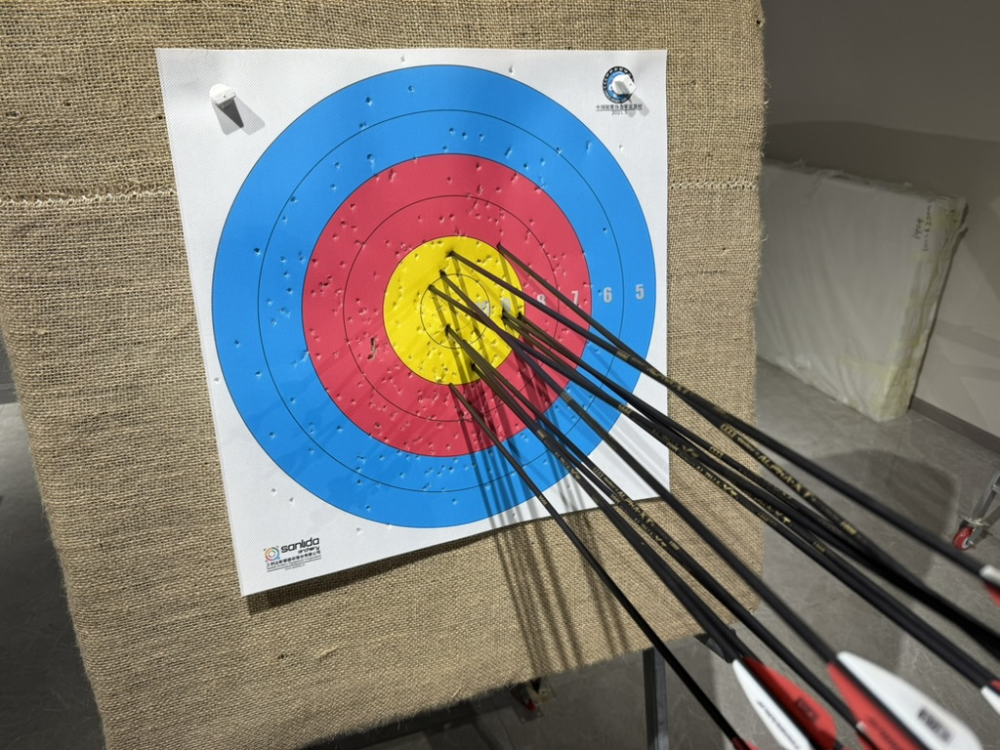
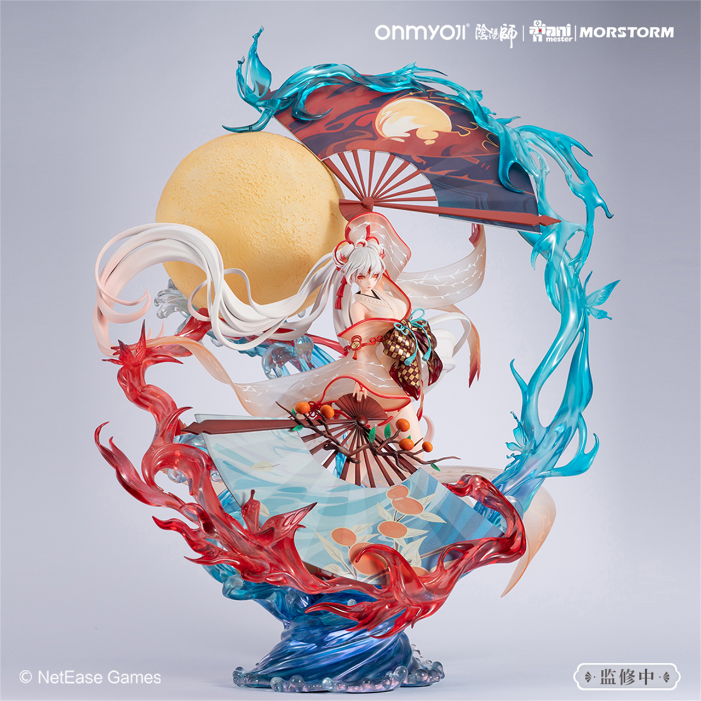

年常系列。开头惯例，先看一下今年 Blog 更新计划完成咋样：

|↘|Category|Comment|
|-|-|-|
|❌|Life|虽然推进了一些事情，但确实又没什么能整理成一些干货的|
|❌|My Own Hackday|又咕咕咕了，甚至没想起来清明在做什么，大概是在折腾龙芯小主机？|
|✅|NAS and OpenWrt|[Self Hosted 1](../self-hosted-1/) 改进后的方案（[rss_pipe](https://github.com/yichya/rss_pipe)）稳定工作半年了，确实十分好用|
|✅|Gadgets|[Gadgets 2024](../gadgets-2024/)，但是支线（龙芯小主机）最终还是咕咕咕了，当然明年还是会发出来|
|✅|Play Around|[Vacation 2024.1](../vacation-2024-1/)、[Vacation 2024.2](../vacation-2024-2/) 以及终于去过了的[九寨沟](../jiuzhai-valley-experience)，基本上算是保持去年水平|
|✅|Technology|[Network Latency Monitoring with Prometheus](../network-latency-monitoring-prometheus/) 算是一点还挺有用的东西|

得到一个什么结论呢：今年比去年还摆。2025 年元旦又只放一天假，害，还是直面一下大摆特摆的 2024 吧

# Big

今年最显著的感觉是全球加速右转，大国小国几乎都不例外。这个趋势落到个人头上当然也影响决策，所以各方面都选择了相当保守的方式（除了下面提到的 Life Mainline 算是唯一一次莽了一下，然后毫不意外喜提减记）。还是不展开了，感觉明年日子怕是还会更难过啊

这两年最大的热点 AIGC / LLM，个人觉得一如以前的区块链与元宇宙，天天都在喊着巨大提升要取代谁谁谁，但现状还是缺乏很实际的应用。LLM 起码在那种信息提取总结之类的事情上表现尚可（但实际上还是很容易出幻觉，即使是非常基础的问题也必须反复确认回答的准确性，比如下面贴一个应该是来自 GPT-4o 的图），AIGC 就真的是折腾来折腾去，哪个都是刚出来的时候火个半个来月（提一个最有代表性的 Suno.ai）然后就没信儿了，真让人觉得有点用的也就是照片魔法消除之类的小工具啥的。。。那些喊来喊去的说白了往往都是贩卖焦虑，看多了也就疲劳了，日子该怎么过还得怎么过。

至于更传统一些的 AI 工具，今年也简单试用了几个 Copilot 类产品，个人的感觉是目前市面上的这类产品只能用来协助做一些全新领域的入门（比如各种地方都能刷到的什么「产品经理零编码基础，三天用 Cursor 写了一个 App 大赚 10W 美刀」之类的，点进去马上就是一波私域流量运营），或者做那种使用者已经做过很多很多次、能让 LLM 有很明确的参考 + 能准确评价 LLM 的输出结果的工作（比如草民拿来做一些照着自己之前写过的代码抄的事情，虽然也抄的很一般吧，也算是凑合用）。日常工作中真正大头的事情，比如涉及到深入业务逻辑的调整、或者比较细碎复杂的规则，构建 Prompt 花的脑细胞远比直接写代码来的多（好像去年就说过这个了？），而且生成出来的代码往往都还需要更多精力大改，实际体验下来对草民这样的普通人来说突出一个食之无味弃之可惜。当然，虽然上面喷了这么多，但比起区块链元宇宙，个人对 AI 倒是不那么排斥，毕竟真的要指望它来机械飞升呢（

跟上面的浮躁之气截然不同的事情呢，其实想提一下小米造车，这个真的是脚踏实地一步一步走过来，结果振奋人心，不得不说这才是认真做事啊（说起来去年的 Flag 倒是跟马老板一块儿成功收了，可喜可贺

可惜小米 YU7 样子个人觉得不怎么好看，SU7 又不是很适合家用，害。这会儿反正也不打算买车，说不定明年这会儿又会泄露个溜背 SUV

# Mainline

推主线这件事呢，虽然嘴上一直说着希望不莽，但结果却是又在南边几百米远的小区买了套房（主要是一方面拧不过爹妈，另一方面这个房子确实各方面都还行，价格当时来看也算合适），然后在预期之外的时间内获得了预期之内的亏损，三个月直接干下去 10%（甚至想赶紧回收一点损失，结果 TM 租都租不出去

当然肉疼归肉疼吧，真说怎么样倒是也不至于，起码现在稳肯定还是能稳住的。话说回来，旁边那个「川大华西高新医院」盖的倒是真快，看这样子明年说不定真能启用，就算再晚怎么也晚不过后年了。另外规划中的骑龙公园预计明年开工，但仍有不确定性，如果也能兑现的话说不定上面那个亏损还会再收窄一点（纯纯自我催眠罢了

剩下的该做完的事情，主要是老家那边的资产处置，只能说又没什么进度 = = 

照目前这个情况，明年也看不到什么显著的好起来的迹象，所以应该也不会怎么推主线，还是安心存粮。当然剩下的资产处置还是尽可能想想办法推进下吧（实在是夜长梦多

# Work

大环境更差了，年底公司又进行了收缩，这波真的差点遭在自己脑袋上。好在又有所转机（代价是多背了好多锅，还一个比一个难背），感谢各位老板抬举。今年又有机会接触一些新形态的基础组件，感觉印象最深的还是搞了一下 StarRocks 支撑一些金主爸爸的生意。StarRocks 有一个非常好的设计就是明确了表的类型，这个真的是非常非常有意义

StarRocks 整个体验下来，性能是真的不错，在数据量特别大（比如一次查询扫超过千万行）的情况下，延迟能降到 TiFlash 的三分之一不到，而机器成本可能也就是 TiFlash 的三分之二左右。但是它最大的痛点还是在于导数据进去很麻烦（毕竟它的应用场景更接近实时数仓而不是传统意义上的 OLTP 数据库，只能通过管道以一个类似从库的身份做批量写入），而且完全不可能达到跟 TiFlash 那种程度的强一致性。感觉 TiDB 目前的 HTAP 方案（TiKV + TiFlash）技术路线确实是没毛病，但就算抛开性能不提，他们家的 Planner 也是真的烂啊，或许真的只是 TiDB 还是太菜了（也可能是版本太低？

去年说搞下云，一年时间过去回过头来看这个判断算是靠谱，今年 toB 尤其是 SaaS 是真不好做啊，大厂（不解释）小厂（比如我司）全都在裁人，今天刚好还是很多小伙伴的 Lastday，伤感。落到自己负责的事情上呢，之前公司战略更希望建设标准化能力吸引更多客户，但今年这个市场就，害，这波老板都打算接着把重心转向私有化业务了。公司依赖的公有云魔改基础设施今年也依然是各种崩沙卡拉卡，一个 Pulsar 消费异常中断的问题折腾了大半年才解决，收钱倒是一点儿不带耽误的，真的是脸都不要了，迟早全给他扬了

明年打算继续做下云 & 私有化的同时，搞搞 RisingWave 啥的（这个公司刚好也有一套），多接触一点 Postgres 世界的东西。另外也接了一点 LLM 生成代码的锅不过暂时还是 Demo 级别的吧，更多还是得先考虑怎么把现在的架子重新收拾一下

# Health

天天晚上吃了睡睡了吃，导致今年体重上升到了一个甚至有些危险的水平，于是终于克服惰性拿起了弓箭，也算把前面连续立了好几年的 Flag 回收掉。目前刚刚解锁 18m 箭道，大概能勉强打个 12 箭 100 环左右的样子（但是还远远谈不上稳定

算到今天，连续每天打卡马上一个月了（工作日晚上九点，休息日下午四点都在箭馆，欢迎各种偶遇）。目前这个样子来看，大概最快明年立春能解锁 30m，到时候考虑一下时候买自己的器材

其他的，今年口腔健康保持的还不错，固定日子去简单看了看没啥毛病。顺便，父亲的股骨头情况比较稳定，准备主张最后一笔赔偿了

# Play Around

[Vacation 2024.1](../vacation-2024-1/)，算的上一切如常，不过明年可能就不太容易约了

[Vacation 2024.2](../vacation-2024-2/)，以及时隔六年终于收了 Flag 的 [Jiuzhai Valley Experience](../jiuzhai-valley-experience)，唯一可惜的是没赶上下雪

今年依然是 6 场 Live，也记录在 Vacation 系列里面（浅浅露个脸

还有一些各种各样的收藏 + 亲签，同样记录在 Vacation 系列里面（感谢各位神仙们投喂！！！

明年目前计划在下面的几个 Flag 里面选一个：

* 跟同事约了张家界，但是在暑假，不确定性很多
* 昆明方向高铁没通，不过明年应该差不多，到时候考虑泸沽湖走一波
* 上面两个 Flag 都倒了的话就去漓江吧（

# Collection

今年塑料小人买的不多（最上面一排没变动就不拍了），但是画册越买越多了（虽然已经没地方放了，但是还会继续买

今年新增的几个塑料小人：

* 左上角：初音 2022 新春（对，这玩意儿整整拖了两年，不过拿到手感觉也还是值得的
* 正中间：明日方舟·夕·浮生听风（感觉是好几个夕的手办里面唯一一个造型没什么问题的
* 右边的：上面一个🐦的积木 + 中间的停云 & 杰哥（虽然是小比例但质量都还挺在线的

以及画册（主要是设定集）：

* 明日方舟设定集 Vol.2
* 明日方舟主线动画原画设定集 Vol.1
* 长安三万里艺术画集
* 白蛇：浮生艺术画集
* 落凡尘电影设定集
* 白蛇：浮生设定集
* 斗罗大陆设定集
* 雄狮 1 设定集（被中间的柜门挡住了

其实右边还摞了一大堆明信片之类的，不过实在是太多了懒得翻了。浅浅晒一张吧（老古风人应该会认识这两位

另外今年买到的最大的那个塑料小人拆都没法拆（其实是有一丢丢后悔买这个阿离了，是真的太大了，完全没地方摆

还有这个明日方舟的黑（这个主要是加上弩之后太高了，前面的玻璃柜子只有不到 40cm 高

目前遇到的最大的问题真的是各种没有空间摆放东西（所以说新家最小那间屋打算做 80cm 深的柜子，所有东西都塞进去。床？不放床了

# Game

崩铁今年上半年的版本简直封神，下半年填坑的力度就稍微弱一些但也还不错

YYS 真的不想玩，月卡都不续了，全拿去充崩铁。抽卡也摆烂，新 SP 差不多都没有（SSR 倒是全

黑猴终究没治好电子那啥，打完虎先锋就没动力接着打了（等一个影神图

# Entertainment

叔叔今年换人做的年货还可以吧，至少味儿是对的，明年继续努力

例行看的动画电影：《落凡尘》很好。《雄狮少年 2》还不错。《盒中之海》一般般。《白蛇：浮生》有点失望了。《伞少女》着实不太行

小破站今年投币基本上都是唱见，当然也没少看 Cos 和鉴证（说起来兰音新皮真好看啊，而且还连续拿了 2023 + 2024 两年 B 站百大，可喜可贺，而且这波颁奖典礼竟然是真人出镜，又有叔叔推的话，在 BW 时间点前后搞个线下 Live 说不定真有希望呢）。云村那边就也基本上是🐰的形状了，还好还有⛄️的两首，而且🐦那首流年如歌至少还是挤进来了

|  |  |  |
| :-: | :-: | :-: |
| 小破站的年报 | 小破站音乐区 | 云村年度歌单 |

[🐰](https://space.bilibili.com/698029620)是好的，[⛄️](https://space.bilibili.com/3769656)是好的，[🐦](https://space.bilibili.com/282994)和[🦊](https://space.bilibili.com/6101727)也是好的，还有一个[脆皮](https://space.bilibili.com/651483)找不到 emoji 了。新的一年预祝泠鸢线下专场一切顺利，兰音的四专和线下都能实现（以及另外三位大忙人能有时间多创作

# Projects

一直在维护的 [luci-app-xray](https://github.com/yichya/luci-app-xray) 目前达到了 640 star，真的是稳定一年一百五。大概也许农历新年能到 666 star（

比较可惜的是，去年提到的从 Xray 中抽一部分能力出来的那个 One more thing 的架子还没搭好，目前还停留在直接魔改 Xray 加一些之前设想中应该有的东西上来确认可用性（有一说一 *ray 的架子虽然破烂了些但是功能还算是全面），至于另起炉灶甚至 RIIR 怕是还得等个契机（其实感觉也差不多了

今年整的小活 [rss_pipe](https://github.com/yichya/rss_pipe) 用起来真的感觉还挺不错的，当然目前它还远远没有达到一个正经的产品该有的水平。

|  |  |  |
| :-: | :-: | :-: |
| 推送 | 历史 | 列表 |

感觉 RSS 今年被 [Follow](https://follow.is/) 狠狠带火了一把，后面草民也打算在 rss_pipe 现有能力的基础上做一些基于标签的能力（比如分类、后处理、更新策略，等等），然后有想法再 merge 一些杂七杂八的东西，在保证合规的前提下做成一个可能有点怪的 iOS app（希望不要咕咕咕

另外还有一个：[Fish 今年成功完成了整体从 C++ 到 Rust 的迁移](https://fishshell.com/blog/rustport/)，这件事其实对于草民这个偶尔写一点 Rust 的 8 年 Fish 老用户确实还是很鼓舞的。年中还偶然跟某前同事聊到了一点 Rust 和 C++ 之争相关的话题，后面也一直在思考：Rust 的 ownership / lifetime 比起 C++ 用静态分析工具限制到某个语言子集（举个极端一点的例子：比如说只能用智能指针，所有不能满足的情况都按照类似 Rust 的 `unsafe` 来对待）能不能实现同等水平的内存安全保证。目前个人觉得是不行，但感觉又拿不出很有说服力的证据，老板们可以在评论区讨论下

# Gadgets

端午节如期更新了 [Gadgets 2024](../gadgets-2024/) ，然后今年下半年买的东西：

* 1.8 寸智能圆屏（吃灰
* 小米的胸包（还不错就是有点松
* CC1 电流表（这个价格要什么自行车
* QCNCM865（暂时不太用的上，扔龙芯里了
* iPhone 16 Pro Max（用下来只能说是如升，索然无味
* 捡来的旧电视（搭配蹭来的键盘鼠标，坐沙发上操作 R86S 意外的舒坦

# Finally

评价为比去年更没活了，没活是一种常态。按照惯例，结束之前还是：新的一年许个愿。

主线：

* 继续推进【逃离帝都】计划，重点是资产处置相关
* 苟过经济周期，不莽、不立 Flag，其他的一切随缘

支线：

* 注重一下健康，主要是控制体重，至少减到 75Kg 以下吧
* 弓箭差不多玩明白一点，比如挑战一下随便参加一个什么比赛然后不要垫底
* 依照计划固定推进 Projects 并完成年度 Blog 更新，My Own Hackday 多少还是努力一下不要直接习惯性摆过去 = =

最后依然送上草民真的很喜欢的《流年如歌》，希望大家新的一年越来越好。

<iframe src="//player.bilibili.com/player.html?aid=94304902&bvid=BV1BE411p7oi&cid=161422087&page=1" scrolling="no" border="0" frameborder="no" framespacing="0" allowfullscreen="true" height="600px" width="100%"> </iframe>
