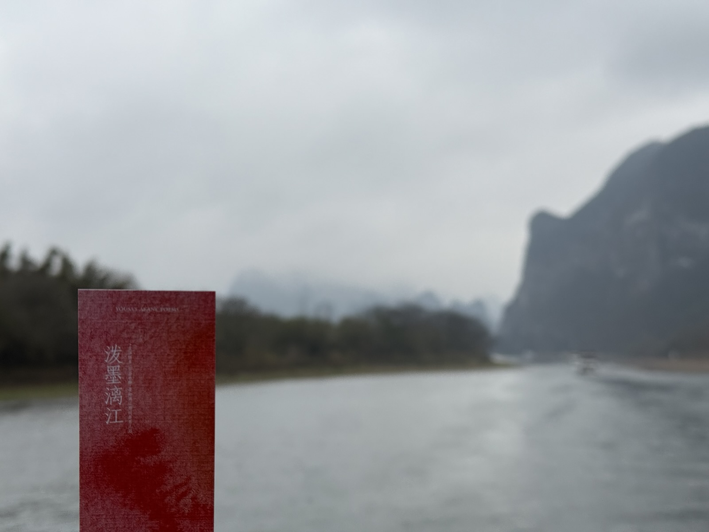

其实本来不太想在天这么冷的时候出去玩，但是又得把马上要过期的三天年假消耗掉。[Vacation 2024.2](../vacation-2024-2) 里面提了两个 Flag，泸沽寻梦太麻烦了而且还要留给新高铁线路（看新闻预计得 2026 年年底了），所以泼墨漓江吧，刚好演唱会的戒断反应也需要想办法缓解一下。

简单摇了三个大哥（两个大学同学 + 他们俩其中一人的同事），翻了一顿小红书再加一些讨论之后得到初步计划：

* 第一天到桂林。晚上才能把人凑齐，草民到的早，就简单四处溜溜，看看城市界面什么的
* 第二天桂林市区游，因为时间不太多就简单找了个能比较容易串下来的攻略
* 第三天上午坐船去阳朔，下午相公山，晚上西街逛
* 第四天上午银子岩，下午遇龙河竹筏 + 十里画廊骑车，晚上摆
* 第五天各凭本事，各回各家

# Preparations

小红书上全是避雷，不做提前准备还真是不行。初步计划有了，那就先确认酒店，以及很多项目需要提前订票，按照时间安排好

## Hotel

提前看了天气据说要连续下五天的雨（事实上真的下了五天雨），肯定得要洗衣服。那么不纠结，直接亚朵

* 桂林 2.19（周三）、2.20（周四）两晚
  * 选了高新的酒店，主要考虑坐船方便，而且桂林并不大，也有共享自行车什么的，交通不算太大问题
* 阳朔 2.21（周五）、2.22（周六）两晚
  * 只有一家，没的选，不过离西街比较近，也算比较方便

## Tickets

下面按照浏览顺序简单列一下。靖江王府要 100 块钱但这次没去，象鼻山不要钱，日月双塔没上去，这些未发生的开销就不列出来了

* 漓江游船（桂林 - 阳朔）
  * 公众号「漓江售票处」可选 3 星和 4 星两种，价格分别是 215（不带饭，加 30 可获得盒饭一份）/ 360（带个不咋样的自助餐）
  * 开船时间，3 星有 9:30 10:00 12:05 可选，4 星只有 9:35；要求提前 40 分钟到码头，公众号也可以约直达车，一人 20
  * 放票提前 5 天，具体来说是指 120 个小时，也就是 2.16 9:35 可以买到 2.21 9:35 的 4 星船票；3 星随便买，4 星票放的少
* 相公山
  * 旁边离兴坪古镇不远，想去的话可以考虑一下交通安排（但一，这地方真没啥可去的，下面会说；二，交通就要自己想办法了）
  * 只去相公山的话可以在 OTA 平台（比如美团和飞猪）上搜到 80 块左右的「门票 + 往返大巴」套餐，会有司机电话沟通上车点
  * 分三个时间段：日出（4:00 出发那种），上午（9:30 左右出发），日落（15:00 左右出发）
    * 日出起的贼早不说，人还非常非常多，价格也要贵十块钱，如果不是很有执念的话建议选日落
* 银子岩
  * 跟相公山的方案类似，9:00 和 14:30 两个时间可选，OTA 平台上的价格也差不多
  * 这个在小红书上被提到最多的是很难打车回来，所以比较建议买带往返大巴的
* 遇龙河竹筏
  * 提前一天 20:00 在「遇龙河」公众号买竹筏票，可选路线比较多，这次选择了「骥马码头 - 综合码头」线路，320 一个竹筏
  * 另外还有「水厄底码头 - 综合码头」、「金龙桥码头 - 旧县综合码头」都是比较推荐的（有两个综合码头不要混了），线路具体特点下面会贴个图，详情也可以小红书启动

漓江游船是出发前就提前订了，相公山和银子岩因为还有些不太确定的地方所以是到桂林的第一天定的，竹筏则是只能提前一天买票。后面这几个会把具体的图贴在下面。

## Traffic

除了上面提到的船和大巴这种买好的，其他的交通也简单做了一下考虑

* 桂林高铁站到酒店
  * 桂林那边从成都过去的车大多都在桂林西站，但西站在小红书上的评价都是交通很不方便
  * 看了几个攻略决定还是 303 路到北站再做打算
* 桂林市区
  * 有共享电动车，但最初没有找到办法提前确认运营区范围
  * 打车看攻略又说黑车偏多，计划还是共享电动车为主，解决不了的再随机应变
* 阳朔（主要是十里画廊）
  * 随处可租电动车，价格一般二十到三十块钱一天
* 阳朔酒店到高铁站
  * 阳朔站离西街还着实是挺远，没有找到特别靠谱的方案（公交时间太长了），最终还是决定打车

另外也讨论了一下包车方案，结论是一天 400 不怎么值（具体不太记得了），放弃

# 2.19

早上八点高铁启动，五个小时左右到桂林西站。高铁上遇到一对英国（大概）小情侣（大概）换座位，成功从 D 座换到 A 座，睡了个爽（刚好他们俩也是在桂林西站下的车）。现在免签之后外国人直接来玩的是真的多

## 桂林西站到北站

西站出来实话说真的是很荒凉。13:20 左右在出站口右手边找到 303 路，13:40 左右发车（甚至又遇上了上面提到那两位，不过他们在北站前面一两站就下车了）。路上收集了一下共享交通工具的服务区范围：小绿面积小的可怜，小蓝面积最大但好像只有自行车，所以推荐小黄的电动车（服务区范围截图下附，最后一张图右下角蓝点就是酒店位置）

|  |  |  |
| :-: | :-: | :-: |
| 小绿（青桔） | 小蓝（哈啰） | 小黄（美团） |

14:10 左右到北站。北站附近其实就比较像一个正常的城市了，从这里出发选择交通工具会方便很多。

## 从北站前往酒店

下车的地方旁边就有一大堆美团电动车，找了个电最多的直接骑到高新区的酒店，顺便路过了一下中心城市的部分关键点位。观察下来感觉城市界面很像十几年前的石家庄，老化比较明显，高新区也完全没有高新区的感觉。说几个印象比较深刻的：

* 很小，上面骑车到酒店甚至还是特意绕了一些路（打算去漓江边上看一眼），但从差不多正北到东南角也只花了一个小时多一点
* 跑了一路一个房产中介都没见到，简直是有些反直觉；但到处都是卖船票门票啥的店（并非什么好事，使人感觉售卖渠道非常混乱
* 见过的唯一一个会把【自行车左转】作为单独信号灯处理的地方，虽然好像大部分时候也都是跟其他信号灯同步（下图恰好是个例外

下午入住亚朵。桂林高新亚朵酒店是个很正常的亚朵，价格印象中是全市所有亚朵里面最低，交通也还算方便，尤其是如果跟草民的计划一样要早起去坐漓江游船的话，可以节省很多坐车的时间，打车也比约的直通车便宜（当然前提是人多），还不用担心早上堵车，值得推荐

出来吃了个塔斯汀，刚好有个什么活动打折，量大管饱。晚上跟小队成员碰面确认行程，顺便定了阳朔那边两个地方的票

|  |  |
| :-: | :-: |
| 相公山（周五下午三点） | 银子岩（周六早上九点） | 

上图是美团，也可以找找携程、飞猪之类平台，或许会有个几块钱的差价优惠之类的，总之一定记得选带接送的就行

# 2.20

断断续续下了一天雨。早上差不多十点才出门，计划照着下图抄作业，再考虑一个晚上来的顺序（省流：6 - 7 - 2）

小伙伴们要买个帽子和小包什么的临时用一下，于是先去酒店附近的万达广场溜达了一圈。经营状态是个正常的商圈该有的样子，还算有些人气，品牌入驻也比较像样

## 象鼻山

不需要门票，门口扫码并提交个人信息就行了。也可以预约（但很搞笑：早上七点开始预约当天，就怎么说呢，连个限流的作用都没有

一个多小时差不多就能逛完，可惜低估了雨势，应该带伞去的。山顶俯瞰视野也很好，整体来说作为一个城市里的免费公园算是相当优秀

攻略上 1 号门进 3 号门出的顺序没啥毛病，建议就这么来，全程基本上不走回头路（除了象鼻子那个洞要折返回来一点再上山）。出来就是两江四湖 + 日月双塔，顺便瞄了一眼，但没啥看头，天黑了再说

## 正阳步行街闲逛

其实就是个很普通的步行街，两边都是那种全国哪儿都有的经典商铺（加上几个卖船票的），但不确定是因为工作日的大白天的关系，还是天气不好，给人的感觉是多少有点衰败（就这张图一眼望去，一大半店都是关着的），尤其是中间广场里面商铺几乎全空，很鬼

其他的，路上买了一点明信片，感觉还不错。午饭啤酒鱼 + 炒粉 + 一点别的，啤酒鱼感觉一般般（但有的小伙伴觉得很不错），炒粉确实好吃，很香，不过后面稍微凉一点就会有那种酸笋的味道出来，虽然甚至已经有点适应了（这东西真的做什么都要放嘛？

## 王城商厦

也是那种十几二十年前的商场的即视感，唯一的一点新意大概算是一楼有家小米，旁边有家瑞幸咖啡。五楼六楼是那种很古早的电脑城，死去的记忆系列（真的，上次逛这种地方大概算是 23 年去五块石那儿，再早根本想不起来是多久以前了

有一说一，这种破电脑套餐跟这个商场的年头可以说十分相似，就这种十几年前的配置现在卖这个价怕是能有 70% 毛利，多少有点离谱了

## 东西巷

商厦对面就是东西巷和靖江王府。王府要钱（还是其次，主要是小红书上避雷太多了，比竹筏都多）所以就没进去，下图左右就分别是西巷和东巷了。顺便真的，哪哪哪都是卖门票和船票的，真的很难评

东西巷更像那种现代化的古镇的形态。放一张经典的天上挂伞（也是小队同框

整个逛下来感觉其实比正阳步行街好一些，最起码更有人气一些（东巷挺热闹，西巷还是比较鬼）

## 逍遥楼

从东巷穿过去的路上终于看到一个勉强算中介的地方。墙上只看到了出租，价格其实比预期要高一点（最便宜的一个一室一厅 950，其他有些都一两千了，对本地平均经济水平来说怕是相当难负担），当然毕竟是在核心区周围，估计都被老板包下开民宿了，贵一点也说得过去

至于逍遥楼，这个楼的视野比预想中的要低不少，还没有象鼻山山顶高。俯瞰漓江还可以，整个城市就想太多了。

这会儿差不多三点多一点。上午淋了点雨，天黑之前也没什么地方打算去，于是决定回去拿伞 + 暖和一下换换衣服什么的。路过解放桥

五点半左右回到东西巷浅浅吃了一顿海底捞，就是很正常的海底捞，跟其他大部分城市没有任何区别（此处就要点名批评杭州西湖附近某家海底捞了）。吃完原路回到逍遥楼，晚上的逍遥楼确实挺好看，但显然就这么两层高不太能俯瞰多大区域

旁边的解放桥，也做了相当不错的灯光设置。某位小伙伴说「如果这时路过一个船就更好了」，评价为确实，可惜这个点游船不营业，漓江水位看着也不太像能货运（包括这个桥做这么矮，显然也完全没考虑货运需求

然后顺着漓江边儿溜达回日月双塔，耗时半个钟头

## 两江四湖 + 日月双塔

这个塔夜景确实不错，所以确实没有必要白天来

至于两江四湖嘛，只看了一个湖，另外几个懒得走了，下次一定（有没有下次就比较悬了

## 漓江桥

这个就没有跟解放桥一样做很好的灯光布置，而且突然想起来这地方应该白天抽空来一下的，略显遗憾（下次一定

刚好九点左右了。淋了一天雨，赶紧回去洗洗睡，明儿早起去坐船。

# 2.21

又是断断续续下了一天雨，估计下午相公山就没啥可看的了（日落肯定是别想了

## 漓江游船

八点一刻叫到车，二十分钟刚好到竹江客运港。下面这张地图的外语选择很有意思，没有日语但是有越南语

先自助取票，票上会有坐哪个船、去哪个泊位。提前半小时检票上船

「迷离间如水山歌绕过一弯又一弯」嘻嘻

枯水期会稍微慢一点（有一说一水位真有点低的吓人），9:35 开船，13:50 下的船。攻略也没啥可攻略的，看就完了，提几个关注的点：

* 20 块钱人民币打卡点看上面地图「黄布倒影」，但是在行船方向的屁股后面。快到的时候会有广播，赶紧去船尾找位置
* 过了兴坪渔村基本上就没什么可看的了，跟前面的画风差很多（两边山上全是塑料棚子），基本可以安心下去吃饭等到阳朔下船
* 午饭虽然是自助但也只能说非常糊弄事儿，船上额外提供（指要花钱，而且挺贵，但是忘了拍菜单）的鱼看起来还行，可以考虑一下
* 推销的东西（印象中有桂花香水和驱蚊小葫芦，好像还有点儿啥不记得了）倒是都不贵，想买就买吧

这个船个人评价还是相当不错的（如果不是枯水期就更好了），相比之下前一天桂林根本就可以说是转不转都行

## 酒店

依然是亚朵。有一说一不如上面那个高新区的，小一些不说还挺贵（比上面那个贵一半），虽然住着倒是各方面也都没啥问题，交通也算方便（走路去西街也就十分钟不到，就是从码头过来的时候被高德的步行导航给搞懵逼了

|  |  |
| :-: | :-: |
| 桂林 | 阳朔 | 

之前在小红书上翻到不少各种各样的民宿，有些价格可能都能做到亚朵的一半不到，所以这个就不做推荐了（懒得找的话也可以选这个，至少体验的下限还是能保证的，尤其是如果还有洗衣服之类的需求的话

## 相公山

扔下东西就去坐车了。15:00 从对面「碧莲江景大酒店」上车出发，车程一个小时多一点，然后停在半山腰上的大门口。需要爬的部分不太高，从下车点往上爬十分钟左右就到顶了，但有一说一视野确实很不错，可惜天气原因导致能见度很差

日落线回来会路过一个什么泉来着，在那里停留十分钟看日落（这次当然是毛都看不到一根），然后差不多 18:30 之前能回到西街。说到价格，门票加车票八十块确实 emmm，天气好的话个人觉得还可以，不好的话就谨慎考虑吧

## 晚上吃啥

酒店旁边的啤酒鱼一个比一个卷，贼逗（左边两张是同一个品牌的两家店

选了离酒店最近的一家「大师傅」，据说大众点评 5.0 满分而且评论数还挺多

* 啤酒鱼，比昨儿那个好的真不止一点半点
* 小炒小河虾，个人觉得很对胃口，有那么一点点微辣很香
* 某种竹筒鸡，喝汤很不错（当然汤里的鸡肉吃起来肯定就很柴
* 其他的一点普通菜品味道也不错，推荐蒜蓉油麦菜、韭菜炒鸡蛋

总之是值得推荐的。亚朵酒店每一层都能拿到 9 折券儿，记得薅一张

## 西街

基本上就是那种典型的商业化古镇，参考大理古城（当然要小很多）。晚上去遛个弯就得，想买啥买啥，累了就回，反正离酒店很近。

有一说一阳朔这边比桂林要热闹不少，人气足还可能是因为周末的关系，但这边的门脸空置的也很少，跟桂林对比还是挺明显

买了几个冰箱贴。这玩意儿有的五块有的十块有的十五，很随意，建议多转悠。顺便买了竹筏的票，结果是随便买，根本不需要花心思抢

|  |  |
| :-: | :-: |
| 特点（还有些往返的可以看 [https://www.xiaohongshu.com/~](https://www.xiaohongshu.com/discovery/item/67906a51000000001701da7e?source=webshare&xsec_token=CBqvMTYQ7tpFg3hF0hR1LgVM0mm83eUFE2DdRsHj19I1E=&xsec_source=pc_share)，顺便还有十里画廊路线） | 须知 | 

西街旁边还有个徐悲鸿故居，有兴趣的话可以去看看（当然得白天去，晚上去是进不到室内的

# 2.22

又是下雨，这天气着实是有点不给面子了。。。

## 银子岩

早上 9:00 京东家电门口上车，车程半个多小时。不得不说，这地方着实是相当不错，比几年前去过的苏州某个溶洞壮观很多，还好没有因为交通问题直接放弃这个地方。每个人都会标配一个讲解设备，里面有些词车速还挺快（比如某个只可意会不可言传的生命之源

唯一的问题是洞里真的又闷又热，好在也没有什么岔路之类的，一个小时左右就出来了。出门有个溜索可以选，30 块，个人不推荐（尤其天气不好的情况下）。旁边还有个什么地球记忆（好像是陨石展吧），要钱，没看。

11:30 左右返程，中午十二点多就回到酒店了。导游很有意思，回来的路上一边吐槽一边推销东西（晒的桂圆、柚子皮、啤酒鱼、烤香菇，好像还有个啥忘了）。回忆几个个人比较感兴趣的地方：

* 桂林这边经济 95% 旅游 5% 农业
* 阳朔房价平均一万一二，是桂林差不多两倍，买得起的都是外地游客或者来做生意的人
* 本地人除了体制内大多都在打零工，注册导游五六万 + 没注册的两三万，但做这个一月也就两三千收入，根本买不起商品房

听的时候也考虑了一下在这里生活的可能性，结果怎么说呢，别的先不提，现在没地铁的城市是真的不太可能考虑定居了

## 遇龙河竹筏

午饭旁边简简单单吃了个粉，然后去坐竹筏。另外两位小伙伴对竹筏不太感兴趣，加上体重方面的搭配问题所以没去，只有草民和另外一位大学同学。这次选择骥马 - 综合码头路线。体验下来真的强烈推荐，比漓江游船还带感，各方面都非常完美（值得一张 Live Photo

<video src="../assets/images/guilin-experience/raft.mov" width="100%"></video>

几个点关注：

* 下雨天会更带感！千万不要因为下雨就放弃了（除非雨实在是太大，竹筏完全不营业那种
* 同一个竹筏两个人体重加起来不能超过 160kg，要现场称重，超重就只能拆筏或者现场找人拼了。草民这次是刚刚好，一点点都不多
* 骥马码头没啥人，所以开始那一段体验会非常好；中间的水厄底码头人很多，需要拼船的话可以考虑去水厄底码头
* 鞋套草民那个船没让穿，说会很滑可能有危险，但是看其他船又有穿了的。实际上也没用到，过水坝的时候把脚抬起来就行
* 虽然兴坪古镇那边也有漓江竹筏，但那个是电动的（小伙伴说有点赛博），而且已经坐过船的话就没必要再专门跑去那边玩一次竹筏了

从竹筏下来就是综合码头，旁边就是工农桥。桥上桥下的视野都非常好，可以稍微多呆一小会儿

这个时节旁边还有一片油菜花，也可以去抓一下

## 十里画廊

十里画廊这一部分其实后面回想下来是体验比较差的，主要是下雨天真的不能骑电动车到处跑，太冷了 = = 应该准备个 Plan B

* 这次租车就在十里画廊北门门口，一天 25 比酒店附近贵五块钱，押金一辆车 100 回来原地还车之后会退。
  * 总体来说区别不大，主要还是看天气吧，天气好就多骑车，不好的话就避免骑车、优先打车
* 一部分收费项目情况（其实所有的收费项目攻略上都不推荐
  * 月亮山不营业（听说去年国庆就歇业了
  * 小火车也不营业（估计是天气原因吧，虽然本来也没打算去

比较开心的是中间路过一个小水坝，让两位没坐上竹筏的朋友也看到了遇龙河的风光

另外，半山咖啡视野不错，不过天气不好的话就不太值得专门跑一趟，旁边温泉啥的也没开

## 最后一顿

纠结了半天选了附近另外一家也是评分 5.0 的啤酒鱼，但实际吃下来只能评价为：价格跟大师傅差不多，但东西明显不如大师傅

* 啤酒鱼，个人感觉还凑合，比桂林那家还是好不少，但小伙伴们反馈比大师傅差一些
* 蒜蓉油麦菜，相当翻车，不仅老，调味也不到位，着实乏善可陈
* 其他几个菜凑合吧，不至于很难吃但也没啥亮点

按说这一天的体力消耗远高于上次，评价还不高只能说明真不太行。这家在前一天的小卡片里面也出现了，猜一猜是哪家（当然是无奖竞猜

# 2.21

终于不下雨了，早一天停也行啊。早上其他人就都打车回桂林机场了，草民自己一个人从阳朔高铁站回去

## 兴坪古镇

本来没打算去，但发现刚好高铁站在它旁边，公交打车都要路过。早上刚好有一个小时左右时间，干脆去转一圈。从酒店过去打车三十几块

* 古镇那部分就是那种全国各地都一样的非常同质化的古镇，并没有什么特别的点
  * 而且比西街还小很多（可能也就比东西巷稍微大一点？），就一条小路，十分钟不到走完
* 出去码头上有个 20 块钱固定打卡点（下图
  * 怎么说呢，如果坐了漓江游船的话，就完全没必要再跑过来一趟（没坐的话也不是很有必要
* 一边考虑怎么解决午饭问题一边溜达到了兴坪商贸城，实际上更像是一个超市加一个菜市场（甚至规模还不算大，不过很热闹） 
  * 午饭最终吃了客运站旁边一个汉堡，味道凑合吧但不如塔斯汀。叫什么忘了，但总之是那附近唯一的一个相对标准化的的选择

结论是完全不推荐。幸亏没有跟相公山赶在一起去，太没意思了，要因为这个浪费时间的话可真是亏大了

## 回家

这波坐火车运气意外的好，又从 C 座换到了 A 座。来回两趟还都是全程不用挪窝，睡了个爽。最后考虑一些改进点：

* 十里画廊那块没整太好。下雨天真的不要骑电动车（回来非常不意外的感冒了 = =），但好像也没有什么很好的备用方案（害
* 桂林真的没必要花一整天时间，安排的好的话半天完全足够逛完重要地点
  * 早上出发、中午到酒店，路边随便吃个粉，下午先去漓江桥瞅一眼，然后象鼻山溜一圈（天气好还能看日落），出来东西巷吃饭
  * 吃完刚好晚上，逍遥楼、解放桥、日月双塔打个卡，还有力气的话两江四湖随便逛逛，累了直接回去睡觉，第二天去坐船

最后也把这首歌送给大家吧（关注泠鸢 yousa 喵，关注泠鸢 yousa 谢谢喵

<iframe src="//player.bilibili.com/player.html?aid=8086541&bvid=BV1Ds411h7T1&cid=13295504&page=1" scrolling="no" border="0" frameborder="no" framespacing="0" allowfullscreen="true" height="600px" width="100%"> </iframe>
