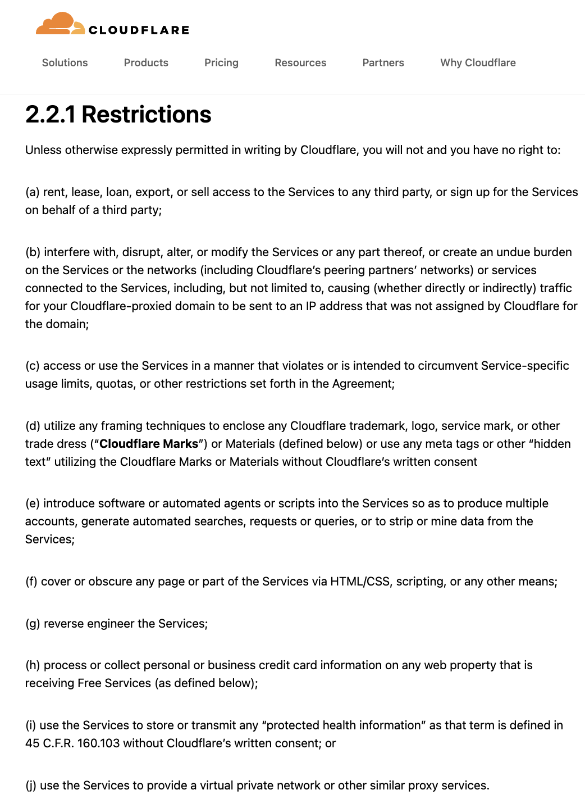
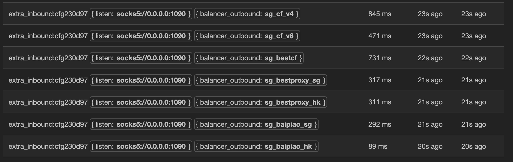
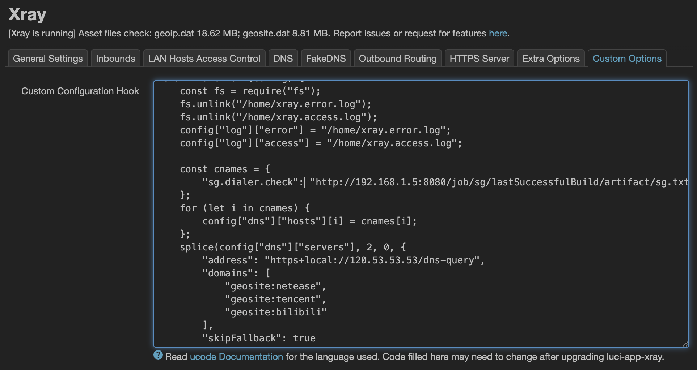
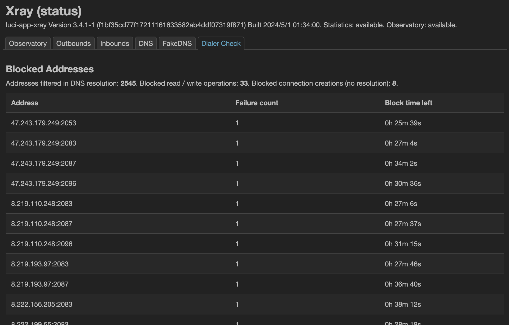
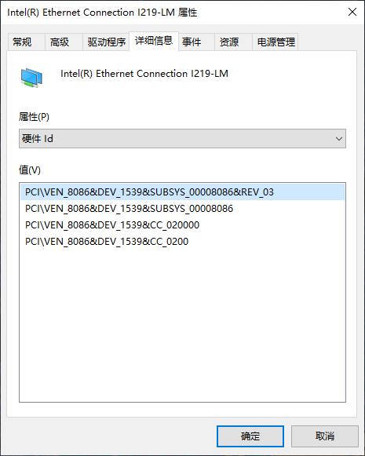
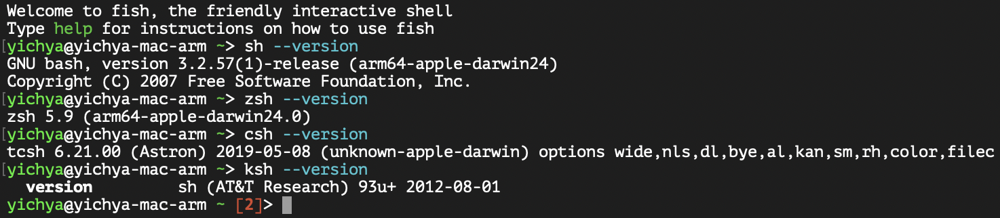

虽然草民的 NAS 形态已经相当稳定，但过去这段时间也还是做了一点不大不小的优化（大部分是网络连接相关）。这一阵儿都没啥灵感，所以清明日常活动又咕咕咕了，以及五一应该还要出门玩，所以这次就把清明的空档拿来简单介绍下好了。

# Get rid of CDN

去年年底的一件大事：Cloudflare 的新服务协议已经明确禁止架设梯子（j）和优选 IP（b），草民现在也已经彻底拆除了相关的设施

<table>
  <thead>
    <tr>
      <th style="width:44%;">原文</th>
      <th style="width:56%;">重点</th>
    </tr>
  </thead>
  <tbody>
    <tr>
      <td></td>
      <td>
        第 2.2.1 限制第 B 条规定：干扰、破坏更改或修改服务或其他部分，或对网络或服务<br/>（包括 Cloudflare 对等合作伙伴的网络）或与服务相连的服务造成不当负担，包括但不限于导致您的 Cloudflare 代理域流量被（无论直接还是间接）发送到未由 Cloudflare 为该域分配的 IP 地址。
        <br/><br/>
        第 2.2.1 限制第 J 条规定：使用服务提供虚拟专用网络或其他类似的代理服务。
      </td>
    </tr>
  </tbody>
</table>

去年上半年这种用法非常热门。贴张图回顾一下优选 IP 的威力，可以看到延迟差距有多明显，最快甚至接近十分之一，重点是完全白嫖



大家可能会有疑问：许可协议废纸一张罢了，这么好用的东西说拆就拆？几点原因：

* 确实也觉得总是白嫖 Cloudflare 不太好，赛博菩萨也经不起这么可劲儿薅
* 现在 Cloudflare 的协议明确禁止此种用法，草民好几个域名都转移上去了，真被封号的话影响太大
* 白嫖优选 IP 去年下半年就已经几乎不可用，就算偶尔有几个能用的，表现也不如官方分配的 IP，已经没有实际意义
* 走官方分配的 IP 稳定性其实也很一般，跟直连基本没啥区别，现阶段主要意义其实也就是隐藏 VPS 的 IP 避免被针对
  * 但最近一两年出现的新的直连协议比如 REALITY，整体也算稳定，只要不跑 PT 之类持续大流量应用，基本上不会被针对了

不过这里还是可以简单回顾下当时为了白嫖做出的一些建设，以及在放弃此种用法后，这些建设能够发挥的其他价值

## All about DNS

当时为了更好的使用优选 IP，做了两部分的事情：Hosts 动态更新，以及将连接状况反馈到 DNS

DNS 记录往往会被中间各种缓存，优选 IP 域名也不例外。而且在这种用法下，通过域名服务商的 API 更新解析记录可能会非常频繁，很容易撞上服务商的频控导致更新失败。种种原因导致 DNS 方案并不可靠，所以往往有另外一些方式获取数据，比如 HTTP 接口或者直接提供一个 zip 文件。另外优选 IP 也还需要进一步的过滤（比如按照 GeoIP 筛特定区域 / ASN）。草民做的某个妙妙小工具就可以像下面这样：

```sh
# go run . -in /usr/local/share/xray/geoip.dat -type geoip -keep HK -filter ./txt/45102-1-443.txt -mode intersection | awk '{print $1}' | sort
47.240.42.138
47.242.180.240
8.210.140.91
8.210.29.68
8.210.48.192
8.212.43.8
8.218.71.200
```

有了 IP 之后就该想办法提供给 Xray 了。Xray 自带的 DNS 机制不够灵活（主要是配置文件不能热更新，重启一次 Xray 感知又太强），为此专门再配置一个 DDNS 的话链路又太长，而且也会遇到上面说的缓存 / API 操作失败之类问题。于是魔改 Xray，在原有的 Hosts 配置基础上增加了一个 goroutine 去定时通过 HTTP 接口拉取对应的 IP 数据，实现 Hosts 的动态更新。这里就不贴代码了，简单指一下在哪儿改（


```
goroutine 4 [sleep, 2 minutes]:
time.Sleep(0xdf8475800)
	runtime/time.go:338 +0x158
github.com/xtls/xray-core/app/dns.(*StaticHosts).refreshDynamicConfig(0x4001770f50, {0xab84c0?, 0x16343a0?})
	github.com/xtls/xray-core/app/dns/hosts.go:159 +0x30
runtime/pprof.Do({0xdeaca8?, 0x16343a0?}, {{0x40007ff560?, 0x0?, 0x0?}}, 0x4000043ed0)
	runtime/pprof/runtime.go:51 +0x78
created by github.com/xtls/xray-core/app/dns.NewStaticHosts in goroutine 1
	github.com/xtls/xray-core/app/dns/hosts.go:97 +0x6b8
```


当时把上面的那个妙妙小工具配置成了一个 Jenkins 上的定时任务，再利用 Artifacts 就可以暴露出 HTTP 接口提供给 Xray，不过现在反正也用不到了所以就先不放出来了（主要是代码写的很乱，包括 Xray 的改动也一样一团糟还没 Unit Test，以后有机会吧



另外，Xray 的 DNS 缺少一个自身反馈的能力，尤其是在优选 IP 这种一个域名解析出非常多个 IP 而且大部分都不能用的情况下。之前常用 GRPC，遇到这种问题基本都只能吃一个 `CONNECTION_CLOSED`，而且会一直持续下去。虽然也可以在上面的妙妙小工具中增加一个验证，但是这种反馈整个流程走下来至少也是分钟级别，很容易被感知到。于是将 Xray 使用这些 IP 时遇到问题的情况（比如 GRPC 可能遇到 HTTP 403）反馈给 DNS 记录，将这些 IP 从后续的解析结果中剔除，使得 Xray 能够在可接受的时间（大概两分钟）内收敛到稳定的状态



上面两个机制搭配，得到的结果非常理想，狠狠爽了几个月。后面顺便还做了 SplitHTTP 支持，可惜做出来的时候已经来不及了（

## About PT

草民之前过 CDN 的梯子用法，除了上面提到的白嫖优选 IP，还有一个[很久以前介绍过](../diy-nas-project-4)的北邮人 PT 用到的 IPv6 代理，为了避免 IP 流量太大被针对也过了 Cloudflare CDN，当然就直接用官方分的 IP 了。不过北邮人的设计有一点很有意思：它只在主站做了 IP 黑名单，Tracker 是没限制的，所以其实现在这样有正常可用的 IPv6 的情况下，下载工具不走梯子甚至效果反而更好，所以这波干脆就一起拆了。

话说回来，好像已经几个月都不会点开北邮人一次了（主要这一阵儿是真没什么想看的电影和连续剧），于是对硬盘空间的需求少了很多。最近硬盘迷之越来越贵，甚至真的有点想改用 8T x4 组阵列，主要是目前的阵列完全不对称，多少有些别扭（还是先凑合用吧，坏了再说

# Better DNS

内部 DNS 的一些调整。这些其实都是本地流量管理该做好的事情，后面 One more thing 需要加把劲

## Optimize Tinc Path

Tinc 在局域网内的 Peer 探测似乎不是很好用，经常要从某个网络外的 Peer 转发（印象中 Zerotier 是做的最好的），用起来显然不如直连舒坦。如下图，目前希望能让 OpenWrt 1 与 OpenWrt 2 建立直接连接（否则可能只能从 Cloud 绕一圈），但因为隔了一层 NAT 所以常用的网络发现方案可能都不太好使，只能通过 OpenWrt 2 直接用地址 `192.168.1.4` 的方式，过一层 NAT 建立到 OpenWrt 1 的连接。


很容易想到几个解决方案：

* 保证 OpenWrt 1 的 IP 地址不变，在 OpenWrt 2 上直接用 IP 地址连接
  * Gateway 是运营商的接入设备，上面不太好搞静态 DHCP 分配，草民也不太喜欢这么做；直接指定静态 IP 更容易出问题
* Tinc 的节点地址更新只能通过 DNS 来完成，所以找个 DDNS 域名记录 OpenWrt 1 的内网 IP，在 OpenWrt 2 上用这个域名连接
  * 也算是相对比较常规的用法，不过草民手头没有合适的域名，而且跟上面优选 IP 一样会遇到缓存 / DDNS 服务商相关的问题
* 可以先走其他节点建立初步连接，再要求其中一端提供自己局域网内的地址用以直连，可以不用依赖外部服务
  * 相当于自建一个内网 DDNS 服务。刚好上面优选 IP 魔改做了利用 HTTP 更新 DNS 数据的设施，于是试着用它来做一个 DDNS

那么来尝试一下自建 DDNS 吧。首先准备一个 HTTP API 用来返回自身的 IPv4 地址。对于 OpenWrt 来说最省事儿的方式是 cgi

```sh
#!/bin/sh
printf "Content-Type: text/plain\r\nConnection: close\r\n\r\n"
ifstatus ${QUERY_STRING} | jsonfilter -e '@["ipv4-address"][0].address'
```

放在 OpenWrt 1 的 `/www/cgi-bin/address.v4`，就可以通过 LuCI 用的那个 uhttpd 直接访问：

```sh
# curl http://192.168.123.1/cgi-bin/address.v4?wan
192.168.1.4
```

在 OpenWrt 2 上通过从 Cloud 绕一圈的方式拿到上面这个地址（首先保证这两台设备从 Cloud 绕一圈的路子是通的，上面 192.168.123.1 就是 Tinc 大局域网内的地址），然后再找个办法把它对应到某个域名就好了。这里就像上面说的那样使用了魔改 Xray，每分钟调用一次这个地址，指定为 openwrt.dialer.check 对应的结果

```
; <<>> DiG 9.20.7 <<>> openwrt.dialer.check @192.168.123.9
;; global options: +cmd
;; Got answer:
;; ->>HEADER<<- opcode: QUERY, status: NOERROR, id: 62269
;; flags: qr rd ra; QUERY: 1, ANSWER: 1, AUTHORITY: 0, ADDITIONAL: 1

;; OPT PSEUDOSECTION:
; EDNS: version: 0, flags:; udp: 1232
;; QUESTION SECTION:
;openwrt.dialer.check.		IN	A

;; ANSWER SECTION:
openwrt.dialer.check.	586	IN	A	192.168.1.4

;; Query time: 0 msec
;; SERVER: 192.168.123.9#53(192.168.123.9) (UDP)
;; WHEN: Sat Apr 05 00:00:51 CST 2025
;; MSG SIZE  rcvd: 65
```

最后让 OpenWrt 2 上的 Tinc 尝试通过这个域名连接到 OpenWrt 1 就行

```sh
# cat /etc/tinc/hosts/openwrt 
Subnet = 192.168.123.1/32
Address = openwrt.dialer.check
-----BEGIN RSA PUBLIC KEY-----
<redacted>
-----END RSA PUBLIC KEY-----
```

OpenWrt 2 上的 Tinc 启动时还不能直接连接到 OpenWrt 1 上，但能够连接到 Cloud 加入 Tinc 大局域网，此时就可以通过 192.168.123.1 上的 HTTP 接口拿到局域网地址，然后在本地完成 `openwrt.dialer.check` -> `192.168.1.4` 的解析，Tinc 就可以继续利用这个地址建立直接连接了。虽然其实这么用实际效果也难说，包括之前有提过的走公网的 Tinc 状态监控，其实也没有找到特别明确的标准来确认，这个大概后面还要做一点防火墙规则相关的过滤来区分中转和直连的流量，利用这个数据来确定状态。留作后续的坑吧（

## No More Static IP & Static DHCP Leases

上面说过草民非常不喜欢静态 IP / 静态 DHCP 分配，原因主要有这么几个：

* 草民的设备很多都是没有插键盘显示器的，如果指定静态 IP 又遇上网络结构变动，很容易就失联了
* 草民的 OpenWrt 变更十分频繁（要同时跟 OpenWrt 和 Xray 的上游改动），每天可能都要更新一两次
  * OpenWrt 重启并不一定会使所有网络中的设备重新发起 DHCP 请求，这时 OpenWrt 自身还没有 DHCP 分配记录所以没法解析
    * 一般的解决方式是再配上 Hosts 记录，但静态分配偶尔会重复（网络中已经有一个设备占了坑），此时 Hosts 也会对不上

DHCP 不靠谱，但是对于网关来说还有其他的方式记录稳定的对应关系，比如利用 MAC 地址来查 ARP，当然也有前提：

* 不是网关的话 ARP 记录不能保证是全的，所以不太能这样用
* MAC 地址要保持不变（所以对于无线网络设备，尤其是比较新的设备一般都会有 MAC 地址自动轮换的功能，这种情况就不适用了）
  * 这种情况其实 DHCP 也不一定靠谱（设备可能在 DHCP 的过程中不发送主机名），就要考虑 mDNS 之类的其他网络发现能力了

把 ARP 记录关联到域名这件事就可以用跟上面相似的方式解决。把下面这个脚本保存为 `/www/cgi-bin/address.arp`

```sh
#!/bin/sh
printf "Content-Type: text/plain\r\nConnection: close\r\n\r\n"
grep -i ${QUERY_STRING} /proc/net/arp | awk '{print $1}'
```

这个脚本就可以像这样通过 MAC 地址查出对应的 IP

```sh
# curl http://127.0.0.1/cgi-bin/address.arp?00:15:5d:0f:e9:02
10.32.15.208
```

再利用跟上面一样的机制绑定一个域名即可。除了 IPv4 和 ARP，相似的做法也可以用在 IPv6、NDP 甚至 mDNS 上，也留作后续的坑吧（

## DoH and More Stable DoH

之前直接用国内的 DNS 解析域名，想的是反正都有明文 SNI 漏就漏吧。不过后面改用 REALITY 又觉得还是应该保险一点，所以魔改了一下 luci-app-xray 支持了一下使用 DoH（纯 IP 那种）解析 Outbound 地址。至于为什么不直接用 VPS IP 访问梯子？一个是懒，另一个是上面那个魔改是基于域名启用规则的（这个又涉及到一些额外的魔改，简单的说就是用 Hosts 映射前的域名过分流，映射后的域名去访问

用了一段时间发现：稍微有名气点儿的几个纯 IP DoH（比如草民之前常用的 `9.9.9.9` 和 `101.101.101.101`）连接还是比较不稳定，经常一抽几分钟甚至半个小时，所以还是要考虑自动的故障切换。Xray 自身不太好配这个能力，但恰好，之前 [Real NAS Project (1)](../real-nas-project-1) 已经配过 cloudflared，它的 DoH 代理是支持这个能力的。只要在配置文件里面加上几行，就可以得到一个 DNS 代理（支持 TCP / UDP）

```yaml
proxy-dns: true
proxy-dns-port: 5311
proxy-dns-upstream: ["https://146.112.41.2/dns-query", "https://146.112.41.3/dns-query", "https://146.112.41.4/dns-query", "https://146.112.41.5/dns-query"]
```

它的行为似乎是按顺序，也就是第一个没成功再尝试第二个这样。另外，比较有名气的纯 IP DoH 三月份之后因为种种原因都不太能用了，好在 OpenDNS 还有一些存活，下列（来自 [YaaTG](https://t.me/yaatg_group/23)）

* 146.112.41.2 / 146.112.41.3 / 146.112.41.4 / 146.112.41.5
* 146.112.70.70 / 146.112.71.71
* 155.190.111.111 / 155.190.111.123
* 204.194.232.200 / 204.194.234.200
* 208.67.220.2 / 208.67.222.2
* 208.67.220.64 / 208.67.222.64
* 208.67.220.123 / 208.67.222.123
* 208.67.220.220 / 208.67.222.222

大部分应该都可以直接通过类似 [https://1.1.1.1/dns-query](https://1.1.1.1/dns-query) 的形式访问，但似乎 dig 不一定会有反应，Xray 和 cloudflared 用起来都是正常的，可以自己根据自己的网络环境选择。

# R86S Direct

起初是 Windows Dev Kit 2023（下面用 [Volterra](../wdk2023-first-experience) 代替）上不能直通无线网卡所以一直在这样用，后来突然意识到把 i211 挪出来可以得到许多好处。先放一张图简单介绍一下家里网络的基本结构（在前面那张图上加了一点细节），体现为 DHCP 分配关系，以及是否为默认网关


图上还有一点没说清楚：OpenWrt 1 是 R86S 上的虚拟机，OpenWrt 2 是 Volterra 上的虚拟机，都跑在 Hyper-V 上

## Rescue

作为一个 OpenWrt Master 战士，遇到些问题搞挂 OpenWrt 也是很正常的，于是希望达成这样的目标：

* 除了 NAS 之外的设备（图上就只有两台 OpenWrt 的宿主机），默认路由都走 OpenWrt 保证网络干净
* 无论 OpenWrt 1 还是 OpenWrt 2 炸掉，对应的宿主机都还能正常连接公网（然后可以用 Tinc 连上去恢复）
* NAS 不依赖 OpenWrt，除了要走大流量 PT 之外，也要保证上一条说的事情发生的时候能访问到备份的镜像和配置

原先因为直通 i211，图上 Gateway 到 R86S 这条虚线是没有的，如果 OpenWrt 1 挂了的话 R86S 就完全无法访问到了，只能跑到电视前面手动操作。现在把 i211 摘出来补上这条链路，再借助一点默认网关的自动优先级规则，问题就得到了解决。下面简单介绍一下

## Default Gateway and Automatic Metric

Windows 的 IPv4 路由自动 Metric 是用链路速度对应出来的：

* 正常的物理网卡一般链路速度跑 1Gbps，Metric 是 25；有的富哥可能多一点比如 2.5Gbps，Metric 是 20
* Hyper-V 起手就是个 10Gbps，绝大部分情况下比物理网络都要快，对应到的自动 Metric 是 15
* 具体规则可见 [An explanation of the Automatic Metric feature for IPv4 routes](https://learn.microsoft.com/en-us/troubleshoot/windows-server/networking/automatic-metric-for-ipv4-routes)

这样得到的网关优先级规则，在上面这种虚拟机里跑 OpenWrt 的用法上非常符合预期，并且能在各种情况下保证 Tinc 可用：

* OpenWrt 宿主机都有一个备用的 DHCP 地址并且都不作为默认网关，保证正常情况下网络干净
* OpenWrt 出问题的时候，遵循上面说的自动网关规则，宿主机的网关会自动切换到物理网卡，不影响 Tinc 的连接
  * 随便找一个什么方式接入 Tinc（甚至可以手机开热点，然后通过 Cloud 接入）即可操作宿主机

其实还有一点可以完善的，就是希望能让 Tinc 始终走某个出口出去，目前只能部分走对路由（当然用是没问题的）：

* 从 NAS 连到 R86S 的可以直接走 Gateway 那条路，因为 NAS 上 systemd-resolved 能直接用 mDNS 解析出 R86S 的地址
* 反过来不行，主要是 R86S 没有办法直接解析出 Gateway 给 NAS 分配的地址，所以还是要从默认网关 OpenWrt 1 过一次 NAT
* 如果 OpenWrt 1 炸了，NAS 到 R86S 的连接仍然不受影响，R86S 自己也可以用正常切换了的的默认网关通过 Cloud 接入 Tinc

不过似乎 Windows 下没有什么办法能做到将某个程序的所有网络请求都绑定到某个网络设备上。欢迎探讨

另外，这种用法还可以进行推广：在 MicroPC 之类便携设备上装一个这样的 OpenWrt，在家不启动，正常接入家庭网络；在外面启动，直接获得透明代理 + Tinc，而且除了启动虚拟机之外不需要做任何其他事情，默认网关自动切换。这个会留作五一出远门之前要做的设置（

## About Drivers

复读：Windows Server 2022 给 i211 装驱动直接装系统自带的 I219-LM，稳定运行半年，毫无问题



顺便简化了一下公司那台网络配置差不多的机器（去年八月公司搬家之后再也没有网线用了），网口甚至可以直接接一个 AP 出来用

# Wireless

之前在 NAS 上插了个螃蟹无线网卡用来连到给父母用的 AP 上（Volterra 也连在上面，NAS 连这个 AP 主要就是提供给 Volterra 一个备用连接方案，用来在它上面的 OpenWrt 炸了的时候连上去处理）。但辣鸡螃蟹卡实在太不稳定了，动不动就暴毙，于是干脆加了个自动重置

```ini
# cat /etc/systemd/system/usbreset.service
[Unit]
Description=Restart Wireless Adapter
After=network.target

[Service]
ExecStart=/bin/bash -c 'ping -c 10 -i 2 10.0.0.1 || usbreset 0bda:c811'
RuntimeMaxSec=60
```

再配一个五分钟触发一次的 Timer

```ini
# cat /etc/systemd/system/usbreset.timer
[Unit]
Description=Restart Wireless Adapter

[Timer]
OnCalendar=*:0/5

[Install]
WantedBy=timers.target
```

实际用下来也并不是很好用，有的时候 `usbreset` 也拉不起来（设备有了但 `nmtui` 上还是无法操作），只能重启。后面还是考虑换个好点的方式吧，比如拿 hap ac^2 做个无线中继。觉得有必要考虑一下再把网络弄的更健壮一些的事情（多准备几个接入方式、修复预案什么的

# Ansible

自动升级几台机器上的 Ubuntu / Xray 等等，非常方便

## Specify SSH Port

Inventory 里面可以一次指定一组目标机器的 SSH 端口和凭据

```ini
[xray]
192.168.123.11
192.168.123.13

[xray:vars]
ansible_port=23333
ansible_user=yichya
ansible_connection=ssh
ansible_ssh_pass=<redacted>
ansible_become_pass=<redacted>
```

其实密码是不应该直接写在 Inventory 文件里面的，但自己用也懒得讲究那么多

## Change SSH Port Correctly

另外，过程中顺便学到了 [https://serverfault.com/a/1159600](https://serverfault.com/a/1159600)，很难理解这 tm 是个什么莫名其妙的设计

```ini
# cat /etc/systemd/system/ssh.socket.d/override.conf
[Socket]
ListenStream=
ListenStream=28251
```

用 `sudo systemctl edit ssh.socket` 来编辑这个文件，`ListenStream` 写两行，一个空的（必须写）再写一个期望的端口。Ubuntu 上默认编辑器可能是 Nano，用不惯的话可以 `sudo update-alternatives --config editor` 改成 Vim

## Playbook Example

比如 apt 三步走，让 Gemini 写了一个，再稍微改改（按说这事儿很简单，但它事实上写的很烂，一开始给出的版本根本不能 autoremove

```yml
---
- hosts: ubuntu, work, xray
  become: true
  tasks:
    - name: Update apt cache
      apt:
        update_cache: yes
    - name: Upgrade all packages
      apt:
        upgrade: yes
    - name: Clean
      apt:
        autoclean: yes
        autoremove: yes
```

有一说一，`become` 真的是个好东西，没这玩意儿着实是寸步难行。运行的时候会返回 OK 代表什么也没做，或者 Changed 代表做了一些事情，不过不能直接看到 stdout / stderr（需要写一大堆很麻烦的配置

# Reality Fallback Speed Limit

二月份很突然的某台 VPS 流量一晚上就被拉爆了，看了一下本地监控也没看出个名堂，怀疑是被人当中转用了所以补了一个 nginx 流限速。首先装一下 `libnginx-mod-stream`（草民是 Ubuntu，apt 就行），并在配置文件最顶上加一个 `stream` 指定一个非常低的限速

```nginx
stream {
    upstream reality {
        server genshin.hoyoverse.com:443;
    }

    server {
        listen 127.0.0.233:2333;
        proxy_download_rate 10k;
        proxy_pass reality;
    }
}
```

然后把 Xray 的 `streamSettings.realitySettings.dest` 改成 `127.0.0.233:2333` 就行了。

有个问题是 nginx 似乎只在启动的时候解析一次 upstream 中的域名，解析不成功会直接炸掉，upstream 的 IP 变了的话也会导致握手出问题。新版本的 nginx 可以在 `upstream` 上加一个 `resolve`（1.27.3 以后，[Module ngx_stream_upstream_module](https://nginx.org/en/docs/stream/ngx_stream_upstream_module.html)，以前的版本想用这个特性的话要收费。不得不说刀法精准……仔细一想，难怪上家的网络接入层当年还有一个 watch 组件专门负责在服务 IP 产生变化的时候去 reload nginx），但 Ubuntu 24.04 自带的是 1.24.0 所以没的用，干脆用上面的办法改了 systemd service，无限次数重启 + 十分钟强行重启

```ini
# cat /etc/systemd/system/nginx.service.d/override.conf 
[Service]
Restart=always
RuntimeMaxSec=600
```

其实主要是懒得给好几台机器挨个装 PPA 不然全升级到主线 nginx 也不是不行。先凑合用吧（有一说一 Xray 真的应该自带限速能力的

# Next

二月份还偶然用了一下 [Nushell](https://github.com/nushell/nushell)，初见印象很不错，彻底抛弃 POSIX Compliant 的历史包袱设计出来的 Nu 在 Interactive 和 Scripting 的表现都很有亮点（而且做到了应该可以说是恰到好处的平衡），但尝试深度使用的过程中也有发现一些实现上草民觉得不太理解的地方，比如插件功能的设计居然还是开个进程用 stdio，以及虽然非常重（就不说加起来可能有上百 MB 的几个插件了，光是本体就自带 uutils、HTTP 甚至 sqlite）但 OOBE 简直是跟 bash 差不多，远没有 fish 那种默认就足够好的 Prompt 以及非常非常好用的自动补全。

顺便说起来研究的过程中才知道 macOS 自带了四种 shell，不过什么 ksh csh 应该是都没啥人用（虽然还有在积极维护的分支 / 兼容实现



* ksh 的兼容实现 mksh 常见于 [Android's shell and utilities](https://android.googlesource.com/platform/system/core/+/master/shell_and_utilities/README.md)
* csh 的兼容实现 tcsh 之前是 FreeBSD 的默认 shell（从 14 开始换成了个非常菜但 POSIX compliant 的 sh

后面可能会写一篇介绍一下草民用过的几种 shell 包括 bash、fish、Windows Powershell 和 Nushell，也包括草民为什么还是坚持使用 fish 

然后是一些计划中的内容。Gadgets（2025）包含：

* 1.8 寸智能圆屏（吃灰
* 小米的胸包（还不错就是有点松
* 小米人体存在传感器（好使，推荐
* CC1 电流表（这个价格要什么自行车
* QCNCM865（暂时不太用的上，扔龙芯里了
* iPhone 16 Pro Max（用下来只能说是如升，索然无味
* 捡来的旧电视（搭配蹭来的键盘鼠标，坐沙发上操作 R86S 意外的舒坦
* Redmi Buds 6 活力版（之前用的耳机电池全挂了，这个调音意外的很好
* CanoKey Canary 正式版（只能评价为 Type-C 真的是不如 Passkeys 好用
* Sharp SL-7500C（纯·电子辣鸡，而且寄来就暴毙了，还好卖家好说话换了一台

东西不太多。作为预告简单晒一下电视好了，有一说一这个尺寸刚刚好，再大恐怕真有点别扭


还有 Vacation 2025.1 为时尚早（内容倒是可能不少），慢慢填。
