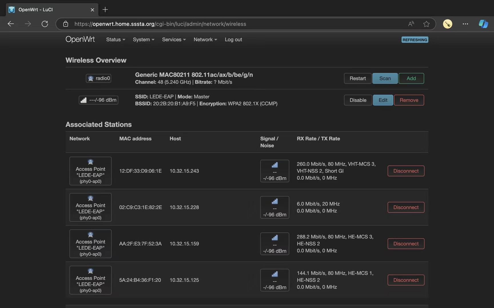
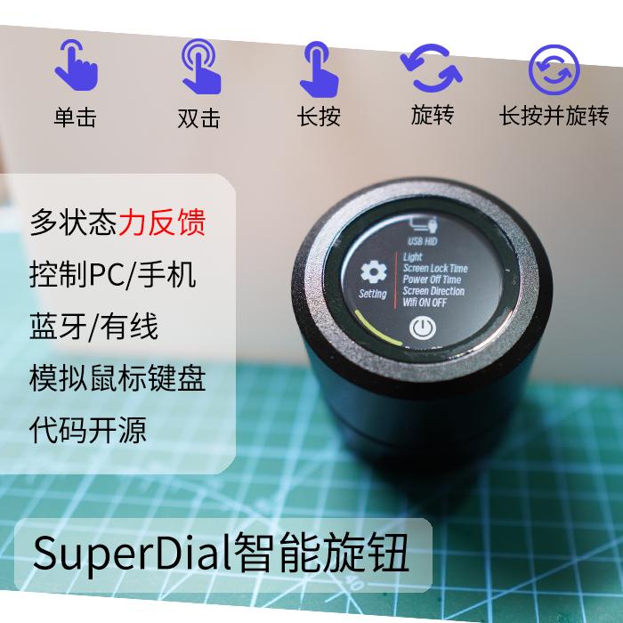
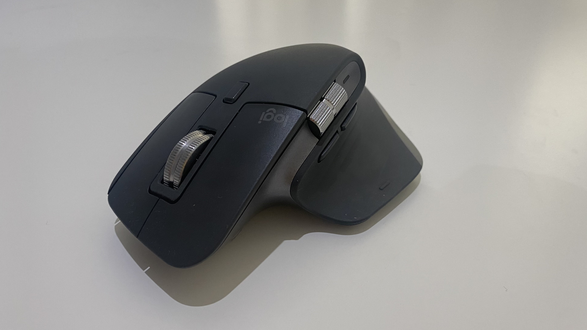

今年端午比以往略早啊，刚好可以赶在五月最后一天发出来，六月的时间就能留给下一篇 Tinc 网络结构与可观测性优化相关的内容了。过去一年有意思的新东西越来越少，以至于草民都开始偶尔买 B 站工坊上的东西了（然后事实证明最好还是不要买

# 1.8 寸智能圆屏

这个小圆屏其实看起来还挺好的，但是工坊嘛大家懂的都懂，出来的东西质量就比较一般，比如这个的屏幕和后盖都粘的不是特别牢固，还在 ESP32-S3 模块上贴了一个又大又厚的散热垫，把后面的塑料壳都顶到鼓起来了，最后还是草民自己换了一个稍微薄一点的。

  

随机带的固件只能说也是一坨大杂烩（国产小辣鸡基本操作了属于是），但是后来可以直接刷小智 AI，就突然又变得实用了一些

* [项目代码](https://github.com/78/xiaozhi-esp32)，详情可以看 README，以及 Releases 里面 taiji-pi-s3 就是这个小圆屏的版本
* [小圆屏厂家的视频](https://www.bilibili.com/video/BV1PMKWe7EZK)，想买的话也可以直接去他们家的店铺

然而这东西不能蓝牙 A2DP，音频输出只能走 3.5mm，而且 Wi-Fi 信号相当辣鸡，无论在家还是在公司，稍微远一点的 Wi-Fi 就连不上。所以最终还是逃脱不了吃灰的命运吧 hhh 看看后续能不能更新出一点更丰富的功能

# 小米的胸包

手头缺一个出去玩的时候用的小包（之前都是直接带通勤的包，里面刚好能装下个 MacBook Pro 13 那种，大部分情况下还是有点累赘

小米这个包总体来说还是很不错的，体积和空间分隔都很合理。槽点主要还是挂在胸前的话比较松，背在身后取东西又不太方便，然后就需要经常在两种形态之间切换（其实也可以试试改为挂在腰上

# 小米人体存在传感器

小米之前只有人体传感器，原理应该是基于区域内的红外辐射特征变化，会出现的问题主要是它只能判定有人移动，但如果是比如蹲在卫生间这种里面有人但几分钟不动一下的情况就没有办法区分出来。而人在传感器则是另外引入了一个 24GHz 的毫米波雷达，可以直接确认区域内有没有物体存在，跟红外信号搭配再叠一点算法就可以确定是否有人存在于空间内了。

|  |  |
| --- | --- |
| 传感器 | 自动化 |

草民买的这个目前扔在卫生间，配置成里面两分钟没人自动关灯（因为检测还是有点延迟的关系，开灯还是自己按开关），用了大半年还没有出现过什么问题，值得推荐。至于另外一个人在传感器 Pro（[这里是一个介绍视频](https://www.bilibili.com/video/BV1GdHHehEio)），因为供电要求等限制，感觉对大多数人意义不大

# 维简 CC1 电流表

很精致的一个小东西，而且价格只要四十来块（虽然长期缺货，蹲了应该得有一个礼拜才蹲到）。因为固件大小限制，[要刷不同版本的固件切换功能组](https://www.witrn.com/?p=90)。大部分人应该用不到线阻和纹波，但是看 PDO / RDO 还是有用的，所以建议刷 8.2 版本。有一说一这种做法还挺不错的，这就把 Flash 的成本节省下来了，对大部分用户来说也没啥影响，真需要的时候顺手刷个固件完事

其他的基本也没什么槽点，硬要说就是上面两个按钮的交互着实是不怎么样：比如说上图所示的功能，切换 Wh / Ah 和清除 Wh / Ah 累计数据这两个功能，是放在两个看起来很像但并不一样的界面上，还需要短按按钮两次切换，再长按某一特定按钮操作……着实有点令人困惑。顺便吐槽一下 iPhone 16 Pro Max 充电现在也就只能 20w，不过如果同时崩铁启动的话就能干到 35w（但只能持续一分钟

# QCNCM865 & 硬核拆解磁吸小垫子

把这俩放一起主要是因为刚好拍在一张图上了，而且时间也差不多。这个磁吸小垫子还挺便宜，16 块钱两个包邮，放螺丝也挺方便，推荐

至于 QCNCM865 这张卡，买它又花了将近三百块。收到的时候刚好 OpenWrt 有了基础支持，再手动打上几个 patch 就能开 AP

当然实际用下来比较糟心（以下复制一下草民当时的测试结论）：

* 信道只能选 36 - 48。DFS 不能用所以 52 - 64 以及 160MHz 都凉了；149 - 161 在草民手里这张卡的发射功率异常小（紧挨着的设备都只有一格信号那种，根本不能用），这种大概率是这一张卡的校准问题，回头便宜了可能再另买个试试
* 虽然打了 patch 但驱动也只是凑合能用，很多数据上报不上来。比如说 TX Rate 全是 0；VHT（Wi-Fi 5）和 HE（Wi-Fi 6）能显示，但手头唯一一个能开 11be 的设备就只有图上第二行那样，也不知道是协商不出来还是状态显示不对。另外，高级特性比如 MLO 啥的，因为看不到数据，也不知道是不是真的能用上
* 抛开以上这些问题，用起来倒是能用，也挺稳定的。信道开到如图 48，能协商的 MCS（差不多对应到最高速率）比之前用的 QCA6391 似乎低一些，至于实际使用则是完全感觉不到什么差别。。。

后面就扔到龙芯小主机里当客户端用了半年多，除了偶尔 ssh 进去会卡一下（应该是电源管理导致的）之外也没啥大问题，但是大概一个月左右之前突然 AOSC OS 一次更新之后就不能用了，原因似乎是卡的固件加载失败了（没细看）。于是干脆又装回了 QCNFA765，这张卡就跟 MT7925 一样，抽屉里吃灰。如果后面再买别的 Windows 小主机的话可能会换进去吧（

# iPhone 16 Pro Max

之前本来说是大概率不换 16，但当时看了几家测评说 16 的能效有比较明显的提升，去年也提到 15 还是有些散热和能耗问题，加上电池健康因为没开充电上限的关系掉到 90%（跟草民同时买的马哥到手就开了 80% 上限，然后那台当时就还有 94%），就还是有那么一点想换。结果运气非常好（？）的在狗东抢到了货，也成功以旧换新大概补了 4200 块钱，算下来也能接受吧

至于手机本身呢，只能说是如升，索然无味。散热和能效之类实话说也没觉得有很大区别，唯一一点可感知的 AI 按钮几乎从来没用到过（顺带一提马上 iOS 19 都要发布了，iOS 18 画的 AI 饼还没有兑现到国行版本）。不过这东西电池是真牛逼啊，虽然说是到手就开了 80% 充电上限，平时也几乎不太会用到 50% 以下，但是用到现在大半年过去了健康状态还是 100% 还是挺令人惊讶的

|  |  |
| --- | --- |
| 相机控制 | 电池健康 |

顺便更新了图拉斯的两个壳，最早买的是 AI 按钮那里挖孔的版本，后面更新了一个全包的，但是只是把挖孔那个地方填了一块橡胶上去……强迫症崩溃时刻了属于是，但又实在是不想再花二百多买下一个版本的壳了。凑合用吧（

至于今年的 iPhone 17 系列，看目前泄露的外观设计，实话说个人觉得是比较明显的倒退，材料也变回了 low 一些的铝合金 = = 而且 iPhone 17 Air（不知道最后会不会真的叫这个名字）谣传中的「摄像头居中」目前来看也没戏了，所以如果没有什么真的算是比较重大的更新的话应该会考虑观望一两代（或者电池健康度快要掉到 90% 以下的时候以旧换新也有可能

# 从公司搞来的 75 寸旧电视

这个是公司规模缩减之后闲置下来的（其实很早就想买了但是没门路，这波还是从某个同事那里倒了一手，花了 800 块），型号还真忘了大概是小米电视 4 吧，总之应该是个 2019 年或者 2020 年的老东西了。因为在公司用了很久，背光老化比较明显（体现为画面左边有一大片圆点状的阴影），虽然不在纯白画面下也不太看得出来，日常感觉也无所谓。

这波终于把原来那个 45 寸的小电视给扬了。刚拉回家感觉「卧槽 75 寸好大，幸亏当时没有脑子一热买 86 寸的新电视」，后来看习惯了就感觉刚刚好（上图可能看着也没有很大，但实际上这个电视宽度差不多有客厅的一半了）。另外花了一百多（应该）买了个第三方的支架放在电视柜上，效果还不错。至于为什么不挂墙，主要还是不确定这个墙够不够结实所以没搞。搭配从另一个同事那里 50 包邮来的一套小米的键盘鼠标，坐沙发上操作 R86S 相当舒坦。

# Redmi Buds 6 活力版

之前用的耳机电池全挂了（AirPods 2 是计划报废还是怎么回事？身边统计学看下来几乎都是右耳电池暴毙，左耳一切正常

这个虽然只要 99 块钱，但是调音意外的很好，很对草民胃口。当然槽点也有不少：

* 没有佩戴检测（虽然好像其实也不是很大问题
* 断联的概率略高，一般可能几十分钟就会断联一次（还是稍微有点烦
* 长按手势关不掉比较容易误触（后来发现可以直接在小爱的设置里面把蓝牙耳机唤醒小爱给关掉，这个问题也就解决了

最近看上了新款带降噪的 Redmi Buds 7S，感觉也是该有的都有，试听了一下虽然调音稍微差一点但也凑合。只能说它早出几个月就好了

# CanoKey Canary 正式版

跟之前的 CanoKey Pigeon 比起来，质感好很多，NFC 也好用了，固件里面的功能也强大一些（图片懒得拍了，随机找了一个群友的

但是现在只能评价为 Type-C 的硬件密钥真的是不如 Passkeys 好用

* 目前手头能插 Type-C 的设备差不多都有 Passkeys，然后基本上都是 iCloud 钥匙串
* 不能插 Type-C 的设备基本都用不上 CanoKey Canary
  * 移动设备里面只剩下了一个用 Lightning 的 iPad Mini 5（但它又可以上 iCloud 钥匙串
  * 因为在公司用的 NUC 装的 Windows Server 2022 还是懒得整蓝牙的关系，Passkeys 没法用
    * 有一说一，有那么一点想升级到 Windows Server 2025 解决掉蓝牙了，还可以顺便搞一下 Microsoft Store
    * 其实它也不是不能插 Type-C，只是它的 Type-C 接口刚好被 HDMI 挡住了所以比较难绷，转接一下倒也能用
      * 其实家里的台式机 Corsair One i160 也是 Type-C 在后面够不着（但是它蓝牙没问题，可以上 Passkeys

考虑到在公司还天天都得用硬件密钥，这个只能扔包里当作备份的密钥了，日常主力还是接着用上次买到的 CanoKey Pigeon

# PietOne 键盘

抽奖抽到的（包括键帽和装在上面的散轴也是抽到的，还是在同一个 UP 那里，此处必须手动感谢[十七鲤](https://space.bilibili.com/1860740010)老师和[枫岫泠尘](https://space.bilibili.com/5091316)老板

键盘的介绍可以看 [https://www.zfrontier.com/app/flow/pWmYkbJOr1G0](https://www.zfrontier.com/app/flow/pWmYkbJOr1G0)，简单总结一下特点：星闪方案与鸿蒙支持 + 3D 打印外壳 + 超长待机时间。个人还是无法接受这种过于精简的布局，白嫖到的线性轴用起来也不太习惯（又懒得换），所以还是接着用上面的 Cherry 了（

# Sharp SL-7500C

不知道从哪个角落里面翻出来的 20 多年前的库存。纯·电子辣鸡，而且寄来就暴毙了，还好卖家好说话换了一台（然而是个旧一点的

原版系统是 Linux 2.4.18 内核 + Qtopia 界面，因为是国内引进版所以自带比较完整的中文支持。简单耍了一下，提几点：

* 键盘手感意外的还不错，但是没有背光；电阻屏就不用解释了，用惯了电容屏的话真回不去
* SD 卡默认支持的容量极小，但是可以装一个驱动然后想装多大卡装多大卡（目前用了一个 32G 的 TF 转 SD
* 充电除了用自带充电器之外也可以买一个 4.0mm 的圆孔转 USB，但是要搭配一个电压高一点的充电器，还得保持亮屏才能充进去电

Qtopia 并没有想象中那么有意思，App 也没啥有意思的，虽然也可以刷自制系统之类，但刷进去大概也没啥用。这东西自身又没有什么无线能力，就算买个十几年前折腾 Windows Mobile 2003 那会儿买过的同款 CF 卡 Wi-Fi 适配器也支持不了现代的 WPA2-PSK 加密了，显然也不可能为了这么个小辣鸡专门准备一个安全性很弱的 AP，所以只能接着像去年买的 uConsole 一样当成一个小手办吃灰（

# 蓝宝石无事牌

被[破乎上面说的](https://www.zhihu.com/question/56595005/answer/72611358315)安利到了，虽然到手之后发现也没有那么夸张，不过也还算是一个挺新奇的小玩意儿吧。

买到的这个说是微瑕但其实细节很经不起深究，除了晶体边缘有一小片白点（大概就是卖家说的微瑕了）之外，人工打磨也完全没有精度可言。目前扔在公司盘着玩，不带回家的原因主要还是太重了（接近 220g，算下来密度稳稳超过 4g/cm³），来回拿了几天实在觉得太麻烦

# SuperDial 力反馈旋钮

本来是送给黄大人的智能小辣鸡，然而他更想把刚刚装修好的房子里面大量的展示柜都填满，于是给他换了一个「三月七·巡猎」手办，旋钮就自己拿回来用了。这个滚轮比上面那个小圆屏还粗糙一些，里面结构件基本都是 3D 打印件，而且屏幕也有点歪，无刷电机在某些特定的位置旋转还不顺畅。虽然也不太影响使用，但确实让强迫症人士有些难受，只能评价为是工坊中的工坊水平。

目前它最大的用途大概是横向滚轮：草民在公司的鼠标是罗技的 MX Master 3S（之前的 Gadgets 2023 里面说过），它有两个滚轮，横向滚轮用在比如看一个字段很多的表的时候就非常方便（而且这对草民来说大概算是日常

但在家里面的鼠标就没有，遇到有时候需要临时在家上线 / 查数据的时候就会因为没有横向滚轮而头疼，然后就可以使用这个旋钮（虽然很快就意识到其实按 Shift 再搓鼠标上的纵向滚轮效果是一样的，但又会有一个很难绷的问题：按住 Shift 8 秒钟就会启动粘滞键

这个旋钮还另外支持 Surface Dial 模式，不过这东西现在怕是已经没什么 App 支持了，Windows 上默认也就只有音量、上一曲 / 下一曲、纵向滚轮（在这个模式下也可以通过 Shift 变成横向滚轮）、缩放和撤销。

# 酷态科 CP122M 磁吸电能块 + 底座

其实是同事买的，但是他觉得太大，于是草民提出用之前买的小米进行交换（然后刚换完就后悔了

虽然容量比小米那个大一倍，但确实还是太厚了一些，在公司的使用场景下容量本身也不是什么优势，输出功率什么的又都一样，厚重的缺点就显得十分难以忽略；以及底座太轻，每次拿起来充电宝的时候都会把底座一起带起来，只好等端午回来在桌子上贴点儿双面胶了。

# Next

后续更新计划：

* Tinc 网络结构与可观测性优化（六月中旬。填一下清明留下的坑）
* Vacation 2025.1（七月初）
* 锐评用过的几种 CLI Shell（七八月事情比较多，所以先立一个国庆之前发出来的 Flag 吧）

最后既然今天是端午，那就送大家一首《山鬼》吧。期待 7.12 兰音 Reine 的线下（许愿抢到 SVIP 票，以及 BW 期间的机票也太贵了

<iframe src="//player.bilibili.com/player.html?isOutside=true&aid=684707134&bvid=BV1jU4y117YR&cid=738603432&p=1" scrolling="no" border="0" frameborder="no" framespacing="0" allowfullscreen="true" height="600px" width="100%"></iframe>
