[Real NAS Project 4](/real-nas-project-4/) 里面提到过一个 Tinc 路径的优化，当时留了一个坑：对 Tinc 自身状态的观测没有找到很好的办法。另外即便是在内网通过 RDP 访问 Volterra（Windows Dev Kit 2023）有的时候会很卡，一旦出现就非常影响使用。所以这次来填一下这两个坑。

# Why Tinc

常见的组网方案多少都会有点问题：

* Wireguard / OpenVPN 特征明显、用的人太多，很容易被针对
* Tailscale 边缘节点都很重，而且依赖 Wireguard，也有被针对的问题
* Zerotier 虽然轻量一些，但是自建很麻烦，要部署好几种不同的节点，而且目前也会被针对

Tinc 作为相对小众的方案至少到目前为止都还没有被针对，而且也比较轻量，自建很容易（所有节点之间基本上是对等的），但是也有一些问题比如节点管理比较麻烦、可观测性差、NAT 打洞成功率相对偏低等等，不过目前草民用起来还算顺手

# Observatory from Firewall

之前留下的坑简单说就是：需要找到办法确认 Tinc 节点之间的传输方式（直连 / 中转）以及使用的协议（TCP / UDP）。Tinc 自身提供的观测手段非常有限，基本上只有发信号读日志以及一个简单的 Graph Dump，没什么用。好在还可以从流量特征上观察

草民在 OpenWrt 上跑 Tinc，为了绕过 Xray 透明代理，将 Tinc 设置为使用 `network` 组（gid 101）启动，但为了操作 `tun` 设备，用户仍然使用 `root`。OpenWrt 上没有其他的服务使用这样的方式运行，因此可以在 nftables 上通过 `skuid` + `skgid` 过滤出 Tinc 相关的出站方向流量；至于入站方向，简单按照 `tcp dport 655` 和 `udp dport 655` 筛一下就行了。基于这样的约定，可以写出以下 nftables 规则将所有跟 Tinc 交换过数据的 IP + 端口记录在几个特定的 Set 中，放在 `/usr/share/nftables.d/table-pre/tinc.nft` 即可：

```
set tinc_inbound_v4 {
    type ipv4_addr . inet_service . inet_proto
    flags dynamic, timeout
}

set tinc_inbound_v6 {
    type ipv6_addr . inet_service . inet_proto 
    flags dynamic, timeout
}

set tinc_outbound_v4 {
    type ipv4_addr . inet_service . inet_proto
    flags dynamic, timeout
}

set tinc_outbound_v6 {
    type ipv6_addr . inet_service . inet_proto
    flags dynamic, timeout
}

chain tinc_inbound {
    type filter hook input priority mangle +5; policy accept;
    ip protocol udp udp dport 655 counter update @tinc_inbound_v4 {ip saddr . udp sport . ip protocol timeout 60s counter} return;
    ip6 nexthdr udp udp dport 655 counter update @tinc_inbound_v6 {ip6 saddr . udp sport . ip6 nexthdr timeout 60s counter} return;
    ip protocol tcp tcp dport 655 counter update @tinc_inbound_v4 {ip saddr . tcp sport . ip protocol timeout 60s counter} return;
    ip6 nexthdr tcp tcp dport 655 counter update @tinc_inbound_v6 {ip6 saddr . tcp sport . ip6 nexthdr timeout 60s counter} return;
}

chain tinc_outbound {
    type filter hook output priority mangle +5; policy accept;
    ip protocol udp meta skuid 0 meta skgid 101 counter update @tinc_outbound_v4 {ip daddr . udp dport . ip protocol timeout 60s counter} return;
    ip6 nexthdr udp meta skuid 0 meta skgid 101 counter update @tinc_outbound_v6 {ip6 daddr . udp dport . ip6 nexthdr timeout 60s counter} return;
    ip protocol tcp meta skuid 0 meta skgid 101 counter update @tinc_outbound_v4 {ip daddr . tcp dport . ip protocol timeout 60s counter} return;
    ip6 nexthdr tcp meta skuid 0 meta skgid 101 counter update @tinc_outbound_v6 {ip6 daddr . tcp dport . ip6 nexthdr timeout 60s counter} return;
}
```

重启 `fw4` 加载一下规则，然后就可以用 `nft list sets` 或者 LuCI 的 `fw4` 页面观察流量（但 LuCI 目前还不能显示 Set，只能看到 Chain 上每一个 Rule 对应的 Counter）。再写一个脚本转换一下格式导入 Prometheus，简单起见一样用 CGI 来做。把下面的内容扔到 `/www/cgi-bin/tinc.counter` 并 `chmod +x`，然后就可以直接通过 `uhttpd` 访问：

```js
#!/usr/bin/ucode
import { popen } from 'fs';

const nft = popen('nft --json list sets');
const counters = nft.read("all");
nft.close();

print("Content-Type: text/plain; version=0.0.4; charset=utf-8; escaping=values\r\nConnection: close\r\n\r\n");

const value = json(counters);
for (let a in value["nftables"]) {
    if (a.set && index(["tinc_inbound_v4", "tinc_inbound_v6", "tinc_outbound_v4", "tinc_outbound_v6"], a.set.name) >= 0) {
        for (let b in a.set.elem) {
            print(a.set.name, '_bytes{address="', b.elem.val.concat[0], '", port="', b.elem.val.concat[1], '", protocol="', b.elem.val.concat[2], '"} ', b.elem.counter.bytes, "\n");
            print(a.set.name, '_packets{address="', b.elem.val.concat[0], '", port="', b.elem.val.concat[1], '", protocol="', b.elem.val.concat[2], '"} ', b.elem.counter.packets, "\n");
        }
    }
}
```

配置好 Prometheus 的 Scrape 之后得到下图。观察出入流量方向，都有的 IP 肯定就是直连（图上按 IP 聚合了所以没有显示端口）。这个 nftables 规则针对 TCP 的部分写的应该还是有点问题的（可能会少统计一部分包），虽然应该也基本不影响使用。观测问题初步解决

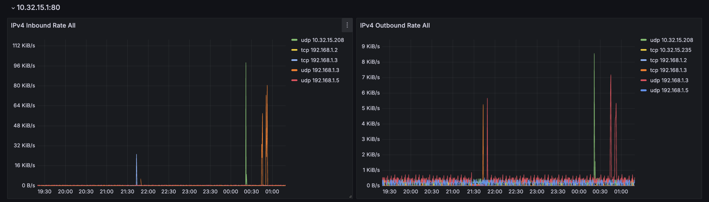

顺便，因为这个抓取的成本很低，它甚至可以一定程度上代替之前的 Ping 直接用来观测延迟。从图上可以看出来两条线的趋势在几次网络切换的地方是可以吻合的，但 Prometheus 抓取会在其他很多地方出现一些随机波动

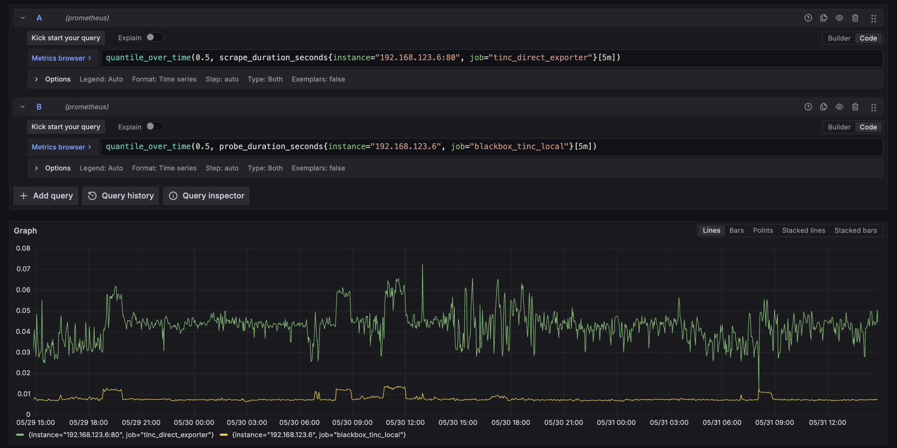

初步猜测是 Prometheus 抓取到的数据大概率还是会超出 MTU 导致 IP 层拆包，结果体现为抓取耗时不如 Ping 稳定。可以尝试简单补一个 gzip 来避免超过 MTU 导致的 IP 层拆包，抓下一个指标的时候介绍一下怎么做，也顺便观察一下效果

# Volterra Network Debug

然后开始解决 Volterra 的 RDP 有的时候非常卡的问题。利用上面的手段观察了流量特征，发现 RDP 很卡的时候 Tinc 的传输都是 TCP，而 RDP 不卡的时候 Tinc 的传输主要是 UDP（注意这里说的是 Tinc 使用的协议，而不是 RDP 自身选用的协议）。按说内网环境 TCP 跟 UDP 也不应该差到有如此明显的感知，不过考虑到 Volterra 放的位置无线信号不是特别好，也不完全能排除这种可能性

首先确认一件事就是 Tinc 在什么情况下会使用 UDP，从日志来看如果两个 Node 之间能建立直接连接（包括 NAT 打洞成功），并且探测出来的 PMTU 最小值比本次传输的包经过 MSS Clamping 之后要大，就可以使用 UDP 进行传输

```
2025-06-15 01:03:24 tinc[2252]: Packet for openwrt (10.32.15.1 port 655) larger than minimum MTU, forwarding via TCP
```

简单观察了一段时间的日志，能直连但是不走 UDP 的情况下 PMTU 最小值基本都是 0，于是有两个事情可以做：

* 对 PMTU 进行观测，找到规律并做针对性调整，使得其能尽量保持在正常水平（可能比较困难
* 确认一下为什么内网 TCP 也会导致 RDP 非常卡，是信号太差导致丢包还是什么别的原因。这个事情明显不对劲，下面来优先解决

## iPerf3

先跑个 iPerf3 看看是不是底下真实网络的问题。果然，从 Volterra 上直接出去（主要是从 OpenWrt 直接出去）的话 Retransmission 严重

```
root@OpenWrt:~# iperf3 -c 192.168.1.5
Connecting to host 192.168.1.5, port 5201
[  5] local 10.0.0.4 port 32924 connected to 192.168.1.5 port 5201
[ ID] Interval           Transfer     Bitrate         Retr  Cwnd
[  5]   0.00-1.00   sec   128 KBytes  1.05 Mbits/sec   35   4.24 KBytes       
[  5]   1.00-2.00   sec   128 KBytes  1.05 Mbits/sec   24   2.83 KBytes       
[  5]   2.00-3.00   sec   256 KBytes  2.10 Mbits/sec   34   2.83 KBytes       
[  5]   3.00-4.00   sec   256 KBytes  2.10 Mbits/sec   30   2.83 KBytes       
[  5]   4.00-5.00   sec   128 KBytes  1.05 Mbits/sec   34   2.83 KBytes       
[  5]   5.00-6.00   sec   256 KBytes  2.10 Mbits/sec   44   2.83 KBytes       
[  5]   6.00-7.00   sec   128 KBytes  1.05 Mbits/sec   28   2.83 KBytes       
[  5]   7.00-8.00   sec   384 KBytes  3.14 Mbits/sec   36   5.66 KBytes       
[  5]   8.00-9.00   sec   128 KBytes  1.05 Mbits/sec   28   5.66 KBytes       
[  5]   9.00-10.00  sec   128 KBytes  1.05 Mbits/sec   32   2.83 KBytes       
- - - - - - - - - - - - - - - - - - - - - - - - -
[ ID] Interval           Transfer     Bitrate         Retr
[  5]   0.00-10.00  sec  1.88 MBytes  1.57 Mbits/sec  325            sender
[  5]   0.00-10.01  sec  1.88 MBytes  1.57 Mbits/sec                  receiver

iperf Done.
```

换了几种方式跑，入站无问题，出站过一次 NAT 之后也没问题；起初怀疑是 OpenWrt 的问题于是顺手起了个 FreeBSD，但表现一样

|  | 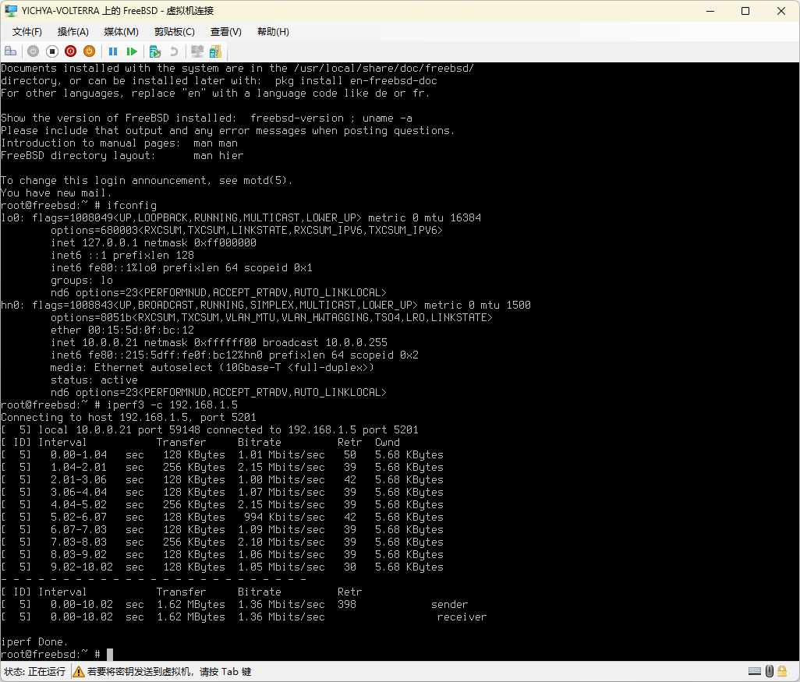 |
| --- | --- |
| 经过 NAT 无 Retransmission | 不走 NAT 有 Retransmission |

那就只能靠抓包来分析一下为什么会出现如此严重的 Retransmission 了。

## Hierarchy

抓包肯定要先找个设备，那么首先来看看 Volterra 的网络是怎么搭起来的，也就是下面这张图里面都是些什么鬼东西

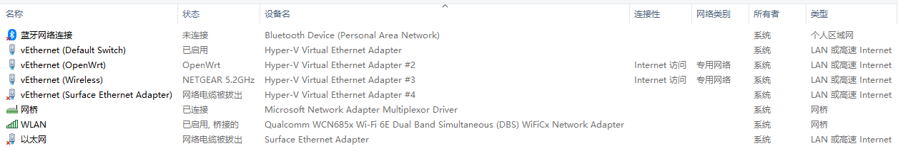

上面有三个未连接 / 网络电缆被拔出的用不到，关注剩下的几个已启用 / 已连接的：

* `WLAN`：真实的无线网卡，但是只接在桥上，不直接在上面绑定 TCP/IP
* `网桥`：Hyper-V 创建的，只有上面那个 WLAN 显示接在上面（但实际上还有别的）
* `vEthernet (Default Switch)`：默认的 NAT 网络。客户端版本 Windows 自带的 Hyper-V 会有这个，但只能说不怎么好用
* `vEthernet (OpenWrt)`：OpenWrt 的 LAN，暴露给 Host OS 做默认网关使用
* `vEthernet (Wireless)`：Hyper-V 桥上的虚拟网卡，「允许管理操作系统共享此网络适配器」后就会有这个 Host OS 可用的设备

说起来这还是头一次在 Hyper-V 环境里面真的见到一个桥，印象中以往都没这玩意儿。比如 R86S 上就是左图这样，物理设备的样子不变（虽然 TCP/IP 也不跑在它上面了，跟上面一样会有一个「允许管理操作系统共享此网络适配器」之后才可见的 vEthernet 设备给 Host OS

| 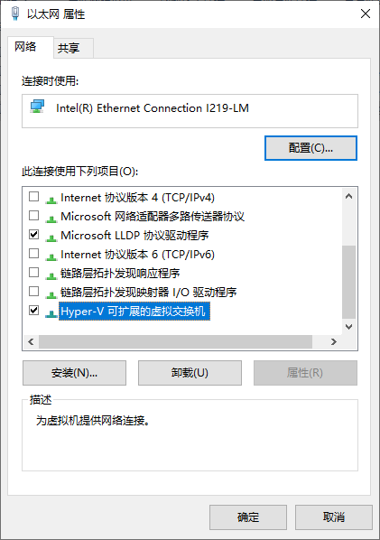 | 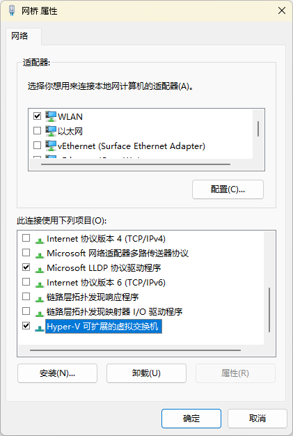 |
| --- | --- |
| 之前的桥（Windows Server 2022，不过是个有线网卡）| 这次的桥（Windows 11） |

但这次见到的这个桥（右边）就很奇怪，不仅有一个真的桥，而且 TCP/IP 还没有跑在上面，非得再拉出一个 `vEthernet (Wireless)` 用来跑 TCP/IP，总之就是十分诡异。后来在 Corsair One 上又试了一下，似乎无线设备都是这样，估计是驱动模型不一样吧

## Wireshark

从 OpenWrt 直接出去的包是经过上面那个奇怪的 `网桥` 再从桥上的 `WLAN` 出去。既然在 Windows 上跑 Wireshark，那就从 `网桥` 开始抓好了。结果一抓一个准，从结果里面发现大量的出包方向上的 TCP CHECKSUM INCORRECT 以及随之而来的更多的 TCP Retransmission

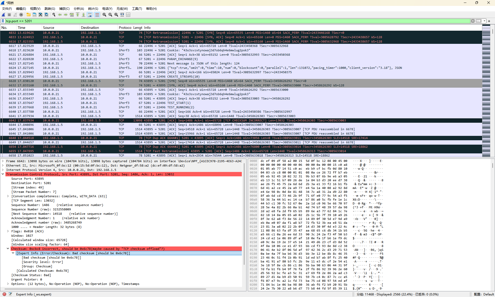

Wireshark 提示 Checksum 不对可能是 TCP checksum offload 导致（而且错误的 Checksum 几乎都一样）。虽然直接从 OpenWrt 上抓也会看到类似的情况，但是当时 Wireshark 的提示是部分正确，而且有一说一，OpenWrt 的 [GSO 和 GRO](https://docs.kernel.org/networking/segmentation-offloads.html) 有段时间几乎是天天出问题，这次如果又是这玩意儿炸了的话还真是一点都不意外（虽然上面刚说了 FreeBSD 也一样炸啊

总之既然 Wireshark 说可能是 TCP checksum offload 的锅，那就先尝试关掉吧。Windows 上一开始没找到怎么搞，先从 OpenWrt 上试试

## Disabling Offload

先看看 OpenWrt 上面 WAN 设备都开了些什么 Offload

```
root@OpenWrt:~# ethtool --show-offload eth1
Features for eth1:
rx-checksumming: on
tx-checksumming: on
	tx-checksum-ipv4: on
	tx-checksum-ip-generic: off [fixed]
	tx-checksum-ipv6: on
	tx-checksum-fcoe-crc: off [fixed]
	tx-checksum-sctp: off [fixed]
scatter-gather: on
	tx-scatter-gather: on
	tx-scatter-gather-fraglist: off [fixed]
tcp-segmentation-offload: on
	tx-tcp-segmentation: on
	tx-tcp-ecn-segmentation: off [fixed]
	tx-tcp-mangleid-segmentation: off
	tx-tcp6-segmentation: on
generic-segmentation-offload: on
generic-receive-offload: on

<omitted...>
```

里面有 `tcp-segmentation-offload`、`generic-segmentation-offload`、`generic-receive-offload`，于是打算挨个试试看，结果试到第一个 `ethtool -K eth1 tso off` 问题立刻就消失了。。。

```
root@OpenWrt:~# iperf3 -c 192.168.1.5
Connecting to host 192.168.1.5, port 5201
[  5] local 10.0.0.5 port 47166 connected to 192.168.1.5 port 5201
[ ID] Interval           Transfer     Bitrate         Retr  Cwnd
[  5]   0.00-1.00   sec  6.38 MBytes  53.4 Mbits/sec    0    385 KBytes       
[  5]   1.00-2.00   sec  5.25 MBytes  44.0 Mbits/sec    0    601 KBytes       
[  5]   2.00-3.00   sec  4.50 MBytes  37.7 Mbits/sec    1    488 KBytes       
[  5]   3.00-4.00   sec  5.12 MBytes  43.0 Mbits/sec    0    544 KBytes       
[  5]   4.00-5.00   sec  3.75 MBytes  31.5 Mbits/sec    0    581 KBytes       
[  5]   5.00-6.00   sec  5.00 MBytes  41.9 Mbits/sec    0    607 KBytes       
[  5]   6.00-7.00   sec  6.38 MBytes  53.5 Mbits/sec    0    621 KBytes       
[  5]   7.00-8.00   sec  5.12 MBytes  43.0 Mbits/sec    0    626 KBytes       
[  5]   8.00-9.00   sec  5.12 MBytes  43.0 Mbits/sec    0    626 KBytes       
[  5]   9.00-10.00  sec  5.12 MBytes  43.0 Mbits/sec    0    626 KBytes       
- - - - - - - - - - - - - - - - - - - - - - - - -
[ ID] Interval           Transfer     Bitrate         Retr
[  5]   0.00-10.00  sec  51.8 MBytes  43.4 Mbits/sec    1            sender
[  5]   0.00-10.04  sec  49.2 MBytes  41.2 Mbits/sec                  receiver

iperf Done.
```

当然上面也提到这个问题显然不是 OpenWrt 自己的，所以还是要尝试在 Windows 里面关掉。因为抓包是在 `网桥` 上发现的问题，所以就优先找了一下对应的设置，在设备管理器里面。里面也有 TCP Checksum Offload，但是关掉没有用；关掉了跟 `tcp-segmentation-offload` 差不多的 [Large Send Offload](https://en.wikipedia.org/wiki/TCP_offload_engine#Large_send_offload) 之后问题得到解决。

| 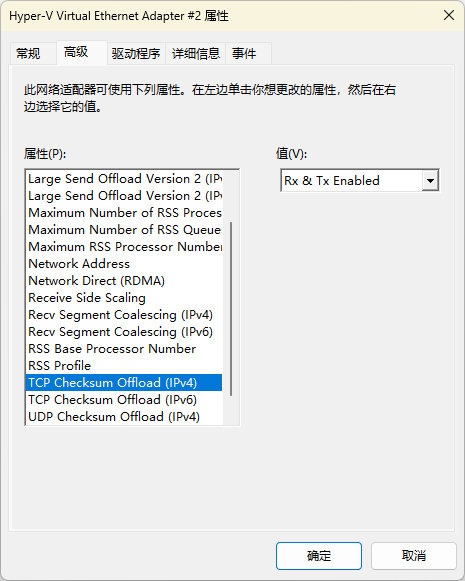 | 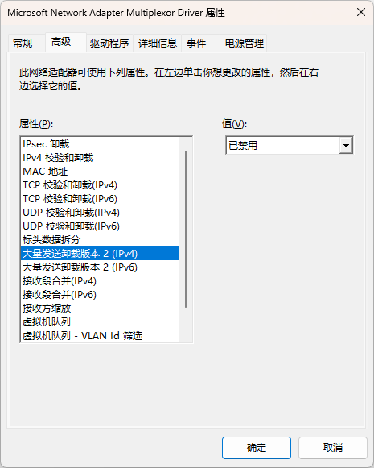 |
| --- | --- |
| 英文（仅用来做对照） | 中文（出问题的网桥） |

Google 上一搜有挺多相关结果都说这个东西会严重影响上传速度，只能评价为微软的咖喱味儿真的是越来越浓了

# Graph Dump with Statistics

解决了网络问题之后来看看怎样获取 PMTU 以便确定 Tinc 的传输状态。Tinc 自身有一个 Graph Dump 可以提供 Node 之间的连接关系，但问题在于只有连接关系，更多的细节比如每个节点的 PMTU 和每条边的权重都没有。好在 Tinc 这部分代码比较简单，稍微改一下就可以在 dump 中返回 PMTU 和 Weight 的值。另外，Tinc 的图更新有的时候不能传播到所有节点，所以再进行一点简单修改，在接到 ALRM 信号的时候触发一次主动更新 PMTU（以下代码修改自 Tinc 1.0.36）：

```patch
diff --git a/src/graph.c b/src/graph.c
index c63fdf9c..cb57f0da 100644
--- a/src/graph.c
+++ b/src/graph.c
@@ -326,7 +326,7 @@ void graph(void) {
    dot -Tpng graph_filename -o image_filename.png -Gconcentrate=true
 */
 
-void dump_graph(void) {
+void dump_graph(time_t last_ping_check) {
 	avl_node_t *node;
 	node_t *n;
 	edge_t *e;
@@ -355,18 +355,18 @@ void dump_graph(void) {
 		return;
 	}
 
-	fprintf(file, "digraph {\n");
+	fprintf(file, "digraph {\n	comment = \"%ld\";\n", last_ping_check);
 
 	/* dump all nodes first */
 	for(node = node_tree->head; node; node = node->next) {
 		n = node->data;
-		fprintf(file, "	\"%s\" [label = \"%s\"];\n", n->name, n->name);
+		fprintf(file, "	\"%s\" [label = \"%s\", comment = \"%d %d %d\"];\n", n->name, n->name, n->mtu, n->minmtu, n->maxmtu);
 	}
 
 	/* now dump all edges */
 	for(node = edge_weight_tree->head; node; node = node->next) {
 		e = node->data;
-		fprintf(file, "	\"%s\" -> \"%s\";\n", e->from->name, e->to->name);
+		fprintf(file, "	\"%s\" -> \"%s\" [comment = \"%d\"];\n", e->from->name, e->to->name, e->weight);
 	}
 
 	fprintf(file, "}\n");
diff --git a/src/graph.h b/src/graph.h
index fafffcb0..60bab17d 100644
--- a/src/graph.h
+++ b/src/graph.h
@@ -22,6 +22,6 @@
 */
 
 extern void graph(void);
-extern void dump_graph(void);
+extern void dump_graph(time_t last_ping_check);
 
 #endif
diff --git a/src/net.c b/src/net.c
index 37ae1166..e3e673e0 100644
--- a/src/net.c
+++ b/src/net.c
@@ -583,6 +583,8 @@ int main_loop(void) {
 				}
 			}
 
+			graph();
+
 			sigalrm = false;
 		}
 
@@ -697,7 +699,7 @@ int main_loop(void) {
 		/* Dump graph if wanted every 60 seconds*/
 
 		if(last_graph_dump + 60 <= now) {
-			dump_graph();
+			dump_graph(last_ping_check);
 			last_graph_dump = now;
 		}
 	}
```

获得的 dump 就可以包含节点的 PMTU（三个值，主要关注中间的最小值）和连接的 Weight，以及上次 Ping 的时间戳：

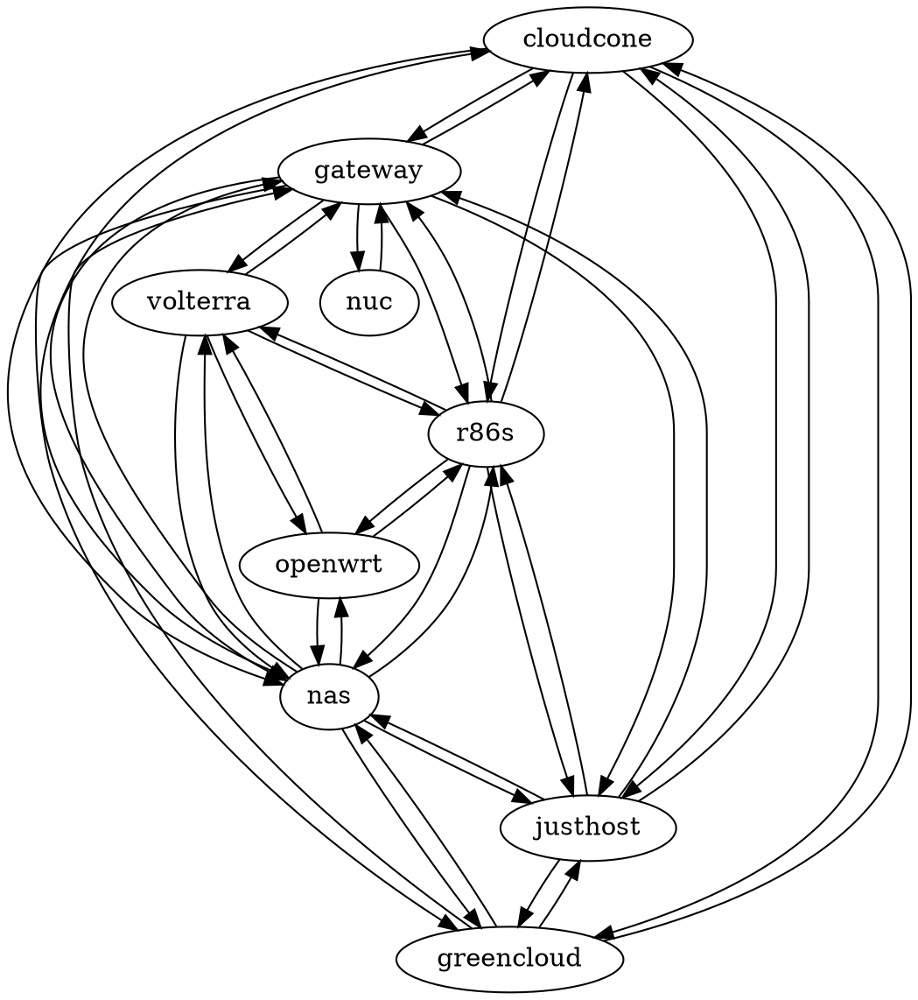

同样也简单转换成 Prometheus 格式用作收集，顺便也给 Tinc 发出主动更新信号。因为这个指标会大一点，所以我们在这里补一个 gzip

```js
#!/usr/bin/ucode
"use strict";
import { readfile, lstat, popen } from "fs";

function convert(w, content) {
    const lines = split(content, '\n');
    for (let line in lines) {
        const splittedLine = split(line, ' ');
        if (length(splittedLine) == 9) {
            const node = replace(trim(splittedLine[0]), '"', '');
            w.write(`tinc_node_pmtu{label="${node}"} ${replace(splittedLine[6], '"', '')}\n`);
            w.write(`tinc_node_min_pmtu{label="${node}"} ${splittedLine[7]}\n`);
            w.write(`tinc_node_max_pmtu{label="${node}"} ${replace(splittedLine[8], '"];', '')}\n`);
        }
        if (length(splittedLine) == 6) {
            const weight = replace(replace(splittedLine[5], '"', ''), '];', '');
            w.write(`tinc_edge_weight{from="${replace(trim(splittedLine[0]), '"', '')}", to="${replace(splittedLine[2], '"', '')}"} ${weight}\n`);
        }
        if (length(splittedLine) == 3) {
            const updated = time() - int(replace(replace(splittedLine[2], ';', ''), '"', ''));
            w.write(`tinc_ping_last_updated_seconds ${updated}\n`);
        }
    }
}

print("Content-Type: text/plain; version=0.0.4; charset=utf-8; escaping=values\r\nContent-Encoding: gzip\r\nConnection: close\r\n\r\n");

const dumpFileName = match(readfile("/etc/tinc/tinc.conf"), /GraphDumpFile\s*=\s*([^\n]*)/);
if (length(dumpFileName) == 2) {
    const fileStat = lstat(dumpFileName[1]);
    if (fileStat) {
        const updated = time() - fileStat.mtime;
        const gzip = popen("gzip -c", "w");
        gzip.write(`tinc_file_last_updated_seconds ${updated}\n`);
        convert(gzip, readfile(dumpFileName[1]));
        gzip.flush();
        gzip.close();
        if (updated > 233) {
            system("killall -ALRM tincd");
        }
    }
}
```

用一点技巧把 min PMTU 和 Ping 延迟画在一张图上，可以说对应关系非常准确

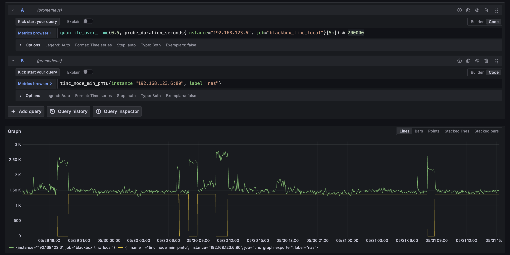

另外也尝试观察了 Prometheus 的抓取耗时看看能不能取代 Ping 探测，结果是基本上无法区分，虽然加了 gzip 但是效果也有限，估计大概是因为完成一次 CGI 调用的成本太高（但确实写起来很省事儿），还是接着用 Ping 探测吧。

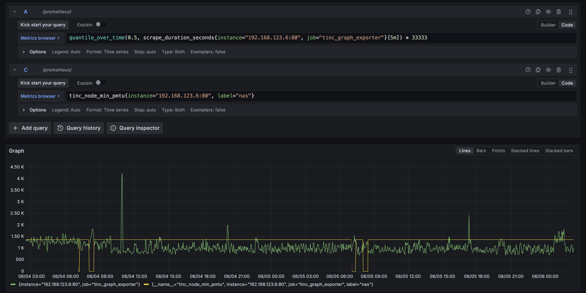

PMTU 观测的问题就解决了，后面还是想看看有没有可能观察出规律，把 NAT 打洞搞再稳定一点，不过这事儿也不太是草民能控制的

# Next

最近在 RSS Pipe 上按之前的想法加了一些杂七杂八的小功能。感觉用起来还不错，后面就可以考虑做一点额外的能力了

然后是七月初发 Vacation 2025.1（🐰的 SVIP 没抢到，难受了一个多星期；以及🐦的上海场在 8.2，跑一趟上海成本太高，应该也不会去了
