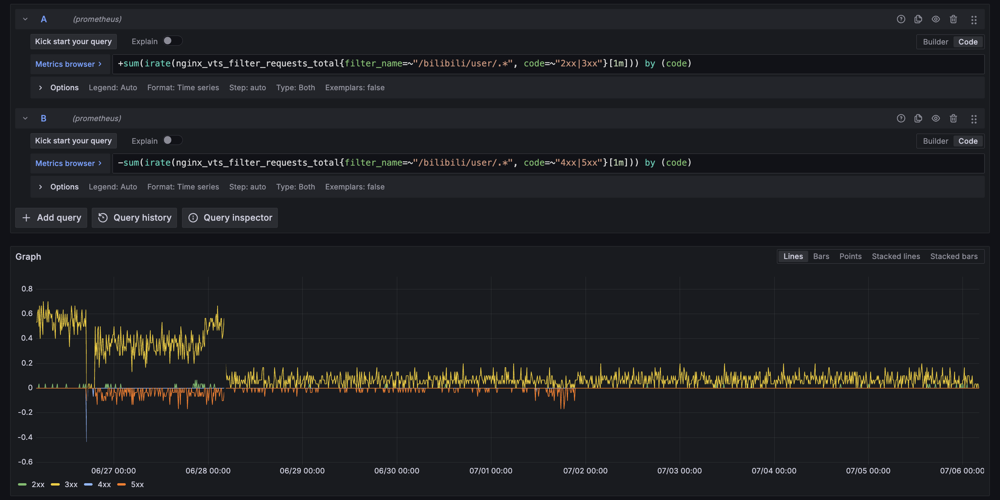

RSSHub 需要一个 Headless Chromium 来应对 B 站的反爬措施。去年的做法是用 systemd 直接拉起来一个，并且当它被 RSSHub 主动关掉之后自动重启，用起来倒是也没啥问题，资源占用也几乎可以忽略不计，但每次 `ps auxf` 看见一大堆 Chromium 都感觉很扎眼。

之前也研究过 RSSHub 推荐的几种方式，但都感觉不是很好：

* RSSHub 自己的容器里面直接带一个 Chromium，按需启动
  * 问题主要是在草民这里一直都很不好使，B 站反爬用这玩意儿就没有一次能成功的，自己起 Headless Chromium 就非常的顺利
* 另外有一个 [browserless/chrome](https://hub.docker.com/r/browserless/chrome)，毒点很多
  * 很重，镜像 1GB+，都不知道里面塞了一些什么鬼东西
  * 为了维持这东西的服务，要起一个 `conmon` 再起一个 `node`，加起来恐怕也不比一个常驻的 Headless Chromium 轻了
* 还有一个问题是这两个方式安装的 Chromium 更新也不是很方便，也不能提供给 Host OS 使用，浪费空间

后面又在给 Ubuntu 改 SSH 端口的时候了解了 systemd 的 Socket Activation，于是想试试用这个来做一下按需启动

# Socket Activation

这个特性实际上来自于历史非常久远的 `inetd`，它负责专门跟网络交互并给后面的服务提供 fd 用来直接读写。不知道它是什么的话可以说它跟 CGI 有点类似，甚至一定程度上这俩是可以兼容的（毕竟都可以用 `stdio`，只是 CGI 多一步解析 HTTP Request 而已，可以通过判断 CGI 特有的一些环境变量来决定要不要从 `stdin` 里面读 HTTP Header）。Socket Activation 在特定的情况下还是有一些用处：

* 它能够使得服务不需要提权（root 或者 `CAP_NET_ADMIN`）就可以绑定 1024 以下的限制端口，对安全性更有好处
  * 虽然现在一般都会起一个 nginx 之类的东西来做这件事，而且 nginx 能做的事情要多不少（比如 SSL、路由和负载均衡）
* CGI 或者 inetd 的传统用法下每个连接都要拉一个进程起来，处理请求的代价会很高，而且稍微有点并发就寄了
  * systemd 倒是额外支持（而且推荐）服务自己 `accept` 的用法，性能可能也不至于太难看（没试过，不确定）
  * 对于不频繁使用的短任务（比如 ssh 这种，或者像是 Cockpit 这种相当现代化的服务也用了这样的方式来启动）来说就很合适
    * 毕竟不用一直开着一个进程，用完了就可以干掉，下次再用的时候再拉起来就行，整体还是能省一些资源

至于具体的流程，说实话有点复杂，里面很多东西也不是很清晰，还需要服务主动做代码相关的适配。有一说一，这年头也基本上用不到这种技术，简单了解下流程就好，可以参考 [https://mgdm.net/weblog/systemd-socket-activation/](https://mgdm.net/weblog/systemd-socket-activation/) 里面的示例。

# Unsupported Applications

大部分现代服务都会主动 Listen 端口，而不是使用二三十年前的 inetd 或者 CGI 风格与网络交互。对于这些不支持传递 fd 的服务，可以利用 systemd 自带的 `systemd-socket-proxyd` 进行转发。当然也有一些需要关注的问题：

* 抢端口，也就是 systemd 和它拉起来的服务会 bind 到同一个地方
  * 不建议 `ReusePort`，这东西的行为是负载均衡，会引入不确定性
  * 可以在本地回环上随便找个地方解决，或者绑定在一个别的设备上
    * 但是如果设备初始化的比较晚的话，设置一下 `FreeBind`
* 可能不知道拉起来的服务要多长时间才能开始 Listen，所以还要加个 Sleep 或者健康检查
  * 其实草民觉得 `systemd-socket-proxyd` 就应该能做这个
    * 但后来一想健康检查的逻辑可能很复杂，那还是 `ExecStartPre` 吧

# Activator

实际做一下。首先定义一个 Socket，名字就定为 `chromium_activator.socket`：

* 它会把同名服务拉起来（这个服务下面定义），systemd 会通过环境变量传递 fd 过去，拉起来的服务直接用传递过来的 fd 读写即可
* 为了避免撞端口，把它 Listen 在 Podman 的网络上
  * 这个设备启动会比较慢，所以设置上 `FreeBind`
  * 虽然其实放在 Podman 的网络上并没有啥意义，因为 RSSHub 还是会用接口返回的完整 URL 去访问 Headless Chromium

```ini
[Unit]
Description=Chromium Activator

[Socket]
ListenStream=172.17.0.1:9222
Restart=Always
FreeBind=true

[Install]
WantedBy=sockets.target
```

然后再定义一个由上面那个 Socket 激活的服务，名字就叫 `chromium_activator.service`：

* 让它把 Chromium 拉起来
* 拉起来之后用 curl 做健康检查
* 健康检查没问题之后启动 `systemd-socket-proxyd` 代理
* 顺便管理一下生命周期
  * 给 `systemd-socket-proxy` 指定一个 40s 空闲就退出的参数
  * RSSHub 会在 30s 后干掉它拉起来的 Chromium，这个是写在它的代码里面的（改不了，不用管
  * 为了避免一些意外情况，给这两个服务再指定一个 systemd 控制的最大运行时长，保证他们用完之后及时释放资源
    * Chromium 60s（下面改），`systemd-socket-proxy` 50s
    * 这两个时间要比上面的两个要长，这样 systemd 拿到的服务退出状态才是正常的

```ini
[Unit]
Requires=chromium.service
After=chromium.service
Requires=chromium_activator.socket
After=chromium_activator.socket
JoinsNamespaceOf=chromium.service

[Service]
ExecStartPre=curl --retry 5 --retry-connrefused --retry-delay 1 http://127.0.0.1:9222/json/version
ExecStart=/lib/systemd/systemd-socket-proxyd 127.0.0.1:9222 --exit-idle-time 40s
RuntimeMaxSec=50s

[Install]
WantedBy=multi-user.target
```

Headless Chromium 的服务还用之前 [Self Hosted (1)](../self-hosted-1) 里面的那个，但做一点小调整：

* Disable 掉避免它自动启动
* 按上面说的控制一下生命周期
  * 把 `Restart=Always` 去掉
  * 增加 `RuntimeMaxSec=60s` 保证它用完后自动退出

最后 `sudo systemctl enable chromium_activator.socket` 让它自动启动就行了。

```bash
# curl 172.17.0.1:9222/json/version
{
   "Browser": "Chrome/138.0.7204.49",
   "Protocol-Version": "1.3",
   "User-Agent": "Mozilla/5.0 (X11; Linux x86_64) AppleWebKit/537.36 (KHTML, like Gecko) HeadlessChrome/138.0.0.0 Safari/537.36",
   "V8-Version": "13.8.258.19",
   "WebKit-Version": "537.36 (@d2b48fd5f7813ed477a2d68fa232b8178fa4fb1e)",
   "webSocketDebuggerUrl": "ws://172.17.0.1:9222/devtools/browser/7299ef75-0a2d-4600-bfbf-1d8f642ed028"
}
```

# Simplify and Monitoring

既然引入了 curl 做健康检查，其实也可以考虑不使用 `systemd-socket-proxyd`，不过有几点考虑：

* `systemd-socket-proxyd` 是 systemd 自带，无需额外安装，不产生额外磁盘空间占用
* `systemd-socket-proxyd` 的生命周期短于被一起拉起来的 Chromium，不产生长期资源占用
* 直接使用 CGI 风格返回 curl 的结果可能会导致 RSSHub 启动的时候拉起来一堆 curl，不如只起一个 `systemd-socket-proxyd` 高效

另外一个可以简化的点是：如果考虑丢掉 curl，或许可以利用 nginx 来处理重试

* 顺便可以将 Chromium 的启动次数记录到 Prometheus 中（虽然好像也没啥用
* 研究了一下，nginx 竟然没有很直接的方式来做针对 502 的直接重试，只能通过错误处理之类的方式绕一圈，真是令人费解，不搞了

至于这么做了有啥用，实话说基本没有，基本上就只有 CPU 占用少了 1% 左右。但是观察日志，Headless Chromium 可能每 15 分钟到一个小时才会被启动一次，绝大多数情况下 `ps auxf` 都不会再看到 Chromium 相关的进程，确实要顺眼很多。

# End

更新于 7.6 的一点题外话：开始写这篇的时候 B 站似乎刚好在做一些反爬相关的升级

* 最早是从 6.26 某次重启 NAS 后发现 RSSHub 的健康检查一直过不去，升级 RSSHub 也没用
  * 后来抓了一下包，小改一下代码解决，但开始出现偶尔被风控拦截的情况，不过情况还算可以接受
* 7.1 15:30 错误率突然开始显著上升，健康检查连十分钟都扛不过去了，纯纯是吊着一口气那种状态
  * 但是非常神奇的是，21:30 左右它竟然又完全恢复到了 6.26 之前那种一个报错都没有的状态

然后观察了几天，截止到 7.6 都再也没出现过一次报错，如下图。甚至从上面 Socket Activation 的日志来看连刷新 Cookie 都没操作过



虽然不知道 B 站是在搞什么活，但反正最后一次获取到的 Cookie 留下来了，如果下次重启再炸就把它填回去。顺便其实这部分是发 Vacation 2025.1 的时候一起补上的，所以就不再这里写下期预告了（
