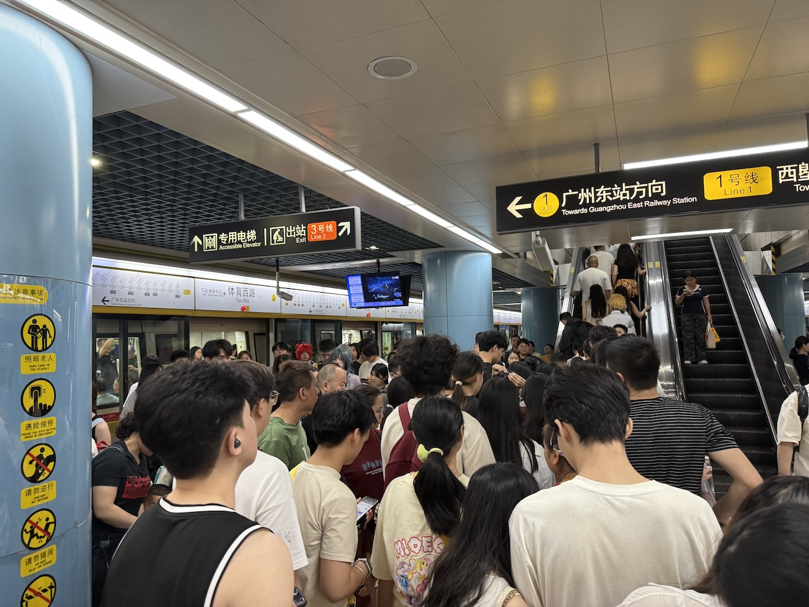

本来 Vacation 2025.1 应该在五月更新的，但刚好 Gadgets 2025 卡在五月了于是往后挪一挪。上半年跑的地方还挺多的，频率也跟去年一样一个月最少一次。而且目前上半年四场 Live，下半年目前确定的都至少两场了，说不定还有两次整大活的计划，好像浪的有点狠了啊（

# 1.11 滑雪

「周末偶遇初级雪道，单板光滑难如怪物，拼尽全力无法战胜」

头一次在晚上来都江堰转悠。还泡了个温泉，贼爽（去年好像也是年初去峨眉山泡的，这个能不能也安排成年常啊

花销不大，买的是融创那个滑雪加温泉加酒店的套餐吧好像是，价格也挺便宜好像一个人两三百块？具体忘了，总之还挺不错的

# 1.18 三岔湖

不知道是不是没去对地方，感觉比较差劲。实习期开车初体验（还好没出什么乱子

晚上去了趟山姆（蹭马老板的卡）。今年进口的樱桃确实不错（虽然我个人还是比较喜欢现摘那种稍微有点酸味的，但今年没安排上

# 2.15 泠鸢 yousa 线下 Live（成都场）

也是真的期待了很久啊。刚好过年被春晚版本的《春意红包》狠狠创飞了，赶紧来洗洗耳朵

真的是氛围最好的一次 Live，尤其是咖啡厅实在是太棒了，下次还去（

成功获得汐米大佬现场签名！

签名板 50% 分辨率（尽力了，原图实在是太大

但有一说一，这合影真是拍的……无力吐槽，两边怎么都能拍不全的

然后重点感谢一下马老板愿意跟我一起玩（

# 2.19 泼墨漓江

戒断 + 消磨假期。竹筏、游船、银子岩分别获得前三名

这里就只摘一张点题的图占位了，具体见 [Guilin Experience](../guilin-experience)

# 3.15 哪吒 2 创作展

2.14 票房过百亿的时候去工作室门口打了卡。这次去这个展览的时候应该刚好是全球票房前五，也顺便沾沾喜气。

地方不大人可真多。后面又来了几次买海报，嘻嘻。希望这波也能再带动一下成都的相关产业

# 3.22 桃花故里

早上起的就很晚了，结果花期更晚（目测山上只开了可能 10% 的花吧）。幸亏这次没拉人来

下午在广场上全程围观了一个多小时的，呃，某个大概只能称之为「团伙」的活动，包括：

* 杂技（还行吧
* 「特技」表演（怎么看怎么像江湖骗子，具体不说了免得被喷
* 变脸 + 喷火（也没啥毛病吧
* 某位大哥把一条小蛇从鼻孔穿进去再从嘴里抽出来（呃……这个没得喷，是真的狠活

吸引了一圈儿人之后开始现场兜售字画，倒是也不贵一幅几百块，但这个活动就，真的很抽象……旁边市集活动也一样的抽象，赞助商竟然是个私立高中，而且看起来还是刚成立没多久那种。有一说一还不如跟前两年一样承办一点少儿围棋比赛或者才艺表演什么的呢 = =

当然喷归喷，明年该来还是来（不过明年还是顺便计划一下洛带古镇的事情，这次早上起太晚没去成可惜了

# 4.4 犍为县

奔着吃东西的目标去，但感觉很踩坑，不推荐

* 牛肉饼，像是粉蒸牛肉夹在薄饼里面，不如肉夹馍
* 串串，从冷柜里面拿出来解个冻往红油里面一泡就端上来了，压根不入味，甚至远不如能在成都吃到的同款味道好
* 冰粉，凑合吧就正常冰粉

然后去看了犍为文庙，emmmmm 个人对这种地方也没啥兴趣，不过有意思的是还真有人在这种地方求姻缘 hhh 以及另外一些小吃：

* 某个什么豆腐夹萝卜丝，额，真不爱吃酸辣口，更不爱吃白萝卜
* 葱油酥，不错，好吃
* 洋芋坨坨，跟上面那个串串搞法差不多，总之是真的不好吃。。。
* 蛋烘糕，还可以

回家前顺便溜达了几个地方

* 县政府，emmmm 就西电老校区那种感觉
* 下图这个商圈。应该是这边最大的商圈了，但还是很鬼：一楼冷冷清清，二楼原来大概是个衣服卖场直接全关，三楼儿童乐园还算有点儿人气（不多），四楼只有个轮滑好像还在开着门，五楼只剩电影院其他有什么 ai 教育什么自助餐之类全关了，封闭用的布还印着欢度猴年
* 顺便路过了几个中介，房价差不多不到五千（差不多 130 多平六十万多一点吧，很多都挂这个价，面积小的单价贵一点），租个三室两厅挂价都是年付 14000 有一说一有点贵，还有些招工一月两三千，感觉还是有点难做

这个广场上的雕像也有那么一点抽象，没太看明白是个什么造型

晚上回华阳吃了个何师烧烤，舒坦多了。

# 4.12 司南「出发·梦话」Live

正火的效果确实很不错，比上次那个场地好太多了。挺开心（除了一点，下次还是最好不要被抽到互动了

槽点主要还是门票类型蛮怪的（这点不如上次），以及服装还是有点无力吐槽（这个跟上次差不多）。顺便在前排遇到三个鸟蛋，刚好就把上次剩下的几个签儿分给他们了（

# 5.2 - 5.5 劳动节假期广州小转一圈

虽然重点是🐦的 Live，但是为了机票效益最大化，这个安排会有点复杂：

* 5.2 一大早赶飞机去深圳
  * 下飞机马上去福田口岸过关到香港，预计十二点半到一点左右
  * 至少呆两到三个小时（主要是为了办卡），期间简单溜达一下（也不是很想溜达）
  * 七点左右出口岸找前同事吃饭，然后晚上住在口岸附近的亚朵
* 5.3 早上赶城际前往大学同学家里，然后就看他安排了，简单耍一天。晚上住在 Livehouse 附近亚朵
* 5.4 全天活动，晚上住在 Livehouse 附近亚朵
* 5.5 早上赶飞机回成都

整体基本上跟计划一样，没有啥偏差。虽然出去的时间不算短，但图并不多，不打算专门拆一篇出来了。

## 5.2 机票效益最大化

当天去香港的人巨多，下午一点多到海关，快两点才坐上港铁。四点做完主线任务（三个港卡开户），流程倒是意外的很顺利（也不完全顺利吧但是问题不大）。完事之后在铜锣湾和旺角简单溜达了三个小时，感觉其实除去繁体中文之外，香港跟国内其他地区也没什么很大区别。城市界面个人感觉跟重庆有几分相似，就是很多那种很破旧的高楼，就很赛博。街边会有那种，门面金灿灿的麻将馆，突出一个土气

以及有一说一，居住成本是真夸张。拍了几个旺角那边中介挂在外面的，换算一下单位：

* 「本店精选」66 平方米建筑面积的房子要将近 700w（等一下，这好像也就是北上深相似地段的基本操作？
* 租的价格更是离谱，最便宜的一个 32 平米建筑面积的房子就要八千多块一个月了，中关村房租怕是都不到这个一半

港铁的报站是粤语 > 普通话 > 英语，深圳和广州地铁的报站是普通话 > 粤语 > 英语，所以好像真的也没多大区别，就是票价是真的贵的离谱。另外 5.2 在香港感觉就像是个正常工作日，所以也没看到什么菲佣之类的（虽然看到了广告），其他的感觉就没啥了

晚上八点左右回来，跟前同事吃了个网红海鲜大排档（有一说一这家店怎么敢收那么多钱的草，太坑了）。住了一个评价为住过的倒数第二辣鸡的亚朵，没有到倒数第一是因为至少比起九寨沟那个来说呼吸还算是顺畅的，其他的只能说又贵又不舒服。害

## 5.3 突出一个羡慕黄大人

早起坐车去深圳北（中间刚好路过民乐站，这一站要是真的能换乘家门口的成都地铁五号线就好了

城际到东莞，地铁到黄大人家附近吃了个早茶，差点吃撑了。完后参观了一下黄大人差不多装修完的新家，真不错，尤其那个床垫真种草了，之后也看看怎么买一个。下午坐另一个略显特别的城际到广州（特别的点主要是它更像是一个地铁和普通城际之间的东西

可惜当天天气太差，暴雨连下好几个小时，来得及去的地方不多。经典环节：地狱西路圣地巡礼

粗逛下来，广州除了漂亮妹纸确实多之外感觉一般，尤其是城市界面确实还是有些老旧，而且有一说一尼哥是真多。晚上入住在 Live 场地附近的亚朵，还不错，价格比上面那个便宜一些的同时也舒服不少

## 5.4 泠鸢 yousa 线下 Live（广州场）

早上起来肯定先去茶餐厅啦。见到了很多熟面孔（嘻嘻

成都小分队合影（后面的签名板倒是也拍了，可以到 B 站找草民的动态，里面有

虽然抽奖什么的从来抽不到，但座位倒是运气不错，刚好正中间。不过有一说一音响效果一般般，以及又是一个两边切角的大合照（

这次的签儿（跟上次区别不大所以少拍了一个），以及乱入一些上面合影里出现的某位鸟蛋的银临周边（前两天南京有活动吧应该是

整体体验也很好，虽然没有上次那种特别强烈的感觉了。再下次是 8.2 上海，因为七月还要去🐰的 Live，短时间跑两次上海成本实在是太高，而且歌单竟然没有《泼墨漓江》……总之就不去了（可能到时候想办法摇人帮带一点限定的小东西

## 5.5 燃尽了回家

后面也许会写一篇开卡和入金相关的事情（等汇丰密码涵和地址信都到了，或者确定都丢了之后再说吧

# 5.11 街子古镇

恭喜马老板喜提新🚗（然后给他添加一点二次元浓度

这个桥就有那么一点像上面的南桥（当然远不如那边热闹

这地方还不错，人也不太多（可能是因为是周日，而且来的也比较晚）。吃了一堆辣的

# 5.17 锦城湖拍个小视频

成都鸟蛋小聚一下。

晚上顺便去接了小竹的朋友，吃了一个🐰火锅，味道还不错（除了原汤当蘸料这种是真顶不住

# 5.24 黄龙溪

骑过去 30km 骑回来 40km，隔天心率还贼快，睡了一下午才缓过来

至于这地方就，呃，一般般吧（主要还是过来一趟有点费劲，如果地铁直达那可以评价为很不错

# 6.21 不才「雾的 19 日」Live

当天重庆还有个墨村的 Live 不过好像跟去年的安排一样，去年的体验也一般所以不去了（结果这次 VIP 就全都有签名，更气了）。这一场的时间也是安排的莫名其妙，一开始真的就以为不会有了（于是加价一倍买了新 EP，虽然也就一百块，无所谓了

时隔两年半又见面真的很开心！这次也终于成功给手里的初版《山止川行》签了名，完满了

另外还是感谢马老板跟我一起玩，以及顺便还达成了网友见面成就（

# End

最后例行晒一下最近半年买的碟，还挺多。首先是一些零零散散的

·
然后是 B 站会员购专场（基本上都是眼熟就支持一下的，当然在 B 站也都多少有点名气

说起来签名的这个《星灵歌者》差点就错过了，好险。下面再专门提几个比较重要的

## 《山色有无中》

两个版本都买了（但小声 bb，有一说一这张碟也就一般，个人觉得最好的是《愚人歌》其次是《眠花去》，其他的就没那么戳

有官方拆箱视频所以这里也就懒得拆了。顺便关于近期节奏，只能说工作室还是长点心吧，多了解一下自己的粉丝群体

## 《茜色诗集》

说起来这张碟竟然还是司夏群里的某个群友出的。稍微多花了点钱但还是很值得，也算是全收集了

顺便抽奖了两张三专都没中签（怎么就每次遇到皮套人就运气不好，什么🧊什么🐦什么🐰都是

## 《竹梦令》

老古风人绝对会懂的一张碟，不多解释。顺便签名 Get

这个卖家也是非常 nice，基本上就是原价出了，保存的也很好。这波真的是圆了多年来的心愿

## 《混入人类计划》

有一说一，这盒子好大啊，差点就找不到地方放了（

里面的 CD 就是上面「零零散散」第一张图里面下面的那个有 ChiliChill 标的，不拿出来单独拍了

## 《你的灵魂长出一枝玫瑰》

这个也是眼熟支持一下（总之草民觉得在认真创作的基本都会支持

顺便抢了复刻的一专《我从人间走过》（上面「零零散散」里面也晒了），又达成全收集啦

## 《白蛇·青蛇》OST

最后一个本系列的周边啦（爱过）。手速很快抢到了签名！

然后也期待一下追光的新作（刚好也是 7.12 上，来得及的话也许会在🐰的 Live 结束之后在酒店附近找个电影院看完，来不及就回来看

## Next

下半年预计：

* 7.12 兰音 Reine 上海场（没抢到 SVIP 好难受，而且成本着实爆炸
* 8.23 黄黄成都场（这个倒是很顺利的抢到了，难道真的是遇到纸片人就会不顺利？
* 应该会有：四姑娘山 / 张家界（也可能两个都去）
* 暂时没定：玄觞 / 叶里的 Live
  * 尤其是玄觞这个很关键（但是完全不知道杭州那一场之后怎么个安排
    * 为此还 hold 了 8.9 囧菌那一场（如果时间不冲突的话可能也买个普票去？目前看来应该是问题不大

然后路上的碟还有：

* 《跨越数千昼夜》（预计五月发货，现在都七月了
* 《天兰夜》复刻（买了预售，预计可能八月底或者九月初收到吧
* 《织梦令》（运气还可以，抢到了有签名的限量版，预计也是八月初收到

下一篇应该是 Shells and Terminals 吧，Flag 立的是国庆之前……感觉有点悬呢。最后放一个近期精神状态《撞地球》（

<iframe src="//player.bilibili.com/player.html?isOutside=true&aid=114278694656288&bvid=BV1rbZdYCEc7&cid=29229910196&p=1" scrolling="no" border="0" frameborder="no" framespacing="0" allowfullscreen="true" height="600px" width="100%"></iframe>
