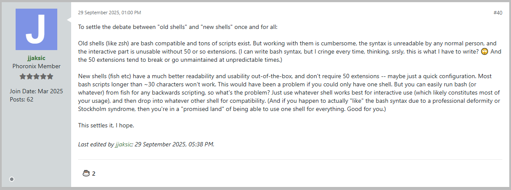
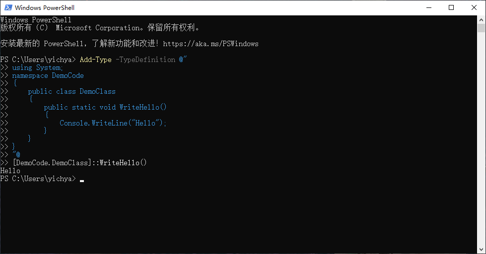

几个月前尝试了一下 Nushell（虽然很快就放弃了），然后就突然想做一下用过的几种 CLI Shell 和 Terminal Emulator 的对比，但后面觉得好像不是很有意义，于是大概会变成安利 fish 再搭配一些可能非常离谱的暴论

# Interactive and Scripting

首先要强调一下这两个概念，作为 Shell 的两个不同的用法：

* Interactive / REPL：指的是对着一个提示符（一般是 `>`、`$`、`%`）输入一些东西，按下回车之后立即得到反馈
* Scripting：指的是像写代码一样写一大堆东西并保存成一个文件，然后作为一个整体丢给某个解释器去跑

虽然这两种用法也并非完全不一样，比如真的有人会写（也可能是网上直接搜 / AI 写一个，然后看都不看就直接复制粘贴）一串非常长，里面又是 `IFS` 又是 `[ [[` 又是一些奇奇怪怪的管道操作（比如 `<(command)`，这是个 bash 的私货）之类的命令到 Shell 里面跑。虽然用法还是 Interactive 但完全没用到自动补全之类的 Interactive 关注的特性，这种实际上更应该认为是 Scripting，以及强烈不推荐这种做法

然后第一个暴论就来了。个人认为用 Shell 去干 Scripting 这种事情几乎已经没有什么讨论的必要：能不用就不用，非得用的话遵循 Google 建议用 bash，bash 都没的用的话有 busybox 一般也就只能用它的 ash，没有就塞一个 dash 进去，这仨区别不大。具体分以下情况讨论：

* Unix-Like Desktop / Server（基本上就是 macOS + Linux 吧，大部分 Web 码农应该都是这配置）
  * 基本上应当假设一定有一个差不多版本的 Python（指至少 3.4），否则建议升级或者换家公司
  * 当然 macOS 需要装 Xcode 或者 Command Line Developer Tools 才行（Ruby 应该自带，但基本只能认为 macOS 限定）
  * 有 Python 之后 Scripting 需求请用它来完成，无论是性能还是功能都比搓 Shell Script 靠谱的多
* 容器、嵌入式设备等受限 Linux 环境（不包括 Android，Android 上做正事基本上都要 APK 二进制交付
  * OpenWrt 及魔改（有一说一现在覆盖面真的非常广）请使用 Lua / ucode，取决于版本
  * Armbian 如果不是砍的特别精简的话应该也可以有 Python 或者 Lua
  * BuildRoot / 容器之类环境高度可定制的情况，建议直接用 C / Cpp / Go 之类的编译型语言做二进制交付
* Windows（至少 Windows 7 及以后，更早的版本真的没必要考虑了）
  * BAT / CMD 就是一坨，不建议任何精神正常的人去写那玩意儿
  * PowerShell 好一些，而且基本能保证环境健全。还有一点是甚至可以考虑直接在里面写 C#（后面会贴个例子）
  * Windows 的环境相对稳定，跟着脚本自己带一个 Lua 或者直接二进制交付一般也不会出什么问题（甚至大概比较推荐

其他实在是没的选的情况（猛一下还真举不出来例子，有的话可以评论区提供一个来分析一下）再考虑写 Shell Script，这种情况也基本只有 bash / ash（busybox）/ dash 中某一个作为唯一选择，而这三个在 Scripting 上几乎没区别，这种时候去争用哪种 Shell 完全就没有意义。因此下面的讨论会以 Interactive 为主，偶尔会提到一些 Scripting（一些非常复杂的 Interactive 也算在内

# Why Fish

观前提醒：以下内容会涉及到大量捧 fish 踩 zsh 的暴论，对此类内容比较敏感的朋友可以提前退出了（

## Out Of Box Experience

既然全称叫 Friendly Interactive Shell，它做的最好的一点毫无疑问是 OOBE，在不做任何配置的情况下就相当的 Friendly：

* 足够用的默认 Prompt
  * 默认只比 bash 多一个 git 等版本控制工具的提示，照顾了绝大多数人（尤其是会去 `chsh` 的那些）的需求，也几乎不影响性能
  * 更多的支持大部分情况下也都是默认提供的，比如 virtualenv 就可以直接 `source <venv>/bin/activate.fish`
* 在自动补全上可以碾压其他所有的 Shell
  * 官方代码库中有很大一部分专门做这件事，因此效果非常好，Nushell 甚至还有个插件专门利用 Fish 的 Tab 自动补全
  * 历史命令补全几乎被所有的现代 Shell 学去（zsh / PowerShell / Nushell 都有支持，Warp 甚至自己做了一个）

草民的 fish 就完全是 OOBE 默认状态，没有做任何改动。为什么 OOBE 很关键？草民认为有以下三点

* 显著降低上手门槛：不用像 zsh 那样起手先开 omz 装一堆插件，很花时间折腾不说，插件装多了性能还会受到影响
* 靠谱的持续维护：官方把 OOBE 作为核心关注点之一，与第三方插件提供的能力相比，质量和维护频率可以认为是更靠谱的
* 不受环境影响：复杂的 Shell 配置在系统升级或重装之后很可能要进行调整，而 OOBE 做的好就几乎不需要考虑环境变更带来的影响

顺便，这里先贴一个这两天看到的评论，后面也会更深入提及一下更广泛的 Project Lifecycle 这件事



OOBE 太差也最终成为放弃 Nushell 的核心原因：真的很难理解为什么它在那么重的情况下 OOBE 几乎是 0，让人完全没有动力去深入探索

## Performance

有人会说 zsh 也有插件可以做 fish 那样的自动补全之类。上面已经提过复杂 Shell 配置可能会遇到的一些上手与维护上的问题，这里也再补充一点：zsh 的性能问题（包括启动和 Prompt）大概算是老大难了，到处都是优化 zsh 性能的教程，而其中大部分会建议把 omz 扬了自己写配置，但是这又会进一步加剧上面提到的折腾成本以及一些环境与版本的兼容性、复杂配置的维护成本相关的问题

草民在 2020 年底刚买 MacBook Pro M1，还没有 homebrew 用的时候短暂的尝试过在 macOS 自带的 zsh 上试过简单配置（印象中也就加了一个 fish 风格补全和一个 git prompt，尽量贴近 fish 的默认状态），但实际使用下来感觉比 fish 的反应明显慢很多；后面 homebrew 能用之后就立刻切回 fish 了。时间久远不太能拿出实际对比数据，不过这大概也算个公认的事情，应该也不需要继续深入

## Compatibility

大概算是 zsh 跟 fish 比最大的优势，也是它有很多用户（Debian 统计， [zsh 7%](https://qa.debian.org/popcon.php?package=zsh) [fish 2%](https://qa.debian.org/popcon.php?package=fish)）的关键原因？

先不管 bash 是不是 POSIX Compliant（事实上它也有些私货，只是被当成 sh 启动的时候会自动关掉），它已经是事实标准了，除了 OpenWrt 之类的嵌入式环境，所有的正经 Linux 再加上 macOS 都自带（当然 OpenWrt 也可以把 bash 塞进去，只是没见过有人这么干，而且感觉 busybox 提供的 ash 除了自动补全之外也没有比 bash 差很多，实际可能也就影响一些 `command-not-found` 之类的东西吧

zsh 可以很接近 POSIX Compliant（通过 `emulate sh`，它甚至还可以 `emulate ksh`，还好 ksh 基本只是 sh 上叠点私货，不然要维护三套 Scripting 规范就太可怕了；另外也可以通过跟 bash 相似的改名字 / 链接到 `/bin/sh` `/bin/ksh` 等方式控制 zsh 以某一特定模拟方式启动），但因为 bash 有私货，zsh 也并不能直接 drop-in 替换掉 bash，这正是上面特意提及要区分开 Interactive 和 Scripting 的原因：

* 除非脚本明确在第一行写了 `#!/bin/sh`，否则并不能保证脚本没有使用 bash 的的私货，万一 shebang 直接就是 bash 那更难说
* zsh 自己的 Scripting 其实跟 bash 也有区别，比如 zsh 数组从 1 开始而 bash 从 0 开始，参考 [https://hyperpolyglot.org/unix-shells](https://hyperpolyglot.org/unix-shells)

这两天 fish 4.1.0 发布，看了 Phoronix 里面的几个帖子感觉还是有点难绷（当然 Phoronix 论坛里面也有一堆人喷 Rust 和 Systemd，所以也不奇怪）：很多人还是完全不能把 Interactive 和 Scripting 区分开，或者会真的把一开始说的「用 Interactive 跑巨长巨复杂的命令」当作关键用法。只能评价为各种意义上都很离谱，安不安全另说，老长一串看也没法看改也没法改，跟 Regex 可以一并称之为纯纯魔法吟唱

不过 fish 也有槽点，主要还是跟 bash 的区别没有大到有明显的感知（[https://fishshell.com/docs/current/fish_for_bash_users.html](https://fishshell.com/docs/current/fish_for_bash_users.html)），虽然个人觉得 fish 留下的这些基本能覆盖 80% 甚至更多的 Interactive 用法，这很好，但是也许区别更大一点或者更小一点都更好：

* 如果区别再小一点比如支持 ``` `cmd` ```，能够在 Interactive 情况下跟 bash 更加一致说不定会更好（但可能确实不太好实现）
* Nushell 就完全不会被拿来跟 bash 之类对比，因为区别实在太大了 [https://www.nushell.sh/zh-CN/book/coming_from_bash.html](https://www.nushell.sh/zh-CN/book/coming_from_bash.html)

除了 bash 之外还有更轻量的 dash，除了 POSIX 之外几乎不考虑 Interactive 的体验（仅仅是有个 Interactive 那种水平，没有任何 Tab 补全的能力），在 Debian 上用来充当 /bin/sh（顺带一提后来才发现 macOS 竟然也自带了 dash，好离谱

```sh
# ls -al /bin/*sh
-r-xr-xr-x  1 root  wheel  1310208 Sep 25 15:03 /bin/bash*
-rwxr-xr-x  2 root  wheel  1091936 Sep 25 15:03 /bin/csh*
-rwxr-xr-x  1 root  wheel   274272 Sep 25 15:03 /bin/dash*
-r-xr-xr-x  1 root  wheel  2549488 Sep 25 15:03 /bin/ksh*
-rwxr-xr-x  1 root  wheel   101232 Sep 25 15:03 /bin/sh*
-rwxr-xr-x  2 root  wheel  1091936 Sep 25 15:03 /bin/tcsh*
-rwxr-xr-x  1 root  wheel  1361200 Sep 25 15:03 /bin/zsh*
```

以上来自 macOS 26.0.1 arm64，这里面 csh 硬链接到 tcsh，sh 是个自动选择 bash / dash / zsh 的小工具（以下来自它的 man page

> sh is a POSIX-compliant command interpreter (shell).  It is implemented by re-execing as either bash(1), dash(1), or zsh(1) as determined by the symbolic link located at /private/var/select/sh.  If /private/var/select/sh does not exist or does not point to a valid shell, sh will use one of the supported shells.

## Project Lifecycle

接下来是一个跟实现并不那么相关但非常非常重要的事情。Fish 花了差不多两年时间，整体迁移到 Rust，应该算是非常成功：

* 虽然整个代码库被整个重写（包含 2000+ commit），但整个迁移可以说是用户没有任何感知
  * 虽然大版本号升级到了 4，但实际上 Scripting 部分的变化可以说是相当小的
  * 因为 fish 追求 OOBE 的目标，大部分用户也基本上没有很复杂的定制项目，显著降低了被迁移影响的可能性
* 过程中吸引了相当多的新 Contributor，虽然不太好统计完全准确的数据但还是列一下：
  * 过去 11 年 fish 使用 cpp 的过程中只有 17 个人有超过 10 个 commit
  * 第一个 Rust 版本虽然大部分工作是 7 个人完成的（同样以超过 10 个 commit 为准），但整个过程有超过 200 人参与贡献
  * fish 4.1 根据 GitHub 上的数据有 1396 个 commit，126 人参与，其中 70 个是新贡献者

迁移完成之后今年也发了五六个版本，保持在一个积极迭代的状态上。而与之相比：

* bash 很难被期待有什么新功能引入进来，虽然 2025-07-23 刚发布了 bash 5.3 但是跟 2022-09-26 的 5.2 相比只有 40 个 commit
* zsh 稳定 tag 是 2022-05-15 发布的 5.9，三年多没 Release 了甚至比 bash 还老；过去一年在 master 分支上只有一百来个 commit
* Nushell 的变更频率倒是非常高，可能几周就更新一次，不过现在一直还是不稳定状态，而且 breaking 的变更挺多
* PowerShell 倒是也还好，毕竟大公司支撑，虽然感觉在 Windows 以外的平台上用的人确实还是相当少

bash 在 macOS 上还有一个比较痛的点是因为许可证的原因，版本被固定到了 3.2.57，事实上框死了 Scripting 的能力范围

## Other Shells

一点题外话，吐槽一下 Nushell 和 PowerShell 这两个大概算是相当异端的东西。他们俩有一些共同点：

* 跨平台
  * Nushell 直接提供多个平台、多种架构的二进制，GitHub 直接可以下载；很多发行版、brew / winget 也都能够直接安装
  * PowerShell 多版本并行，Windows 10 / 11 自带 5.1，Microsoft Store 里那个 / 能跨平台装上 Linux 或者 macOS 的那个是 7.x
* 结构化的数据类型
  * 传统的 Shell 大部分情况下都是在输入输出文本，依赖大量外部工具（比如 `sort` `uniq` 或者复杂一点 `awk` `sed`）处理文本
  * 结构化的 Shell 则是处理对象，比如 `ls` 返回的是一个 Object List，可以利用 Shell 自身的能力对它进行投影、筛选、排序
* 很重，自带很多东西
  * 算是结构化 Shell 必须做的一件事，毕竟现存的外部命令并不能直接返回结构化的数据，需要先覆盖最常见的用法
  * Nushell 本体自带了大部分 `uutils`（当然还不只这些）并做了一些结构化的魔改，PowerShell 自带的东西就更是非常非常多了
* 在上一条的基础上却几乎没有做什么 OOBE 相关的努力，默认情况下的 Interactive 体验跟传统的 Shell 几乎没有什么区别
  * Nushell 至少还默认做了历史补全，PowerShell 的这个东西还需要升级一下 PSReadline 再特意启用一下这个功能
  * PowerShell 默认情况下的 Tab 补全能支持 Module 中的命令和参数（但是不如 fish 那样能显示一点帮助），Nushell 则约等于无

下面再提一些他们俩自己的特点。

## PowerShell

PowerShell 除了上面提到的特性，最牛逼的一点肯定还是跟 C#（包括整个 CLR 环境）的无缝衔接，甚至拿 C# 来 Scripting 也不是不行



至于 PowerShell 最大的槽点，个人认为还是 Windows 自带的 Windows PowerShell 5.1 和上面提到的跨平台 7.x 两个版本并行导致的割裂，就因为这个割裂的事情导致 PowerShell 7.x 个人感觉就很难推广起来：

* 说它能跨平台吧，很多 Module 没的用，甚至就算都在 Windows 上，能支持的 Module 和一些其他环境相关也有区别
  * 比如臭名昭著的 `curl` = `Invoke-WebRequest` 在 7.x 去掉了，但是 5.x 去不掉，结果还是天天被人喷
* 不考虑跨平台吧，为什么不直接用保证系统自带了的 5.1，根本就没有必要用 7.x，还得让用户专门装
  * 甚至 Windows 上还要再装个 .NET 6 Runtime 才能跑起来，当然商店版本会自动搞定

草民使用 PowerShell 7.x 的经历十分短暂，macOS 上感觉还是很别扭，Windows 上感觉跟系统自带的那个没啥区别，所以很快就弃坑了。

## Nushell

草民使用 Nushell 的经历也非常短暂，最核心的原因主要还是上面提到的 OOBE 太差劲。至于用下来最大的感受，还是让草民开始觉得 fish 是不是可以考虑离 bash 兼容性更远一点，抛掉更多技术债务的同时，也不用天天被拿来跟 zsh / bash 做对比

当然了，Nushell 的槽点除了 OOBE 很糟糕之外，还有很多：

* 为了结构化数据类型，自带了很多命令，但其中有很多都是改变了习惯的，让人觉得很不适应
  * 比如很典型的一个，`uname` 不支持 `-a` 参数，因为不带参数的就会返回一个 6 x 2 的表格，包含了 `-a` 中的所有内容
  * 与自动补全之类的 Interactive 特性不同，常用命令的差异会让人感觉仿佛在用一个完全不同的操作系统那样，非常非常别扭
* 插件功能是个用 stdio 通信的外部进程，导致后台一直开着一大堆很重的东西
  * 真不如像 PowerShell 那样可以动态加载进来，还可以更进一步跨平台到 iOS 上
  * 用 `dlopen` 之类的特性不好做的话，wasm 感觉也可以接受（虽然插件性能会差一些，但也只影响自动补全啥的，问题不大
  * 不确定是因为这个特性还是 `nu` 本体太重，Nushell 即使是 OOBE 状态也会给人一种反应很慢的感觉，远没有 fish 来的利落
* 前面反复提过它很重，但是重到什么地步呢：以 Manjaro amd64 提供的 `nushell-0.107.0-1` 为例
  * `nu` 本体除了上面提到的 `uutils` 之外，甚至还带了 `sqlite` 和网络请求能力，结果直接干到 35M 大，实在是感觉没必要
  * 至于它的插件更是相当夸张了，最大的一个 `nu_plugin_polars` 有 66MB，这一堆加起来有 130MB 多了

```sh
# ls -al bash dash fish* nu nu_plugin_* zsh
-rwxr-xr-x 1 root root  1162232 Aug  2 22:56 bash*
-rwxr-xr-x 1 root root   133792 Feb 25  2023 dash*
-rwxr-xr-x 1 root root  4379792 Sep 19 15:32 fish*
-rwxr-xr-x 1 root root  4408464 Sep 19 15:32 fish_indent*
-rwxr-xr-x 1 root root  1268832 Sep 19 15:32 fish_key_reader*
-rwxr-xr-x 1 root root 35141032 Sep  3 11:52 nu*
-rwxr-xr-x 1 root root  6030584 Sep  3 11:52 nu_plugin_custom_values*
-rwxr-xr-x 1 root root  6759568 Sep  3 11:52 nu_plugin_example*
-rwxr-xr-x 1 root root  6538264 Sep  3 11:52 nu_plugin_formats*
-rwxr-xr-x 1 root root  6643296 Sep  3 11:52 nu_plugin_gstat*
-rwxr-xr-x 1 root root  2794464 Sep  3 11:52 nu_plugin_inc*
-rwxr-xr-x 1 root root 66432592 Sep  3 11:52 nu_plugin_polars*
-rwxr-xr-x 1 root root  7414968 Sep  3 11:52 nu_plugin_query*
-rwxr-xr-x 1 root root   488336 Sep  3 11:52 nu_plugin_stress_internals*
-rwxr-xr-x 2 root root   947360 Mar 15  2024 zsh*
```

相比之下同样由 Manjaro amd64 提供的 `fish-4.0.8-1` 本体只有 4MB 多一点（虽然也确实不算小了，`zsh-5.9-5` 本体只有不到 1MB 比 `bash-5.3.3-2` 还小一点，`dash-0.5.12-1` 更是只有 133KB 左右，当然这些都没有算上链接的 so

# Terminals

最后是一点个人对终端（主要是终端模拟器）的选择。首先是对个人口味的描述：

* 跟上面对 Shell 的选择一样，看重 OOBE 与环境稳定性，因此倾向于选择不需要花很多时间配置的工具
* 有在服务器上干重活的需求，因此习惯于使用 tmux，进一步导致对终端模拟器提供的分屏 / Tab 能力也不感兴趣
  * 分屏几乎完全不用，用的话一般也是开两个窗口然后用操作系统自带的窗口排列功能并排放在一起
  * Tab 也不咋用，像 Windows Terminal 和 Warp 那种提供了的情况会偶尔用一下，但不会成为选择 / 放弃某款终端模拟器的理由
* 因为被 JetBrains IDEA 自带的终端模拟器整的烂活坑过很多次，故倾向于不使用终端模拟器提供的高级特性
  * 比如 AI 集成这种会拦截输入的特性会严重破坏 tmux 的可用性，还有自动复制这种可能会乱动剪贴板的功能
  * 与其说「不使用这些特性」不如说「最好不提供这些特性，免得还得花时间关甚至可能压根关不掉」，做好一个终端该做的事情

## Multiplatform

这里列出几个跨平台的选项，但其实个人最推荐 VSCode（除了启动慢点几乎没啥毛病

### Alacritty

虽然是跨平台，但只在 Windows 10 上用过几个月的时间

* 优点是用 OpenGL 渲染因此确实很快，而且很简洁没有什么很复杂的特性
* 缺点是配置比较复杂，而且因为自己搞字体渲染，在低分辨率屏幕上也不能关掉抗锯齿，所以只适合在高分辨率屏幕上使用

时间比较久远，并不记得最终是什么原因放弃了。

### Warp

虽然是跨平台，但主要在家里的 Windows 11 PC 上用

* 真的跨平台，一跨到底
  * 尤其针对 Windows 的支持，OOBE 就同时配好了 Windows PowerShell、WSL 和 Git Bash
  * 而且官方直接提供 Windows ARM64 构建，对于一个闭源软件来说真的非常难得
* 虽然有很多乱七八糟的高级特性，但能做到不影响正常使用
  * AI 集成甚至是主推功能，但拦截输入 / 不拦截输入这两个模式的界限很明确，不像 IDEA 那样混在一起互相影响
  * 多数复杂功能可以通过很简单的步骤关闭，而 IDEA 就在做的很烂的同时还压根关不掉
* 它确实在 UI / UX 上做了非常多的工作，把 OOBE 状态下的 Interactive 做的非常好用，而且性能也不差
  * 尤其对 fish 用户来说感觉会非常熟悉，包括 Tab 补全和历史命令补全都非常好用
  * 而且它完全是自己实现的这些特性，即使底下是 bash 或者 PowerShell 也能获得一致的体验（比如下图是 PowerShell）


当然 Warp 也有一些问题：

* 运营更接近互联网 App，包括强制注册账号才能使用，以及会用比较打扰的方式推广新特性
* 因为做的事情确实很多所以还是比较重，Windows 上的二进制文件 200MB+，对机器配置也有一定需求
* 跟 Alacritty 一样的字体渲染问题，低分辨率屏幕上显示效果很不理想
  * 虽然在 Linux / macOS 上的默认设置没啥问题，但 Warp 提供的字体相关的调整选项不多，字重、Fallback 这些都没有
  * Windows 上默认字体中文就很难看了，在懒得找字体的情况下建议用系统自带的黑体，HiDPI 上中英文效果基本上比较一致

总体来说个人还是挺推荐使用的，尤其是对于 Windows 用户能在 WSL 之外的环境上体验到接近 fish 的 Interactive 体验

### Electron Based (Like Hyper)

可能会有人提，但个人的评价是不如直接用 VSCode，这里也就不展开了。

## Linux Desktop

一般建议是选择桌面环境自带的终端（比如 KDE 就是 Konsole），例外情况：

* 如果是 WSL 之类的情况又需要一个原生渲染出来的终端的话个人比较推荐 [st](https://tracker.debian.org/pkg/stterm)，很轻而且默认情况下足够好用
* WSL 上直接跑 Warp for Linux 效果不太好，速度很慢且有些这样那样的兼容性问题（比如 HiDPI 一会儿小一会儿大），不推荐

## macOS

现在草民在 macOS 上不干重活，重活都要 ssh / VSCode Remote / JetBrains Gateway 到其他的机器上了，macOS 上跑的基本上就只有 `jekyll serve` 和 `brew upgrade --greedy`，所以目前草民的方案是 macOS 自带终端 + fish + tmux

macOS 大部分人应该会用 iTerm2，草民也用过挺长一段时间，不过原因是当时 macOS 自带的终端跟 fish 有一些兼容性问题，导致滚动和 Tab 补全都很别扭。后面这个问题不知道什么时候修好了，草民又完全没用到过 iTerm2 自带的一些高级特性，于是草民就换了回来

至于上面提过的跨平台方案，Alacritty 和 Hyper 感觉跟自带的也没啥区别；Warp 倒是可以考虑一下的，但是如果已经装了 fish + tmux 而且用不到 Warp 提供的 AI 能力的话感觉意义不大，没有装这些的话倒是也挺建议尝试一下 Warp 的。当然 VSCode 也很推荐（

## Windows

除了上面提过的几个跨平台方案，还主要用过几个：

* conhost.exe
  * Windows 10 自带的那个。其实因为 Windows 10 开始加了一些 Unix 终端相关的 Control Sequence 支持，所以也能凑合用
* Windows Terminal
  * 大部分情况下还是挺好用的，渲染也很快，也能关掉抗锯齿，但就是感觉 UI 还是有那种 UWP 特有的磨磨叽叽的感觉
* Mintty（Git Bash / wsltty）
  * 直接用 Win32 API 来做的，好处是很简洁，而且高低分辨率屏幕上字体渲染都很干净，坏处就是渲染是真的很慢

目前大部分情况下都是 Windows Terminal 搭配 Warp 来用了。

# End

总之是花了几天时间又把这个日经问题翻出来扯了一遍，回收了一下半年前立的 Flag

下一个应该是 11 月底左右发 Vacation 2025.2，然后如果有精力的话可能十月份会再发一个跟 RSS 相关的一些折腾（没精力就明年见
