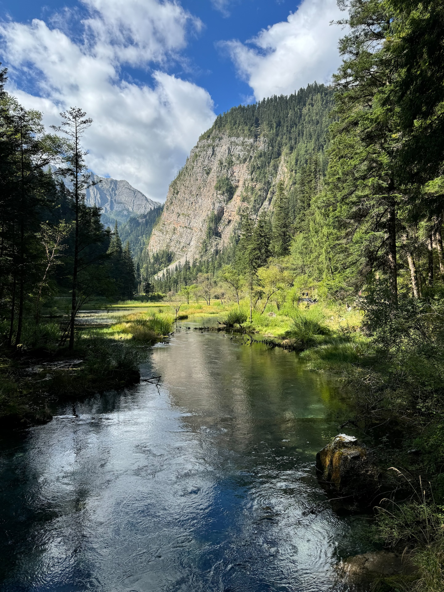

上半年的 Vacation 2025.1 不仅拖到了七月，而且现在回过头看感觉内容写的太少了，一件事就一两句话还是多少有点过分，于是 Vacation 2025.2 就早一点开始写，稍微丰富一点内容（虽然流水账也不太可能真指望上什么丰富内容），然后尽量在 11 月底左右发出来吧（

# 7.12 🐰上海

关注🐰也三年多了，这场线下真的是期待已久。🐰这一场印象中应该是年初预告的，当时就说了应该会跟 [BW](https://space.bilibili.com/402923390) 安排在一起，可惜草民对 BW 实在是提不起兴趣，没办法，年纪大了，这类二刺猿展会实在是没体力跑了。当然这个安排没毛病，毕竟很多人会愿意白天 BW 晚上顺便看个演唱会，但 [BML](https://www.bilibili.com/video/BV1jj8yzLEWo) 毕竟门票也有限还有点挑受众（比如草民真的是人都认不全，而且不太想去拼盘），所以 up 们自己开专场倒是也刚刚好。话说回来，跟🐦不一样，🐰这轮线下都是自己真人上台，然后还就戴一个跟面纱一样薄、只能当作时尚单品对待的口罩（因为戴不戴根本没什么区别，尤其是[广州场官图](https://www.bilibili.com/opus/1107161836415877123)那个大白牙一清二楚，笑死）；以及草民完全没想到 SVIP 票竟然如此难抢，就草民这秀动未尝一败的操作还是没赶上，后面还被那个候补机制坑了一手。实话说当时甚至都有点不想去了，但又觉得天知道🐰还有没有下次，而且 VIP 多少还是有个签名海报……所以纠结一番之后，还是花了加起来得有十倍门票价格的机票酒店钱（当然结果就是出票顺序也相当靠后，最终跑这一趟的 ROI 完全低到没眼看

就像上面说的那样，演出前几天逐渐刷到了 BW 期间一堆 up 在上海开线下 Live 的计划，光草民知道的就还有 [MeUmy](https://www.bilibili.com/opus/1059339941843042311) 和 [Akie 秋绘](https://www.bilibili.com/opus/1076872258163572736)，🐰这个也是 BW 开票之后很快门票就卖完了（唯一一场卖完票的，各档加起来应该有 1000 多张的样子；另外两场应该都是 400 张左右，其实算是还可以了，而且票价不低成本不高，算下来说不定还能有点利润）。7.12 当天魔都天气相当差，前脚晴间多云，转个头可能马上就是大到暴雨。飞机落地耽误了巨久时间，中午一点才跟老同学吃上了饭，完后顺便逛了一下附近某个 Sony 旗舰店（有一说一 Sony 的电视现在看感觉也就一般）。顺便一算，贵协成员似乎只剩两三个在魔都（草民刚毕业那会儿可能还有五六个），还有另外两三个在广东的，剩下一大把得有十来个人都在帝都，也不知道为啥

环境又热又潮，前一天又没怎么睡好，反正就突出一个药丸。下午本来想回去睡会儿，但是又被堵在回酒店的路上，只来得及换个衣服就直奔场地了。场地倒是还不错，但是大概因为是第一次的关系，入场的安排真的是一团糟，其他流程上的问题也比较明显（比如周边在场内销售，导致羽织这类热门周边直接被 SVIP 通吃。是草民不想买 SVIP 嘛，根本抢不到啊）。各种因素叠加起来，到快开始的时候人整个都已经麻了，然后就看见第一套那个自己 cos 自己的造型，当时真的没绷住……好在🐰线下还是相当稳（抛开忘词和口胡不谈的话，当然这些倒是本来也不算啥大问题），而且毕竟第一次，勉勉强强算一个及格水平吧。除去上面流程问题也多少想吐槽一下某一位嘉宾，但是不展开说了

上面那个合影只能评价为跟🐦那个一样进行了一些很糟糕的切角（以及包看不到草民的，下面北京场倒是很容易找到）。出来的比较早（草民六月那会儿还认真考虑过当时看见 SVIP 排队会是个什么心态，结果真到那时候反而完全没啥想法了，只想赶紧溜），顺便线下真实某🥚群群友之后按之前计划的去看了追光新作《聊斋·兰若寺》，评价为追光刻板印象水平，画风还行、故事不咋样，总结为仅适合家长带娃来看。最后晒出一部分周边（为了把这个签名海报完好无损带回来，草民甚至拿了个专门装海报的纸筒过去，结果只能评价为有用但没必要

第二天回来，刚好体验了一下 C919，评价为跟 A320 几乎感觉不出什么体验上的区别，这么看应该可以说相当不错。飞机上的小装饰、飞机餐这些都很有特色，拿了个装垃圾的小纸袋子回家收藏了（

然后隔天北京场的预告就发出来了 = = 有一说一，去北京的成本相对低一点，有大把朋友叙旧，还可以顺便回趟家、处理一些之前逃离帝都那会儿遗留的小问题什么的，要是早点说八月份还有个北京场的话，草民大概率七月上海场就不去了，改为去 8.2🐦那一场（虽然一个月里前后脚跑两个巨远的地方也有点说不过去，再考虑一些其他原因，总之也不太可能真这样安排）。简单考虑了一下，决定抢到 SVIP 就去

# 8.9 🐰北京

从上海回来，时隔不到一周再次抢票。这次倒是轻松回收了上面的 Flag，抢到了个甚至还挺靠前的 SVIP（秀动这个纪念票编号的最后三位数就是出票顺序号）。虽然后面看 SVIP 还是一下就没了，现场也是好多人候补上的，但是整体比起上海还是容易太多了。那么按上面说的提升一下 ROI，用一天年假顺便回趟家，然后在帝都见些老朋友，顺便抽空处理个遗留问题（把当时没提干净的医保存折都提出来，帝都医保 2022 年 9 月之前的钱都能提现

起初是想直接飞到正定机场看看，但发现从正定机场回家着实有些麻烦（这地铁到底怎么修的真离谱啊），于是改为体验一下七月新开的动卧 D968，上铺比飞机便宜一百多（下铺要再 +90，就跟飞机差不多了），比高铁二等座只贵十块钱。很有意思的是还有个人拿他在隔壁的下铺跟草民的上铺换了（应该是对小夫妻吧大概，想尽量在一个包间里面），就血赚。这动卧还真不错，主要是考虑时间成本的话性价比真的拉满，就是草民这一趟空调太差劲（今年这天气是真离谱吧，哪儿都是又潮又热），最终还是完全没睡好。中间有好多个车站都一停半个多小时，大概是为检修车让路 / 到站尽量是个天亮（事实上也确实是刚好天亮），估计要是不考虑这些的话八个小时肯定是能压进去的

从火车站出来骑电动小蓝出去瞎溜达了两个多小时。修这个咱也不知道几号线地铁把友谊大街给堵了个死死的，当然对草民来说显然是好事（毕竟现在又不住这儿，地铁真修好了显然有利于草民房子出手，当然也别指望真能利个多少吧）。除此之外有一说一，二环内西北角（主要是和平路以北那一部分）变化还挺大，其他的地方倒是一如既往。午饭和晚饭直接选了两个个人必吃榜：某本地品牌炸鸡 + 某本地连品牌都没有的炸鸡，这两家真的是干了 20 多年没挪窝，味道也一点变化没有，甚至后面那家人都没换，一眼就能认出来，怎么想都很夸张。

隔天早上到帝都（走之前才想起来空调忘了拔下来了，害），中午在二环堵了一个小时终于见到了几位老朋友。一起到之前经常去的牡丹园海底捞吃了一顿，然后听到个挺令人震惊的事情（当然这里不是很方便讲），以及吃到了近几年吃到过的最难吃的一只脑花（真的差点吐出来那种）。出来顺便小坐了一下某位大佬前一天刚提的 YU7 Pro，有一说一这车个人就是觉得这个长车头的造型看不习惯（屁股也有点怪吧但是没有车头这么不顺眼），除此之外是真香啊，尤其是这位大佬选的 Pro 个人觉得真算是除了审美上的偏好之外没啥可挑剔了。

下午抽空带着之前的医保存折找了家北京银行全提出来。有一说一上家不知道怎么搞的多给交了俩月，这波刚好把这次来帝都的开销完全覆盖了。存折好就好在自带强制流水展示，看着上面一行行「结息」越来越少越来越少就，耐人寻味。然后就是直奔场地买场贩（今天这个天气更不给面子了，大太阳晒一下午，还不如下点雨呢），以及晚上见🐰啦。

这次在流程、造型这些上次问题比较严重的地方做了很有效的优化（说起来这个造型啊，后面🐰有一次直播说上海场第一套衣服的造价比后面所有场次的衣服加起来都要贵，真是……），加上这次抢到了 SVIP，最终整体体验真的非常好。上面的大合照感觉也好一些，至少不切角了。总结为不虚此行，很开心（当然还要特意晒一下 SVIP 特典，尤其是成本算下来差不多是原价 100 倍的这张碟

最后一场 8.30 在广州，有一说一这日子选的确实有点不太好，甚至更惨的是当天广州还有一个阵容相当豪华的 AniSonic 全息演唱会（虽然草民对这个阵容没兴趣，而且据现场群友反馈，拼盘也就算了还是预制拼盘，票价还高的离谱，中间还出了一些视频放错了的问题 = =

至于草民自己，实话说五月份已经跑过一趟🐦的广州场，这次实在是不好找摊平 ROI 的手段了。本来想立一个「如果当天爹妈已经回石家庄了，并且那时 SVIP 票还有剩就去」的 Flag，但这两个条件最终都没有满足，那只好期待一下之后更大的舞台再见（不过有一说一广州这一场吃的真好啊，歌单换了好多歌，时间也比前面两场都要长不少……笑死，为什么又是只要遇到皮套人就运气不好系列，算了问题不大

说到皮套人运气不好……8.8 那天🐦还在直播里面说明年可能会搞降低成本、提升覆盖面的 Livehouse 形式的巡演。有一说一这种确实比起🐦那两场大场地的靠谱，而且那个现场动捕是真没必要，so 许愿一个真人上台 + 有类似🐰这种 SVIP 特典环节吧（虽然感觉可能性不大

# 8.23 黄黄

距离上次「人间」已经两年了，说天天盼可能有点夸张但确实一直都想能再来一次，尤其是新专辑《今日无事》发了之后就更加期待会不会有新的巡演安排。没想到很快，四月就等到了这个，而且第一批就安排上了成都，狂喜。这次的形式官方称之为「幕剧音乐会」，简单的说就是利用一些舞台剧表演把歌曲作品串起来。从这次的场地选择来看，比之前的 Livehouse 要高端不少，着实让人感觉十分期待

成都开始售票在 7 月 5 号。草民刚被上次抢🐰的 SVIP 失败那回搞到怀疑人生，黄黄这个前面两场抢票似乎也十分凶残（虽然草民之前帮虾滑老师顺手抢了一张，感觉也没有很难，这事儿当时还让草民自信爆棚……然后就被🐰教育了），但这次却意外的成为了很证明抢票手速的一次：7 秒付款，个人觉得很快了，但实际还是天外有天，闲鱼上一看到处都是三四秒那种。8.18 中午出座位号，虽然事实证明确实有 80 多个人比草民手速快（说明🐰那儿第一次失手也不算太离谱），但结果刚好在这个基本上是全场最佳的位置：不仅很靠中间，而且比起前面「乐池」四排来说不用一直仰着头，也不会像后面过道那样可能被抽到互动，社恐人很开心（虽然实际上跟预想的可以说完全不一样

|  |  |
| - | - |
| 号码 | 位置 |

起初还是计划拉上马哥和维洲一起，不过马哥运气不太好第一次开票没抢到，第二次草民人刚好在🐰北京场结果所有人都把这事儿忘的死死的，维洲也因为类似原因两次都没安排上。本来以为没希望了，但是非常意外的是演出前一天出了一个比较难绷的事情：有一小部分相当好的座位主办方之前以为不能卖，然后发现实际上可以卖，那天晚上就突然拿出去卖了 = = 最后甚至还没卖完。虽然这个事情让几个群里的一大堆没开出好座位的人非常破防（有一说一这事儿确实是干的不地道），但是也因此让马哥有机会捡漏，最终还开到了一个非常好的位置（甚至后面他还在现场换到了一个更好的位置，视野比草民的还要好一些）。维洲就比较可惜，当天行程冲突彻底没机会了，下次一定（

下午也是又见到了虾滑老师并得到了他精心制作的 PCB 板（真有创意啊，下面晒一下）。然后直接快进到看完的感受：完完全全 next level

* 跟之前看过的那些 Livehouse 比完全是碾压式的体验
  * 形式和内容都可以说无可挑剔，狠狠让草民这个没吃过细糠的被震撼了一把
  * 中间有好几幕真的美哭，可惜这些地方都不允许拍照（跪求后面放个官录出来吧
* 场地本身的硬件条件也是绝对没有异议的顶级，舞台和音响效果都是极佳
  * 不过草民那个座位实际跟乐池一样高，手机拍照效果一般，马哥那个靠后一点的位置要好很多
  * 还有一点是这个位置比草民想象中更偏左一点，而且因为比较靠前，看舞台左右的提词器有点费劲
* 万万没想到草民所在这一排还真被黄黄抽到互动了，然而草民本质上还是个 i 人，完全没反应过来
  * 马哥那一排也有演员互动（虽然他没有拿到宝玉撒的糖），只能说他实在是各种意义上的血赚
* 然后还一定要强调一点是林妹妹那个演员实在是太可爱了，真的是完全长在草民的审美上那种，最后返场怼着拍（放一个[花絮](https://www.bilibili.com/video/BV1NaxiztECn/?p=2)在这里

最后还是感谢各位神仙投喂（这次也是拿到了老粉证明系列）和赞助商支持（草民的香水只剩小半瓶了！！！马哥那个还有一大半！！！）

现在就真的期待明年能安排在重庆一场吧，或者有什么其他不太远 / 没去过的地方也可以考虑（今年武汉就真的不跑了，预算实在是爆炸了

# 8.24 王子

这个也是盼了很久很久，不过没想到第二场就在成都还是很惊喜的。虽然吧，杭州场有的《东风第一枝》这次给 Roll 下去了，有点怨念

这次还准备了各种预热，比如曹操专车的开屏和车载广告，以及万达投了几天的大屏。但是这个大屏每天都在出各种问题，真的十分无语：

* 第一天中间一小块是坏的
* 第二天群友反馈轮播内容不见了
* 第三天下午确认一切正常（下午王子还去亲自打了个卡
  * 于是晚上骑车过去，结果整个屏幕都关掉了，给人气的头疼。然后偶遇一位芦荟并获得投喂的扇子一把（话说回来，这位朋友也跟马哥一样捡漏到了黄黄前一天开的好座位，笑死
* 最后一天也没时间去了，看群友返图更离谱，中间两排全坏了……这个万达实在是多少有点离谱

中午过去排队，发现这帮人的成分都贼复杂：起码看见三个「今日无事」的包，还有「雾的 19 日」和「山色有无中」的袋子，还有人前一天刚买了「入梦」的衣服今天就穿来的（怎么到处都是这帮人啊，害）。这次两个嘉宾，小随不太熟（毕竟草民几乎不听男声没办法），以冬可是老熟人了而且近期也经常出现在各种拼盘里面，这次能在线下见到也是十分幸运

|  |  |
| - | - |
| 王子 | 以冬 |

然后还是快进到看完的感受：本来还觉得前一天刚吃过细糠，再回来听 Livehouse 会不会感觉有落差，虽然事实上确实能感觉出来场地硬件水平的差距很明显，但王子一开口这种担忧瞬间烟消云散，甚至王子这个看完回来之后，比前一天黄黄的感觉戒断更严重一些（毕竟气氛大概是 Livehouse 跟剧场的最大区别 + 它独特的魅力所在

* 现场是真的太稳了，真的完全跟 CD 一模一样那种稳，这就是科班出身的专业实力啊
* 王子真的很擅长跟观众互动、活跃气氛，大概是早年 YY 加上现在🎵直播练出来的本事
* 上面吐槽的没有《东风第一枝》后面补了一点清唱，也行（完整版就刚好以后留个念想
* live 凑不够时间各种拖的经常有，头一次见中间几乎没怎么停，然后还加班加半个小时的
  * 结果后面的签名 + 合影环节，还因为王子实在太好说话结果拖了两个多小时才弄完 VIP……

那么最后是例行合影（几乎是刚好把这个场子塞满了，所以说这次的票确实卖的挺不错的

然后晒一下签名（以及还是忍不住想吐槽一下官方售卖的明信片和书签着实是贵的离谱了

当然还要感谢各位神仙的投喂（

以及同样期待明年再来一个川渝地区的场次吧，这次成都的票卖的还不错，应该下次还能安排上附近的场次。话说回来北京场开票之前刚好是广州那个大拼盘，看🍠上似乎是狠狠圈了一波粉，这次北京场卖的更是相当不错。可惜草民肯定安排不上了，八月刚去过北京而且 9.20 还有下面这个里少的（说起来非常巧，10.19 武汉的场次也跟里少的南京场撞了，当然主要原因大概还是里少时间安排太密集，江浙沪连续三天可还行，可惜王子武汉这场也真没预算支持了……虽然也想过如果恰好又是跟黄黄前后两天的话也不是不行，但实际上隔了俩星期

# 9.20 里少

这次抢票使用了一点小技巧（指支付宝小额免密），成功 4 秒付款抢到了 VIP 001，然而这一场线下排队所以抢到这个并没有什么用（

这次的场地跟上面王子那个是同一个，今年来这个场地都三回了（而且又是例行见到了一堆熟人，这次到处都是芦荟，上次到处都是卿卿，怎么来来回回都是你们啊）。有一说一跟去年比感觉到了很明显的场地音效加成（东郊记忆那个 MAO Livehouse 确实是不如这个场地好），而且里少这个乐队水平确实是很不错，开场唢呐很带感，以及琵琶小姐姐太棒了完全挪不开眼睛

这次嘉宾是不才，9.1 公布的时候着实有点吃惊，毕竟这俩虽然都是本地人但日常都不呆在本地。这次不才换了一种很松弛的风格上来，有一说一跟六月份她自己那场比确实温和多了，上次那个风格选的多少有点致郁

说回里少，依然是跟上次一样相当稳定靠谱。歌单跟上次比换掉了很多，很适合草民这种平时听新歌很少的人。这次互动还是十分的 i 人地狱，不过这次比上次好一点至少没有那么压力观众了（草民这次一开始真的有点想不抽号码牌的，甚至还特意去晚了一些，中间还跟虾滑老师换了一下挪到了个靠后一点的位置，不过还好最终没有被抽到互动

最后也是晒一下签名并感谢各位神仙投喂（

目前看起来不出意外的话应该就是今年最后一场了，然后也期待一下里少和不才的新专辑，以及希望虾滑老师心愿成真，后面里少可以安排一场在重庆（实在是需要一个理由去重庆再跟黎老板吃个饭

礼拜一听说熊家搞了个拼盘又有小女神又有竹桑的，嘿……更觉得七月份去上海去的有点亏了。不过本来草民也不去拼盘倒是

# 10.18 三星堆

三星堆的 Flag 其实也算是立下来有些时日了，但实话说还是有点远，摇不到人一起的话草民也不是很想单独跑一趟。这次刚好是某位在帝都的贵协大佬远道而来，并且是周六中午到，刚好有一下午时间可以安排，于是决定一起去康康。至于攻略不攻略的感觉也没必要，小程序上能买到门票就行了，坐城际到广汉北或者三星堆都差不多，然后打车或者公交车到博物馆门口就完事

花了大概俩小时逛完，个人的感觉其实也没有觉得那么震撼（也许是因为看了太多介绍，期望值被拉太高的关系，加上之前去过成都博物馆，对这边的早期文明也多少有点概念了），当然设计语言能保持一致这件事在那个时代确实挺牛逼的。晚上回来顺便去了一趟很久没去的锦里。提到这地方草民的态度一般都是非常抗拒，毕竟之前去的几次都是人挤人，体验实在是相当糟糕。还好这次人倒是很少，大概是因为国庆刚过没多久，以及中间最窄的那条小吃街进入了翻修流程（所以这位贵协大佬想找的菠萝饭就没机会了

# 10.22 九寨沟 3.0

同样是跟上面这位大佬一起去的，这也导致去年立下的「明年不去九寨沟了」的 Flag 终于还是倒的干干净净。可惜运气一般般，彩林差不少火候，天气也不算好（放一张同一个位置的照片对比一下，大概都是上午十点左右的样子

|  |  |
| - | - |
| 去年九月上旬 | 今年十月下旬 |

其他的怎么说呢，跟之前比起来就是另外补拍了几个牌子，以及去了几个没去过的地方：

* 原始森林（进去溜达了一圈儿大概也就花了十几分钟，感觉意义不大，走下去到天鹅海那一段更带感
* 鹰爪洞（一个大概深度三四米的洞，岩壁上有个形似鹰爪的痕迹，是某种之前嵌在里面的石头掉下来的样子罢了
* 五花海和珍珠滩中间，走路的话会路过一个金铃海（没找到牌子但看到高德上有人拍了，实际上看着也一般般没啥亮点
* 去长海的路上认真盯了一下上季节海和下季节海，这次倒是多少存了点水，但也就一点点，没啥看头

顺便买了个非常便宜的偏振镜，评价为有那么一点用但也有限，试图找到一组可以对比的照片结果发现忘了拍了，笑死。

总体上跟上回区别不大，包括刚回来一个礼拜就下雪这种事情竟然又遇上一次 = = 明年年初再找个下雪的日子挑战一次当天来回试试（

# 11.1 四姑娘山

小竹五月份去四姑娘山的时候被高反折磨的非常痛苦，回来之后就一直想着再挑战一次。草民也确实有些兴趣，所以就又摇了两车六个人一起过去。九寨沟没赶上的雪这次终于是赶上了，不知道该说运气好还是不好，草民反正是很开心。

感觉双桥沟这里攻略也没有什么很需要攻略的，除了要关注一下高海拔地区的影响（按小竹的说法是他觉得红景天非常有用，仅供参考），其他的就跟九寨沟一样不带脑子坐车就完事，流程更是称得上轻松加愉快（除了开局先来一个 40 分钟超绝大晕车体验之外

中间会有一个漂流可选，票价 90 一个人。体验还不错，十分轻松愉快还能省不少脚程，两人一船能凑齐的话还挺推荐的。至于为什么大冬天有漂流，咱也不是很理解；至于为什么这次还去尝试了，那只能说是猜硬币猜出来的

整个流程下来早上十点左右进，下午不到五点出来，看手机记录的步数还不到一万，着实是轻松加愉快（如果没有一开始那个晕车就更好了）。下午雪就停了，这次该说不说运气是真的不错，尤其是草民这个北方人四年多没玩过雪了，这次真是玩了个爽

个人逛下来感觉其实像是去了一个 Pro Max 版的蓝月谷，当然毕竟海拔很接近，似乎也有几分合理。之前还打算第二天去长坪沟徒步，但考虑天气和时间，最终决定改为回程时顺便去映秀参观地震遗址。不得不说，亲眼见到确实还是相当震撼，解说也很认真且富有感染力

以及旁边的地震纪念馆，更深刻的感受到了当时的天灾，以及之后的众志成城。不管怎么说，还是希望大家都平安啊

从四姑娘山到映秀的路上还会路过一段风光相当不错的山路（当然现在更流行「理小路」自驾，据说风光更好

# 11.8「久久」

草民上面列出来的那些歌手没听说过也很正常，毕竟古风一直都是鄙视链底端的小众圈子。但大概不会有太多人没听过《红昭愿》和《芒种》这两首当年红到离谱的歌（不过草民是从《惊蛰》和《沉鱼》入坑的），「久久」就是她们俩的九周年出道纪念系列线下演出啦。天还热的时候看着上海场和武汉场着实是分外眼红，没想到十月份突然又安排到了一次成都的场次，而且还是生日场，狂喜。

话说回来，真的是最近才知道 2022 年 11 月忙着入住新家，不仅错过了音阙诗听的实体专辑《一》还错过了六周年在东郊记忆的线下演出……着实是非常非常可惜。这次线下买了票之后就在考虑互动的时候签名到底带什么东西去签，最优选择当然是去闲鱼买一个《一》但是这玩意儿闲鱼压根就没人挂，现在是根本买都买不到；买票送的礼包也是晚上才去领。看了下群友们的计划，最终决定买一把纸扇带去

场地又是熟悉的正火艺术中心 6 号馆，这已经是今年第四次来这个场地了，虽然这个场地音响效果确实不错但也没必要逮着一家薅不是。这次的流程安排是下午先互动晚上再演出，实际的执行是两点到三点互动一次，四点到五点又互动一次，等于中间只留了一个小时彩排，压的实在是太短了，并不算合理。当然因为这次没有请乐队的关系彩排也没有那么高的要求，所以实际出来的效果倒是也问题不大

两位人美歌甜自不必多夸，小道具的节目效果也很有意思。生日场当然会有一系列的互动环节，包括非常压力观众的猜歌接歌（幸亏这次真的下定决心不抽号码牌了不然要是被抽到可太吓人了）以及分蛋糕

这次的礼包里面最喜欢的是中间纸袋下面放的那两个决策币，当然也顺便晒一下包含签名的扇子

更好的消息是明年大概还会有十周年场（毕竟音阙诗听这帮人大本营就在成都，那怎么也是应该安排上的），本来看完还是有一点戒断的，现在就完全转变成了期待

# 11.29「婧钰双声」

上一场结束还不到一个礼拜就看到群友又发出来了这个，怎么说呢，11 月这两场都得称得上是相当意外的安排。这次票一开始只在猫眼上卖（说起来才知道猫眼原来是美团旗下的……然后就直接大众点评启动解决掉了），后来隔了一个礼拜左右的样子才又上了秀动。上次因为各种原因没来的虾滑老师这次倒是运气很好的收了一张便宜票，加上这次结束比较早他还可以直接晚上就回学校。顺便又继续去闲鱼蹲了大半个月《一》，还是没辙，不过这次拜托虾滑老师去他的人脉里面找了，希望明年能用的上。这次听群友们的说法是个商演，而且场地好像还是个夜店。草民完全没参与过这种风格的线下，而且看放出来的歌单跟「久久」比也更倾向流行一些，当时感觉多少还是有一点慌

下午三点到场地排队，结果被主办莫名其妙的放进场地围观排练去了 = = 一脸懵逼的进去一脸懵逼的出来系列，不过趁机观察了下场地，舞台和音响确实都还不错，观众区域也确实完全就是想象中的夜店那样子。五点左右入场，坐到六点突然哗啦啦一下进来一大堆汉服小姐姐，问了下虾滑老师也是一脸懵逼，后面跟邻座打听了一下才知道今儿在旁边电子科技大学有个汉服节，这场演出是跟汉服节联动的（然后六点钟进来的这些人大部分应该都是赠票或者是价格非常便宜，怎么说呢，反正商演艺人拿固定出场费，那就感谢金主爸爸吧）。后面台上两位的 talking 也一听就是非常商单的风格，除此之外倒是跟正常的演出没啥区别，包括她们俩的互动也还是非常有趣，听的还是很开心。草民的评价是这种商单请多来点，越多越好，务必加大力度。

当然后面就要吐槽一下主办了。比上次好一些的是流程上至少留出了足够多的彩排时间：原来海报上写的也是三点到四点半互动，四点半入场这样，等于是又几乎没什么时间排练，然后三点多屁颠屁颠去到那边之后又被通知互动改为演出结束以后，虽然这样对演出效果更好但还是多少有点折腾。然后就是跟汉服节联动导致原定六点开始结果六点钟又突然进来一大车人要协商座位什么的，又往后拖了二十分钟；再加上场地是夜店的关系，人家晚上要正常营业以至于后面留给 VIP 观众的合影互动预定就只有大概不到半个小时，上面又拖了二十分钟导致这个环节突出一个匆匆忙忙连滚带爬……这里还要感谢某位大佬投喂明信片一包，终于不用纠结在什么东西上签名了，超级开心

最后就要再吐槽一下礼包了，又少一个 NFC 冰箱贴，还得后面等快递。强迫症直接买了所有的票根，礼包里送的就改为送给虾滑老师了

这次最后没有安排大合照略显可惜，毕竟全场那么多汉服小姐姐呢。那么这个就真的是本篇最后一条内容了，剩下的 Vacation 2026.1 见

# 例行晒一下碟

今年线下演出炸出来很多老古风人，出新专辑的也不少（虽然草民只支持了女歌手的，男歌手主要还是实在空间有限，只好咕咕咕了

## 《今日无事》

当然是毫不犹豫买了两个版本。这个木盒子的版本是真不错啊真不错

这次的货确实是备了相当多，根本不需要抢，甚至标准版卖了两三轮才卖完，「入梦」成都场还可以直接买到

## 《天兰夜》复刻

本来是打算带去北京场找🐰签名的，但 CD 盒子太糊弄事儿了，结果八月份只好拿精选集去了

发货过来的时候就直接在发货单上加了一个歌词本，但是跟盒子里已有的对比了一下也没发现什么区别，只能打为虚研社传统艺能

## 《织梦令》

执素兮也算老熟人了，这两年也是经常在各种拼盘里面冒泡

至于旁边的织梦镇永居契书为什么没写 ID，只能说果然是被🎵客服机器人挡在外面了，不过问题不大，以后再找机会补上就是了

## 《半壶纱》+《渡风》

还有一个送的《珂笺》

有一说一没想到现在还有全新库存甚至带签名，这真忍不住剁手

## 《二次元凶》

只买了小版支持一下

小碟（因为是 EP 只有四首歌，用了小尺寸的盘）是好文明，收纳方便多了

## 《反转童话》

虚研社稳定发挥……以及更加糊弄的盒子和里面的空白 CD-R，虽然印了图案上去但是还是觉得有点难绷

而且上面那个《天兰夜》起码 U 盘外面还有个小盒子，这回这个也没有了，下次再找🐰签名都不知道怎么带过去（先有下次再说吧

## 其他

还有一个《跨越数千昼夜》是 B 站今年拜年纪的设定集，虽然里面也带了一张碟……有一说一内容还是稍微少了点感觉一般。其他的还有不少设定集（今年主要是年初的哪吒 2 和暑期的兰若寺、浪浪山这几部动画电影，加一个影神图）和塑料小人（有点多）啥的，懒得挨个晒了，年常直接拍一张展示柜现状得了（感觉不能再买了啊没地方放了啊，已经不得不把粥的几本统一收起来了

目前在路上的碟还有：

* 小红泡《童话入侵计划》本来说是 12 月初左右发，目前看起来是得等到月底了
* 云之泣《独白》刚好是今天晚上开始预售。已第一时间下单，预计是明年 1 月份发货，可惜没有签名（微博抽奖这种事情就不做梦了

明年要出的目前预计，不才、叶里、银临、兰音应该都会有新碟或者 EP 发出来，狠狠期待住了。顺便也简单数了数手里的签名，感觉想要的基本上已经差不多都有了，还没有的除了一些根本想都不用想的，剩下的就🐦这个是真的非常难搞

# End

之前计划中的张家界终于还是咕咕咕了（虽然今年还通了高铁，有一说一真该去的），然后明年可能有的计划：

* 银临「粼粼」（今年只开一场在杭州，还真是体育场，也是一眨眼卖完；这一阵儿牵丝戏那个事儿之后明年的票会不会好抢一些哈哈哈
* 黄黄「入梦」的全新升级版本（今年也是只开一场在苏州，而且连开两天，结果售票又出问题了……真离谱，换平台也不知好不好抢
* ChiliChill 会有新的巡演（当然除了会有之外，现在完全是个饼的状态，具体安排还不知道要等到什么时候
* 🐦可能也会有巡演（属于是只在直播里面提了一下，甚至不能确定会有，说白了连饼可能都不算的
* 上面有提到的「安 + 静」十周年，成都场目前大概也算是有张饼了（吧

其他几个想去的地方：

* 挑战一次当天来回九寨沟，桃花雪花二选一（今年已经玩过一次雪了所以大概会更倾向于桃花，不过也要看日子，要赶在淡季里面的话桃花肯定是没机会的
* 今年张家界通了高铁，大概明年优先考虑这个吧
* 泸沽湖这个，小竹国庆跟他的朋友自驾去了，颇令人羡慕，可惜到昆明的高铁恐怕还要一两年才能通，不知道啥时候能安排上

另外四姑娘山明年好像也会通一种什么列车，但是暂时并没有什么二刷的想法，过两年再说吧（
