年常系列。开头惯例，先看一下今年 Blog 更新计划完成咋样：

|↘|Category|Comment|
|-|-|-|
|❌|Life|也就只有老家的资产处置算是有些进度，其它着实是没啥可说的，所以也就没有新内容了|
|❌|My Own Hackday|虽然有在例行推 RSS Pipe 但还没整理出来什么东西，不过是有计划了，明年一定|
|✅|NAS and OpenWrt|[Real NAS Project 4](../real-nas-project-4/) 和 [Tinc Improvements](../tinc-improvements) 两个组网相关优化，算是例行迭代| 
|✅|Gadgets|[Gadgets 2025](../gadgets-2024/)，然后龙芯小主机又咕咕咕了一年，目前来看是没什么机会了，等到 [2027 年 Debian 14 出来](https://www.phoronix.com/news/Debian-LoongArch64-Official)再搞吧（|
|✅|Play Around|[Vacation 2025.1](../vacation-2025-1/)、[Vacation 2025.2](../vacation-2025-2/) 和 [Guilin Experience](../guilin-experience)，总之就是比去年浪的更狠了|
|✅|Technology|[Start Headless Chromium on Demand](../start-headless-chromium-on-demand/) 是 RSS Pipe 的延伸，[Shells and Terminals](../shells-and-terminals/) 也算是一点还挺有用的东西|

回看过去一年，着实也没解锁什么新成就，跟各位老板相比称得上一事无成。摆了摆了。开始之前先叠个甲：以下内容充满各种暴论，轻喷

# Big

今年的大环境依然是全球右转、经济下行，甚至显得比去年更加糟糕了。虽然说这种话题已经懒得年年复读了，但不得不说草民周边的门面和写字楼空置率也是越来越高，比如公司对面的一家的偏北方口味的面馆，大概是因为一些经营问题，即便味道很不错、生意也还凑合，还是在年中被转手出去变成了一家没啥特色的重庆小面，味道平平不说客单价还贵，人流量可想而知还不如从前，估计过不到一年又要跑路。今年的国际形势之紧张个人感觉也能算是新世纪以来的新记录，因此草民闲暇时间消费的鉴证内容也多了一些，算是一种大脑升级（？

| 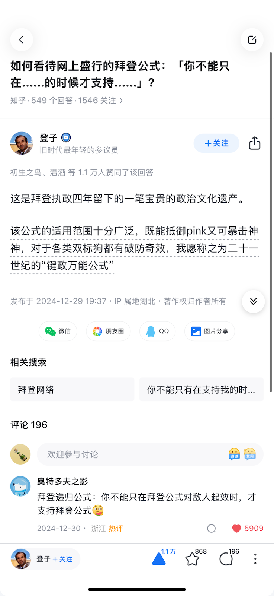 | 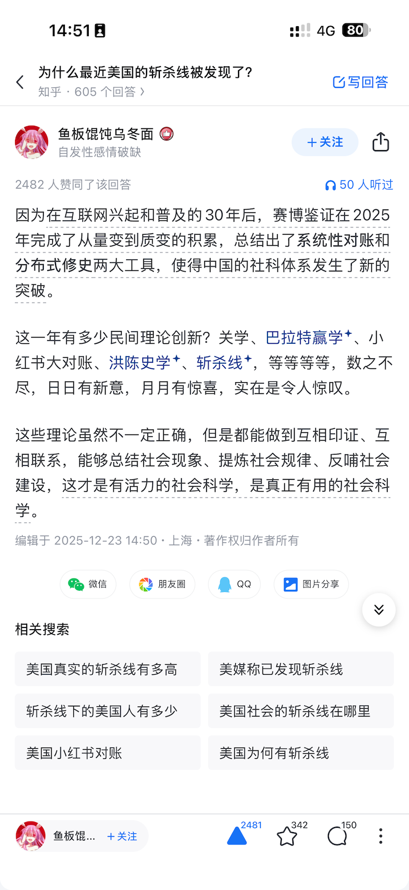 |
| - | - |
| 年初一张万能公式 | 年末一张盘点总结 |

虽然确实觉得能学到一些东西，至少也多个看事情的角度，但也像某位老板说的那样，看多了、听多了之后剩下的更多是一种深深的无力感

AI 当然也是个绕不过去的话题。怎么说呢，除了年初 DeepSeek 火了一顿之外，之后这一年过去感觉跟去年也没什么本质上的区别，还是那样国内国外几个大厂出一堆大差不差的产品来回卷，卷了一年除了一直刷榜之外，感觉也没卷出什么跟去年明显不一样的新名堂出来

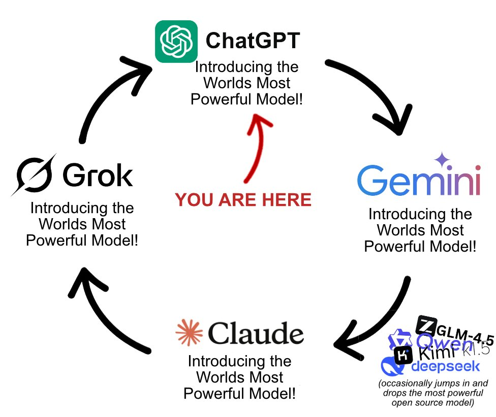

比较有意思一点的大概算是多模态的一些工程化产品，比如 Sora 和 Nano Banana 确实让梗图、梗视频生产快了很多，但互联网上的这些东西本来就已经是远远超载的了，再用 AI 生成一大堆这种东西除了图一乐之外并没有什么很实际的意义，看多了只会觉得越来越烦。同时这些工具事实上很可能并不像它们所宣称的那样提升了生产力与信息流动效率，而是恰恰相反。考虑 2025 年的典型信息流动过程：

* 原始内容：最准确、信息密度最高
* 传播者先用生成式 AI 洗一遍，混入不确定性 / 传播者刻意增加推广内容导致准确率降低、转换为视频等其它形式导致信息密度降低
* 上述内容大量混入平台搜索与推荐流，高质量、高信息密度的原始内容与大量蹭热度内容混合，原始内容被检索到的概率显著降低
* 平台获取内容过多，且混入大量不相关 / 低质量内容导致信息过载，用户主动 / 被动使用 AI 总结等能力，进一步降低内容的准确率

虽然 ChatGPT 类的 AI 应用确实比传统搜索引擎方便，但由于其固有的不确定性也导致事实核查变得越来越重要（现在拿着一张 DeepSeek 截图在社区里乱跳的小鬼实在是太多太多了），而 AI 生成内容充斥网络又导致事实核查变得越来越困难。如果再考虑到事实核查过程中受到推荐系统（怎么不算一种 AI 呢，只不过不是生成式罢了）被反复诟病的「信息茧房」问题的影响，信息的有效流动就更是难上加难

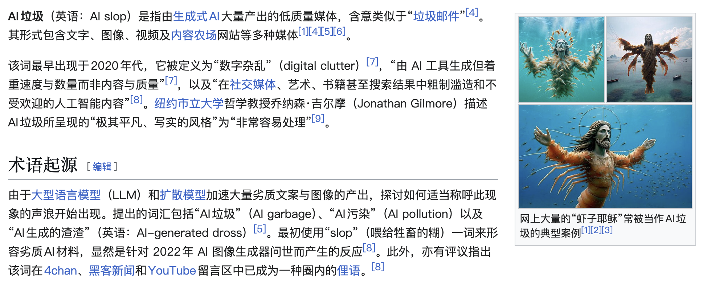

目前卷来卷去的 AI 实话讲已经让开放互联网逐渐成了个笑话：一边放任用户用 AI 生成大量的辣鸡内容，同时针对视频之类信息密度偏低且不易检索的内容进行搜广推相关权重的提升，使得用户越来越难以获取有效信息，不得不在平台停留更长时间以达成平台所期望的 DAU 指标增长；一边又在使劲儿做风控做反爬将用户锁死，比如某红色平台、某绿色平台和某蓝色平台几乎完全阻止传统搜索引擎等工具的索引，导致已经非常严重的信息孤岛现象进一步恶化。实话讲，经历过十几年前互联网「黄金时代」的话，对现在的互联网真的很难不感到失望

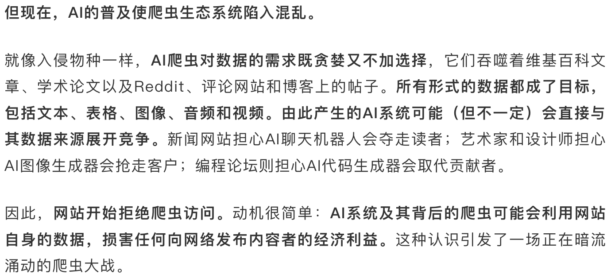

AI 发展还导致一个非常难绷的事情就是内存价格暴涨数倍。偶然看到一句话：这种情况下 Apple 的内存价格甚至都开始显得良心起来

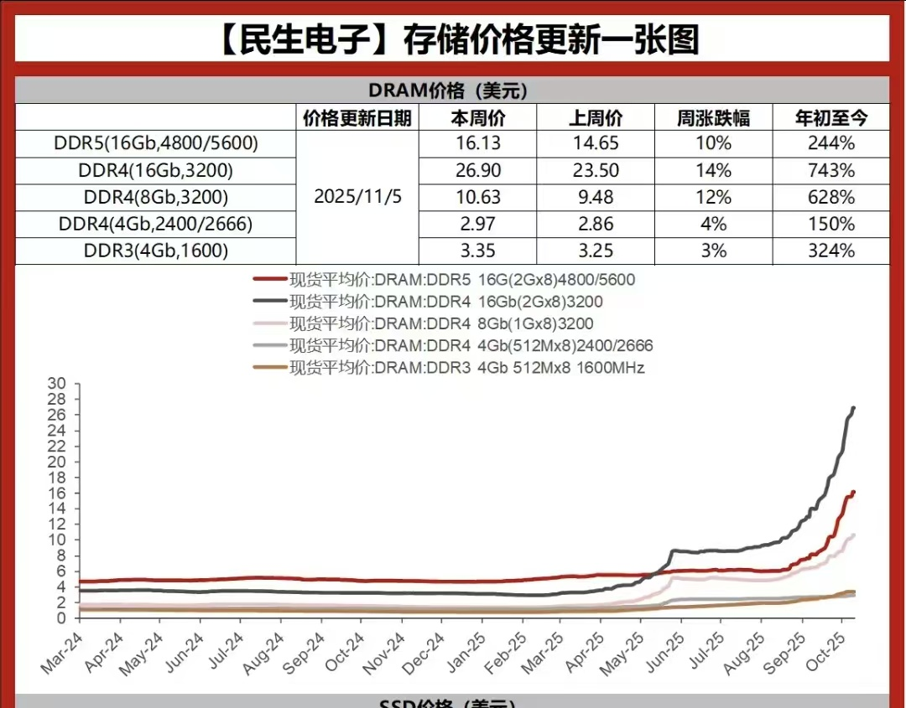

经历了这几年的 AI 发展，有时候也真的忍不住在想，十几年后回看这一波汹涌浪潮，究竟是像前面几次工业革命那样实现了生产力的极大提升，还是如千禧年前后的互联网泡沫一样最终变成一地鸡毛，甚至可能是更糟糕的赛博朋克般加剧了巨头垄断？从草民自己的感受来说，生产力提升感知不强，AI 垃圾内容成倍增加、工作岗位因 AI 明显减少、部分计算机配件越来越贵倒都是实打实的，因此真的很难乐观起来

# Work

虽然从一个老网民的角度来说，实在是很难不对目前的 AI 发展产生一些反感，但作为沾那么一点点边的从业者又不得不说 AI 带来了新的业务增长点。公司的业务重心切换到 AI 相关的一些应用，草民负责的事情中搭基础的相对少了一些，大部分事情都在一些定制相关的事情上（然后不得不说大部分事情坑都比较多，毕竟每家客户都会有自己积累下来的一系列东西要理解学习，再喂给 AI 做事；但是能拿到的这些东西质量往往都相当差劲，沟通成本远比老板最早规划中的预期要高，需要反复拉扯才能完成交付）。目前公司在 AI 这部分选定的方向个人觉得还是有一些空间，而且能跟公司现有的业务叠加获得一些先发优势，感觉还是有机会的，现在还是想看看能在这条路上走多远

至于日常干活，去年也提到过要尝试一些 AI 提效，当时的结论是「用来开新坑值得一试，但是在现有项目上的迭代就不太可用」。现在一年过去，实话说草民是真没觉得这个结论有什么变化。草民日常现在会用 AI 做一些简单重复、不用费脑子写 Prompt 的事情，举两个例子：

* 将一个 SQL 转换为等价的 GORM 代码
* 基于 OpenAPI 文档生成 Python 的调用代码

这两件事应该说都是比较简单、规模有限、结果可验证的任务，但实话说即使如此，这两件事 2025 年年底最新的模型做的也都一般般：

* 简单的 SQL 出来的效果很不错，但稍微复杂一点的 SQL，比如涉及到多个子查询、窗口函数等情况时往往就会翻车，而因为代码不是自己写的，对着 AI 生成出来的一大坨东西几乎是完全没有解决的思路，硬要修的话最终要花的时间甚至可能比从头自己写还多
* 基于文档生成代码则往往因为文档自身的问题（比如缺少术语表导致一个特定的中文名词有很多种不同的英文翻译，或者文档中给出的某一字段却在示例中被遗漏，甚至文档里的很多细节干脆就直接是错的）变成一种纯粹赌概率的行为，后续仍需大量人力去拉扯

以上这些还只是发生在单个项目中的迭代。跨多个项目的迭代往往涉及到一些架构设计上的取舍，比如某类功能表面上看起来实现在模块 A 和 B 里面都行，但不同的开发者给 AI 输入的 Prompt 略有不同（甚至是 Prompt 完全相同的情况下也不一定能保证结果完全稳定）就可能导致 A 和 B 里面都散落了一部分职责相近的功能逻辑。如果整个系统的架构 / 项目本身的框架设计不到位，无法对 AI 应该修改的范围做出合理管控以规避此类问题，日常迭代的过程中又没能在前置设计阶段和后置验证阶段识别并处理掉这类问题的话，久而久之就会导致整个架构逐渐向着完全不可控的方向滑落，最终彻底变成一团乱麻。事实上真正的开发工作中，大部分的精力也往往就花费在设计与验证两个阶段

* 传统工作流：设计（思考某个东西应该怎么实现，30%）-> 实现（写代码，30%）-> 验证（Debug、测试、Code Review，40%）
* 引入 AI 的工作流：设计（同上，30%）-> 交给 AI 实现（写 Prompt，10%）-> 验证（同上，但开销显著高于传统工作流，60%）

上述精力分配甚至还是理想情况，实际上与直接写代码比起来，跟 AI 反复拉扯能不能节省精力还真不一定，但验证是实打实的更费劲

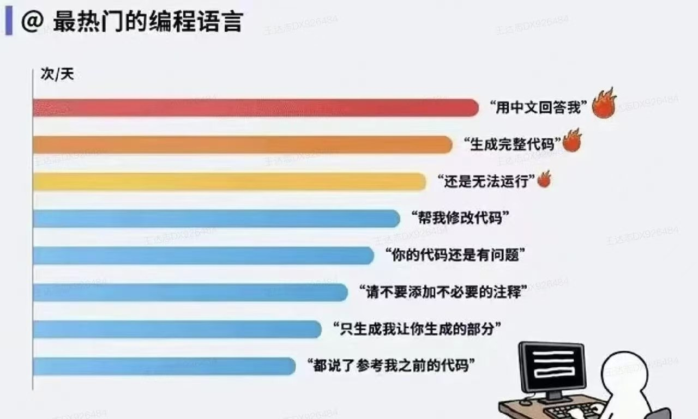

老板们当然会希望 AI 能像田螺姑娘一样节省大量人力成本，自媒体壬也会为了卖课之类的利益诉求不停的贩卖焦虑、吹嘘所谓「十倍生产力」，但只有实际干活的人才知道真实的业务流程充满了拉扯与妥协，在人工💩山上堆 AI 生成的💩山会是一种多么令人绝望的事情

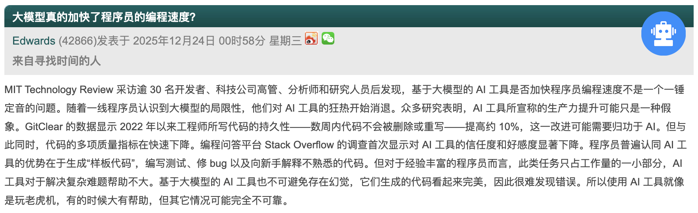

关于之前提过的下云，今年其实也毫不意外，降本增效的趋势下 GCP、Azure 和 AWS 都炸了个大的；比较意外的大概算是 Cloudflare 连炸两次，一次 [Rust 写的 FL2 随手一个 `.unwrap()` 遇上脏数据](https://blog.cloudflare.com/zh-cn/18-november-2025-outage/)，另一次 [Lua 写的 FL1 少检查一个 `nil value`](https://blog.cloudflare.com/zh-cn/5-december-2025-outage/)，这下某些人左右脑互搏了

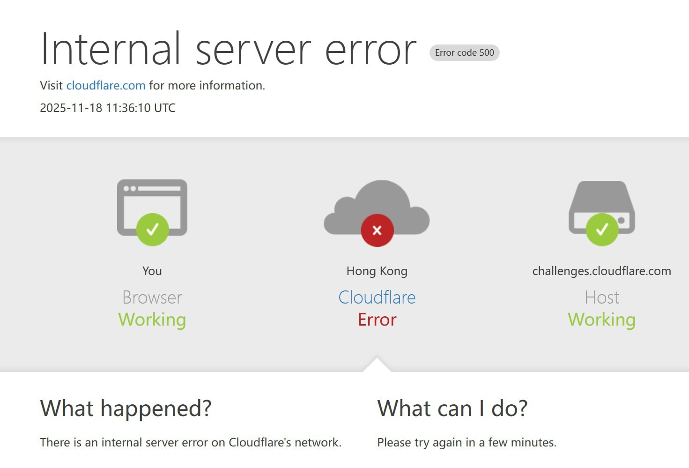

于是著名梗图加强版就来了。一个云平台的故障就可能一波带走几十上百家公司的不同业务，但无论是小企业还是云平台都在应对越来越高的成本压力，一边削减人力一遍高强度引入 AI，运维领域尤甚，导致这年头的互联网感觉比五年甚至十年前还要脆弱

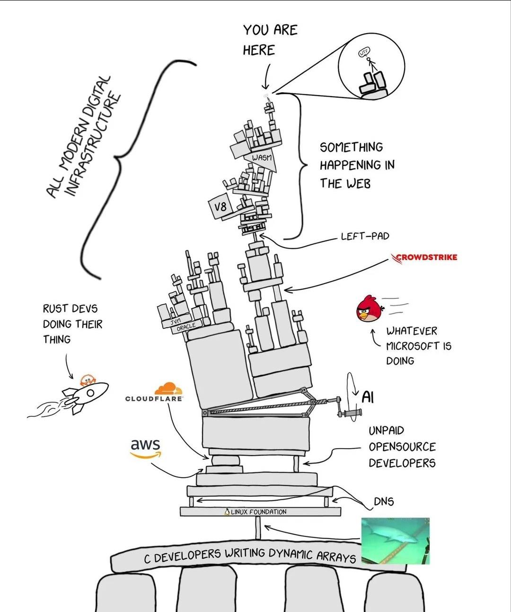

AI 一定程度上逆转了下云的趋势，毕竟 LLM 比传统的互联网基础设施更需要靠规模去压成本（于是带来了内存之类的严重短缺），这个下云确实尚早。不过因为使用的公有云设施更加不稳定（模型、插件、平台之类高频迭代），以及考虑部分公司更高的数据安全需求，公司也在着手探索私有化部署 LLM，好在目前开源模型无论是部署成本还是推理效果都凑合，而且大部分业务 RAG 加 Prompt Engineering 足够

# Mainline

去年的预期是按兵不动，除了老家的资产处置想办法推一推之外避免整其它的活。实际上也跟预想的差不多，老家的资产处置终于有了些进展，春节计划回去再看看；其它重大决策今年突出一个能拖就拖，当然也为此没少跟父母争吵，没办法，就目前这个形势包亏的，甚至存在归零风险。好不容易卷这几年下来有了那么一点存粮，在这么个大环境下可一定要万分谨慎，不然恐怕真的要挨斩杀线了（

去年买的房子三月前后倒是租出去了，租金也完全足够覆盖贷款，估计明年暂时也用不上，还是接着租吧。旁边的医院和公园进度也算喜人：医院差不多竣工了，明年年底左右开始营业；公园一期工程也开始了，预计明年上半年就能耍上，二期就不急了慢慢来

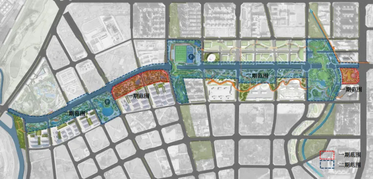

年中去了香港（算是这辈子第一次出海关吧，虽然前后加起来也不到八个小时）办了几张卡。虽然是本着机票效益最大化的想法做的，不过也顺便把能开的账户之类都开了，后续也计划一下，考虑增值 / 灵活性 / 风险规避之类有没有能够用的上的地方

其它的，目前暂时对明年主线怎么推还没什么想法，大方向应该还是求稳吧，不过或许会有几个机缘可以抓一下

# Health

身体总体上比去年好一点，主要归功于确实瘦了一些。买了体脂秤，要向着 20% 以下的体脂率努力。弓箭耍了半年余，30 米基本上勉勉强强，可惜后面公司的事情忙了起来，加上开销确实略大暂时搁置了，Flag 也是理所当然的没立住，明年再搞

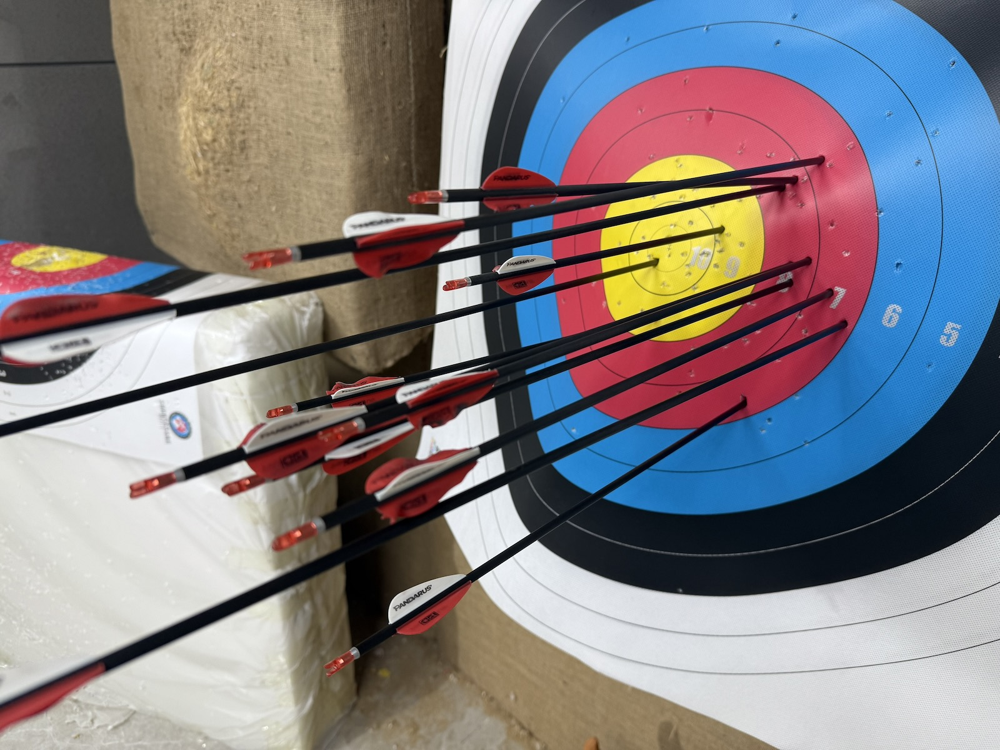

今年当然还是逃不过例行看牙，重做了口腔 CT 结果还是发现有几个侧面情况不太好，补了一个感觉也不是很满意，在某些特定情况下还是略有不适，明年可能还需要再收拾一两次。大家还是要注意口腔健康，尤其是记得刷牙之后使用牙线 / 冲牙器清理缝隙啊

# Play Around

今年比去年浪的狠多了。一直想去的「泼墨漓江」达成了 [Guilin Experience](../guilin-experience/) 

一直想见的🐦和🐰终于见到了 [Vacation 2025.1](../vacation-2025-1/)（不过这张图其实是八月份的

还有王子和安静等等也都见到了 [Vacation 2025.2](../vacation-2025-2/)，总的来说真的是玩的很开心的一年

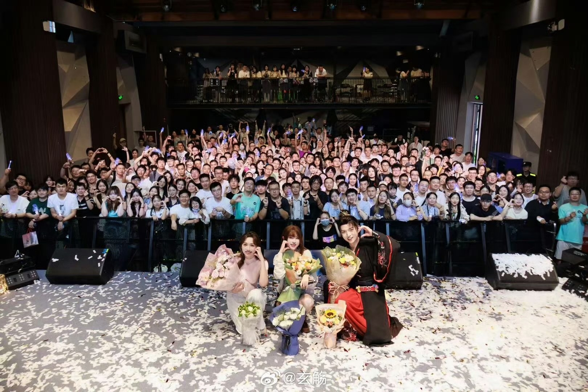

明年目前计划中的 Live 的大概四五场的样子，包括 ChiliChill、银临、黄黄、🐦和🐰应该都有戏，其它的除了旺季之前挑战一次当天来回九寨沟之外暂时没其它想法，老板们有想法可约（

# Collection

例行更新一下宅男快乐柜。由于空间确实非常紧张，今年开预售的流萤手办就没买了（目前大概只想要花火和风堇

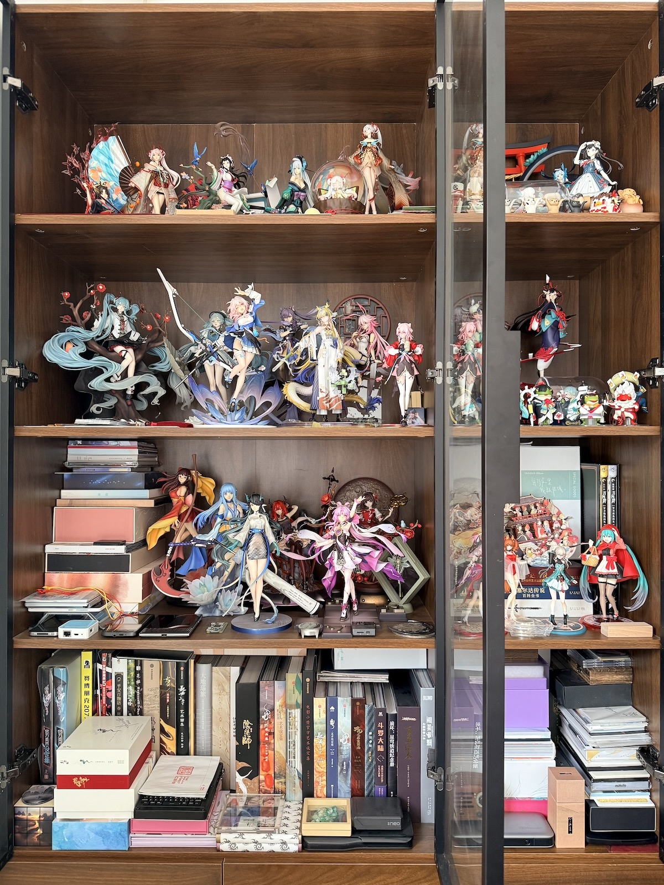

除了 Gadgets 2025 和 Vacation 2025.1 / 2025.2 里面提到的小玩意和碟，今年新买的塑料小人和设定集：

* 第二排：拿弓的「三月七·存护」和端茶的「三月七·巡猎」，以及夹在中间的「黍」
* 第三排：符玄（斯哈斯哈）和右边小格子里的青雀
* 最下面设定集里面觉得最好的两个是《大地巡旅》以及黑猴的《影神图》，其它的还有（大致按收货日期排序）：
  * 《新神榜：杨戬》艺术设定集
  * 《小倩》官方艺术设定集
  * 《雄狮少年 2》电影艺术设定集（因为柜子空间耗尽，所以跟 1 的一起放到其它地方去了
  * 《哪吒之魔童闹海》艺术设定集
  * 《崩坏：星穹铁道》纪念册
  * 《聊斋·兰若寺》设定集（也是因为没地方所以没摆出来
  * 《平安百物语》设定集 Reset（白嫖，没想到等了这么久竟然没咕咕咕，不过翻了一下内容好像也没特别大变化
  * 《明日方舟设定集》Vol.3 + Vol.4（也是连同前面几本一起放到其它地方去了
  * 《浪浪山小妖怪》设定集

还有 12 月收到的一张碟《一》（感谢虾滑老师撮合）以及还在路上的《童话入侵计划》和《独白》，后面 Vacation 2026.1 再晒

# Game

YYS 3000、3333 天了，人明显越来越少，而且今年也没整出什么好活，明年 1.22 终末地出来看看情况，要是靠谱说不定真就把 yys 弃了

HSR 今年的剧情里面 3.1 3.3 真的超赞，下面缇宝的剧情简直看哭 [BV1ctP7epEQw](https://www.bilibili.com/video/BV1ctP7epEQw/)，草民将其评价为今年最佳

风堇和赛飞儿的剧情也是真的非常好，尤其是下面这个设定真的非常巧妙。[版本 EP「拂晓」](https://www.bilibili.com/video/BV12HJBzHERG)这首歌个人也觉得是今年的几首歌里最好的

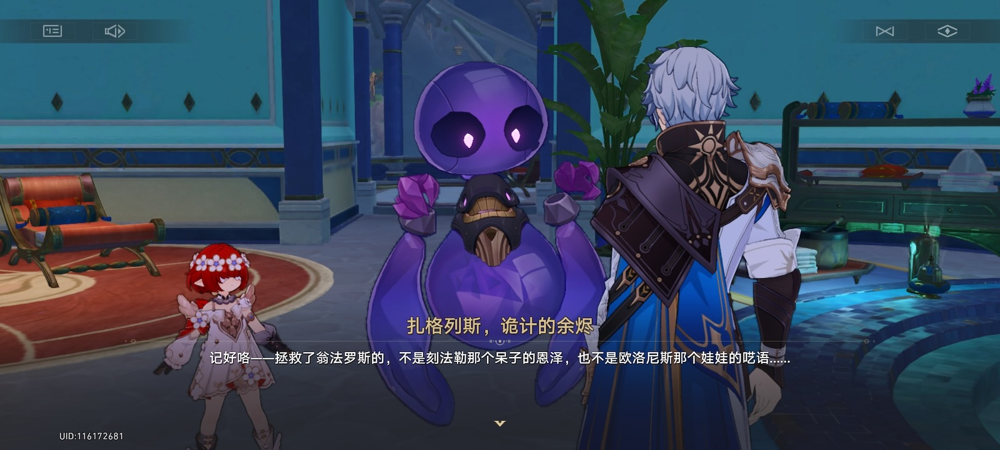

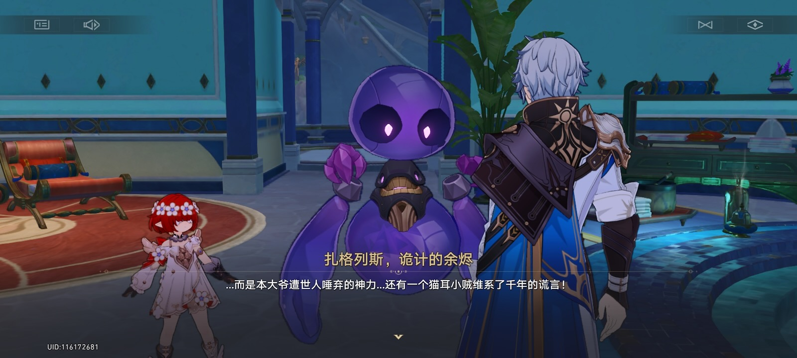

后面 3.7 可以说是草民见过的最天才的一次运营操作（虽然 3.7 剧情个人觉得是有一点拉了，当时纠结了半天氪了一把弓，还被两个小保底歪没了；但是后面 3.8 那个节奏出来，突然又觉得这个弓氪的还挺值的，而且 3.8 的剧情还是挺不错的，虽然就是抽卡又歪小保底

还有些值得一提的大概是上半年《明末：渊虚之羽》（可惜开局翻车）和下半年 SC2 国服回归，虽然也没什么心思玩，年纪越大越电子那啥

# Entertainment

除夕之前崩铁还整了个新春会（叔叔这套 Festival 模板整的还挺好），里面🐰这首[《幻境中》](https://www.bilibili.com/festival/HSRSF2025?bvid=BV1sKfhYjE5q)着实带劲。说起来还有点怀念「狐斋志异」这个活动了，文案各种梗信手拈来，玩法也挺有意思。后面也就「初花习剑录」有这感觉，今年的活动玩法倒是各有亮点但剧情还是差点味道

_可以组一辈子的捉鬼小队吗_（可惜 mygo 这个梗晚了俩月才出来

叔叔今年的年货呢，几个小剧场都挺对味，主线故事也水平在线，鬼畜全明星回归更算的上惊喜，这些比起去年来说算是提升相当明显。但是音乐节目草民就觉得恰恰相反了，光从播放量看跟之前比都低了非常多，马上要一年了也不过一两百万（上面这个都快 350w 播放了）。这里面尤其是命题作文真的完全听不进去，各方面都远远不如 2023 年虚拟区年货那首[《到深空更深处去》](https://www.bilibili.com/festival/VSF2023live?bvid=BV1Zv4y1C7Ty)；其它的歌个人感觉也都平淡了一些，幸亏还有一首[《六耳》](https://www.bilibili.com/festival/bnj2025?bvid=BV1tsfpYwEt2)非常非常亮眼，终于还算是撑住了场子。怎么说呢，去年毕竟第一次还能理解，但今年还是觉得丢了噩梦那种神韵之后又没拿出新的东西顶上，加上 B 站重心偏向跨年晚会，出现这种结果也不意外……还是希望一个半月之后新的年货能有更好的表现

春晚版《春意红包》真的是狠狠吃了个大份的。词改了也就算了，重新编的那个曲是什么一坨给人气死，后面 B 站还有一大堆二创，越看越烦。这几年拿拜年祭老歌硬整的新活就没一个像样的，之前《横竖撇点折》，这次《春意红包》，不知道下次又轮到哪个倒霉蛋

例行看的动画电影：《浪浪山》最佳。《Zootopia 2》很好（二刷场试了一下杜比影院但非常可惜同事一不小心选了一个中配）。《哪吒 2》还行。《兰若寺》只能说相当一般，追光连续两年端上来的东西都这个水平了，明年又开新坑……其它电影零零散散看了一些，《捕风捉影》确实带劲，《阿凡达 3》特效不错，其它的就感觉也都一般般，没什么很值得专门提的。今年国产片和进口片榜首都是动画电影，也是很难绷

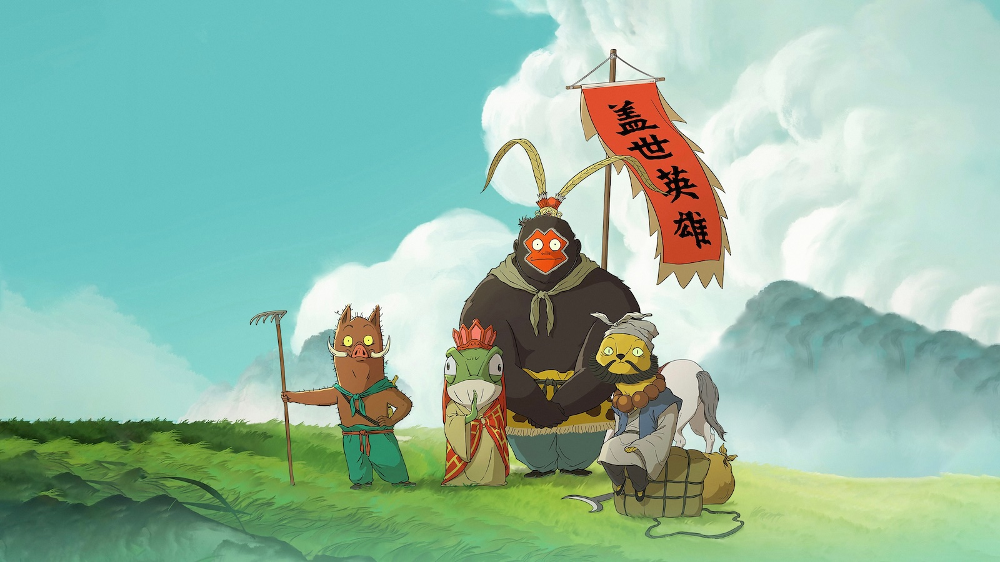

叔叔这个年报今年直播的权重高了好多（毕竟这个真赚钱的），结果🐰虽然投了挺多币但只剩一个隐藏小视频（小院这个《求职》说是

|  | 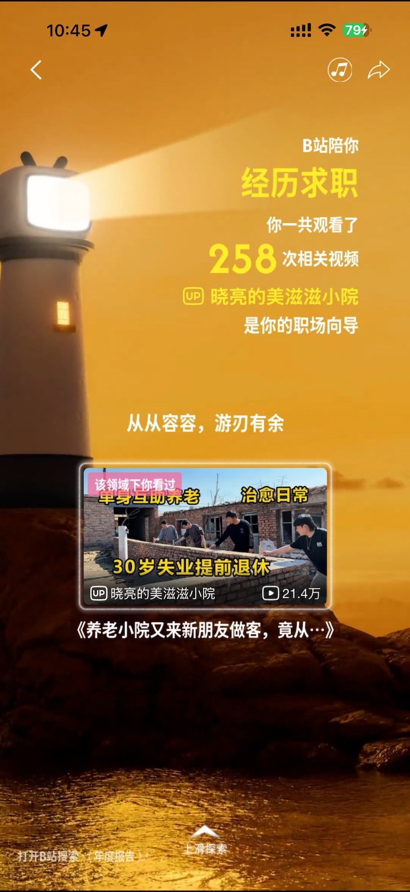 | 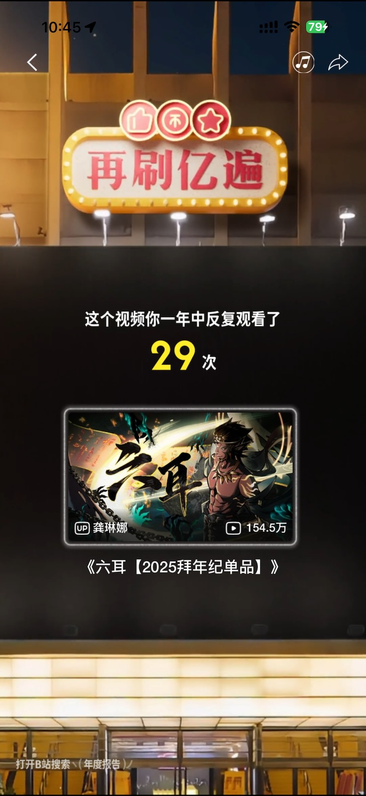 |  |
| - | - | - | - |
| 🥚 | 🏠 | 🐒 | 🐰 |

今年☁️用的就少一些（因为下午晚上基本都在🍤和🥚那里黑听），偶尔听歌的时间依然还是毫不意外的，除了难忘今宵之外大部分都给了🐰

|  |  |  | 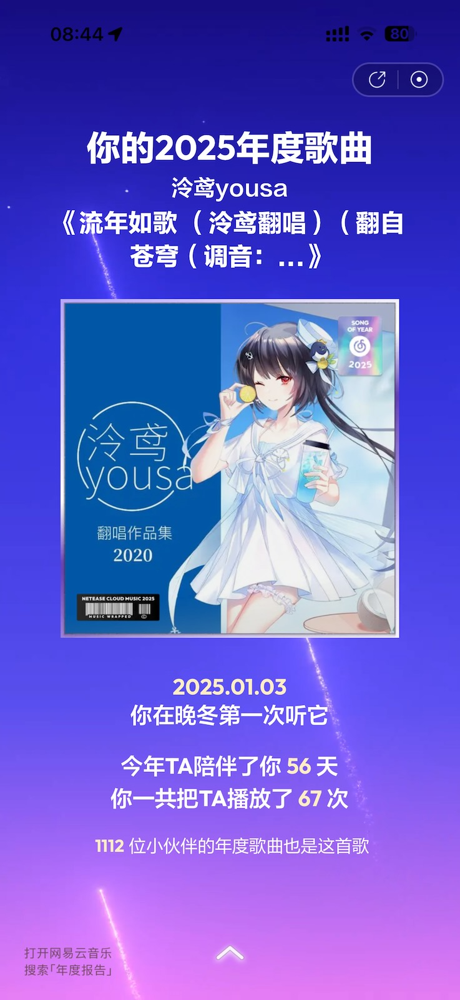 |
| - | - | - | - |
| 年中的一个活动 | 今年的年度歌手 | 老宇航兔了说是 | 难忘今宵这一块 |

另外的几个统计其实也蛮有意思，比如年报还能联动，以及后知后觉的发现今年收了《竹梦令》实体之后真的是狂听了好一阵，还有⛄️冒泡

| 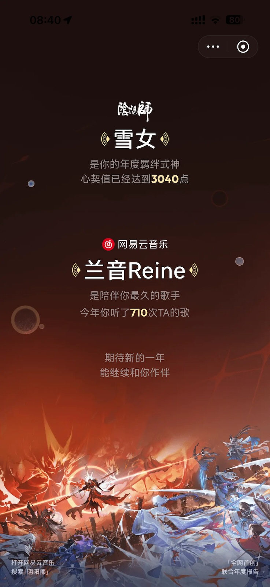 |  | 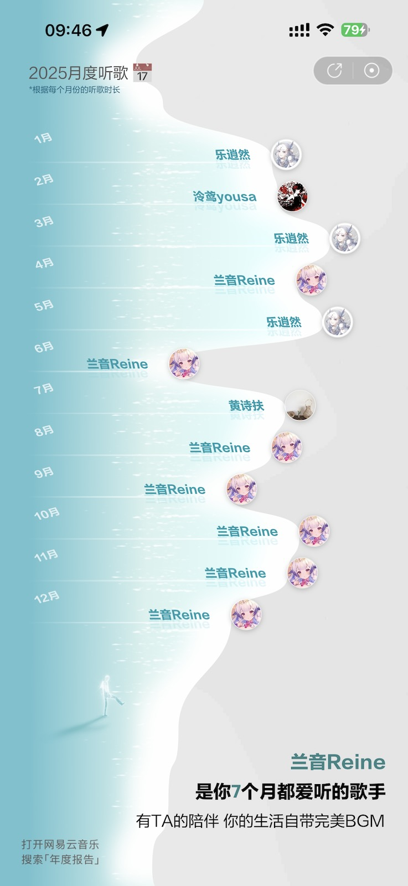 |
| - | - | - |
| 🪭竟然不是阿离 | 🎋这张碟真的神 | ⛄️明年多营业啊 |

顺便今年☁️十年了，刚好两位关注十年截图，这波真的是十年老粉了。过一两个月还会有新的一大批关注十年来袭（

|  |  |
| - | - |
| 竹桑 | 银临 |

最后，年底看了一下游戏与娱乐相关的开销，miHoYo 那块还好，但叔叔那块花的钱确实还是有些多了，明年要控制一下这方面的相关支出

# Projects

luci-app-xray 目前 789⭐️，估计农历新年上 800 应该不成问题。今年在这块儿主要做的事情：

* 完善 luci-app-xray 的 Dynamic Direct，修复一些问题的同时增加了针对 DNS 的前置处理
* 为了应对 DoH 越来越差的可用性，魔改了一番 cloudflared 实现 DoH3 0RTT，并增加一些针对性的策略（针对谁就懂得都懂

出来的效果还不错，后续可能也会介绍一下 luci-app-xray 在分流上做了哪些事情以及跟 cloudflared 的搭配

RSS Pipe 加了 pyo3 实现了更灵活的内容处理（这个 crate 超级好用，强烈推荐），以及一个简单的类「文件传输助手」的功能，顺便利用 iOS 快捷指令实现了文字（主要是链接）和图片的分享，差不多是想象中完全体的六成水平，明年应该会进一步扩展 pyo3 的应用实现 bot 和 LLM 接入什么的。今年早些时候 Fish 4.0 如期发布、年底 Rust for Linux 实验通过进入正式状态，Rust 绝对是值得长期投入的

| 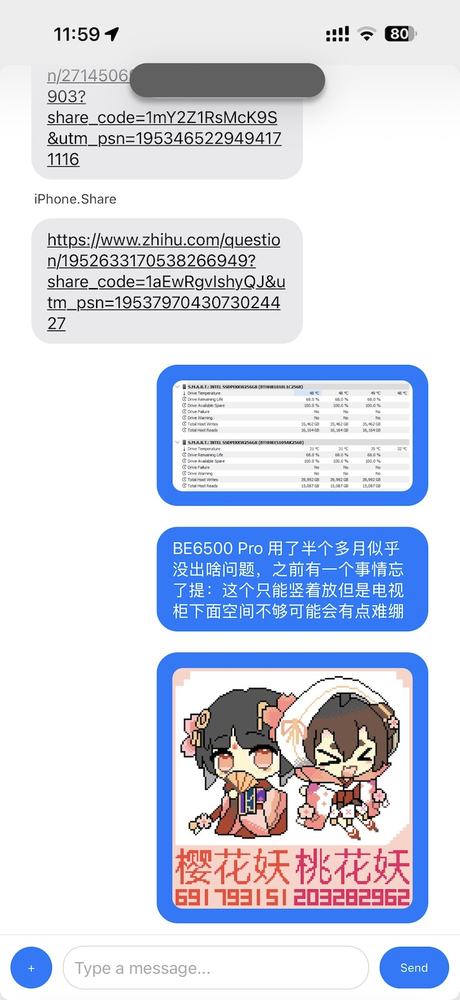 |  | 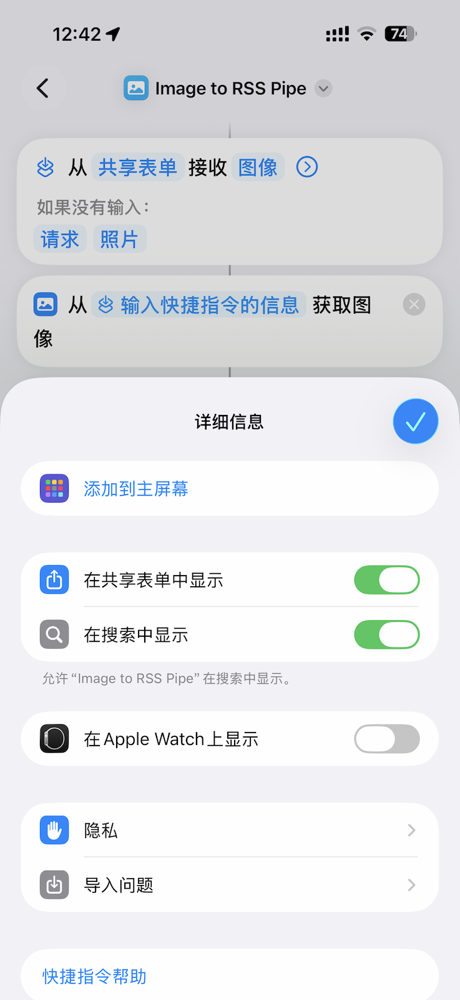 |
| - | - | - |
| 列表 | 通知 | 分享 |

龙芯今年没怎么折腾，不过值得庆祝的是 Debian 正式把 LoongArch 加入官方支持了，以及 AOSC OS 终于把 Python 2.7 相关的依赖都去掉了。其它值得一提的大概是在 Volterra 上跑了 `Qwen3-VL-30B-A3B-Instruct-UD-Q4_K_XL.gguf` 偶尔玩一下，过程颇费了一些周折（只能用 MSYS2 里面的），可惜 Volterra 内存还是太小，还只能拿 CPU 硬算（10 Token/s），多模态也慢的基本没什么实用价值，纯图一乐吧

# Gadgets

端午节如期更新了 [Gadgets 2025](../gadgets-2025/)，下半年买的东西呢：

* Redmi Buds 7S：降噪在骑车的时候会自己莫名其妙的关掉，音质调的也不是很好（感觉跟 AirPods 4 那种两头翘的曲线刚好反过来
* Switch Lite 和 iPhone SE 电池：都还行，顺便 iPhone 16 Pro Max 的电池健康终于掉了三个点
* 小米 BE6500 Pro：25 年年初生产的旧版本，2.4GHz 差一点，其它还行，自带中枢网关很方便，就是太高刚好塞不进电视柜下面；买了最后那个拆分线之后腾出来一个电源插座，就扔电视后面了，没想到效果意外的非常好，顺便还优化了 NAS 跟 Volterra 的通信
* AirPods 4 ANC：不到 1100 买到，各方面都不错，也没有上面那个自动关掉降噪的问题
* Logi Bolt Type-C 接收器：强迫症解决方案 +1，确实很好用，而且感觉比之前 Type-A 的稳定性也好一些。说起来 MX Master 3S 的主滚轮有点不顺畅了，拆开清理发现轮子下卡了一大团毛毡 = = 然后满血复活，这个鼠标还是挺易于维修的就是得自己买一套脚贴
* 偏振镜：有用，不多，Vacation 2025.2 里面提过没 Diff 成，下次一定
* QCNCM865 无蓝牙版：R86S 上完全认不出来，龙芯上倒是没问题，只能怀疑是某个供电引脚之类的定义不完全准确吧。不过在龙芯上用着似乎信号好一些，但因为客户端电源管理的问题 Ping 延迟还是偏高，大概会留到后面把 R86S 换掉的时候用上
* 四姑娘山捡到的红点：据说是装在相机上用来打鸟的时候快速构图的，有点意思
* 补光灯：趁双十一入手的，以后拍塑料小人观感会好很多
* 小米体脂秤：一步到位的八电极版（不知道为什么手柄上要放四个），折腾一年 BMI 降了一点但还是不太够
* 水月雨 NiceBuds：性价比确实相当爆炸，虽然 AirPods 4 听习惯了确实感觉这个有些差距。黑白各买了一条支持一下本地企业
* 翰林阅 Free2：为了把七月份买的两个🐰键帽用上，以及清理一下🐶东豆子买的，除了自带的矮青轴极烂（还好能换）之外还不错
* 小米 BE3600 2.5G 版：小竹 140 收来发现不能刷 OpenWrt 就不想要了，遂一百块拿回来。试着扔在客厅当无线 Mesh 子节点，效果比预期的还好一些，不过把 BE6500 Pro 从次卧挪到电视下面之后就用不到再开 Mesh 了，遂回盒子里继续当备用设备
* 12V 5.5 x 2.5 拆分线：有效释放弱电箱 / 电视柜等地方的电源插座，强烈推荐，直接促进了草民入住以来家庭网络最大一次优化

更具体的内容就还是明年端午见啦。

# Finally

感觉现在生活算是相当稳定，甚至明年都不想立什么 Flag 了，但还是照例：

* 明年目前觉得还是不适合做关键决策，所以还是谨慎为主，苟过周期
* 上面提到的几个机缘还是要关注一下，有的选的时候不要让自己后悔
* 支线：依然是重点关注身体健康情况，日常迭代项目也继续保持推进

最后依然送上草民真的很喜欢的《流年如歌》，希望大家新的一年越来越好。

<iframe src="//player.bilibili.com/player.html?aid=94304902&bvid=BV1BE411p7oi&cid=161422087&page=1" scrolling="no" border="0" frameborder="no" framespacing="0" allowfullscreen="true" height="600px" width="100%"> </iframe>
