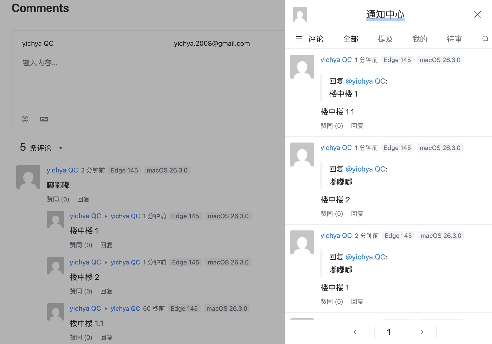
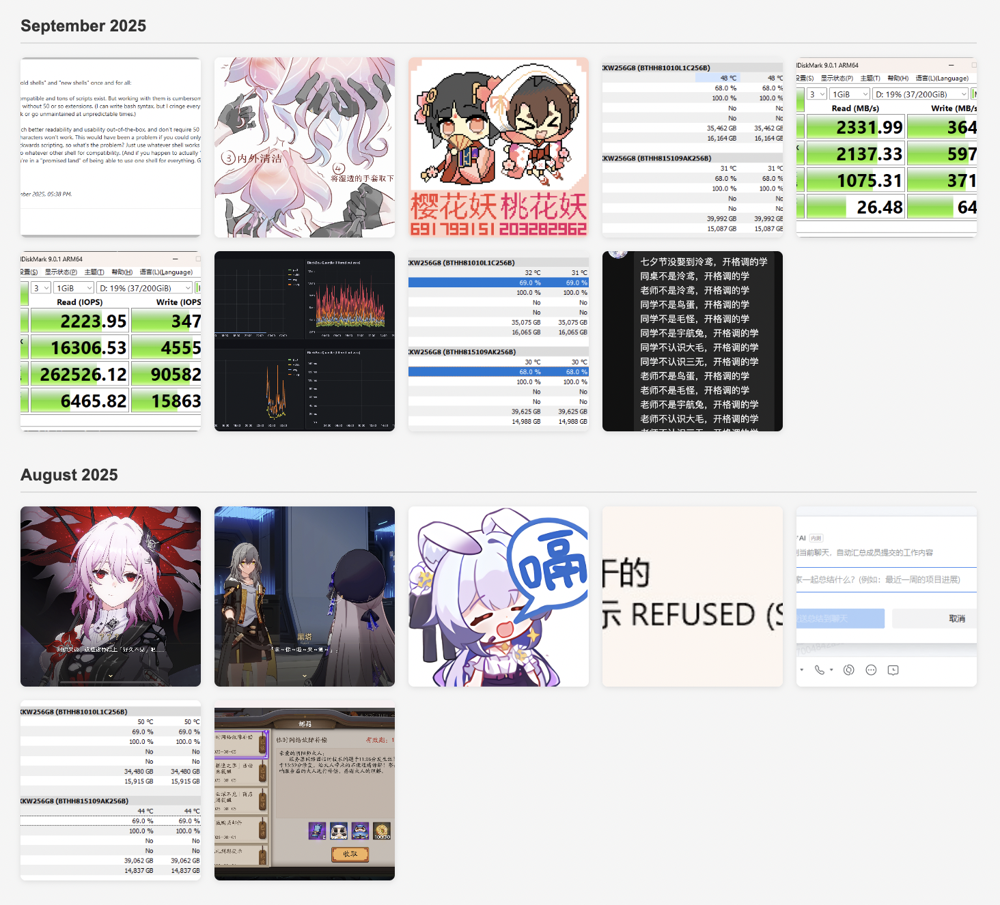

这里评论用的 Valine，虽然架好之后没多久它就闭源了 = = 不过用着也没啥毛病就没管。结果这几天突然发现 [LeanCloud 就要停服了](https://console.leancloud.app/docs/sdk/announcements/sunset-announcement) = = 趁过年在家的功夫搞了一下咕咕咕多年的 My Own Hackday，花了一天时间快速肝了一个最小的 Valine 兼容服务端实现

# On-Premise Replacements

当时选 Valine 的原因之一就是它非常简洁干净，并且没有什么很复杂的社交集成功能，国内访问也比较稳定（即便后面 LeanCloud 国内强制要求备案的时候迁移到国外了也还可以接受）。相比之下老牌工具 Disqus 现在猛猛加私货广告，根本没法看；至于比如 utterances 之类的工具倒是也非常简洁干净，但是它绑死 GitHub 还要求登录，也不太方便数据迁移，这对草民来说也算是一票否决

这次 LeanCloud 停服，也属于草民一直关注的下云案例（只是没想到这么快就下到草民自己头上），再选方案的话当然必须全自建了

## Waline

貌似是个比较平滑的切换方案，从名字上就很容易看得出来跟 Valine 颇有渊源（事实上也是如此

* [https://waline.js.org/guide/get-started/](https://waline.js.org/guide/get-started/)（这里有评论区 Demo
* [https://github.com/JQiue/waline-mini](https://github.com/JQiue/waline-mini)（原版服务端是 TypeScript，也有人做了第三方的 Rust 后端，不过貌似没啥人用


看了一下官网 Demo 感觉有几点不太符合草民胃口：

* 实在是太重了：社交集成、用户标签、文章反应，乱七八糟的功能过多，远不如 Valine 简洁
* 客户端文件走公共 CDN 托管，服务端自备甚至可能还是第三方的，说不定什么时候就会出点兼容性问题

虽然 Waline 确实解决了 Valine 存在的一系列问题（主要是安全相关），但额外加的东西又确实是太多了，并不能满足需求

## Artalk

官方后端是 Go 实现的 [https://artalk.js.org/](https://artalk.js.org/)，也直接提供了自托管的客户端 JS 文件，跟 Waline 相比运维起来更方便一些



这个部署相当平滑，花了十来分钟就完成了对 Valine 评论和计数器两个功能的替换（不包括数据迁移），但也有几点感觉不太好：

* 上传图片完全没有任何限制（虽然可以一刀切直接关掉这个功能
* 还是略重，比如什么社交集成、各种推送之类的功能用不上
* 侧边栏草民不怎么喜欢，尤其是连个开关都没有这件事

草民博客流量极低，可能一天只有个位数请求，开个这玩意儿绝大多数时候都是空跑，还是多少有点浪费，而且这玩意儿一年半没有发新版本了，上次代码变更也是大半年前了（甚至官网自己部署的 Artalk 服务端证书都过期了 = =），感觉也相对不算靠谱

## Other

类似上面两个的 [Twikoo](https://twikoo.js.org/intro.html) 也有比较重的问题，而且它只有 TypeScript 服务端，这里就不专门搞了。另外还搜到了一个利用 [Memos](https://usememos.com/) 的接口的[方案](https://www.hollowman.cn/archives/memostest.html)，问题主要在于前端还得自己写，就算有 AI 感觉也还是会很麻烦，还是算球了

顺便一提，Memos 其实很符合草民对 RSS Pipe 上一些额外功能的需求，只是还是不够简洁（所以草民才做了「文件传输助手·青春版」），功能上也不如类似 ChatGPT 那种 Sessions 的形态组织起来更高效：即便有 AI 加持的情况下草民也不认为人类能长期、频繁跟进 20+ 个不同事项，所以 ChatGPT 之类左边列出十几二十个近期 Session 的形态足够好用；再复杂的需求可以通过全文检索甚至 AI 辅助的搜索完成。当然 Memos 已有的一些特性，比如标签 / 按内容类型分类之类简单的管理工具倒是也能用得上，Sessions 的形式也可以展示在日历上并搭配一些自动 / 手动操作刷新变更时间。可能后面再扩展 RSS Pipe 的能力的时候会考虑一下做一点类似的实现

# Custom Valine Server

搜到的几个方案都有些偏重，于是也起了直接替代掉 LeanCloud 的想法。似乎并不难做，但抓接口得知 Valine 同时进行了三种 CRUD 方式

* REST 形式的接口
    * 发送评论
    * 创建阅读计数器
    * 修改阅读计数器
* 一个很类似 MongoDB 的语法
    * 获取评论总数
    * 分页获取评论
    * 获取阅读计数器
* CQL（一个很类似 SQL 的语法）
    * 获取楼中楼评论（这个真的很奇怪，不知道为什么只有这一个特例，而且按说也完全可以用上面的形式实现

评价为这玩意儿也让人感觉不是很靠谱，再加上还不开源……但它又确实足够简单，刚好过年在家呆一周没有很好的网络条件（虽然后面又想起来家里还有个老伙计还能发挥下余热，很快就把网络搞好了），于是决定把咕咕咕了多年的 My Own Hackday 搞起来，花一天时间在 RSS Pipe 的基础上进行扩展，目标是实现 Valine 可能用到的所有 LeanCloud API 用法的最小集合

## Analysis

虽然 Valine 操作 LeanCloud 的方式很多，但实际上每一种都使用了非常固定的形态去请求，分析之后完全可以在服务端做针对性实现

### Relations

Valine 在 LeanCloud 上定义了 `Comment` 和 `Counter` 两个表（实际上更像是 MongoDB 的 Collection，包括主键也叫 `objectId`，但这里就还当是表好了）。有的旧版本可能还会操作内置的 `_User`，新版没有这个了，这里以 1.5.3 为准，本次也只实现这两个表的操作

* `Counter` 没啥说的，跟具体文章通过 `URL` 一一对应起来，然后就是 **+1** **+1**
* `Comment` 跟具体文章通过 `URL` 组合成一对多关系，然后再通过 `rid` 和 `pid` 建立楼中楼关系
    * `rid` 是主楼的 `objectId`，会用于检索，实现时要考虑能被过滤（以及可能的索引）的存储形式
    * `pid` 的关系稍微有点乱，不过它不用于前后端交互时的检索，实现时只需要原样记录、传递就可以了
    * 因为 Valine 可以直接粘贴图片（实际上是作为 data URL 处理的），评论的内容可能会很长，考虑存储的时候要注意数据类型

总的来说也比较简单，随便放在什么类型的数据库上都很容易实现，草民这里就继续选择 RSS Pipe 已经用了的 SQLite

## Implementation

上面有提到继续在 RSS Pipe 的基础上开发，原因有以下几个：

* 可以对接 RSS Pipe 已有的一些能力（比如 Bark 推送、正式发布时自动清零计数器等等
* 已经实现的「文件传输助手·青春版」的表结构只需要简单调整就能适配上面的关系
* 可以利用这套一对多的关系来实现对 RSS Pipe 现有能力的一些扩展
    * 针对「文件传输助手·青春版」，可以实现「回复消息」与「Session 管理」两个相当有用的功能
    * 针对 RSS 内容可以扩展出私有的评论 / Bot 能力，类似 GitHub Actions 在 issue 区的互动
        * 比如利用 RSSHub 从☁️拉取到了新歌，可以直接在下面评论 `/download` 通知 Bot 进行下载

为了理清思路，实际的实现过程中除去少许代码片段之外基本没有使用 AI 辅助，过程中也确实觉得没有 AI 的话产能低了好多（

### REST

啥技巧都没有，简简单单一搓完事

* 创建评论：`POST /1.1/classes/Comment`
* 创建阅读计数器：`POST /1.1/classes/Counter`
* 修改评论计数器：`PUT /1.1/classes/Counter/<objectId>`

具体的 Body 也很简单就不贴了，自己抓一下就好。一点细节：

* `objectId` 的格式并不需要跟 MongoDB 的默认格式一致，Valine 也不会在客户端生成这个，草民这里直接改用 SQLite 的自增主键
* POST 的两个请求中会有一个 `ACL` 字段，服务端解析的时候直接忽略即可，不需要去纠结它的类型
* PUT 的 Body 的内容大致就是 `time += 1`，实际上完全不需要解析
    * Valine 针对这个还有个安全问题，就是可以随意构造请求去修改这个 Counter，不解析这个也可以顺便解决这个问题

### MongoDB Like

三个查询的请求都只用到了一个非常简单的条件，以查询这篇内容的评论与阅读数量为例

* 查询请求都是 `GET`，参数用 Query String 传递
    * 评论：`GET /1.1/classes/Comment`
    * 计数器：`GET /1.1/classes/Counter`
    * 排序 `order` 均为创建时间倒序，但实际上不需要解析具体排序条件，实现的时候写死即可
* 评论查询由两步完成，所以这里总共要实现三种请求
    * 一个入参包含 `count`，仅用于查询评论总数不获取具体内容
    * 另一个入参包含 `limit` 以及可能的 `skip`，用于分页获取评论
* 评论和计数器查询都用到的过滤条件：`where={"url": "/self-hosted-2/"}`
    * 计数器最多只会查到 1 个，没查到的话会调用上面的 REST 接口创建一个并写入 `1`
* 评论查询时会在上面的 `where` 里额外增加一个过滤掉楼中楼的条件：`{"$or":[{"rid":{"$exists":false}},{"rid":""}]}`
    * 因为楼中楼只有下面的一种查询方式，实际上这里也并不需要解析这个嵌套了几层的条件，在服务端直接实现这个过滤就行了

这三个请求可以通过 Path 和入参带不带 Count 进行非常简单的区分，因此大部分复杂解析都不需要做，知道是哪个请求并针对实现即可

### CloudQuery

这个针对楼中楼的查询解析起来稍微复杂一点，要把里面的 `rid` 硬抠出来。至于排序一样不用管，实现的时候写死就行了：

```sql
select * from Comment where rid in ("1x","2y","3z") order by -createdAt,-createdAt
```

因为查询比较固定，草民实际做的时候直接切了切字符串拿出来完事了。注意返回值有一个固定的字段 `{"className": "Comment"}`，不加上的话 Valine 不认。都完事之后给一个 `GET /1.1/cloudQuery` 的路由即可。不过另外还有一个问题原来用 LeanCloud 的时候 `rid` 是一个并不太容易枚举的 `objectId`，而这里的重新实现图省事直接用 SQLite 的自增主键，会导致这个接口可以枚举所有的评论数据，因此至少在实现的时候还需要把下面的 appid 相关检查做好（当然也可以改用类似 `objectId` 的生成器，但是对简单业务来说有点太麻烦了

### Authentication and CORS

LeanCloud 的鉴权传了两个字段，一个 appid `X-LC-ID` 和一个计算出来的签名 `X-LC-SIGN`；Valine 说白了压根不需要这么复杂的流程，也不太可能逆向出来 `X-LC-SIGN` 的相关逻辑，因此简单做一个自包含验证并且不跟 LeanCloud SDK 冲突的 appid 就可以了：

* `X-LC-ID` 是 24 个字符加一条横线再加 8 个字符
* 这个 appid 需要能对应到一个 RSS Pipe 的 `feed`，成本最低的方式是直接利用它传递 `feed_id`
* 为了避免伪造，利用 RSS Pipe 一个之前就有的启动参数 `auth` 跟 `feed_id` 拼接起来，再计算一个 hash 用作签名

省事儿起见 hash 选了 md5，按流 base64 出来刚好 24 个字符（最后两个是等于号，但并不太影响）；后面 8 个字符是 `feed_id` 的十六进制表示，刚好 int32，对于 `feed_id` 来说肯定够用了。也尝试在里面掺了 base64 的其他字符，实测不影响 LeanCloud SDK 工作

```
gVbhGkTgtIgfaI6pD0Xr5A==-00000065
```

CORS 没啥特别的，别忘了就行，图省事儿的话就全都 `*`

## Deployment

LeanCloud 从几年前就已经强制要求绑定用户自己的域名了，所以部署也很简单，把 RSS Pipe 通过无论什么方式（内网穿透 / VPS 部署等等）挂在这个域名上面即可；或者如果 RSS Pipe 已经挂在某个其它域名上了的话，就修改一下 Valine 的初始化配置

针对客户端部分，LeanCloud 官方不再提供服务，在公共 CDN 上托管的 SDK 说不定在未来的某个时间点就会被撤下来；Valine 也有类似的可能性，所以最好是把目前确定可用的前端文件保留一份自用。虽然 Valine 内部自己决定了如何加载 LeanCloud SDK（目前应该是写死了 jsdelivr），但是它也会提前检查 `window.LC`，所以可以提前自行初始化 LeanCloud SDK，就如下面这样直接加载进来就好了。另外，Valine 目前不开源，为了确保来源可信，比较推荐的方式是自行从官方提供的 CDN 地址下载两个 js 文件（注意版本号）并自行管理

```html
<script src='/assets/js/av-min.js'></script> <!-- https://cdn.jsdelivr.net/npm/leancloud-storage@3/dist/av-min.js -->
<script src='/assets/js/Valine.min.js'></script> <!-- https://unpkg.com/valine@1.5.3/dist/Valine.min.js -->
```

## Data Import

因为主键从 `objectId` 变成了自增的关系，数据迁移会涉及到一个针对全量数据的主键重新映射

* 先从 LeanCloud 导出所有数据
* 选择一个未使用的主键范围对 `objectId` 做映射（停服以避免可能的主键冲突，或者拉一个足够大的间隔出来
* 生成 SQL 后手动批量导入

对于草民这种数据总量区区一百来行的情况，直接拖进 Excel 里面查找替换，完事儿复制粘贴到 SQLite 里面齐活

## Better Integration with RSS Pipe

写作的过程中偶尔还是会需要提前拉起 Jekyll 预览生成效果，但这又会导致阅读量计数器产生变化。为了记录更准确的阅读量数据，往往还需要在正式将内容推送到托管平台之后手动到 LeanCloud 上重置计数器。RSS Pipe 就能很好解决这个问题：工具只会拉取托管到平台的 RSS，因此在每次拉取到内容的时候搜索 `url` 匹配但 `title` 和 `author` 都为空（Valine 虽然定义了 `title` 字段，但是目前的版本并不会在调用服务端时传递它；`author` 更是只能通过 RSS 拿到；两个都过滤主要还是考虑到比如 RSSHub 抓取到的一些内容可能因为各种原因缺失部分信息）的对应记录，如果存在的话直接更新对应记录的未填写字段并将 `counter` 设置为 0 即可

# More About RSS Pipe

最近还在「文件传输助手·青春版」的基础上加了简单的图库（AI 生成前端代码真的很方便，写好几个对接后端的 API，前端几乎秒出



下一步考虑：

* Vibe 一个有点像绿泡泡的朋友圈的 UI，对接上面的博客评论能力
* 完善一点「文件传输助手·青春版」的界面细节，更便于检索历史内容

上面提到的 RSS Pipe 部分改动在 GitHub [yichya/rss_pipe#7](https://github.com/yichya/rss_pipe/pull/7)，不过其中还不包含「文件传输助手·青春版」（因为还差不少东西没有收拾干净），而且目前也还不能开箱即用，主要是还需要手动创建数据库之类。这部分的自动化相关也放在后面处理吧（

# Next

过年难得回了家一次（而且说实话可能再回家的次数两只手数得过来了），于是多写了一点东西，会在下周末（3.1）发出来。
