难得回家一趟，额外记录一点东西。原计划 3.1 发，但因为被各种各样的事情占满时间，最终只能清明发了（

* 2.12 收拾收拾，晚上赶火车
* 2.13 天亮到家，上午补觉，下午去新房子看了一眼并购买本地品牌炸鸡一份
* 2.14 剪毛并又购买本地品牌炸鸡一份，下午见了姥爷，晚上搬了一堆东西
* 2.15 前一天贼累于是未安排出门活动，时隔多年 My Own Hackday
* 2.16 除夕于是未安排出门活动，晚上认真看叔叔的年货并锐评
* 2.17 真·拉电线，还算顺利
* 2.18 出门小逛，未做明确规划，导致浪费颇多时间
* 2.19 出门小逛，晚上收拾了在家里留下的最后一些东西
* 2.20 白天探望亲戚，晚上赶火车
* 2.21 上午到成都，下午整理，晚上约饭
* 2.22 完善了一下 My Own Hackday 的相关内容，晚上发了出来
* 2.23 调整调整准备复工

除了 2.15 算是摆了一天（实际上也在搓 [Custom Valine Server](../self-hosted-2/)）之外真是够忙的。下面的顺序就比较随意了，梦到哪块说哪块

# 冬天回家

这次跟去年回去那次一样选了动卧，但因为没什么经验的关系把暖气开太热了，结果还是完全没睡好 = =

选的车次跟上次差不多，于是也是早上六点不到就出站，天都没亮包没地铁又懒得打车，还好也不算太冷，就还是骑了个电动小蓝回家

# 把老伙计拉起来

回家之前对网络的规划是 MicroPC + 树莓派，甚至也考虑了搞不好网络就认真弄 Custom Valine Server，但突然又想起来家里还有个退下来的老伙计可以支撑一下。事实证明老伙计依然靠谱，可惜硬盘位彻底寄了（去年八月份回来那次其实就坏了，当时还以为是什么偶然问题，这次又弄了弄还是没救回来），草民倒是考虑到了这一点，于是出发前就准备了个 U 盘 dd 进去了一个 OpenWrt，然后又因为下图这个摆法多少有点让人不踏实，于是在存储价格最高的时候买了个小米的 U 盘（买回来之后才又想起来家里还有一个更早之前 DIY 的 U 盘能用

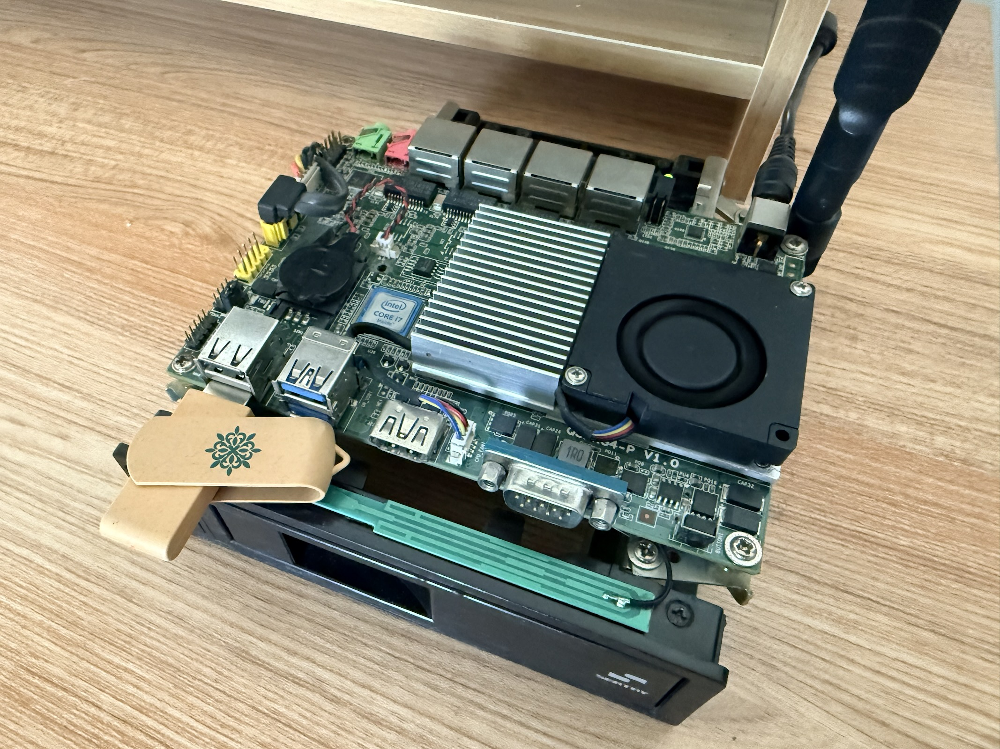

话说回来，这玩意儿插上就能直接用这件事，后面仔细一想甚至有点离谱，但凡有一个环节没搞定，草民都得去想办法买个键盘救火：

* 随手写了一个平时用的 x86_64 镜像，但这个镜像完全是给虚拟机准备的，虽然一直带着 USB 和 ath10k 驱动，但很久没验证过了
* 老伙计的板子电池恐怕是早就没电了，而它的 UEFI 固件里面的 Secure Boot 又默认是关掉的，这样才能顺利启动没有签名的系统
* 虽然这年头 USB 启动的兼容性早就不像十几二十年前那么令人头秃，但也不是随便哪个盘都能保证拉起来，这点草民也完全没验证

虽然用起来效果也就差强人意，主要还是家里的便宜宽带是真的很烂，以及之前拿回去的那个 NETGEAR 洋垃圾信号不算理想，整个链路串起来算是勉勉强强能做事吧。这次没有把小竹那里收来的小米路由器带来，确实是个错误。今年也许还有机会，下次一定

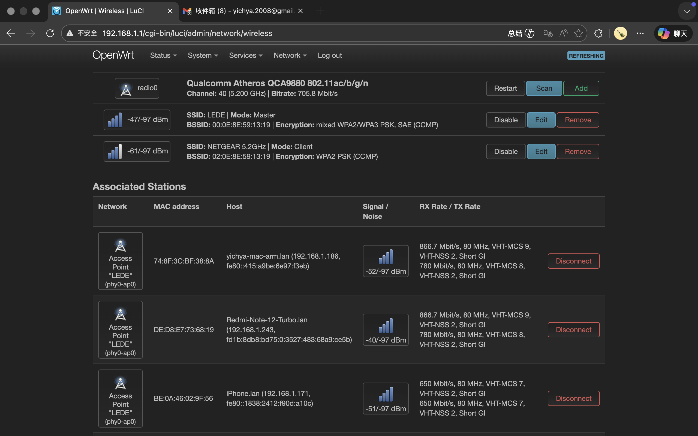

另外总觉得分流问题很大，明明用的是一样的系统、一样的配置，唯一的区别是这边没搞好 IPv6，但是手机和平板的直连判定几乎全部失败，怎么想都觉得非常奇怪。在家没顾上认真折腾，回来之后又对分流进行了一些思考：感觉很多设备（尤其是手机和平板这种很不透明的设备）是不需要甚至不应该使用双白方案的，所以也额外支持了黑 GeoIP + 白 GeoSite 方案，目前来看效果更好一些，下次回家再试试看

# 听了一年多的 VUP 竟然是真·老乡

购买本地品牌炸鸡的时候晒了个单，然后非常震惊的发现草民跟⛄️的距离可能只有小几公里远

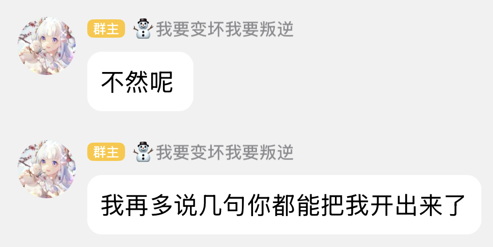

更具体的肯定是不敢多问了，真怕一不小心就给人开了

# 叔叔的年货·预告与一些不吐不快

今年的预热力度似乎比去年还要大一点，甚至还有 [BV1mmF6zkEra](https://www.bilibili.com/video/BV1mmF6zkEra/)，估计也是官方觉得去年那几首歌的数据实在是太差？但感觉从预热漏出来的这一点儿看，今年还是不怎么能达到之前噩梦在的那会儿的水准，希望正片出来能扭转一下草民的看法，再不行的话干脆左转[虚拟歌手贺岁纪](https://www.bilibili.com/festival/VSF2026live?bvid=BV18zF7zSEoC)去了。VSF 今年算是第一次认真从头看到尾，其中颇有几首挺对胃口，但也不得不说确实不是年年都能像 2022 年有[《扬旗鸣鼓》](https://www.bilibili.com/festival/VSF2022live?bvid=BV1mb4y1E7RF) 这种级别的作品（当然草民更推荐 2023 年 AI 翻调过的 [BV14Y411R7hv](https://www.bilibili.com/festival/VSF2023live?bvid=BV14Y411R7hv)），甚至像 2023 年那样憋出[《到深空更深处去》](https://www.bilibili.com/festival/VSF2023live?bvid=BV1Zv4y1C7Ty)这种绝对的大招

翻了一下几个预热视频的评论，就说白了听个纸片人唱歌这玩意儿也整这种粉圈一套是真让人觉得很烦，还有人吹什么触底反弹不如回去看看数据呢？尤其去年，播放量跟之前比只有两三成不说，二创更是少得可怜，甚至现在很多小 V 在直播间里面唱点年货歌还是《天知河》《不问天》，就这还回去踩噩梦那会儿的团队也真的是脸够大了。好在确实是有很多人跟草民一样觉得噩梦那个时代的歌做的真的很不错

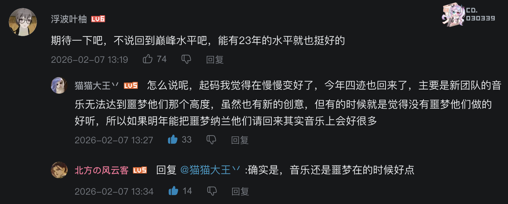

另外也锐评一下歌姬。草民五维吃得多有六成原因是真的被某家粉丝恶心到了（顺便 [2.12 ilem 的动态](https://www.bilibili.com/opus/1168356053745664023)，深以为然，一样的合成引擎给不同人用出来的根本不是一回事，而且草民日常听的那些根本不需要歌姬 IP 引流）= = 另外四成确实是因为赶上了忘川全盛时期 + Synthesizer V 当时可以称得上震撼人心的性能表现，如果有哪位朋友在 2019 年听到[《天下局》](https://www.bilibili.com/video/BV1z4411q74Y)的话应该能理解这一点，应该甚至到后面合成引擎 AI 化的时候都远远没有当时那种冲击力。可惜 Synthesizer V 和五维这两年社区运营和商业化做的都多少有点不怎么理想，忘川也不如全盛时期那么神挡杀神，所以现在偏正式一点的节目又大头都给 VSinger 了

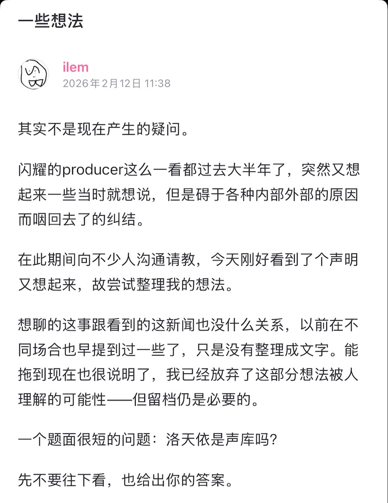

顺便看到一种说法：叔叔的年货这样选也是为了可劲儿卖收藏集。为此草民也特意统计了一下今年的商业化相关（然后顺手又买了今年的设定集，虽然不仅没地方放而且看去年的东西感觉也不是很值那个价），看起来倒是没有专门给《辟浪》准备收藏集来着

另外，过年之前忘川端上来了一个相当不错的 [BV1avFSzkEB6](https://www.bilibili.com/video/BV1avFSzkEB6)，阵容和制作都称得上神中神。虽然更偏抒情一点（所以选了星尘 Infinity，不会像赤羽那种上来就是很强的冲击力），但慢热一点后劲反而更足，可以说又弥补了今年虚拟歌手贺岁纪缺了点大活的小遗憾

⬆️记住这个数据，以及 4.6 是 245w+ 的播放量，后面要考

# 各家游戏的新年版本

春节向来是各家游戏的重点活动时间，今年甚至要同时肝三个半（HSR 4.1 内测算半个

## YYS 新年版本

SP 桃花妖太好看了，各种意义上狠狠戳中草民的审美

至于抽卡 450 也是……本来说要是终末地靠谱的话就弃坑 YYS 结果终末地也不是很靠谱，但是这一波过来也不怎么想接着肝 YYS 了

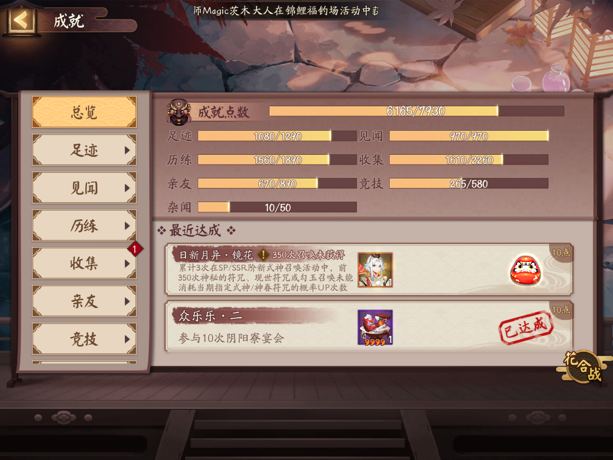

今年新年假期的对弈，前面倒是还好，最后两天强度是真的高，超级连输，最终胜场 26 / 47 只能给到一个 NPC

## 拉电线、拉水管，已经拉不动了

本来对终末地的期望真的很高，然而狠狠肝了开服版本之后实在是没动力接着玩了

* 很花时间，**每日**任务需要连续占用半个小时的注意力做大量重复无聊的事情，相比之下 HSR 差不多就一分钟，YYS 也不超过十分钟
* 抽卡资源少的可怜，卡池规则弯弯绕绕，还没有可以继承的保底让玩家愿意试试深浅，关键是草民真的很脸黑，这个实在是没招了
* 作为核心玩法的基建几乎不跟数值挂钩（一天就能凑完的装备原件、限量供应的养成材料、抠抠索索一礼拜给不了几次的刻写券
* Intro 整体做的非常糟糕，序章没一句人话，四号谷地到处通马桶，好不容易到武陵观感好了一点结果 1.0 在武陵的剧情就开了个头
  * 然后就是更离谱的 1.1 版本，几乎是明着告诉玩家「地图必须认真做出来，剧情之后再想办法糊个差不多的凑合一下得了」
    * 尤其是再加上《清波寨 Oh My Life》这抽象玩意儿，草民是真想不出来有多少人会因为真的吃这一套而去抽汤汤

也就小红帽运气好一点两个十连出了（但是她又强绑定杰哥没法用），只好备战绿色奶龙了。后面估计可能一个礼拜能上一次线就不错了

## HSR 4.0 + 乐子大会

4.0 做为大版本 Intro 比拉电线那个实在是好太多了，比 3.0 过于慢的慢热也好了很多，甚至这还是在一些懂得都懂的爆肝之后的结果

顺便早几天得到了 4.1 版本的内测机会（清明之前两周就上线了不算泄密了吧），不得不说工作量着实是大到离谱（以及奖励真的是少的可怜）。平时打个货币战争都觉得头疼的草民能坚持下来可真是不容易啊，就算有下次也不搞了

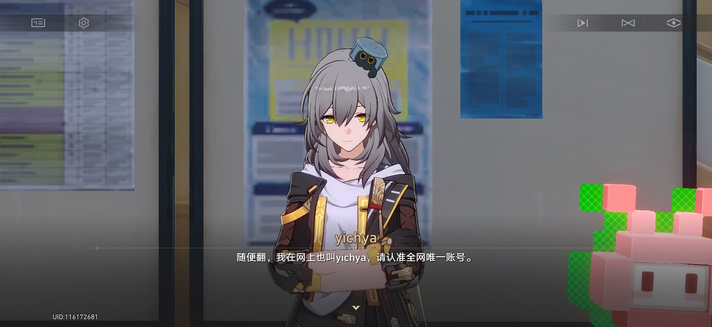

另外[乐子大会](https://www.bilibili.com/festival/honkaistarrail2026festival)比拜年纪有意思多了，还有星琼拿

# 烂尾了十年的房子 + 收拾老物件

这次回家其实最主要的事情就是看一看旁边房子的现状。说它烂尾十年可是一点不夸张，好在最终几经波折终于还是收回来了，而且有电梯、有地暖、有个朝南的阳台采光，但其它的基本只能说着实不怎么样，主要还是面积太小了，就算只有父母俩人住都显得局促。目前简单装修基本差不多了，这次回去也专门花了一下午时间接好了网线（真·拉电线），剩下的基本上就是一些家具相关的事情了，不出意外的话天热起来之前应该就能住进去。当然其实也不会怎么住了，父母另说，草民自己一年能回来十天就不错了（不过后面两三年应该尽量保证吧

家里其他的资产目前应该暂时也不动，毕竟现在住的房子大概从最高点掉下来差不多 30%，说多不多说少也不算少的样子。目前的预期是大概几个月内清空准备出租，所以这次回去的重点之一也是整理老物件。翻到了很多当年的磁带、软盘、光盘什么的，软盘不值一提了都是自己折腾的，而且现在是真的只能当手办看看了，光盘倒是说不定还能救一下，至于磁带基本都是英语听力不值一提

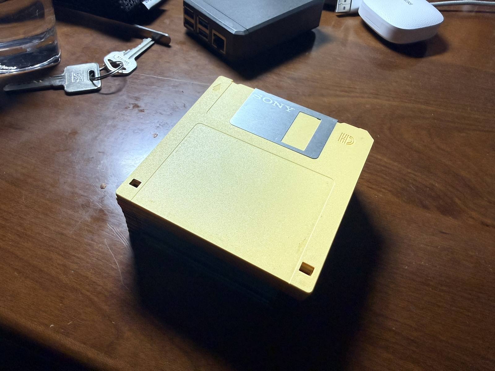

那个年代的电脑杂志内容量比现在这些自媒体真的是一个天上一个地下，一本能看好久，配套光盘也真的是能看得出是花了精力在上面的

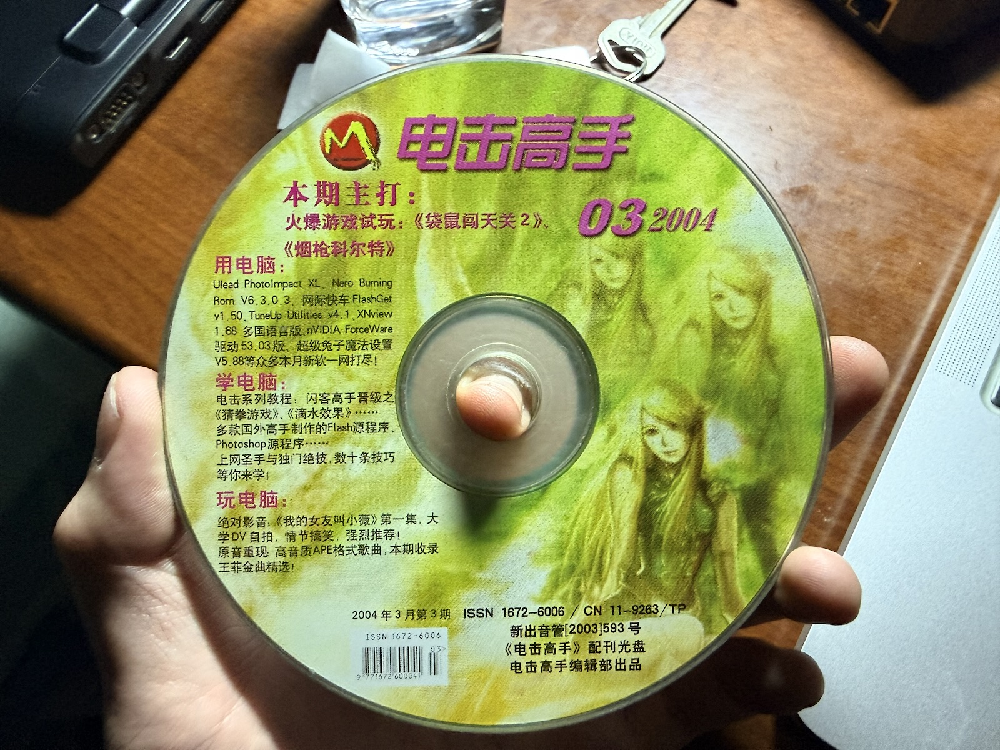

对着这些老物件，突然在想或许能用完全不功利的方式给自己过去的日子断代：

* 10 年之前折腾盗版碟、研究 PE 和 Windows Mobile，甚至偶尔听英语听力磁带助眠（这倒是让草民后面受益不少
* 11 年换了台相对现代些的电脑，高中加大学这两段时间折腾的东西多了一些，手里的各种数码小玩意儿也多起来，算是渐进式的变化
* 再往后能最直接拉起回忆的大概是 YYS 的庭院 + BGM（2017 年底「枫色秋庭」 / 2021 年底「远海航船」）
  * 无论什么时候回想起「枫色秋庭」的 BGM 都非常非常令人怀念，2017 年下半年真的算是草民人生中最快乐的一段时光了

后面也收拾好了家里最后剩下的一些暂时带不过来的宅物（主要成都这边目前实在是没地方放了），精挑细选了一小部分回来：

* 瑾 + 瑕（因为已经完全无法从组装好的状态上分离开了，所以也装不进原来的盒子，为了保证完整性只好拎过来了
* 仙萌四选一（muji 的那个塑料箱子里面费了很大力气塞进去了三个，剩一个实在是没地方放，只好也拎过来了
* 挑选了几张旧碟，没想到的是最终竟然真的还都能读出来，赶紧把几个 GBA 老游戏 ROM 复制出来了
* 今晚吃啥（[BV1LT4y1P7re](https://www.bilibili.com/festival/2021bnj?bvid=BV1LT4y1P7re)），为数不多的要划在比较新的断代里的东西，目前放在公司了
* 《榣山遗韵》4CD（这个字可真难找

剩下的一两箱东西什么时候能拿过来呢？估计最快也得是草民什么时候想通了，打算结婚生娃的时候了吧

# 叔叔的年货·正片吐槽与数据统计

除夕晚上看完，只能说上面的预期算得上相当准确。总体觉得今年跟去年比也没什么提升，甚至主线真的是近几年最烂的没有之一，纯粹是为了复刻站娘投票整的个饺子醋，极其无聊；主线的两首歌《从奇迹中诞生》《人生列车》（这个其实是结尾曲，但 PV 跟主线关联比较多，就算主线的一部分好了）倒是还说得过去，不过跟历年作品比又还是缺乏亮点

其他的音乐作品（草民最关注的部分）也只能说是远远达不到前几年噩梦在的时候那种年年有突破、有惊喜的水平（_只道当时是寻常_

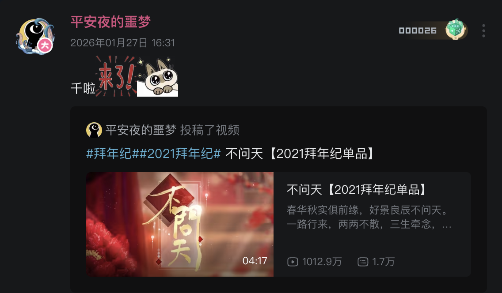

当然了，也还是有一些很不错的作品的。评选一下个人的全场最佳：

* 歌：《刹那芳华》（有 ilem 这事儿在前，必须强调一下主要是推🐰 + 1an 的作曲编曲，这俩人搭配一向很靠谱
* 其它：《路过朝我吐口再走》（反犬为什么是神.jpg

差不多 50 个小时（初二 23:30 左右）之后点了一下几首歌的播放量（下面会列出来）。咱就不说别的，上面发的忘川那首差不多 25 个小时就到 100w 了，今年年货数据最好的一首歌在 50 个小时之后也没有超过这个数，至少可以说明一点是拜年纪真拿不到多少流量资源了。想想也是，噩梦之前就说过内部员工大部分更喜欢跨晚，除夕当天晚上要跟春晚合作避免太严重的分流，初一又有自己的三次元联欢会，拜年纪这些钱少事儿多的 sb 二次元看的东西 nbcs，前置的那些预热基本也没什么意义了。至于更具体的数据，现在是清明假期，过去差不多 50 天，绝大多数单品的数据不会再有什么明显变化了。下面挑几个草民觉得最有必要评价的单品细说一下

## 关于《年年对对》

50 小时的播放量是 30w+，50 天的播放量是 62w+，个人觉得 24 - 26 这几首歌个人觉得基本上算是水平保持稳定。对比 4.6 的数据：

* 《春日游》是 81.6w，考虑到多积累了一年的播放量，应该说从阵容、歌曲质量、最终呈现的数据等方面来看，基本都差不多
* 《八珍玉食》是 188.7w，但个人倾向于认为主要原因是这首歌的阵容非常超模，仅从歌曲本身来看不至于能甩开后面两首 100w 播放
  * 而且还是在阵容如此超模的情况下跟《新春小记》（205.7w）保持一个水平，但《新春小记》的阵容当时基本还都算是新人

然后就要说这首歌最大的问题：歌词太复杂，节奏又很快。对着字幕看还能勉强理解，但是记忆几乎没可能，作为新春小曲门槛明显太高了

* 用一个简单的方式评价：不看字幕听一遍能理解 / 记住多大比例，仅就这一首歌来说，草民听了三四遍一个字都没记住
* 跟同样是 St 作词的《横竖撇点折》相比，歌词「稍微」复杂一点，节奏快了「很多」，编曲的复杂度也高出不少，使得记忆更加困难
  * 《横》的地位就不用说了，单品播放量 812.2w，🐦的翻唱都有 300w，甚至后面还被拿去跨晚炒冷饭（那玩意儿简直给人气死
    * 又忍不住怀念一下噩梦还在的时候端上来的都是什么神仙作品……那时候的年货是真的值得期待一整年的

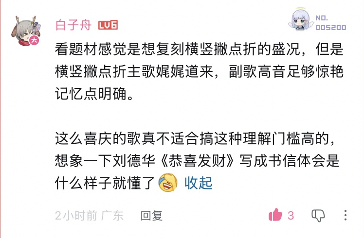

总之肯定无法超越前面三座大山（春意红包、吉祥话、新春小记），当然也不至于像四喜东家那样垫底，就跟另外两首争第四吧

## 关于《堪解人间》

50 小时的播放量是 27w+，50 天的播放量是 52w+，也算中规中矩

个人觉得一点小遗憾是初音的音色草民觉得不是那么适合这个，后面倒是有不少很不错的翻唱（推荐：[BV1CXPJzpEcT](https://www.bilibili.com/video/BV1CXPJzpEcT)、[BV18pZQBrEFS](https://www.bilibili.com/video/BV18pZQBrEFS)、[BV1zCZ6BtE1n](https://www.bilibili.com/video/BV1zCZ6BtE1n)），确实听起来比 Miku 的音色适配很多。另外一个比较难绷的点是商业化来的疑似太早了

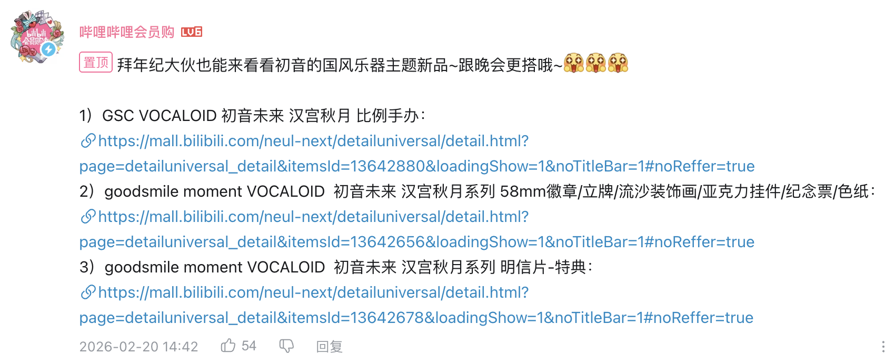

第一个造型不咋滴，价格倒是不算贵，当然草民是肯定不会买了（毕竟是真的一点地方都没有了啊

## 关于《刹那芳华》

50 小时的播放量是 48w+，50 天的播放量是 108w+；整体上看应该是除了《衔尾之歌》（疑似《鸣潮》商单，122.8w）之外数据最好的一首，甚至如果考虑🐰自己的投稿（[BV114fgBDEPv](https://www.bilibili.com/video/BV114fgBDEPv)，31.1w）分流出去的那部分的话，说不定能有机会接近甚至超过《衔尾之歌》

仅说单品的话算是相当不错，作曲编曲可以狠狠夸，词也算佳作，歌姬 + 调教算是没拖后腿吧（但也没啥亮点说是）。这首歌是占前几年《繁华唱遍》那个位置的，跟历史作品比起来肯定是没丢份儿的

实际上从数据来看也明显比《辟浪》要好，同期播放量基本都能多 20% - 30%

~~人声本家~~（兰音难唱.jpg）出来之后更是连不太吃歌姬（IP / 合成歌声）的观众都可以放心欣赏了（虽然草民个人觉得这首歌选南北组从 IP 或者合成歌声适配度上来说都没有问题，但又不得不说🐰唱的比调出来的好听太多了

## 关于《辟浪》

50 小时的播放量是 39w+，50 天的的播放量是 84w+，从它占的这个位置来看，应该可以称得上惨不忍睹

总体来说个人觉得比 24 年《大哉乾元》还略好一些，比去年的《天星问》要好很多，但还是完全够不上 22 年及之前的水平

* 题材和结构个人其实觉得跟《弈》颇有相似之处，这点比前面两年的都好很多，尤其是比起去年的《天星问》真的好太多了
  * 《天星问》后面又听了几遍：用一个貌似很燃的节奏去唱一些稀松平常的事情，就给人一种不知道在燃些什么东西的感觉……
  * 跟《天星问》比起来，前一年的《到深空更深处去》同主题就好很多很多，今年这首《辟浪》其实结构也真的挺不错的
  * 中间的川江号子着实不错，个人觉得算是整个曲子除了整体结构之外最大的亮点
* 编曲比去年《天星问》好一些，但个人还是觉得有那么一点乱，鼓点有些过于密集、过于追求复杂华丽了，结果出来效果也没有很好
  * 正面例子《弈》就不错，今年的《刹那芳华》也可以。这两首歌的鼓点都没有太过密集，也没有一些莫名其妙插进来的怪乐器
  * 《天星问》一样有鼓点太密集的问题。燃曲也不能就这么燃在表面上，尤其是在词的表现明显撑不起来的情况下
* 调教的问题最大，跟歌姬的选择合起来，草民觉得要背这首歌五六成的锅
  * 开始两句 4、5 字之间停顿和重音都很不明显，导致听起来总有一种失去同步的诡异感觉……
  * 有几句「哦哦哦」出来的效果很差，本身歌姬就不是很擅长低音还用哦哦哦这种填空，还不如让词作努力一下各填三个字在这里
  * 有的评论说 ACE 洛天依有点软，草民觉得确实是在语速非常快的时候真的觉得吐字有点不清晰（当然也有人说是调教个人风格
* 歌词也确实是太复杂、生僻字词很多，导致把理解门槛拉的过高，更不要说能记住什么东西了
  * 听了四五遍，除了「不做英雄，且当愚公」这句没什么生僻字词、并且前后结构上能照应一下的词之外，几乎找不到什么记忆点
  * 这里面最正面的一个例子要举同样是洛天依的《万古生香》，几乎只需要初中水平就足够理解，快速理解往往能递进到快速记忆

这首歌其实还算对草民胃口，但是因为歌姬选择和调教上的问题实在是大到无法忽视，结果这是从 20 年《万古生香》之后草民头一次不得不翻过头来去找翻调和翻唱。虽然还是没能找到很满意的翻调，不过听了几个五维 / ACE 言和的，其实都感觉比 ACE 洛天依舒服一点。总之真的觉得是哪怕因为一大堆原因不能选 Synthesizer V，换成 ACE 乐正绫再做一下针对性的风格优化，出来的东西也比现在这个要好很多。顺便其实对大部分翻调不够满意的原因基本都在混音差太多上，中间还忘了看的哪个喷《刹那芳华》的视频还说《辟浪》主要是混音有问题，对此草民的评价是作为完完全全的非专业人士，混音真没觉得有啥毛病，除此之外倒是哪儿都有些或大或小的问题……

另外也真的想吐槽一下 B 站的搜索，几乎搜不出来什么东西，完全是当推荐位在用了（虽然逻辑上一定程度也能成立

## 关于《踏长空》

继《夜光杯》之后又有一首非常带劲的歌。50 小时播放量是 28w+，50 天的播放量是 73w+

* 词写的很易懂的同时完全不失气势（看有的评论说不如夜光杯有故事性，草民觉得倒是问题不大），加上首尾照应，还挺容易建立印象
* 节奏没有那么快，编曲也比较收敛，跟上面提到的两首歌比起来甚至算比较慢热的
* 王朝这次唱的有点收敛，显得声音偏单薄（尤其是跟屠洪刚比较起来就非常明显
  * 不过最前面的 8 句由屠洪刚来唱就一定程度上规避了这一问题

评价是作词作曲编曲上的技巧都比上面几首歌要明显高一个 Level（比较可惜的是各种原因下来，数据肯定不会比主推的两首歌好），但是草民个人感觉没有去年《六耳》（161.3w）那样一上来就很抓耳，从最终呈现的数据来看也确实还是吃了些亏

# 很久没有认真进行的 City Walk

本来以为呆一个礼拜时间应该非常充裕，实际上事情贼多，甚至抽不出一天出门逛街，初二才终于认真出了一次门（但是初四晚上就要回成都了）。庄里这几天空气比成都好多了，大概也是因为今年烧纸放炮啥的都管的贼严。地铁上放猫和老鼠是真没想到（又看一集

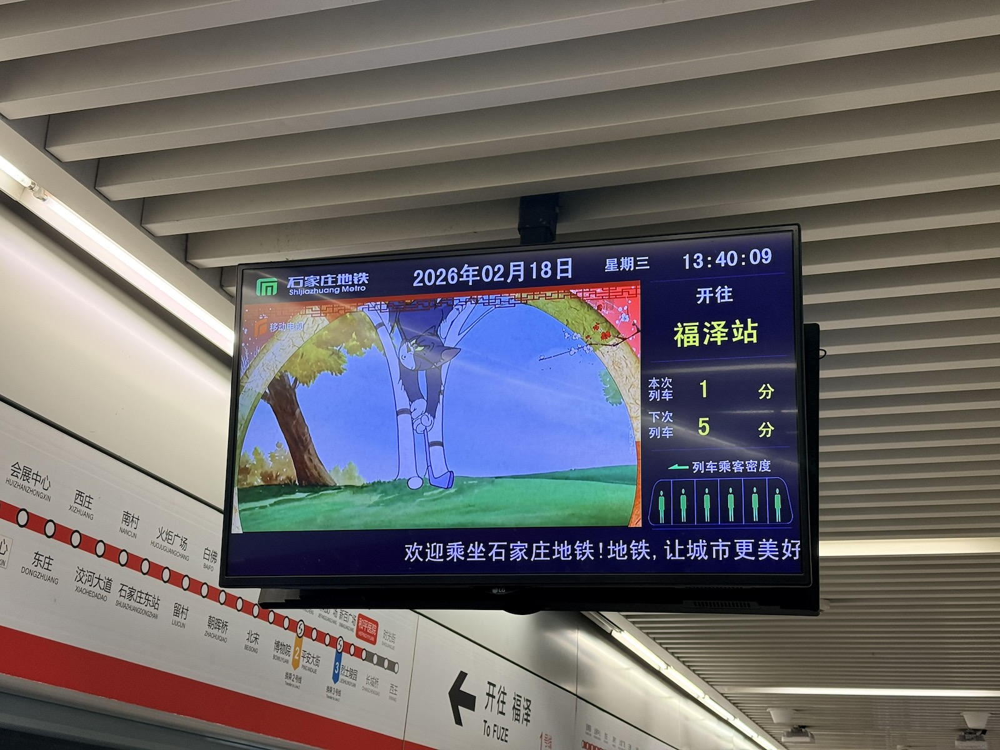

下午去正定那边什么砂之船溜达，晚上本来想着来都来了去古城看看灯会，结果好家伙那叫一个人挤人，周末全到河北是吧，赶紧溜溜球

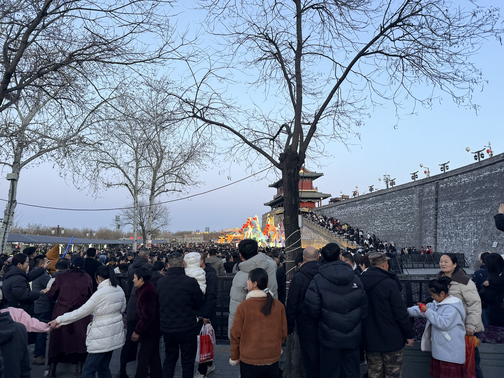

回二环里面的时间还不算太晚，遂骑车 City Ride，但不得不说大部分地方是真没啥变化

* 本地物价比成都还贵个两成，而且 tmd36524 买饮料连吸管都不给一根，简直离谱
* 本地品牌炸鸡前几天倒是早早买到了吃爽了，本地连品牌都没有的炸鸡没赶上，只好下次一定
* 几个老登商圈也是关门贼早，八点就歇了，⛄️提的万象城（这地方确实不错）和北国先天下倒是这个点还在营业

初三天气也很不错于是抓紧时间继续。去年八月回来硬是一辆小米没看见，这次终于找到了一辆 SU7 Max，好像还是 founders edition

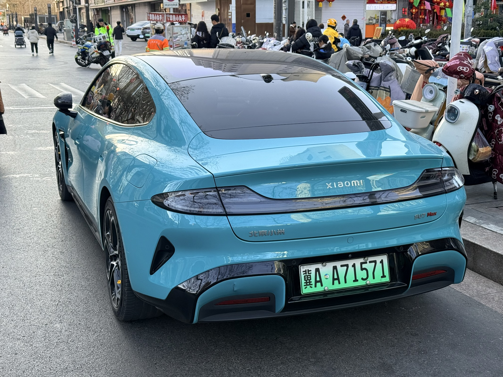

除此之外还有两三辆 YU7（不过没注意具体 SKU）以及一些其他品牌电车，凭印象（先把几乎纯跑网约车的那类品牌排除掉）：

* 理想最多，毕竟增程受气温影响小
* 小鹏也不少，P7 最多，Mona 有一些，还有智己也是
* 鸿蒙智行只能说有几个，但并不算多
* 小米和极氪真的少见，蔚来好像完全没见到过（在市中心来回转了好几圈。好像也没注意哪里有换电站

顺便也还真没注意到什么地面充电桩，只能说北方开电车，在帝都以外的地方还是比较难

# 一些基本的人情维护

初四回成都之前最后去见了多年未见的舅舅舅妈，然后收获了今年过年期间唯一一次被催婚……

顺便见到了表姐活泼可爱的女儿。怎么说呢，有时候也突然会觉得养个崽也挺好的，但是还是先把自己养明白了再说吧（

# 回成都

有了前几次的经验，这次的动卧睡的算是相当安稳。初五的成都已经相当热闹了，简单收拾调整一下，迎接新年新气象（

# End

说起来日子还挺快，下一篇是端午期间的 Gadgets (2026)，不过目前端午很有可能会是一个去上海的行程（具体去不去取决于能不能抢到黄黄上海场的票），虽然应该也不太影响那篇内容按时发出来

Gadgets (2026) 里面可能会额外补充的一些东西，不多：

* USB A - C 转换头
  * Logi Bolt Type-C 接收器直接插在 NUC 的 Type-C 口上会莫名其妙的出一大堆可修正错误，但是转接一下插 A 口就不会有问题
  * 后来发现是 ASPM 的问题，关了之后一切正常
  * 这个转接头倒是还可以给 CanoKey Canary 用，所以也不亏
* 小米双口 U 盘
  * 64G 要 129，128G 要 229……
  * 不得不复读一遍：AI 带来的生产力提升还没怎么感受到，生产工具价格倒是狠狠涨了一大波
  * 不过也是时候把钥匙环上面原来那个十多年前捡到的小 U 盘换下来了
* Cherry MX 8.0 的 ESC 键似乎手感变软了，而且就只有这一个键这样
  * 拆之前对着保修贴纠结了半天，然后草民竟然没找到是在哪个平台买的
  * 中间还搞丢了两个螺丝，于是买了一盒常用螺丝，结果发现没一个能对上，还好后来又把那两个螺丝找到了
  * 轴当然毫不意外的都是焊死的，虽然大概也可以试试不取下来的同时打开轴体，但是等它坏了再说吧，现在也没什么影响
* i160 的奇怪问题：CPU 冷却液温度竟然是和前面板 LED 灯亮度联动的 = = 
  * 跑了一小会儿 Prime95 确定散热没问题，那再抽风就临时调低亮度到 66%，66% 还不够就 33%
  * 结果 66% 还真不够，于是干脆固定到 33% 了，反正也没必要搞那么亮
  * 它的水泵转速也持续降低了，于是又买了转速计观察顶部风扇转速（这俩几乎可以肯定正相关），然而还没观察明白，后面再搞

另外照目前情况来看，之后两三年的春节假期应该都会做类似今年的行程安排，那自然也都会有类似这次这样的记录啦。
