今年端午去上海入梦 1.0 收官场。令人非常难受的是果然被大麦摆了一道，不过还好位置不算太差劲，虽然稍微靠后一点但还好在中间区域，而且听歌为主也不是特别在乎位置吧。当然这个场地跟之前成都那一场比确实差点意思（Vacation 2026.1 再细说

# Music

过去一年买了三款耳机和一个 MP3，放一起好了

## Redmi Buds 7S

去年的 [Gadgets (2025)](../gadgets-2025) 里面就提过想买，一方面还是对降噪还是有点需求（主要是想着骑车下班路上听一点鉴证内容），当然也有一些原因是去年买的那个 99 块钱的功能缺失确实有点多而且连接不太稳定。原价 199，蹲了一阵儿 169 左右入手

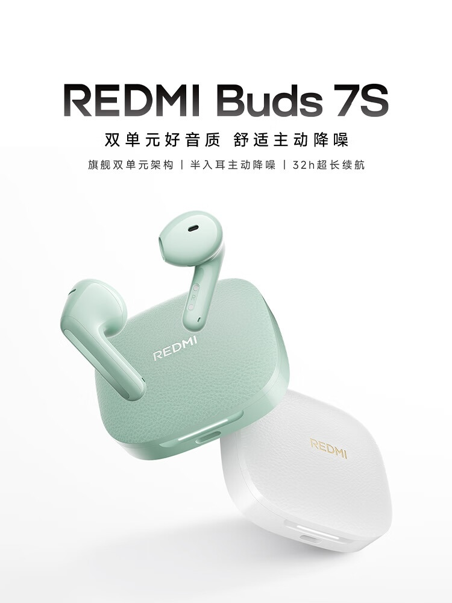

实际体验下来：

* 音量很小，就算在办公室这种并不怎么吵闹的地方也要顶在 HyperOS 默认音量限制的上限听
* 降噪拉完了，周围噪音稍微大一点的时候就会自己莫名其妙的关掉，连比如骑车、飞机、地铁之类的最常见的情况都搞不定；结合上面音量小的问题，结果就是下班路上根本什么也听不清
* 音质调的也不是很好（感觉跟 AirPods 4 那种两头翘的曲线刚好反过来），甚至应该说远远不如去年买的那个 99 块的，结果就导致光拿来听歌也几乎没法用。下面是用 HyperOS 自带的个性化听感调出来的一个曲线，也就是说需要叠一个两头翘的 EQ 才比较顺耳

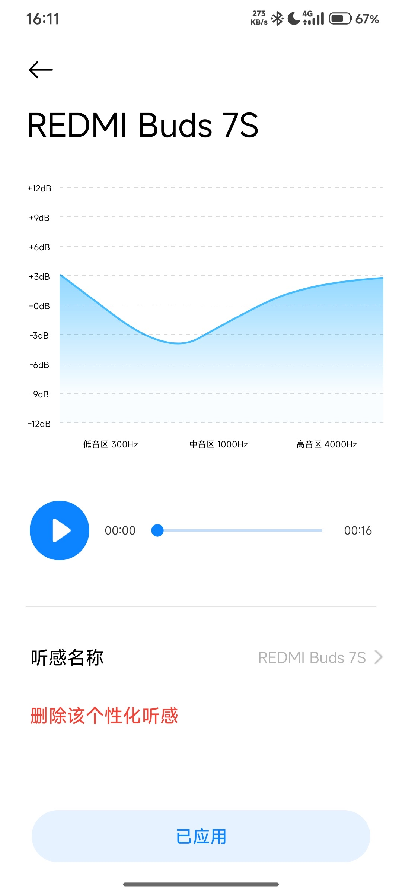

总之又是比较踩坑的一次，虽然这个价格摆在这里吧也不好说太多

## AirPods 4 ANC

不到 1100 买到。各方面都不错，也没有上面那个自动关掉降噪的问题（当然价格确实也摆在这里

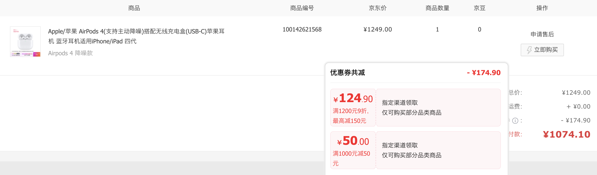

这个应该就没有什么特别需要额外介绍的了，总之就是评价为你大爷还是你大爷.jpg

## 水月雨 NiceBuds

性价比确实相当爆炸。黑白各买了一条支持一下本地企业，白的放公司，黑的放家里

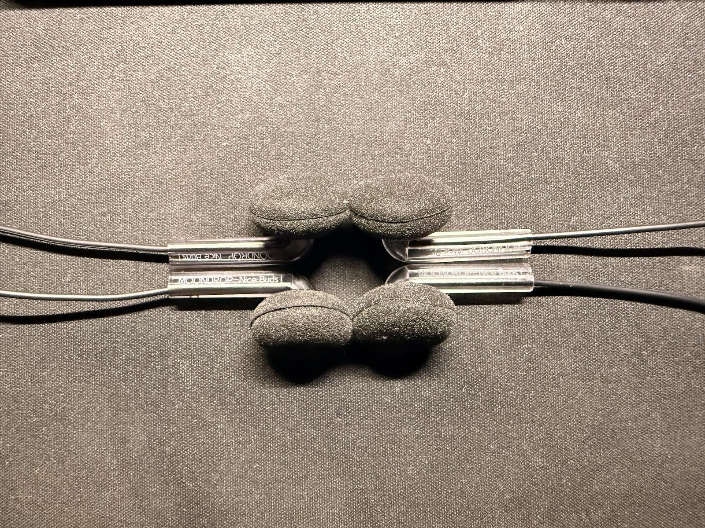

虽然 AirPods 4 听习惯了确实感觉这个有些差距

* 主要也还是觉得两头不够翘（？
* 送的海绵套儿拿下来的话低音就基本没了，装上的话高音又显得不足，一定要选一个的话还是建议留着

反正 16 块钱要什么自行车，能响就行了

## Echo Nano

之前零零散散买了好几个 MP3 都或多或少有点不满意，这次难得见到一个传统形态的新产品，于是果断入手

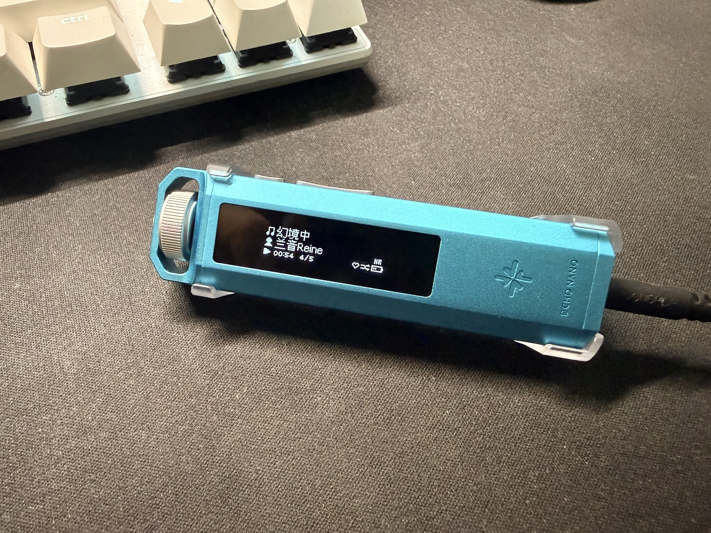

顺便做了一个一直想做的事情：用 AI 把 iPod Shuffle 里面的歌提取了一遍（[AI 真好用](https://github.com/yichya/itunesdb_parser)）。粗略用下来：

* 质感不错，比较可惜的是自带存储约等于没有，还得塞个 TF 卡，但是 TF 卡又跟很多类似设备一样会冒个尖尖出来
* 音质还行吧，虽然有很多项目可以调，什么陡降缓降啥的，但听着也没听出啥区别
* 随机播放也是一坨，后退、前进的顺序还是会乱
  * 往回退一首歌可以，多退一首就不知道跑到哪儿去了；此时切下一首也一样会完全随机
  * 甚至不知道会在哪些时候触发这个 shuffle 的操作，咱就是不知道这个东西到底难做在哪
* 更新了一次固件之后 FAT32 直接炸了，不过换成 ExFAT 之后少了很多小毛病
  * 但是又比较难绷的是内置存储如果要升级固件的话必须还得是 FAT32；固件升级倒是还挺积极的，买来一个来月推了两次

顺便还发现一个事情是之前买的 iriver 太久没用，结果电池鼓包把后盖都撑开胶了 = = 真的是超级无敌辣鸡

# Network

话说回来今年的日常 NAS 迭代记录该什么时候整呢（

## 小米 BE6500 Pro（基本实锤是缩水版）

家里小米的开关什么的比较多所以买了中枢网关，但之前跟老 NETGEAR 路由器一块儿都扔在次卧，一大堆线乱成一团；后面看见这款无线路由器自带中枢，一直很心动。刚好去年夏天爹妈回家长住，把老路由器直接寄回去，然后就跑了一趟楼下的小米之家。本来看生产日期 2025.2 应该不是缩水版，于是激情下单，店员给了一个券儿之后 549 到手；后面又发现[这里](https://www.acwifi.net/31949.html)缩水版的包装和草民买到的一样，光凭包装也不太能完全确定，但好在里面还提供了两个重量数据，于是草民一称，1.6KG……那没救了。下图来自 [acwifi](https://www.acwifi.net/27123.html)，缩水版会略有不同仅供参考

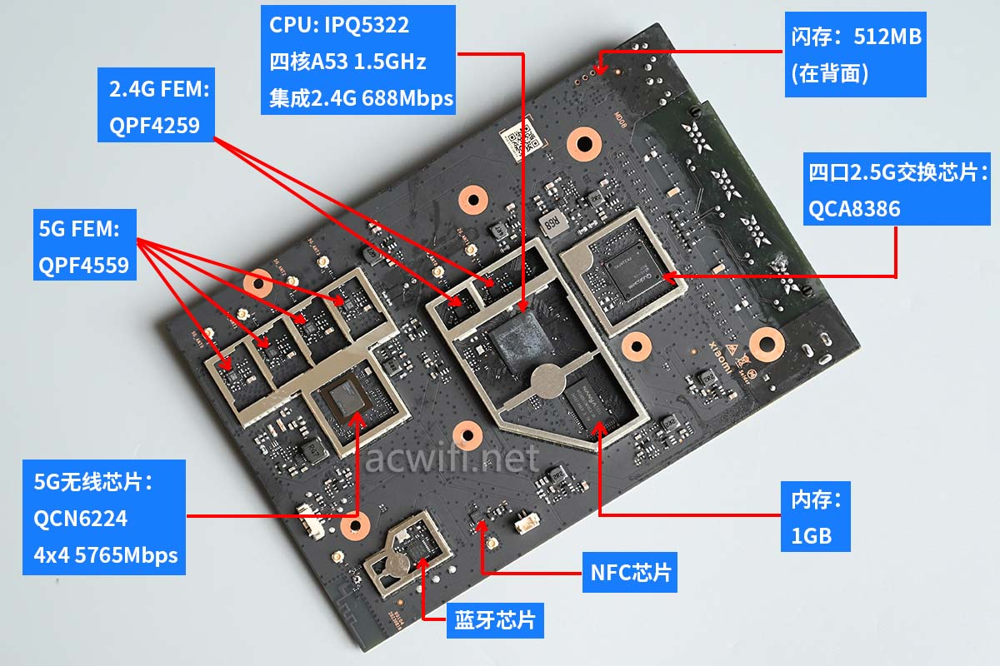

买来之后发现最大的坑：太高，刚好塞不进电视柜下面（差了大概不到 1cm），只好跟之前的 NETGEAR 一样先放在次卧

这玩意儿的 2.4GHz 确实是不怎么样（这还是缩水版据说优化了之后的结果，那没优化的得有多烂啊 = =），扔在次卧就导致其他房间的几个 2.4GHz 连接的灯经常断开连接，主卧的显示器挂灯尤其严重，颇令人头疼；5GHz 倒是没啥毛病，比之前的 NETGEAR 好不少。买了 12V 拆分线之后腾出来一个插座，就扔电视后面了，没想到效果意外的好，几个灯的连接问题轻松解决，最远的次卧吸顶灯也有 -70dB 左右，完全够用。顺便还优化了 NAS 跟 Volterra 的通信，当然这个也有点复杂，涉及到 multicast DNS 的一大堆坑，之后找时间细讲

用了差不多一年，总体感觉还是挺好的。自带中枢网关很方便，那部分也可以跟系统固件本身分开更新，功能上大致也没什么问题。至于缩水版砍了散热之类的影响，印象中刚买来的时候貌似是有过一次死机，但后面设置了每天定时重启 + 升级过一两次固件之后就没再出过什么问题，也经历了一年最热最冷的时间段，所以评价为确实没啥大毛病。至于推不推荐，按说买新不买旧，但是 BE7200 Pro 提升不大贵快一倍，BE10000 Pro 更是完全买不起；BE6500 Pro 现在倒是四百出头，但是缩水这事儿……膈应的话还是买个普通一点的搭配中枢网关吧

## 小米 BE3600 2.5G 版

小竹 140 收来发现不能刷 OpenWrt 就不想要了，遂一百块拿来留着备用。下图也是来自 [acwifi](https://www.acwifi.net/26827.html)，日子比较久了应该不太可能又是[缩水](https://www.acwifi.net/34321.html)的

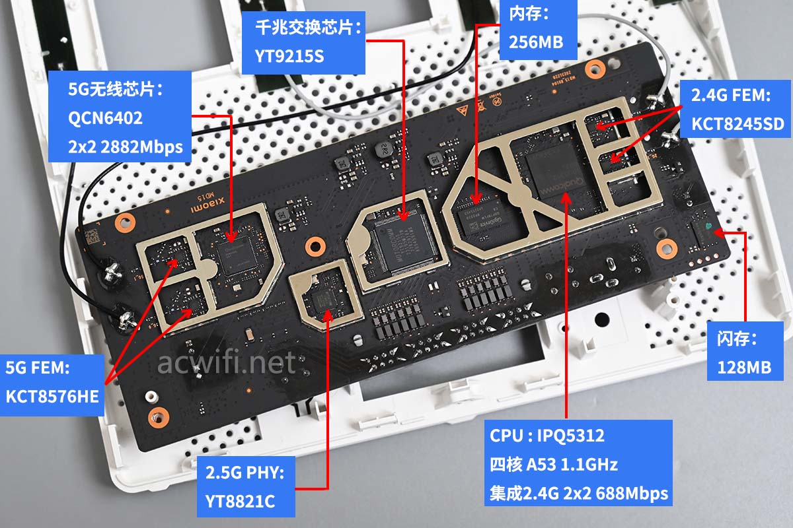

它的 2.4GHz 和 5GHz 表现都挺好的。被上面那个 2.4GHz 的问题搞的焦头烂额的时候试过把它扔在客厅当无线 Mesh 子节点，效果应该说相当不错，不过把 BE6500 Pro 从次卧挪到电视后面之后就用不到再开 Mesh 了，光扔在柜子里吃灰也有点浪费，八月拿回石家庄用刚刚好

## 12V 5.5 x 2.5 拆分线

光猫和 IPTV 机顶盒各占一个宝贵的 220V 插孔，实在是太浪费了。后面为了给 BE6500 Pro 腾一个位置出来买了这个，效果相当不错，有效释放弱电箱 / 电视柜等地方的电源插座，还能省一点电（当然开关电源效率一般都挺高的所以也省不了多少），强烈推荐。

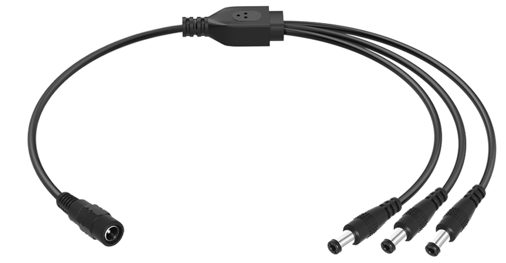

当然用它的话要关注一下线的长度以及使用的电源的功率，草民原来光猫和 IPTV 机顶盒应该都是 12V1A（或者 1.25A，具体多少忘了），这里换上的是一个老母鸡（WD 元素盘）用的 12V3A 电源，反正肯定比原来两个加起来多，目前用了差不多半年，完全没出过什么问题

## QCNCM865 无蓝牙版 + MT7927

两个比较新的卡，不过因为各种各样的问题都没用上

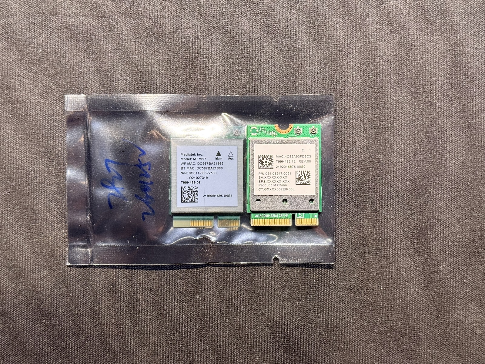

这个特殊版本的 QCNCM865 在 R86S 上完全认不出来，龙芯上倒是没问题，只能怀疑是某个供电引脚之类的定义不完全准确吧。不过在龙芯上用着似乎信号好一些，但还是一样 Ping 延迟偏高，大概会留到后面把 R86S 换掉的时候用上（然后内存价格就起飞了，根本换不起

MT7927 暂时没驱动 & 据说固件的 AP 模式效果很烂。买来 160 块算正常价格，先扔着吧，什么时候驱动好了再拆开包装试试

# Groceries

除了下面提到的还有 Switch Lite 和 iPhone SE 的电池，都还行，但确实也没什么可晒单的

顺便 iPhone 16 Pro Max 的电池健康终于掉了三个点，照这个速度感觉说不定能等到 iPhone 20 再换了（

## Logi Bolt Type-C 接收器

强迫症解决方案 +1，可以腾出背后的一个 A 口接耳机的发射器。确实很好用，而且感觉比之前 Type-A 的稳定性也好一些

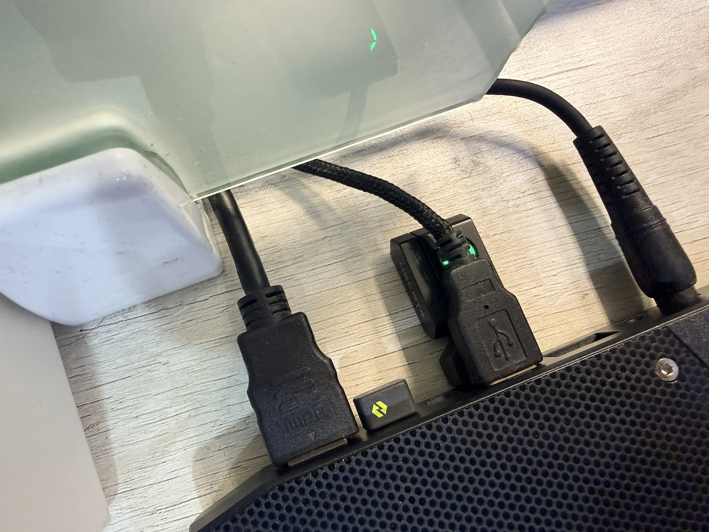

另外 MX Master 3S 的主滚轮有点不顺畅了，拆开清理发现轮子下卡了一大团 = = 然后满血复活，这个鼠标还是挺易于维修的就是得自己买一套脚贴；以及如果手很容易出油的话，最好每年换一套防滑贴

## 偏振镜

有用，不多，[Vacation 2025.2](../vacation-2025-2) 里面提过没 Diff 成，下次一定。图也懒得发了，基本上都没啥区别

## 四姑娘山捡到的红点

据说是装在相机上用来打鸟的时候快速构图的，有点意思

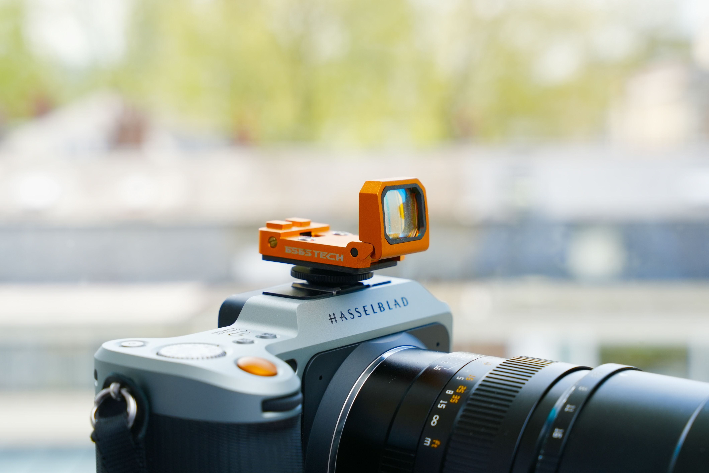

实际捡到的是个黑色的，上图来自官方 [BV1QS411A7Yw](https://www.bilibili.com/video/BV1QS411A7Yw)

## MAMEN 的补光灯

趁双十一入手的。本来想找个眼熟一点的牌子，结果看来看去最终还是选了这个，不过东西没啥毛病挺好用的

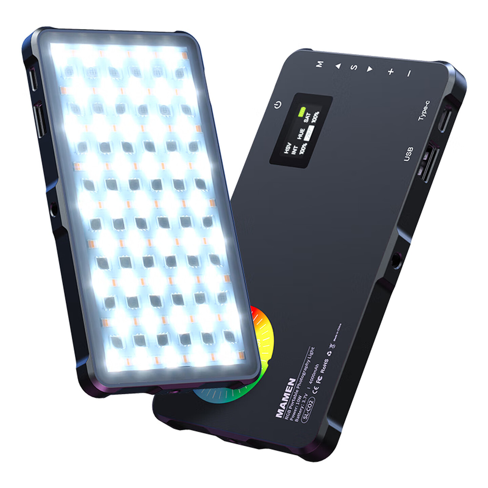

当然了买它主要还是为了拍塑料小人，应该说确实观感好很多

这个「忘归人·加多宝版」猛一看差不多跟之前买的符玄差不多一样大了（实际上都不是一个比例的手办

## 小米体脂秤

一步到位的八电极版（不知道为什么手柄上要放四个）

折腾一年 BMI 降了一点但还是不太够，体检也是毫不意外的中度脂肪肝，害

## 翰林阅 Free2 高矮轴两个版本

起初是为了把七月份买的两个🐰键帽用上，以及清理一下🐶东豆子买的矮轴版

* 自带的矮青轴很烂，电路导通竟然在手上感受到段落感之前，这得是有多大病才能设计出这种轴出来
* 买了两个不同品牌的矮青轴，结果发现竟然完全不通用，甚至这两个跟自带的那个也都不通用
  * 一个引脚位置都对不上，跟正常高度的轴体的引脚位置也不一样……咱就说这玩意儿自立门户的意义是什么
  * 另一个被下面的 LED 挤开了一点，但至少触发的位置没什么毛病

总之现在就完全是当作解压玩具按着玩儿罢了，根本不会真的用来翻页

|  |  |
| - | - |
| 矮轴版 | 高轴版 |

至于为什么又买了个高轴版？核心原因当然是上面吐槽的轴太烂还不能换，更直接的原因则是前几天一不小心掉地上直接把超声波焊接的后盖砸开了，虽然也还能用但是有一个 RGB 灯挂了（说的就好像真的会用一样

高轴版确实按起来爽多了，但是比较难绷的是官方把反转固件撤了（虽然上面也说了根本不会真的用来翻页）；另外也买了几个半高轴试了试，但是半高轴还需要专门的键帽，把🐰这个装上去的话会卡在轴边上，而且也没有普通轴的触底感，总体来说不如普通轴按起来舒服

## USB A - C 转换头

上面那个 Logi Bolt Type-C 接收器直接插在 NUC 的 Type-C 口上，会在事件查看器里面莫名其妙的看见一大堆可修正错误，然后有的时候修正着修正着就修不正了，鼠标就没反应了。用耳机的转接头转一下插在 A 口上就不会有问题，所以买了个这个顶上

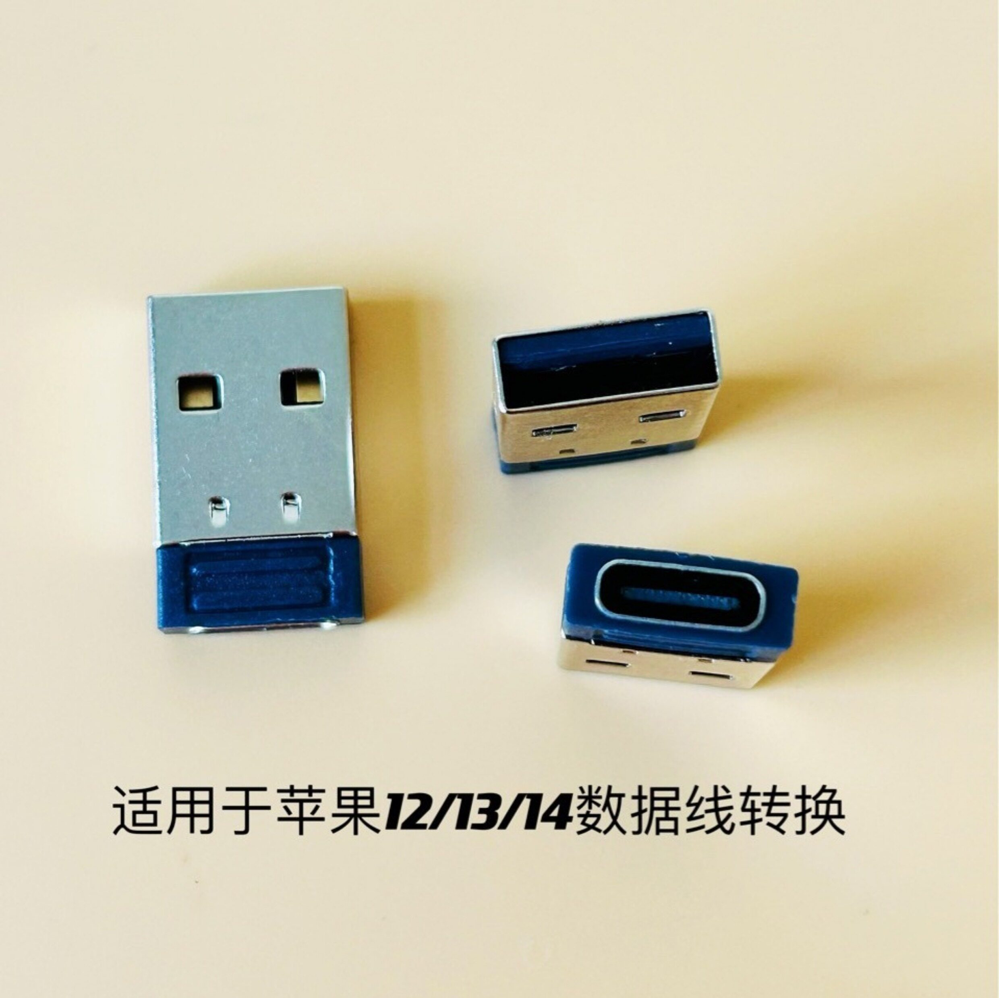

后来发现是 [ASPM](https://en.wikipedia.org/wiki/Active_State_Power_Management) 的问题。Skull Canyon 的 Type-C 接口是雷电 3，被 PCI-E 相关的东西管着倒是也很合理（包括 UEFI 里面需要设置启动时初始化 ThunderBolt 3 控制器相关的两个选项，才能在 UEFI 设置里面用鼠标），关了之后一切恢复了正常。感觉 ASPM 这玩意儿好像除了捣乱之外啥用也没有，要么断联要么降速的。这个转接头倒是还可以给 CanoKey Canary 用，所以也不亏

## 小米双口 U 盘

就如 [Vacation at Home 2026](../vacation-at-home-2026) 说的那样，过年回家买的。64G 要 129，128G 要 229……不得不复读一遍：AI 带来的生产力提升还没怎么感受到，生产工具价格倒是狠狠涨了一大波。不过也是时候把钥匙环上面原来那个十多年前捡到的小 U 盘换下来了

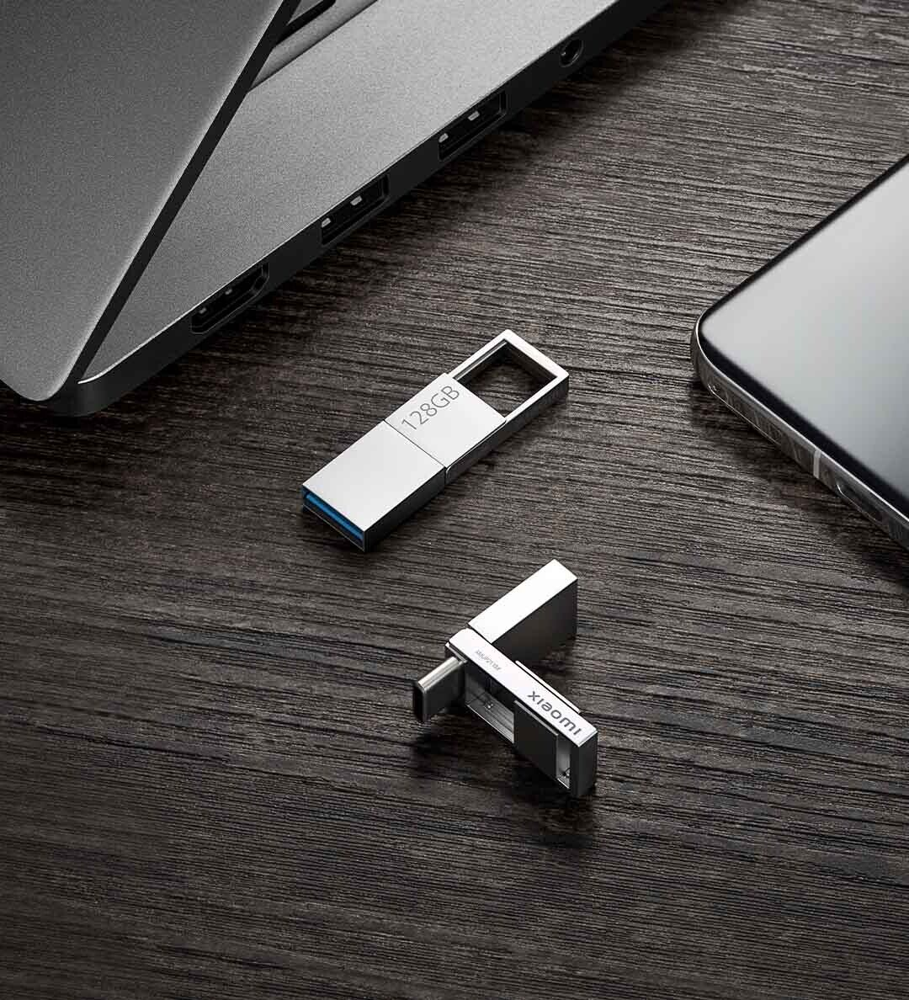

这个 U 盘用的方案好像还挺靠谱的 [BV1HkD6BCEKS](https://www.bilibili.com/video/BV1HkD6BCEKS)，实际用起来 AC 两个口确实也挺方便

## 通用螺丝

Cherry MX 8.0 的 ESC 键似乎手感变软了，而且就只有这一个键这样。拆之前对着保修贴纠结了半天，然后草民竟然没找到是在哪个平台买的，中间还搞丢了两个螺丝，于是挑了半天买了一盒常用螺丝，结果发现没一个能对上，笑死

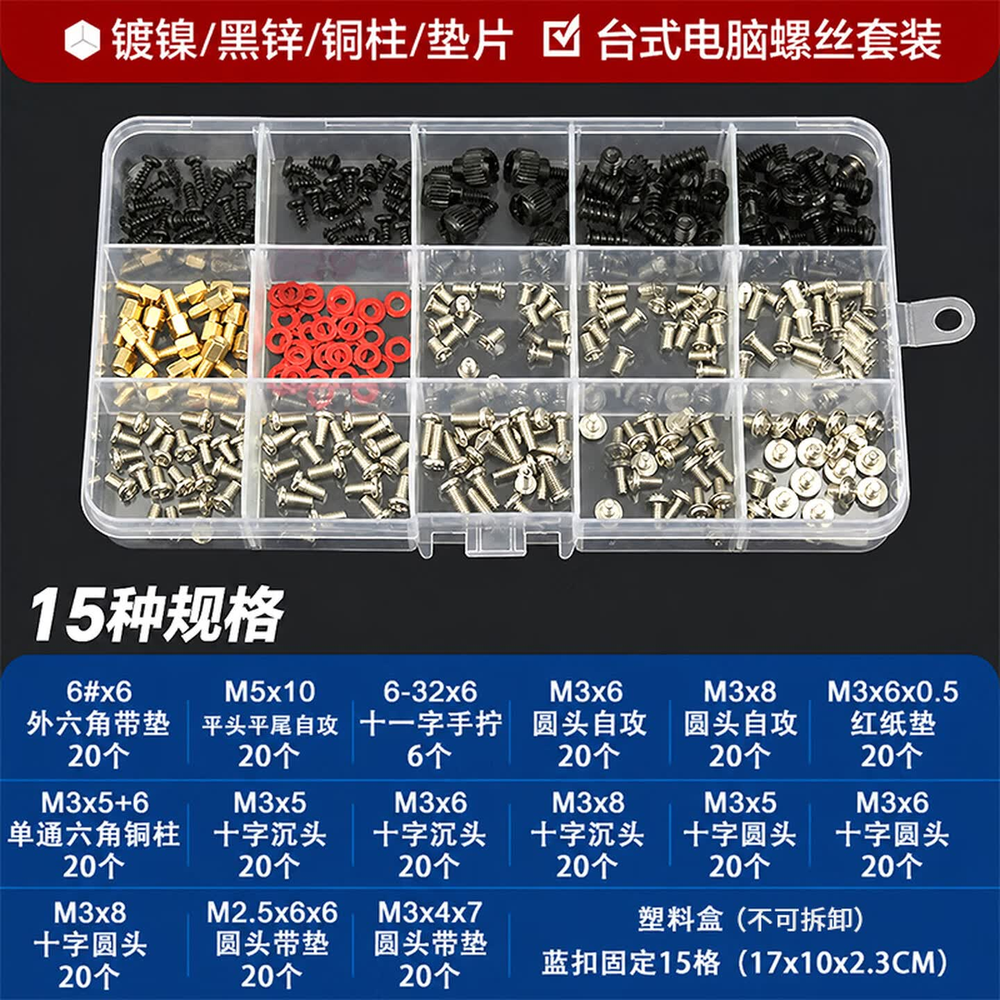

还好后来又把那两个螺丝找到了。轴当然毫不意外的都是焊死的，虽然大概也可以试试不取下来的同时打开轴体，但是等它坏了再说吧

## 转速计

i160 的水冷系统工作不正常有些日子了，体现为 iCUE 上显示的 CPU 那一侧水冷液的温度会在一瞬间从三四十度窜到六十多度，但与此同时 CPU 温度并没有什么变化，还是维持在大概四五十度的状态；这个状态有时候持续可能几十秒，有时候可能连着半个多小时都不恢复

它回报的水泵转速也持续降低了，于是想确认一下是真的转速降低了还是回报的数据有问题，为此又买了转速计观察顶部风扇转速（这俩从观察的结果来看，几乎可以肯定正相关

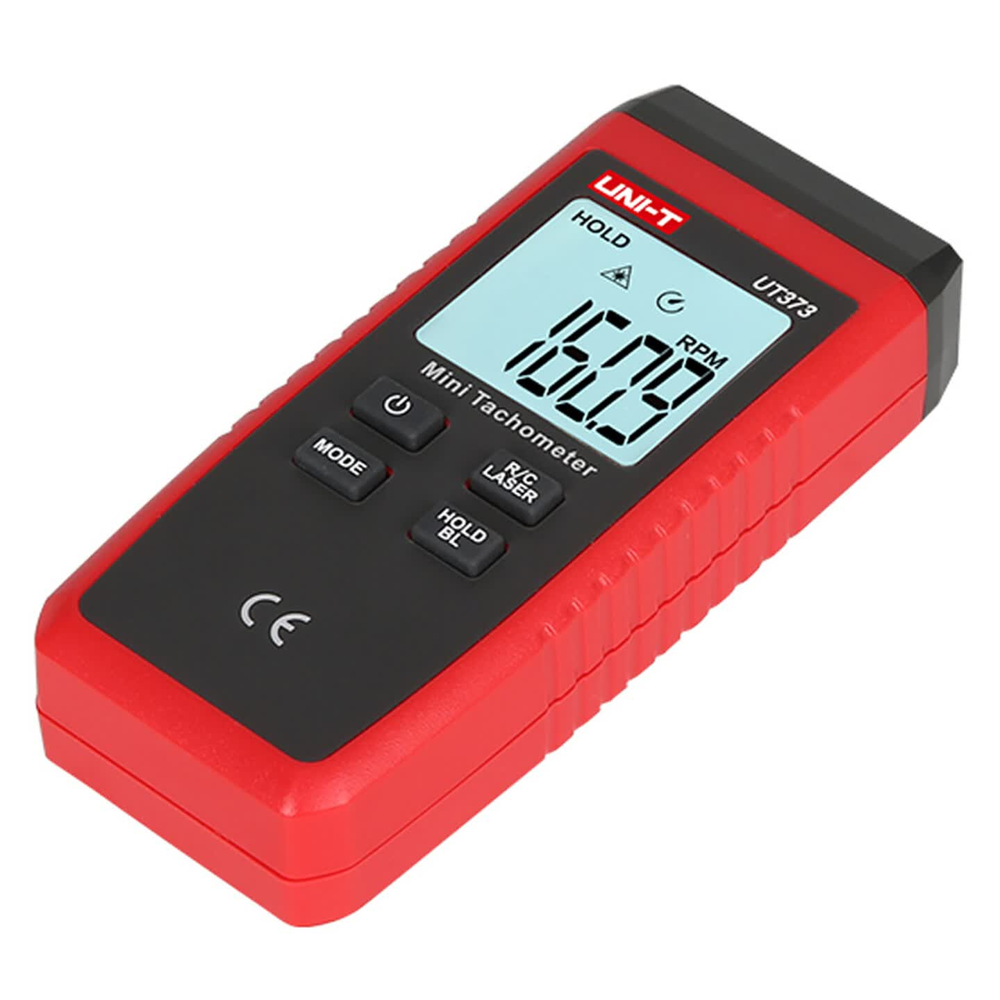

但是这玩意儿最终也没用上

* iCUE 回报的转速比转速计测出来的快差不多 5%，还不太稳定，根本就没法用来参考
* 现在那套水冷系统也很难弄回到比较正常的状态上了，虽然从 CPU 的监测来看，用起来倒是还没啥问题

不过有一个很奇怪的发现是 CPU 冷却液温度竟然是和前面板 LED 灯亮度联动的 = = 跑了一小会儿 Prime95 确定散热没问题，那再抽风就临时调低亮度到 66%，后来发现 66% 也不一定行就干脆固定到 33% 了，反正也没必要搞那么亮

所以这个只能留着以后再折腾了。现在硬件价格也是高位中的高位，近期也不太会考虑换平台（AI 还是坑啊

## Anker Pencil

又是小竹换下来的，但是实话说草民也用不上（好像绝大多数人买 iPad 的笔都会吃灰吧

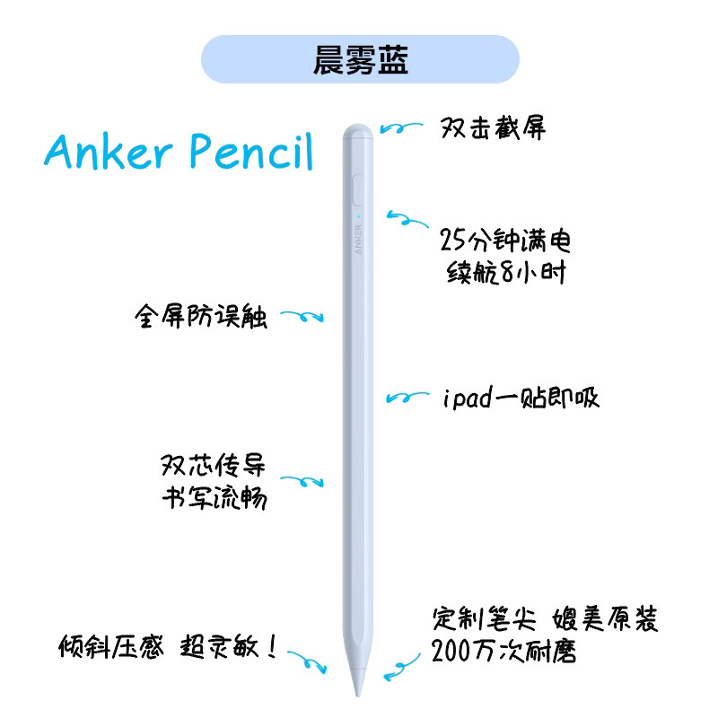

随便从某宝某店找了一张图。以及要说明的一点是这个笔并没有压力感应，只有倾斜感应

## Pocket Term 35

之前买的 uConsole 是在 Compute Module 的基础上做扩展，直接放原版树莓派进去的这个形态的产品等了这么久才出来一个，而且价格还相当贵，算上之前买来就一直吃灰的 Pi 4 和 TF 卡的价格能上千了（AI 全责

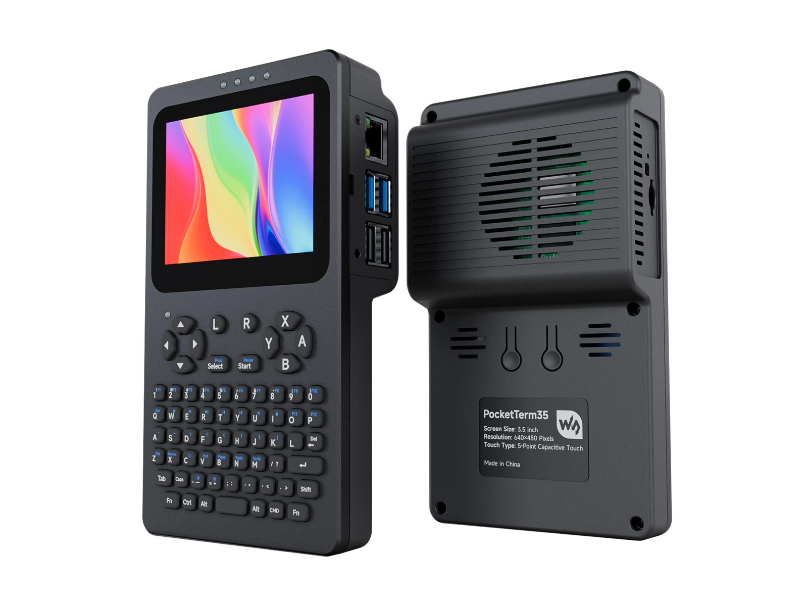

发货也贼慢，四月底下单等到五月下旬才收到，不过感觉确实还不错，吃灰的 Pi 4 可以拿出来再发挥点作用了。简单体验：

* 适配比 uConsole 靠谱多了，不需要魔改内核，只需要在原版系统的基础上叠几个 Device Tree 的 Overlay 配置一下
  * 它的硬件设计就很好，屏幕走 HDMI，键盘走 Type-C 接口的 USB Host，触摸屏是从 Pi 主板反面用顶针怼上去的
  * Overlay 只需要配置两个，一个是官方系统自带的 Type-C USB Host，另一个是这个产品提供的 I2C 触摸屏
  * 也试了一下非官方的 Ubuntu Server + MATE，键盘正常，触摸屏出不来。其实触摸屏也走 USB 的话会更好
* 键盘一般般，灵敏还算灵敏，但是按键手感不咋样，而且没有背光，默认布局也是一坨
  * 这个键盘是 CircuitPython 实现的（硬件方案不太清楚），布局完全是用 MicroPython 定义的，确实也可以自己魔改
* 官方系统对触摸屏的适配一般，Wayland 下面的 Chromium 不能滚动，戳屏幕偶尔会进入只能移动指针不能触发点击的情况
  * 然后这个键盘的 L R A B X Y 这几个键在默认布局下又真的只是用来输入这几个字母的，纯粹为 RetroPie 设计的
  * 感觉这一点上 uConsole 选择的轨迹球方案确实比触摸屏方案要好一些，小尺寸适配和兼容性都更靠谱
* Pi 的功耗和发热对于一个移动设备来说确实还是太高，而且几乎没有什么电源管理的能力，就算 5000 mAh 的电池也顶不住多久
  * uConsole 的功耗也好不到哪里去，但是电池选择了 18650 的标准方案，比这款的软包电池确实也要靠谱一些
* 从扩展的角度来讲 uConsole 给了 4G 模块，这款如果是用 Pi 4 的话没有什么靠谱方案，Pi 5 还可以从 PCI-E 上想想办法
  * 对于移动设备来说其实还挺有意义的，能把这个问题解决的话基本可以说除了功耗之外会是个相当不错的移动终端

总之用下来的评价是如果手里有吃灰的 Pi 4 / 5 想利用一下的话买一个玩玩也行，但是现在 Pi 的价格贵上天，专门买一套不值

# End

虽然发出来已经是夏至了，但是也在端午假期，所以还是送大家一首《山鬼》吧（以及一个多月之后又要去见🐰了真不错啊

<iframe src="//player.bilibili.com/player.html?isOutside=true&aid=684707134&bvid=BV1jU4y117YR&cid=738603432&p=1" scrolling="no" border="0" frameborder="no" framespacing="0" allowfullscreen="true" height="600px" width="100%"></iframe>
