理论上来说这个系列上半年的部分应该是跟端午节岔开，比如今年端午在六月的话这个应该放在五月发出来的。但是去年十二月和今年一月都没折腾啥，二月回家过年的部分又写在 [Vacation at Home 2026](../vacation-at-home-2026) 里面了，所以还是只好把六月的两个活放进去，然后排在七月上旬发（

# 3.14 桃花故里

正常应该是安排在春分所在周的周末，但今年气候偏暖，花期明显提前了许多。翻了几天小🍠，决定早一个礼拜过去。地铁二号线截断一截确实带来了比较明显的影响，从行政学院下来还得坐将近一个小时的公交车到「音乐广场临时站」，再换另一路公交车花半个多小时上山

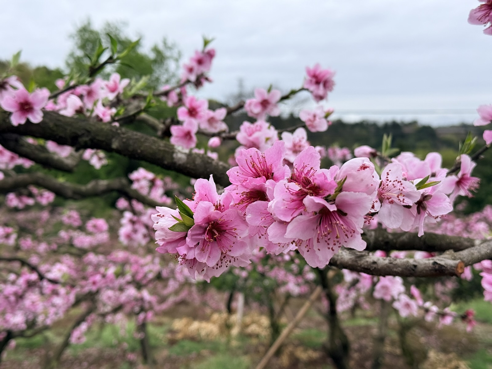

今年的桃花节相关活动似乎还是跟以前一样安排在了春分那一周，叠加前面说的交通相关的影响，山上人并不多，突出一个轻松惬意。当然活动相关的一些展板之类的倒是已经摆出来了，今年的合作方是个搞 VR / AR（这玩意儿真的还有什么炒下去的意义嘛）+ AI 的，宣传物料也毫不意外充满了 AIGC 的味道。至于广场上的布置则是村糖会，虽然也没太搞懂这个概念，但至少比去年那个兜售字画的团伙靠谱多了（

| 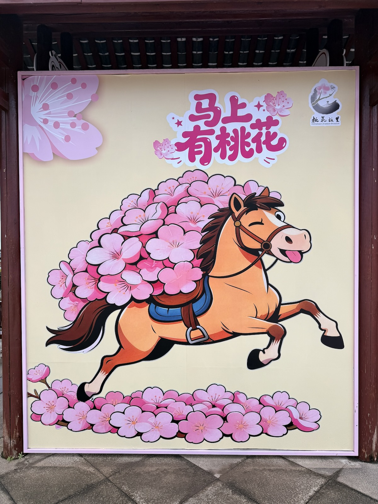 | 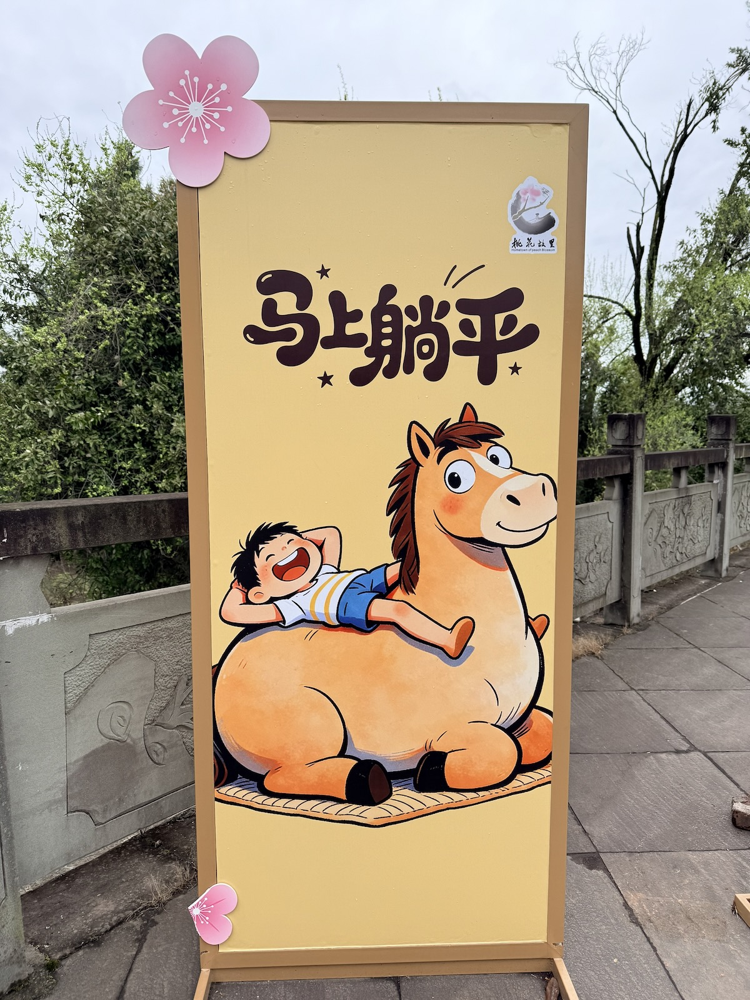 |
| - | - |
| 就算不需要这个 | 肯定也需要这个 |

至于去年规划中的洛带古镇，害，还是明年再说吧，也可以考虑跟今年一样利用上春分前后的两个周末（

# 3.21 一天速通淡季九寨沟

去年有立过 Flag「桃花雪花二选一」，但雪花确实还是有些可遇不可求了。同样是翻小🍠发现那边山桃刚好到日子，那今年的春分就留给这个 Flag 吧，顺便也赶在淡季的尾巴验证一下一天速通这件事的可行性（旺季就不要想了，去原始森林的话时间包不够，但不去又着实血亏

这次应该说是很幸运的一次，天气非常给面子，就是晕车晕了个狠的。时间线大致如下：

* 草民选择早上 6:45 的高铁过去，到那边 8:30，8:45 大巴开车，10:45 左右下来
* 11:00 刚好进门坐上车。然后又被分到右线（总共就去了四次，每一次都是右线就离谱
* 淡季的箭竹海、熊猫海个人估计没啥看头所以砍掉了，如果能在前面压缩出来半个小时的话或许也可以不砍掉这部分
* 11:30 到五花海，左边那一圈肯定是要绕的不解释，然后就是基本也没怎么停，半个小时转完
* 12:00 到金铃海（还是找不到牌子），12:10 到珍珠滩瀑布，镜海直接跳过然后 12:30 到左线乘车点
* 12:50 左右下车，因为天气太好 + 确实有点累了就多停留了一会儿，13:45 到五彩池，13:55 坐上回中心的车
* 14:20 到诺日朗瀑布，14：45 到老虎海山桃打卡点，然后就是一路走到盆景滩坐车了，刚好 16:00 左右
* 这次时间相对早于是回去的车还会从扎如寺过（虽然藏传佛教草民是真没兴趣），16:30 刚好出大门口
* 回去的大巴选择了 17:30 左右到松潘站的。在车站旁边吃了个 KFC 补充能量，然后 17:38 开车，19:45 左右到
* 草民把车票改签到 20:40 那趟，22:20 到成都东站，然后从从容容坐地铁回了家

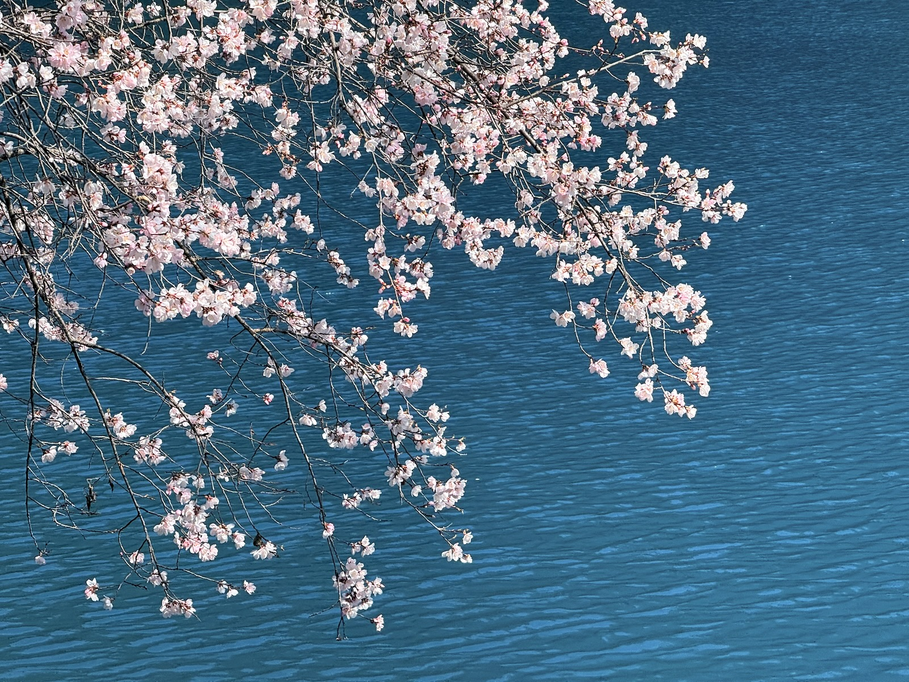

基于这次实践考虑可以优化的点：

* 早上的时间还有一部分可以压缩，比如坐更早的高铁或者拼出租车，乐观一点的话或许能节省接近半个小时
* 淡季箭竹海从上次的经验来看没啥意义，就算不砍掉也不建议走里面那个更长的栈道，算上箭竹海瀑布和熊猫海，这一块至少得按一小时左右来估算；如果十点半左右能进大门的话就也可以不砍掉这部分，十一点还没进去的话就要谨慎了
* 五花海还是无论如何都建议走完外圈；金铃海不去的话估计能省不到十分钟，个人的评价是都行，看等车的人多不多吧
* 珍珠滩 + 瀑布也是一定要看完，镜海确实跳过比较好（虽然也一样估计最多省个十分钟，区别不大）
* 然后就是速通基本不要考虑在诺日朗中心吃午饭，真没时间，自己带点面包之类比较好
* 左线长海和五彩池没什么操作空间，避免浪费时间就行了
* 最后是中线。如果把上面这些全按照比较激进的方式搞定，从左线下来应该是不晚于下午三点的，然后要以五点半之前出去作为目标来考虑中线怎么操作，主要是要不要走完芦苇海那一段（如果天气比较差比如有雨雪的话要留更多时间
* 事实上中线两个半小时依然会比较紧，如果跟草民一样想大部分都走下来的话，可能两个大隐藏最多就只能挑一个了
* 五点半出大门的话可以赶上六点出头的那一趟车，建议还是先买最晚（21:37 - 23:12）的车，到车站附近再视情况改签车票

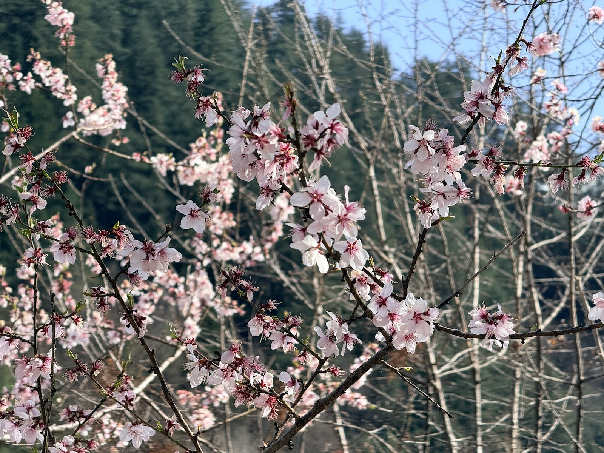

总之结论是：淡季一天速通完全可行，甚至可以不需要做什么取舍，只是时间表非常紧，几乎不会有多少休息的机会。下次再去那边无论如何都要选下雪的日子了，之后时间会比较灵活，考虑在那边多住几天都可以

# 4.11 「粼粼」广州场

过去小半年有那么两个不太好评价的事情（细节就不说了，闹的还挺大的，不难查到）。草民属于是很支持商业化的那种，毕竟这年头还在认真做古风的那些人能活下来就很不错了，总不能还跟十几年前那样天天用爱发电吧。后面这场线下相关的安排出来的时候草民还在想「有前面那两个事情的话，这次抢票说不定会容易一些」，事实上确实容易了一些（不过可能更多是因为选平台的一些神奇规则），但没想到机缘巧合，实际开出来居然是真·第一排，而且还很靠中间。本来贼高兴，但是当天还要同时抢黄黄上海场的票，而且开票时间还是 18 点和 19 点，只能在场地抢票了。结果可想而知，被大麦狠狠摆了一道，两天的 880 都没抢到只买到一张回流 680，还是一定程度上影响了心情

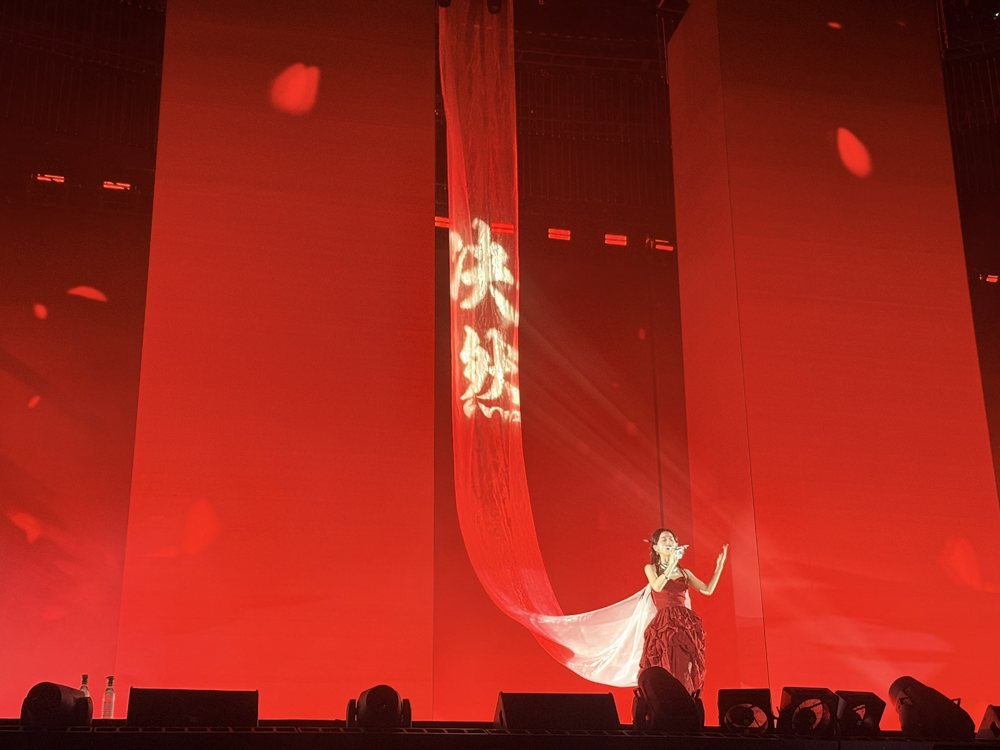

到了现场坐下之后发现其实视角也并不算特别好，要一直抬着头，而且经常被前面走来走去的摄影师挡住。但舞台效果着实相当不错，看的还是很爽的。相比起来音响就差点意思了，乐器的声音被人声狠狠压下去，除了动次打次很强之外其他细节几乎全没了

这次的歌单确实是让草民极其满意，《千秋令》《无题雪》还有最惊喜的《枕万梦》，加上跟司南一起的《天和山雨雪》（最近意外的火

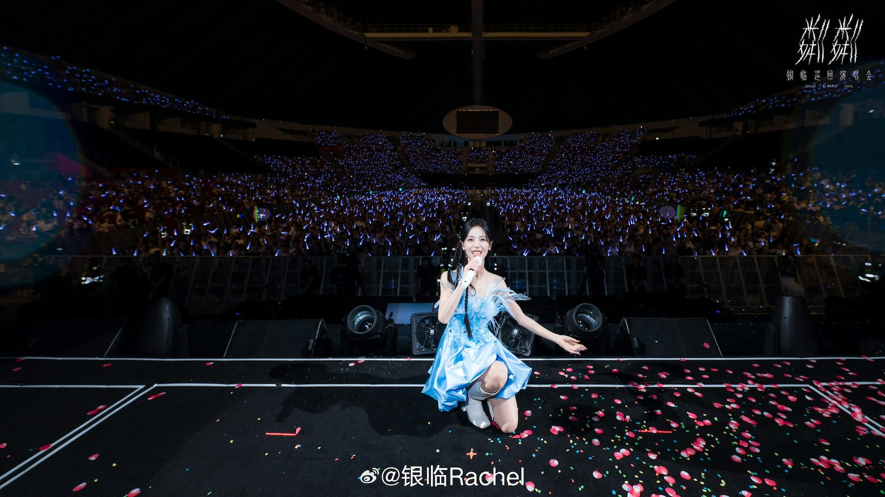

因为歌单加成太强，总体来说也还算是比较满意的一次线下（当然如果黄黄的票顺利的话就更好了）。下一场赶快端上来吧，很急（

# 5.2 都江堰的一个拼盘

草民一向不喜拼盘，而且那几天中了流感着实很难受，假期还有个出差的安排，安排起来贼折腾。但是回过头一想，毕竟难得在家门口一次（其实都江堰也挺远的了），而且 2 号有竹桑在（甚至她的微博说要唱 8 首歌），看了一下去年买到的《竹梦令》，想了想决定还是去一趟吧。起初觉得下午四五点怎么也差不多了，就随便选了两点到六点回的车次。结果节前三天主办才公布具体的时间，一看竹桑排到晚上八点半才结束，那会儿再回去翻返程车票早没了，折腾了半天也只能勉强获得一张九点多一点开车的票，然后在高铁站发现群友们已经在组织合照了，哭死。其实来之前甚至做了「干脆考虑一下定个酒店」的设想，但第二天要赶飞机，实在是安排不过来，只得作罢，遗憾退场

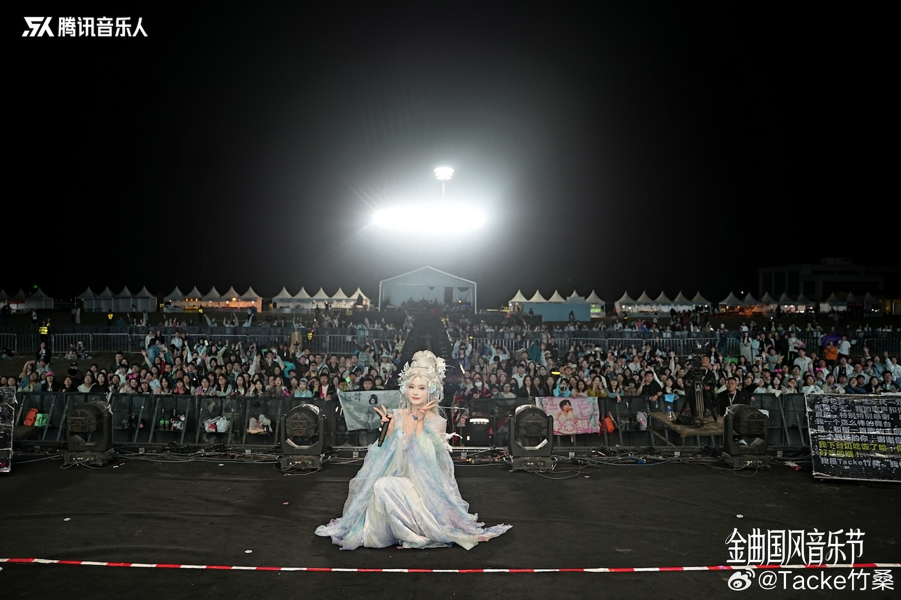

至于当天的演出本身，去的时候是下午四点多，刚好赶上[少年霜](https://space.bilibili.com/655181/)的时间，虽然听过的歌不多但还是有些印象的。然后竹桑上来之前还有一个做民乐的团队叫[「宫羽令」](https://www.xiaohongshu.com/user/profile/557160b933f60c44ee21b5e4)（好像只有主理人🍠上的号相对活跃一点），整的还不错。至于场地，应该说音响效果挺好的，舞台也还行，可观众呆的地方就很难顶了，就是一片土地稍微平一下拉一点预制草皮过来，前一天还刚下了雨，真·一步一个脚印，一脚一个不吱声……

结合上面说的很难顶的时间安排，果然拼盘还是得谨慎啊。但是竹桑今年应该没有时间再参与线下了，算了来日方长，留个念想也好

# 5.17 「混入人类计划」成都场

时隔一年半故地重游。这次的舞台布置的真的很有意思，右边还有时尚小辣鸡展览（这次官方还专门组织了小辣鸡摊儿，但因为天太热等等一系列原因，草民去的时候已经比较晚了，印象最深的是一哥们拿了一叠翁法罗斯的海报发，笑死

另外有个插曲：入场抢号的时候秀动卡了半天没出来，一分钟不到后面再点进去已经 400 多号了（说起来上次也是四百多），着实没想到这么多人，当然这个位置倒是挺适合草民这种社恐人士的。签售的号倒是轻而易举抢到了个位数，所以说秀动对草民还真不错的

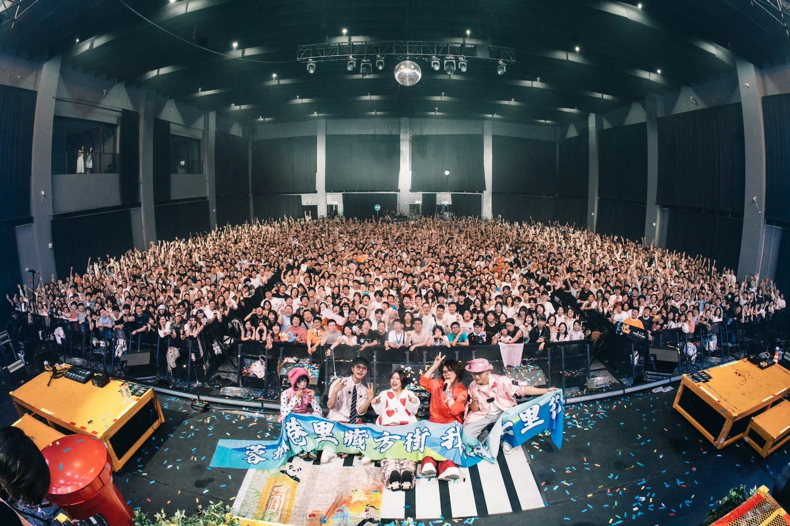

最后签名 +2（但因为太多了也没必要晒了说是

# 6.19 「入梦」1.0 上海场

去年去了成都场的 0.0，真的是惊为天人。1.0 等了很久也没等到比较近的场次，本来五一有两场在北京，但因为暑假要安排去看🐰的关系不是很想跑两趟，加上上海是 1.0 收官场所以还是决定去这场。然后紧接着就是上面说的抢票惨败的事情了，还好进去之后发现最终的位置其实也还行，虽然靠后但视角还是很正的。另外这次这个场地非常巧，端午三天假，两天入梦一天混入人类，可惜草民只排了第一天的时间

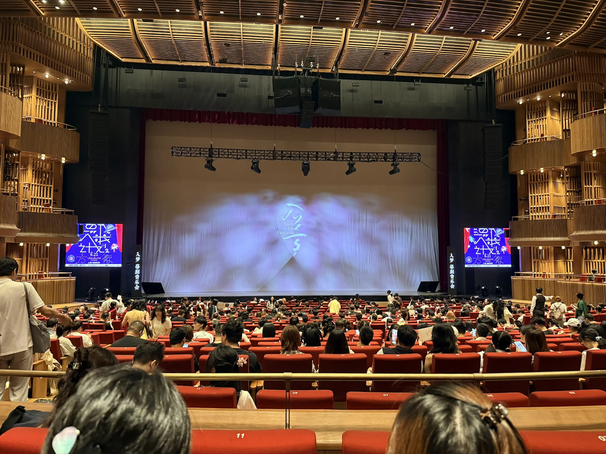

1.0 在去年 0.0 版的基础上做了少许调整，比较明显的是会有小部分歌曲由演员而不是黄黄来唱。草民是没太理解这么做的目的是啥，不过倒是也没什么所谓，反正都是听过好多次的歌了。结束之后演唱会环节《红白》城市限定，不赖

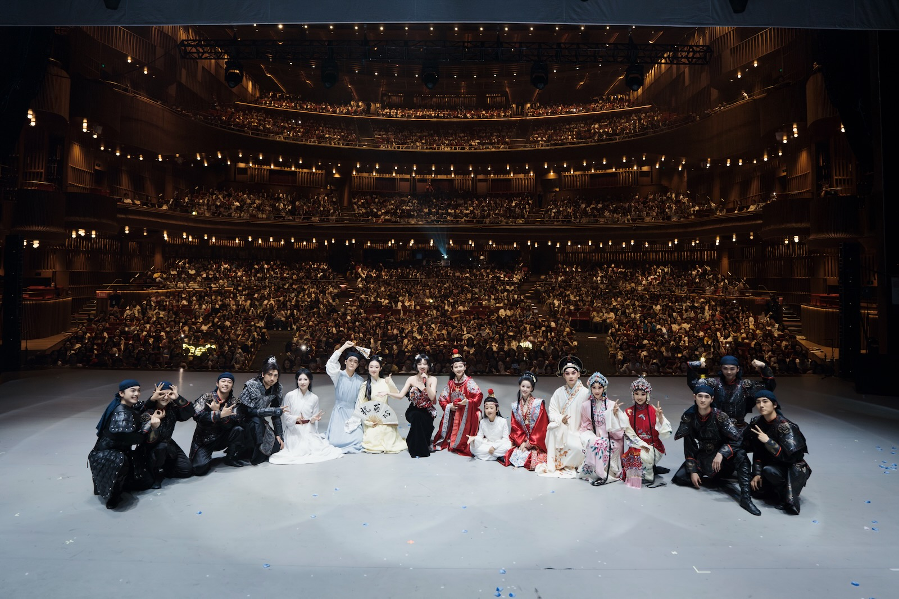

然后还是要吐槽一下：草民觉得问题最大的还是场地，跟去年成都场比起来真的还是有差距

* 舞台有点无力吐槽，投影从背后往半透明的纱帘上打，看着都是重影的，真的很难受；当然条件所限，也就只能理解万岁
* 黄黄的麦调的还行，其他演员的麦什么毛病都有：非常尖锐的高频、第三幕两个演员轮流没声音，这真不知道该怎么理解万岁
* 其他的一些什么字幕偶尔抽风之类的细节都懒得提了

总之还是静待 2.0，肯定还是会至少去一场的（希望真的是十月中旬在深圳，又可以公费看演出了

# 6.27 「流光之境」成都场

时隔不到一年又来见王子啦（而且又是紧挨着入梦）。这次歌单上有《东风第一枝》了好开心，买了新专辑更开心。王子的表现一如既往的优秀，真的完全不需要多夸，入坑绝对不亏就对了。当然又要吐槽一下音响，感觉共振比之前明显了好多……过几天🐰那场再仔细听一下

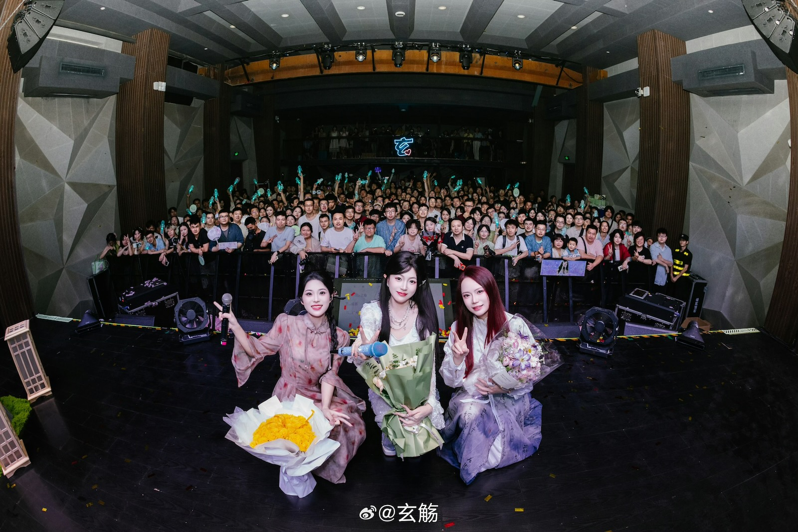

这次王子请了冥月和阿 yueyue 两位嘉宾。冥月老二次元了，翻了一下☁️关注也十多年了；阿 yueyue 这几年简直火的没边（然后当天才知道也是四川人，25 年暑假还来过这个场地巡演，虽然搭配的那位男歌手的风格草民不是很吃……总之以后再有线下的话高低捧个场

# 7.5 拼个豆

其实也是个网友见面会。图案为店铺老板（之一）的 B 站头像（链接就不贴了想找的话可以自己挑战一下

草民还真不知道拼豆是怎么莫名其妙又火起来的，草民上次玩都差不多是十年前了。不过偶然看到一个说法：跟现实中的大多数事情相比，拼豆属于为数不多的付出多少收获多少、很有确定性的事情之一；另外草民自己也还挺需要几个小时安安静静做一点可以放空大脑的事情

# Disc

例行晒碟（怎么感觉比预想中少

## 音阙诗听《一》

感谢虾滑老师撮合。22 年十月刚搬新家，又赶上疫情，不仅错过了同样在成都的线下，也错过了这张专辑，还好花了些钱补上了（

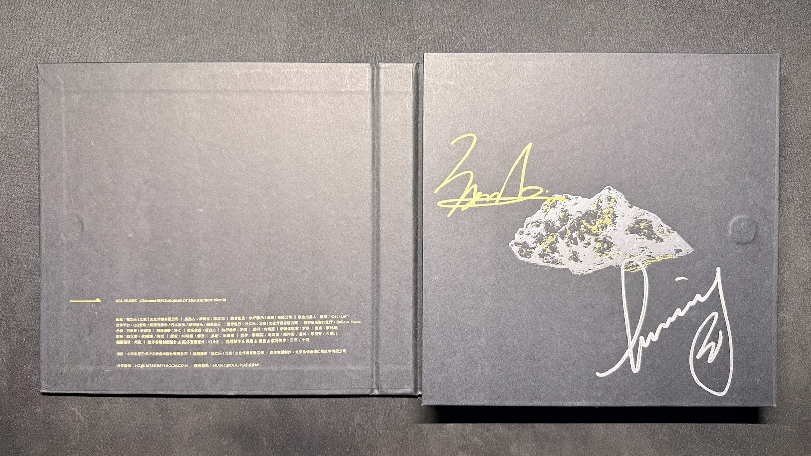

今年就是音阙诗听十周年了，去年凑了不少人唱团歌，今年几个视频平台也开始慢慢活跃起来了，希望年底能有一场专场吧（

## 小红泡《童话入侵计划》

其实严格来说不熟，也忘了怎么刷到的了，看着挺顺眼，歌也挺不错，就支持了一个简装版

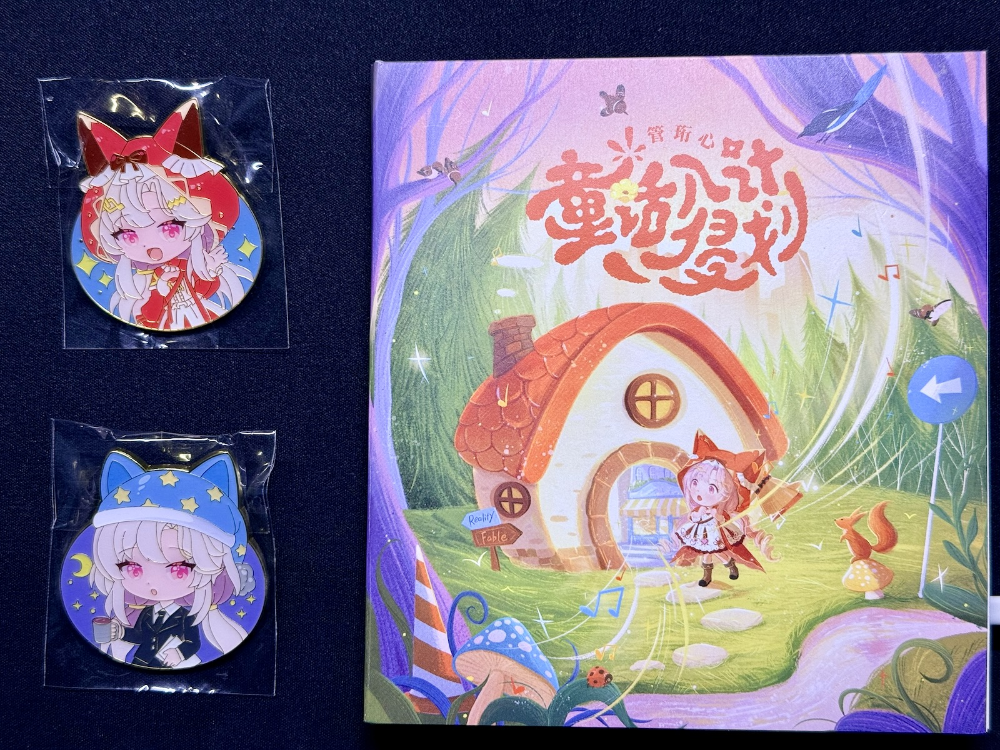

这个专辑展开的方式设计的真的还挺巧妙的，但是拍起来有点麻烦，可以看[官图](https://www.bilibili.com/opus/1168090023482884097)

## 云之泣《独白》

有签名！非常难得的运气爆表的一次

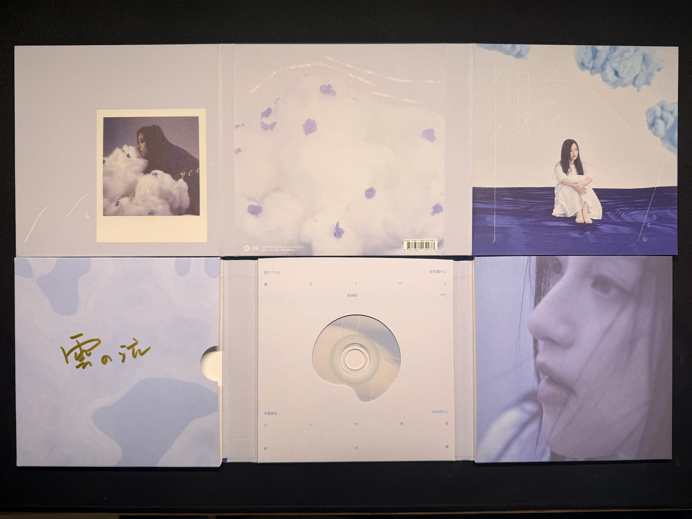

看到微博抽奖平台的通知的时候都来不及填地址了，哭死。还好私信过后顺利解决，不然真要大腿拍断

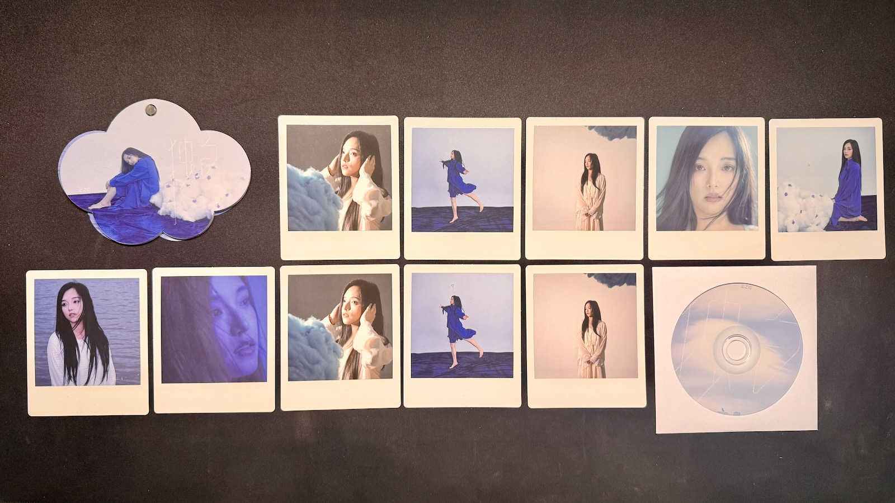

当然草民自己也早早下单了一张，然后拍立得有三张重复的（也算是欧气守恒定律吧

## 小柔《清醒梦》

懒得再拍一张没有 PocketTerm35 的图了（

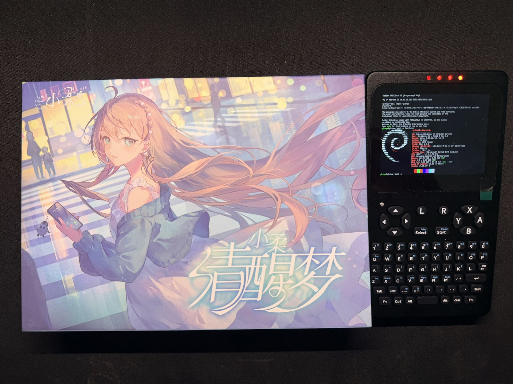

小柔的两张碟实体都没什么问题，那就忍不住要问了：xys 到底什么时候能认真一点对待🐰的东西

## 玄觞《流光之境》

签名 +1（过几天还会再有一张，这次一定要签在里面

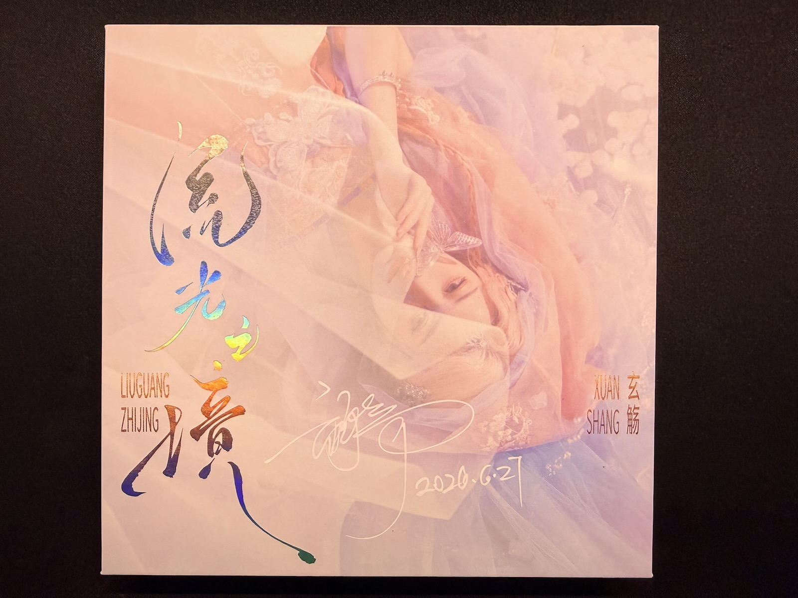

顺便送了🥚一张（当然过程中又有一些比较难绷的事情，笑死

## 2026 拜年纪礼盒

刚好这几天[《辟浪》](https://www.bilibili.com/video/BV1WeZLBtEW1)终于冲到 100w 播放了（真是不容易啊

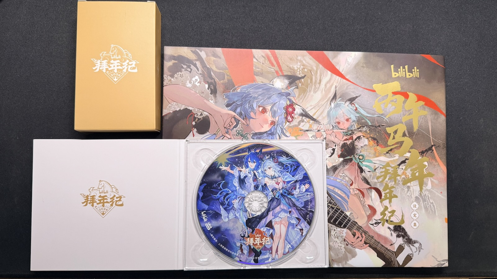

其实两千二百三十三（雾）这个带了过分明显的生肖元素的人设总感觉怪怪的。。。。。。不如不加

## 还有一个昔涟的戒指

确实过分美丽了，一起晒一下

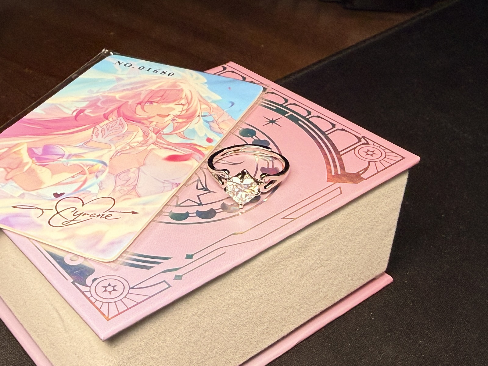

编号是随机的，草民甚至不是买的预售，但是发货贼快，看来是做了不少，挺好

# End

暑假（并没有假）的安排挺多：

* 七月三场线下，都已经定下来了
  * 🐦（7.18 成都）
  * 王子（7.19 广州）
  * 🐰（7.25 成都）
* 八月两场线下，不过都挤在一个周末，倒是刚好可以省下去帝都的交通费用，顺便回家呆两天
  * Two Steps From Hell（8.21 北京；直接冲了最贵的 VIP，1580 确实是有点奢侈了）
  * 🐰（8.22 北京；不得不说这回恐怕是真难讲会不会有下一次了，无论如何还是支持一下）
  * 另外还有几个选项但是目前都不是那么想去：董真（8.1 上海），🐰（8.8 广州），王子（8.8 南京），鸾凤鸣（8.8 苏州）
* 再后面大概率会去的
  * 董真那个《创世回响》也官宣有成都的场次了，这个肯定会去
  * Hans Zimmer 成都 9.30 的一个场子（票价太贵了，杭州场内场 2580 就离谱，应该就随便买一个便宜的看台票听听）
  * 入梦 2.0 今年可能有一场（有人挖出来深圳定在 10.10 / 10.11，不过目前还不太确定具体细节，如果真的是的话就直接去）

下一篇应该是给一些新朋友做的一个服务治理相关的科普，预计安排在八月中旬左右。最后希望下半年还能有一场粼粼吧（
