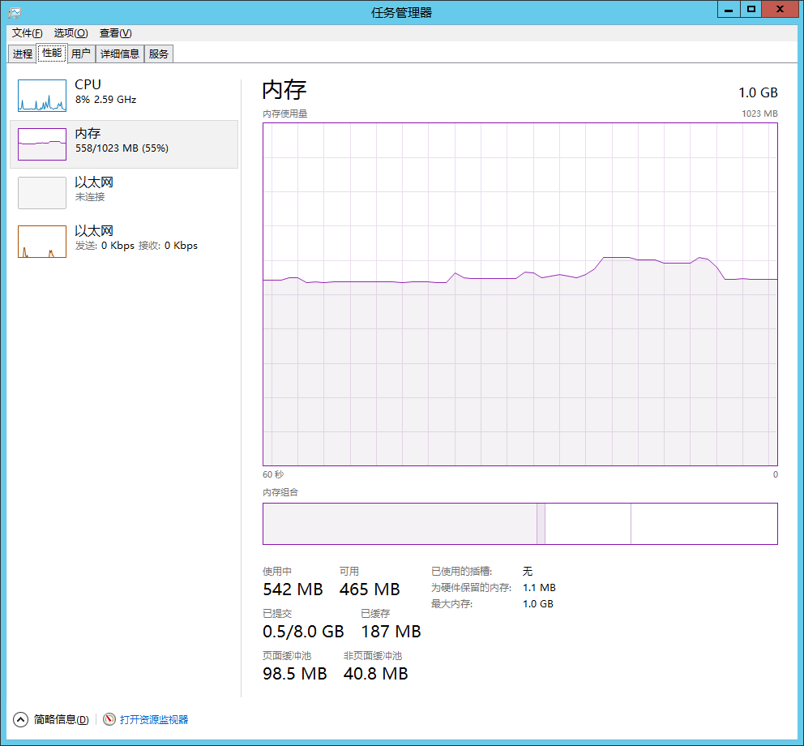
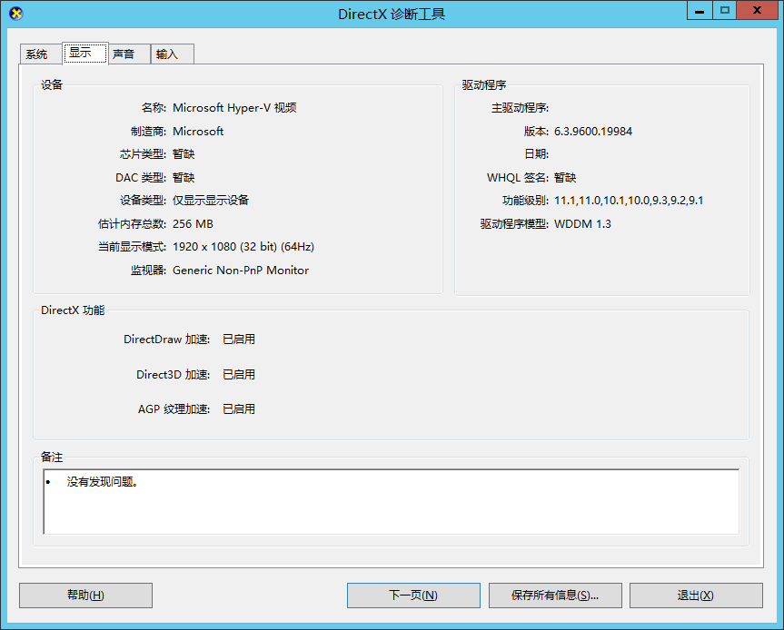
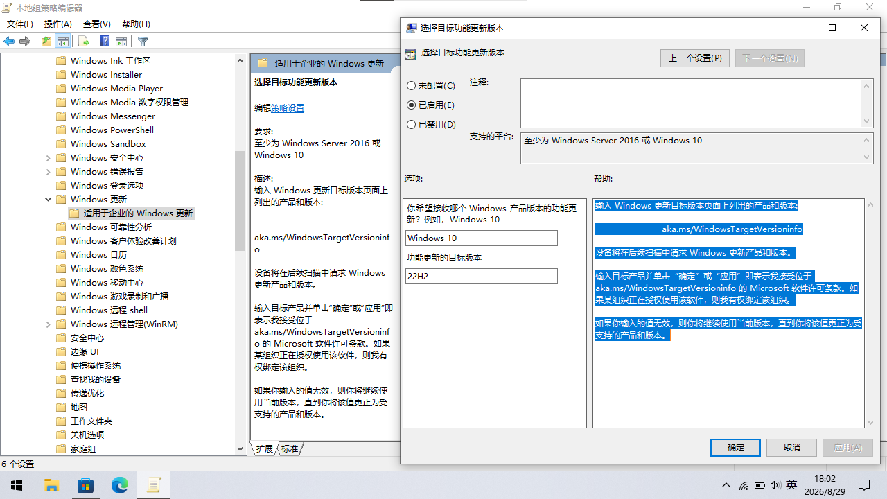
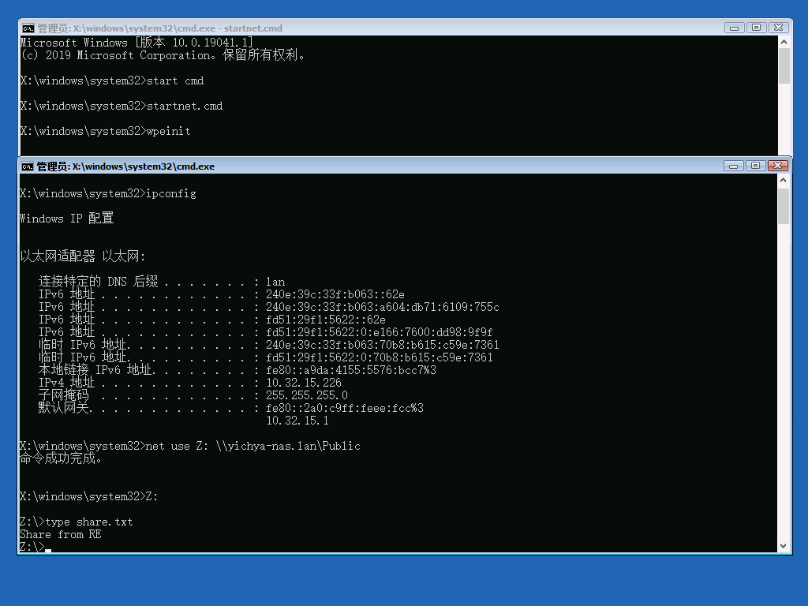
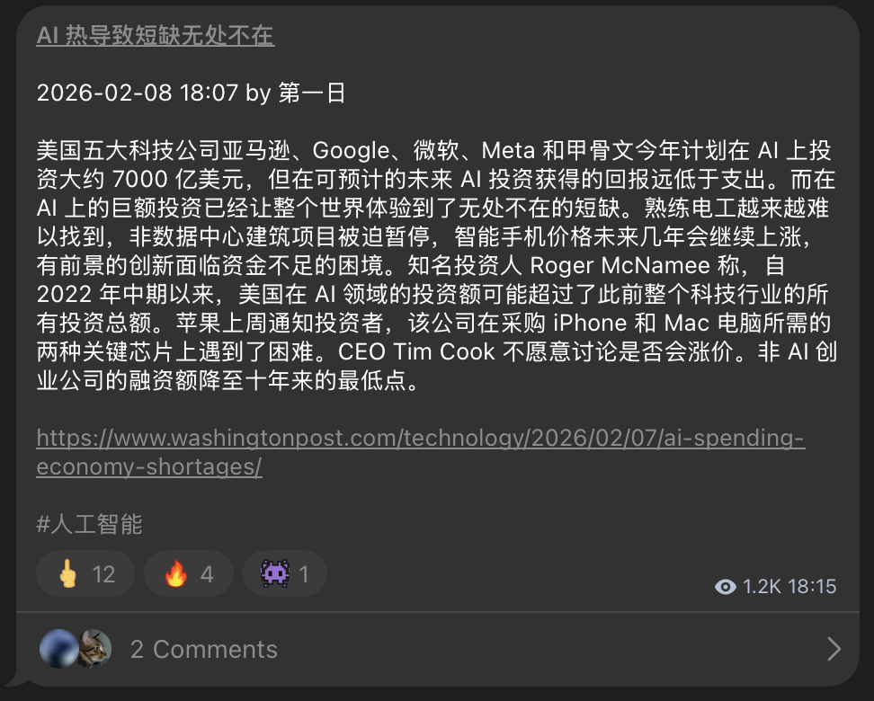

Windows 11 用的真的很心烦。基于草民个人的一些痛点折腾了两个稍微老一点的系统，或许也能解决大家的一些特定需求

# Windows Server 2012 R2

这甚至已经是一个一年前的选题了。至于为什么要整这么个活：跟某个客户对接需要跑他们的 VPN，但这种东西一般都带一点说不清道不明还可能删不干净的乱七八糟的玩意儿，所以不想装在 Host OS 上，于是准备找一个老系统起 VM

* 最早打算继续 WES7x64，但 Hyper-V Gen 1 硬件支持一般，而且在上面跑 DBeaver 界面经常卡，感觉是 DWM 有点奇奇怪怪的问题
* 后来又试了一下 Deepin LiteXP，虽然客户的 VPN 还真能装的上，但因为实在太老旧了，没有很方便的端口转发方案
* 某一天突然觉得 x64 有点浪费内存，于是计划找个 WES7x86，可惜找了半天也没找到个满意的（其实曾经有但早丢了），又确实懒得自己搞；过程中偶然尝试了一个没激活的 Thin PC 然后自动在有 KMS 的网络里面激活了……突然灵光一闪
* 尝试了一下 Windows 8.1 x86 感觉带的乱七八糟的东西还是有点多，然后突然想起来 Windows Server 2012 R2

话又说回来，折腾这个大概算是二十年前就开始搞的真·老本行了（

## 优点

跟 Windows Server 2022（这个也是个人比较推荐的干活用系统）比：

* 资源占用明显更少，开机内存 0.5GB 左右，分 1GB 拉起来绰绰有余（当然 swap 还是该加就得加的，不过比起内存来说还是便宜多了，尤其是在这个内存贵上天的节骨眼上
* 几乎跟 Windows 7 一样干净，没有那种系统自带的 WPF 画出来的磨磨唧唧的界面，找回那种指哪打哪的利索感觉；也没有 Windows Defender，虽然这个不一定是好事，但是在任务非常特定的虚拟机上应该问题不大



跟更早版本（比如 WES7）比：

* 样式比不能开 Aero 的 Windows 7 系列好看一点（Hyper-V 就开不了）
* HiDPI 支持好很多，而且强制 DWM，能避免一些比较新的设备、应用可能有的小问题
* 支持很多现代特性，比如 UEFI 启动、更好的 Hyper-V 支持（尤其是 Guest 图形界面驱动比 Windows 7 好很多）



总之不愧是 NT6 + Win32 最后的荣光，以及跟 Windows 8.1 比也是要干净清爽很多。另外这代 Embedded 没啥亮点，所以跳过了

## 缺点

跟 Windows Server 2022 比：

* HiDPI 支持还是有不少毛病
* 缺一些很好用的东西，比如新版控制台、WSL 等
* （不魔改）跑不了最新的浏览器、VS Code 等，Golang 之类的工具链 / 产物也有版本限制需要费点心思
* （即将）没有安全更新（就算搞魔法更新也只能活到 2026 年十月了；Windows Server 2022 能支持到 2032 年的样子
* 完全不能装 msix 应用比如 Windows Terminal 和 winget（Windows Server 2016 / 2019 印象中也不能装，所以只推荐 2022
* 没有 CompactOS（亲测 Windows 8.1 能用的 WIMBoot 在服务器产品线上不能用，对于一个已经基本 EoL 的系统来说有点可惜

跟更早版本（比如 WES7）比：

* 没有 32 位版本，强制要求 DWM，占资源还是稍微高一点
* 还是从 Windows 8.1 搞了一个开始屏幕下来（虽然也可以 StartIsBack

因此这些考虑下来还是仅仅推荐在需要一个不太占资源的虚拟机的时候搞，不建议用来当主力干活，主力还是请上 Windows Server 2022

另外关于 Windows Server 2025 个人是觉得除了补上了 Windows Server 2022 没有的蓝牙之外别的意义不大（如果用新一点的 CPU 的话可能还有大小核感知调度器，这个要用的话就确实没办法），但是代价是多了很多 UWP 的负担，个人觉得不是很推荐

## 安装

建议 Standard + GUI 就行了

* Hyper-V 的话闭眼选 Gen2 开 UEFI，其他平台看情况，一般推荐能上 UEFI 就上 UEFI
* Hyper-V 基本上是进系统之后驱动全部自动装完，其他 VM 自行安装 Guest Tools
* 其他的 Windows 自带组件看着办，草民推荐不装「桌面体验」，基本上是没啥用

激活就各显神通了，虚拟机的话个人建议外面的 OpenWrt 上跑 vlmcsd；然后再进行一下自动更新，目前还可以直接 Windows Update，然后可以装一下 Legacy Update（主要是根证书更新，不然很多东西不太好使

### 魔法更新

[一点小技巧开启 ESU](https://forums.mydigitallife.net/threads/bypass-esu-blue.86548/)，然后可以更新到 2026 年十月（也就一个月了，感觉可以等最终版了

虽然对于不对外提供服务的虚拟机来说，这样的用法大概也不太重要，各取所需（

### PowerShell 5.1

[Win8.1AndW2K12R2-KB3191564-x64.msu](https://go.microsoft.com/fwlink/?linkid=839516)

但是因为没有新版控制台的关系，装上了也并不能用 PSReadline，所以随便吧

## HiDPI 以及 Hyper-V 增强会话

Hyper-V 不开增强会话的话分辨率只能拉到 1920x1080，虽然大部分情况也够用了，但是没有点对点缩放看起来不怎么好看。但是 Hyper-V 的增强会话感觉不是很好用：每次点开都要重新登录，而且 HiDPI 莫名其妙的各种各样的抽风

就算不考虑这些奇奇怪怪的毛病，本质上也就是个走 VMBus 的 RDP，除了不用折腾防火墙什么的之外，用起来体验跟 RDP 区别也不大，总之不是很推荐，更建议直接走正常的 RDP，可以记住密码不用每次都重新登录一遍，而且 HiDPI 也正常一点；另外不想要 HiDPI 的话可以手动装一个版本旧一点的 SysInternals Suite 用里面的 RDCMan，比 mstsc 好用一点

## 一点小优化

除了一些常规操作（比如把 Windows Audio 服务打开才有声音）之外，还有一些小设置，调了更舒心一些

### 壁纸 + 图标

不装桌面体验的情况下没有「个性化」这个控制面板选项，不过壁纸很简单，找一张图然后右键「设置为桌面背景」就行

桌面图标也好解决，运行 `desk.cpl ,,5` 然后全勾上就行了。

### 磁盘清理

不知道为什么 `cleanmgr` 也跟桌面体验绑在一起，甚至很怪的是装了它也不能清理更新，所以还是得上 DISM

```bash
dism /online /cleanup-image /startcomponentcleanup /resetbase
```

当然也可以用 Dism++ 顺便删掉一些其他的东西

### 默认输入法

默认输入法死活不能切换成英文的，就算添加了 English 语言也不行，于是只好使用一点注册表魔法

```
Windows Registry Editor Version 5.00

[HKEY_CURRENT_USER\Keyboard Layout]

[HKEY_CURRENT_USER\Keyboard Layout\Preload]
"1"="00000804"
"2"="d0010804"

[HKEY_CURRENT_USER\Keyboard Layout\Substitutes]
"00000804"="00000409"
"d0010804"="00000804"
```

然后选择一下【替代默认输入法】就行了，强迫症还可以再调一下顺序把微软拼音放到后面去

### 删除确认

草民不是很想用回收站，所以一般是把回收站扬了然后把【删除确认】对话框打开，但是遇到那种需要 UAC 才能删的文件的时候这个提示框就死活出不来。应该是一个 Windows 7 时代就有的老问题了，一直到 Windows 11 还是这样

使用以下注册表导入就行（也可以组策略：用户配置 - 管理模板 - Windows 组件 - 文件资源管理器，右边【删除文件时显示确认对话框】
```
Windows Registry Editor Version 5.00

[HKEY_LOCAL_MACHINE\SOFTWARE\Microsoft\Windows\CurrentVersion\Policies\Explorer]
"ConfirmFileDelete"=dword:00000001
```

但是亲测下来不完全有效：删除文件的时候可以，删除文件夹的时候还是不行，不知道是怎么搞的。保险起见建议是把 UAC 拉满（虽然动不动就点确认也有点烦，不过除了任务管理器 / 关机重启之类高频操作之外一般也影响不大），或者也可以选择开启回收站

# Windows 10 IoT Enterprise LTSC 2021

MicroPC 上跑 Windows 11 实在是让人忍无可忍，加上考虑到另外两台设备（十多年前的 X550JK 和八年半前买的 NUC）也用得上，花了点时间折腾了一下，换完真的全身舒畅，而且还解决了莫名其妙连不上 EAP 的问题

虽然 Windows 10 的 ESU 又多白送了一年（本来也是只到 2026 年十月的），但是 IoT Enterprise 能干到 2032 年，加上它非常简洁几乎啥都不带，但跟 Windows Server 2022 比又更接近正常的消费级系统（比如不用费心思折腾蓝牙和商店什么的，还有一些 App 比如网易云音乐也能正常启动），对于不方便直接上 Windows Server 2022 的情况也更加推荐

## 安装

这个 SKU 目前是 19044（21H1），不过可以离线把 21H2 的可选包塞进去。官方并没有直接提供镜像，所以草民是随便找了个已经做好了的第三方提供的 ISO [https://www.bilibili.com/opus/1168875731890995209](https://www.bilibili.com/opus/1168875731890995209)，使用前请自行做安全检查

确实不放心的话也可以尝试自己搓这个镜像出来，用 Dism++ 来搞的话也不算很复杂

## 激活

本来是想 KMS 的，但是这个版本能上 [HWID](https://massgrave.dev/manual_hwid_activation)，试了一下果然很香。因为里面的东西多少还是有点敏感，这里就不贴了

## 自动更新

不知道为什么不能用，但是手动下载了累积更新 MSU 之后又能正常安装，可能是 LTSC 的什么奇怪属性

也尝试了一下开 Insider Preview 选 Release Preview，并没有什么用，开了之后还会被塞 Windows 11 的更新提示，很坑爹。不过找了几个法子解决了一下。先照图设置一下组策略（计算机管理 > 管理模板 > Windows 组件 > Windows 更新 > 适用于企业的 Windows 更新）



然后参考 [https://www.tenforums.com/windows-updates-activation/190562-how-hide-win-11-upgrade-option.html](https://www.tenforums.com/windows-updates-activation/190562-how-hide-win-11-upgrade-option.html)，清理一下已经完成的几个兼容性检查，再重启、重新检查一下更新即可。

## Microsoft Store

非常简单，`wsreset -i` 就行了。常用的几个包商店里如果搜不到的话，手动装一下然后再更新就行

* 应用安装程序（winget 还是很好用的）
* Windows Terminal、NanaZip 等常用工具
* 几个媒体扩展：HEVC（建议选「来自设备制造商的 HEVC 视频扩展」）、AV1、MPEG-2 等等

另外关于图片，可以参考 [https://www.tenforums.com/tutorials/14312-restore-windows-photo-viewer-windows-10-a.html](https://www.tenforums.com/tutorials/14312-restore-windows-photo-viewer-windows-10-a.html) 使用旧版的照片查看器，这样就不用装商店里的 UWP 照片 App 了

## 日常体验

这一套都做下来之后开机内存占用大概是刚好 2GB 多一点点，比起 Windows 11 来说显然要好得多，而且响应明显更快、风扇也转的少了

目前是又在上面装了 Lark 拿来应急（真惨啊

# NUC 备份

最近还有一个很有意思的事情：把 NUC 重装送走之前当然要做一个全盘镜像，但是很不巧，手头暂时没有足够大的介质。想了几个方案

## 局域网 dd

最初的打算是起一个 Ubuntu LiveCD，用 dd 抓全盘镜像，然后通过网络转发 stdio 导进 NAS，非常顺手的方案

但是就不知道为什么 Linux 就是死活认不到 Intel RAID 0 Volume，试了两三个不同版本的 Ubuntu 都不行，只好放弃

## PE

手里虽然刚好有个功能还挺齐全的 PE，但是它毫不意外撞上了新版安全启动证书的大坑。这台 NUC 的安全启动证书更新也全是问题，为此实在是不想再把安全启动关掉，于是只好回过头去找一个新一点的 PE

## RE + Disk2VHD

找 PE 之前突然想起来 Windows 自带的 RE 似乎也支持网络，结果没想到还真的能用

* `startnet.cmd`
* `net use Z: \\yichya-nas.lan\Public`

草民截图的时候起了一个 Windows 10 的 Hyper-V 虚拟机，不过它稍微遇到了一点波折（NUC 备份的时候就完全没遇到什么问题

* startnet.cmd 之后 wpeinit 卡住了
* 退出去重新开了一个 cmd，发现 ipconfig 已经正常了
* net use 提示「工作站服务没有启动」。手动 `net start lanmanworkstation` 之后一切正常



挂好网络共享之后用 Disk2VHD 抓了一个 VHDX 镜像并直接写入网络共享，齐活。顺便后来发现 Disk2VHD 好像支持 Windows 自带的 Volume Shadow Copy，如果用它的话压根就不需要非得专门拉起一个跑在内存里的环境了……

另外关于老口碑的工具 Ghost，草民近几年拿它备份系统就没有一次能成功还原的，不过如果只是 GhostExp 提取一些文件倒是也够用（但是又远不如 VHDX 之类的镜像可以直接用 qemu-nbd 之类的工具挂载取文件出来

# End

某个巨头说 Vibe Coding 就是未来，写代码以后没什么意义了。今天洗澡的时候突然出现的一个额外的念头：

* 目前的 Vibe Coding 往往会引入大量的 spaghetti code，导致计算资源的显著浪费
    * 感觉 Windows 11、Microsoft Edge 都算个例子：刚出那会儿还说得过去，后面是越来越烂
        * 虽然也许是阿三的因素更多，但是阿三用 Vibe Coding 不是更那啥了
    * 虽然不排除随着 AI 的发展，支持的 Context Window 真的足够大的话有可能实现全局最优
        * 但至少现阶段不是这样，这一天什么时候到来也没人说得准
* 现在 C / C++ 之类没有 Runtime 成本的语言确实逐渐让位于 Go / Java 这类有 Runtime 成本的语言
    * 但是也有 Rust 这种同样零 Runtime 成本的语言越来越火：不只是因为安全，也是因为 GC 带来的额外负担
        * 这说明计算资源并不是（至少并不应该是）可以被无限浪费的，甚至在很多地方会成为决定性的瓶颈
    * 防杠：tokio / 其它 asyncio 抽象引入的 Runtime 成本这里不划给语言
        * 而且 libuv 之类的 asyncio 抽象也一样要引入少许 Runtime 成本
* 巨头们鼓吹这种说法或许也是 [Andy and Bill's law](https://en.wikipedia.org/wiki/Andy_and_Bill%27s_law) 的一种表现
    * 除了直接销售 AI 需要的算力之外，Vibe Coding 导致的计算资源浪费，也间接促进了整个社会对算力的需求



之前也提到过 AIGC 在信息流动效率上的效果值得商榷，个人觉得这个话题或许有异曲同工之处。以及另外看到的一个话题：Vibe 出来的 App 大量冲击 App Store 审核，用极低成本去搏 ARR，个人觉得很难说到底能带来多少价值

最后送大家一张非常有意思的图


下一篇应该会是之前说的服务治理相关的一些内容（本来应该是这个月，不过被这一篇插队了，那就下个月中旬左右的样子
